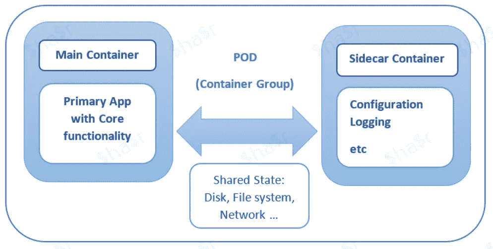
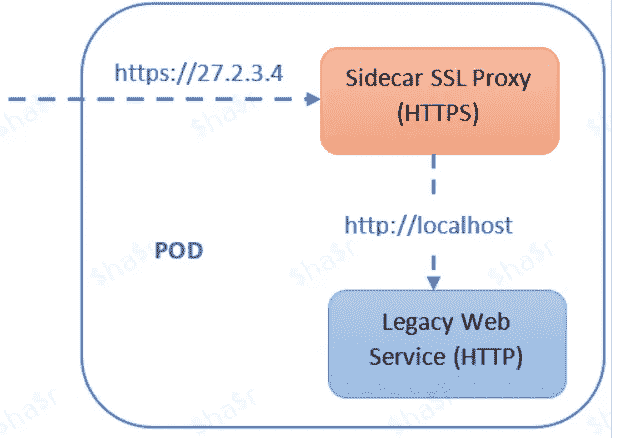
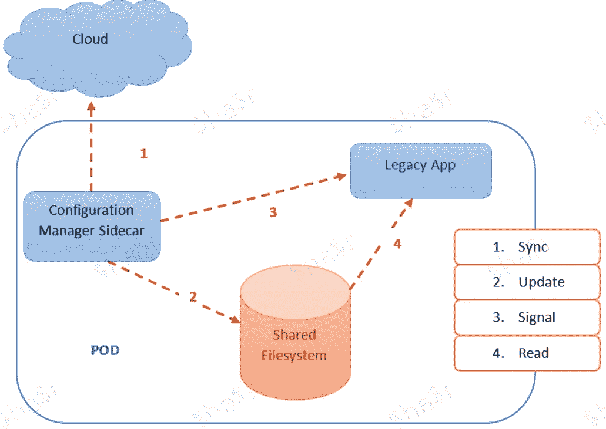
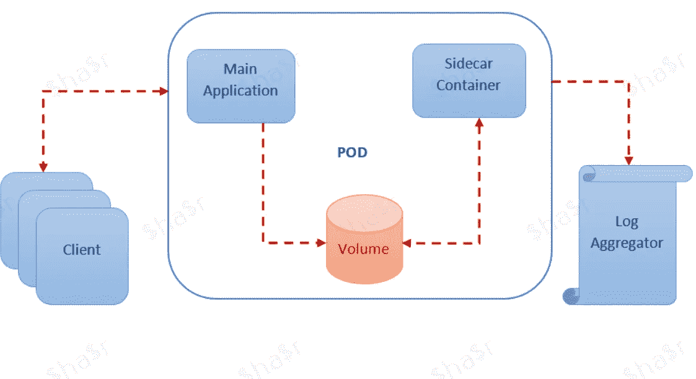

# 微服务架构:边车模式

> 原文：<https://medium.com/nerd-for-tech/microservice-design-pattern-sidecar-sidekick-pattern-dbcea9bed783?source=collection_archive---------0----------------------->

边车模式

在微服务架构中，多个服务/应用通常需要日志记录、配置、监控和网络服务等常见功能，这种情况非常普遍。这些功能可以在同一个容器或单独的容器中作为单独的服务来实现和运行。

*在同一应用中实现核心逻辑和支持功能:*

当它们在同一个应用程序中实现时，通过有效利用共享资源，它们被紧密地联系在一起并在同一个进程中运行。在这种情况下，这些组件没有很好地分离，它们相互依赖，这可能导致一个组件的故障反过来影响另一个组件或整个应用程序。

*在单独的应用程序中实现核心逻辑和支持功能:*

当应用程序被分离成服务时，每个服务可以用最适合所需功能的不同语言和技术来开发。在这种情况下，每个服务都有自己的依赖项\库来访问底层平台和与主应用程序共享的资源。当我们在不同的主机上部署两个应用程序时，它还会增加应用程序的延迟，并增加托管、部署和管理方面的复杂性。

**Sidecar 模式(或 Sidekick 模式)？**

库伯内特斯边车概念越来越受欢迎。这是容器世界中的一个普遍原则，容器应该解决一个问题&它应该做得很好。Sidecar 模式通过将核心业务逻辑从扩展原始功能的附加任务中分离出来实现了这一原则。

Sidecar 模式是由两个容器组成的单节点模式。

第一个是应用程序容器，它包含应用程序的核心逻辑(主应用程序)。没有这个容器，应用程序就不会存在。

此外，还有一个 Sidecar 容器，用于通过在同一个容器组(Pod)上并行运行另一个容器来扩展/增强主应用程序的功能。因为 sidecar 运行在与主应用程序容器相同的 Pod 上，所以它共享资源——文件系统、磁盘、网络等。,

它还允许将同一应用程序的组件(用不同的技术实现)部署到一个单独的、隔离的和封装的容器中。当跨微服务架构共享公共组件(例如:日志记录、监控、配置属性等)具有优势时，这被证明是非常有用的..)

例:边车:有两个容器的豆荚

**什么是 Pod？**

Pod 是 Kubernetes (K8S)中部署的基本原子单位。

在 K8S 中，pod 是一组包含一个或多个共享存储和网络的容器。Sidecar 充当 pod 中的实用容器，它松散地耦合到主应用程序容器。Pod 可以被认为是运行多个容器的消费者群体(用 Kafka 术语来说)。

**边车模式什么时候有用？**

*   当服务/组件用多种语言或技术实现时。
*   服务/组件必须位于运行主应用程序的同一容器组(pod)或主机上。
*   服务/组件由远程团队或不同的组织拥有。
*   一种服务，可以独立更新，不依赖于主应用程序，但与主应用程序共享相同的生命周期。
*   如果我们需要控制组件或服务的资源限制。

**例句**:

1.将 HTTPS 加入传统服务
2。带边车的动态配置
3。带边车的日志聚合器

***将 HTTPS 添加到遗留服务***

考虑一个通过未加密的 HTTP 服务请求的遗留 web 服务。我们需要增强同一个遗留系统，以满足 HTTPS 未来的服务请求。

示例:示例:将 HTTPS 添加到旧服务

遗留应用被配置为专门在本地主机上服务请求，这意味着只有与服务器共享本地网络的服务能够访问遗留应用。除了主容器(遗留应用程序)之外，我们可以添加 Nginx Sidecar 容器，它运行在与主容器相同的网络名称空间中，这样它就可以访问运行在 localhost 上的服务。

同时，Nginx 终止 pod 外部 IP 地址上的 HTTPS 流量，并将该流量委托给遗留应用程序。

***带边车的动态配置***

示例:示例:带边车的动态配置

当遗留应用程序启动时，它从文件系统加载其配置。

当 configuration manager 启动时，它会检查存储在本地文件系统上的配置和存储在云上的配置之间的差异。如果有差异，那么配置管理器将新的配置下载到本地文件系统，并通知遗留应用程序使用新的配置重新配置自己(例如:可以是 EDD 或编排机制来选择新的配置更改)

***带边车的原木聚合器***

假设我们有一个 web 服务器，它正在生成访问/错误日志，这些日志对于在特定时间间隔/内存空间之外保存在卷上来说并不重要。但是，访问/错误日志有助于调试应用程序的错误/缺陷。

示例:带边车的日志聚合器

根据关注点分离原则，我们可以通过部署一个单独的容器来捕获访问/错误日志，并将其从 web 服务器传输到日志聚合器，从而实现 Sidecar 模式。

Web 服务器很好地完成了它的任务，为客户端请求提供服务& Sidecar 容器处理访问/错误日志。因为容器运行在同一个 pod 上，所以我们可以使用一个共享卷来读/写日志。