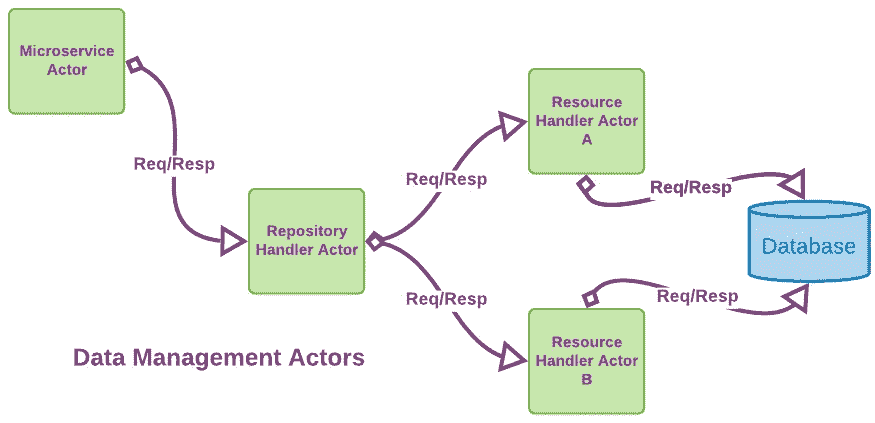

# 微服务和持久数据

> 原文：<https://medium.com/nerd-for-tech/microservices-and-persistent-data-9e98a5488fc9?source=collection_archive---------0----------------------->

## 每个服务的数据库？

[**点击解释**](https://drive.google.com/file/d/10KLDVswfBmWy9nfgtFtRqx7SsJmRKKRU/view?usp=sharing)

***“每个服务一个数据库”的微服务架构模式有效吗？鉴于这种模式对使用微服务管理分布式数据的严重影响，这是一个值得回答的问题。***

每服务*数据库*模式源于对亚马逊首席技术官[沃纳·威格尔](https://en.wikipedia.org/wiki/Werner_Vogels)描述的原则的误解或误用。沃格尔斯是一个非常聪明的人，也是我们今天所知的云计算的创造者之一。当沃格尔斯开始开发帮助亚马逊成为今天的巨人的软件时，他阐明了一套软件设计的原则。这些原则包括:

*   软件组件应该被构建成独立的无状态服务。
*   一个*服务*中的所有业务逻辑都应该与它所作用的数据封装在一起。
*   不应该从*服务*之外直接访问数据库。任何和所有对数据库的访问都应该通过调用专门实现的*服务*来完成。
*   每个*服务*都应该发布一个接口，使得其他服务能够访问它的数据和功能。

推断这些原则要求每个服务有一个*数据库是这个概念的不合逻辑的延伸，与我们使用微服务的许多理由背道而驰。*

## 什么是“每个服务一个数据库”模式？

*每个服务一个数据库*模式要求任何需要持久数据的微服务都有自己唯一的数据库，只能通过该微服务访问，就好像假设一个应用程序只有该特定微服务的一个实例。一篇 [*微服务架构*](https://microservices.io/index.html) 博客给出了这种模式的描述:“保持每个微服务的持久数据对该服务是私有的，并且只能通过其 API 访问。服务的事务只涉及它的数据库。本文对每个服务 模式的 [*数据库的分析如下: *:**](https://microservices.io/patterns/data/database-per-service.html)

> **每个服务使用一个数据库有以下好处:**
> 
> 1.帮助确保服务是松散耦合的。对一个服务的数据库的更改不会影响任何其他服务。
> 
> 2.每个服务可以使用最适合其需求的数据库类型。例如，进行文本搜索的服务可以使用 ElasticSearch。操纵社交图的服务可以使用 Neo4j。
> 
> 每个服务使用一个数据库有以下缺点:
> 
> 1.实现跨多个服务的业务事务并不简单。由于上限定理，最好避免分布式事务。此外，许多现代(NoSQL)数据库不支持它们。
> 
> 2.实现连接多个数据库中的数据的查询是一项挑战。
> 
> 3.管理多个 SQL 和 NoSQL 数据库的复杂性

您会注意到，有许多其他方法可以实现上述两个优点，而由此产生的三个缺点使得在使用微服务时管理分布式数据几乎是不可能的。从纯架构的角度来看，这似乎是一个非常糟糕的权衡。

## “每个服务一个数据库”模式有什么问题？

*将每个微服务的持久数据保持为该服务私有，且只能通过其 API* 访问，这是绝对正确的，并且是可行且重要的微服务约束。这是把这种限制推向了一个不符合逻辑的极端。让我们来看一些原因:

*   我们使用微服务的主要目的之一是利用云容器和容器编排提供的可伸缩性、可靠性和故障转移能力。这要求我们能够部署单个微服务的多个实例。在大多数情况下，这意味着每个已部署实例的持久数据的状态必须相同(这是我们试图保持微服务无状态的一个原因)。也就是说，在所有实际情况下，不可能用每服务模式的*数据库来完成。*
*   为了实施有效的故障切换策略(由于可能的软件、硬件或网络中断而变得必要)，需要在多个位置的多台服务器上镜像重复的数据存储。每个服务的*数据库模式不仅没有认识到这个需求，还使得它很难或者不可能被满足。*
*   为了实施有效的扩展策略，以应对动态变化的工作负载，通常需要镜像到不同集群上的重复数据存储。每个服务的*数据库模式不仅没有认识到这一需求，还使其难以或不可能满足。*
*   一个设计良好的微服务在任何时间点只代表一个事物的一个实例。例如，*客户*微服务应该代表单个客户，而不是所有客户。*通常，客户服务中的所有逻辑都作用于单个客户实例，而不是同时作用于所有客户。*在这方面，每个服务的*数据库应该是每个服务*的*行，这是一个更不实际的解决方案。这是完全不必要的阻抗不匹配。如果您需要一个作用于一组客户的服务，正确的微服务模式是一个*聚合器*或*阵列—* 创建一个*客户*微服务，该微服务使用*客户*微服务作用于单个客户。*软件阻抗不匹配是指您拥有的与您想要的不匹配。**
*   *每个服务一个数据库*模式简化了现代 DBMS 的并发性和一致性保护、关系 DBMS 的关系和引用完整性保护、noSQL 文档 DBMS 的数据结构化功能，以及所有 DBMS 多表连接，以获得通过其他方式更容易获得的好处。

## 我们应该做什么？

在*每个服务一个数据库*、每个服务一个模式*或者每个服务一个表*的情况下*，这些模式对最简单的微服务需求无效。它们不起作用是因为它们误解了它们试图实施的约束:*“不应该有从服务外部对数据库的直接访问。对数据库的任何和所有访问都应该通过调用专门实现的服务来完成。”**

那么，我们如何才能实现这种约束的好处，而不招致每个服务的*数据库的不可接受的缺点。在微服务设计的 [***云参与者模型***](/nerd-for-tech/building-cloud-native-apps-part-1-393d250cf107) 中，我们有专门为此而设计的模式。该模型实现了一组概念，使得使用分布式数据实现云原生微服务变得更加简单和易于管理。云参与者模型使用:*

*   ***演员模型*** 微服务作为[乐高](https://www.lego.com/en-us)来构建分布式云应用，因为它们简单、有意义，并且可以很容易地组合在一起构建更大的东西。这种简单性和直观性使得以参与者为构建块来设计和构建复杂的应用程序变得更加容易。Actors 是小的可独立测试、可部署、可执行的代码单元。Actor 实例是可重入的和线程安全的。参与者通过消息传递进行交流。actor 实例完成工作所需的一切要么在它所响应的消息中，要么在它所连接的持久资源中。参与者不使用锁，所以他们不会被死锁。没有单独的框架。所有服务器端组件都是微服务，仅在需要时部署。
*   ***演员角色*** 的概念。在他们的众多角色中，参与者可以是*普通微服务*、*微服务客户端*、*事件发布者*、*事件处理者*、*消息代理*、*分布式日志记录者*、*错误处理者*、*存储库处理者*、*资源处理者*和 *Web 服务器*。每个角色都有其特定的使命、定义的行为和约束，以及自己的基础编程模板，以使开发更容易。
*   ***存储库处理程序*** 角色作为应用程序接口，用于通过逻辑数据视图创建、读取、写入和删除数据。他们可以使用单个资源处理程序或多个资源处理程序。存储库处理程序向应用程序参与者实例呈现逻辑数据模型，并通过 REST API 与资源处理程序进行交互，以物理方式映射、存储和检索物理数据模型中的数据。*存储库处理程序及其相关的资源处理程序为应用程序的其余参与者执行分布式数据管理(故障转移、扩展、复制、一致性)的繁重工作。*
*   ***资源处理程序*** 演员角色作为物理数据模型的应用程序适配器。存储库处理程序使用它们来将资源映射到持久存储和从持久存储映射资源，非常像对象关系映射器(ORM)，例如 [Hibernate](https://hibernate.org/orm/) ，将对象映射到关系数据库和从关系数据库映射对象。资源处理程序是通过 REST API 访问的。*资源是驻留在非易失性系统存储中的东西，如文件、键值存储和数据库。*
*   自组织 ***代理*** 参与者作为粘合剂，通过组织参与者之间的消息传递来连接各个参与者，并作为*断路器*来减轻级联错误情况。*代理是唯一有状态的参与者，管理云参与者模型的故障转移、扩展和自组织功能。*当一个代理运行时，它向所有其他可到达的代理广播它的存在。代理跨云集群联合，并相互共享状态信息。一个小的代理代理在每个 actor pod 中作为一个 sidecar 存在，以便于 actor 注册和使用最优代理传递消息。代理接收寻址到特定 actor *type* 的消息，并将它们路由到该 actor 类型的最佳实例的物理地址。一个 ***邮箱*** 与每个单独的 actor 实例配对，为 actor 缓冲传入的消息，并代表 actor 实例发送消息并与代理服务器通信。

## 相关链接

*   [***域有界上下文作为第一类演员***](/nerd-for-tech/designing-microservices-4130bc41c046#7a7d)
*   [***微服务架构***](/nerd-for-tech/microservice-architecture-622e4148f1)
*   [***软件架构为云***](/nerd-for-tech/software-architecture-for-the-cloud-c9226150c1f3)
*   [***多云 app:第一部分，掌握演员模型***](/nerd-for-tech/building-cloud-native-apps-part-1-393d250cf107)