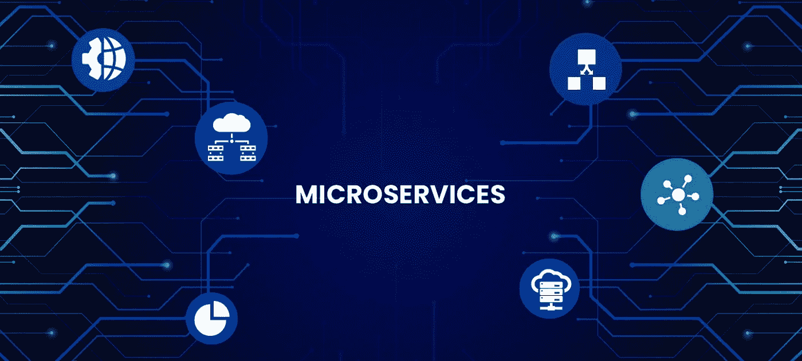

# 微服务(第一部分)——简介

> 原文：<https://medium.com/nerd-for-tech/microservices-part-1-introduction-b1a10c2f26c?source=collection_archive---------16----------------------->

图 1:微服务(来源:谷歌)

# 整体应用架构

在微服务出现之前，单片应用程序架构是大多数开发人员创建企业级应用程序所遵循的架构。在单片应用程序中，**所有的业务模块都在一个单独的进程中运行，这个进程通常是一个 WAR/EAR 文件**。这些不同模块的类可以互相交流，也可以使用相同的库。这些模块之间有许多耦合。此外，整体式应用程序通常使用单个数据库，其中包含与所有可用业务模块相关的多个表。单一应用程序包含 3 个主要层，即客户端层、服务器层和数据库层。

**例如:**考虑一个电子商务应用程序。该应用程序可能包含以下组件，

*   网络服务器
*   负载平衡器
*   目录服务

## **单片的优点**

*   易于测试整体应用程序(集成测试)。
*   易于监控。
*   简单。

然而，这种体系结构风格对于大型企业来说是不够的，因为它有一些主要的缺点。

*   应用程序不同模块之间的强耦合。
*   应用程序规模大，性质复杂。
*   开发人员更难理解并快速做出更改。
*   任何更新都需要整个应用程序的完全重新部署。
*   扩展性较差。
*   可重用性较差。

# 微服务架构

定义—

> *微服务是一种将单个应用开发为一套小型服务的方法，每个服务运行自己的进程，并与轻量级机制(通常是 HTTP 资源 API)进行通信。*

微服务基本上是一种架构风格，有助于克服单片应用程序面临的问题。在微服务架构中，所有服务都应该**围绕特定的业务能力**构建，并且应该**可独立部署**。这些服务可以用不同的编程语言编写，也可以使用不同的数据存储技术。

## 扩展:整体服务与微服务

图 2:扩展整体服务与微服务

单一应用程序必须在多台服务器上复制整个系统才能扩展。这是一个非常复杂和昂贵的过程，有很多缺点。由于复制实例中可能不需要某些功能，因此存在巨大的资源浪费。

微服务应用程序通过在服务器之间仅分配所需的服务来进行扩展。这比单芯片应用中的缩放有许多优势。

*   资源得到更好的利用。
*   总体费用更少。
*   需要完成的配置更少。

## 微服务中的缩放立方体

图 3:缩放立方体

Scale cube 是一本名为《[可伸缩性的艺术](https://www.goodreads.com/book/show/7282390-the-art-of-scalability)》的名著中介绍的一种伸缩模型。根据该模型，缩放在 3 个主轴上进行，即 X、Y 和 z。

*   **X 轴**:指在负载均衡器后面运行一个应用的多个副本的过程。这种扩展的问题在于，所有拷贝都需要潜在地访问所有数据。
*   **Y 轴:**指的是通过将应用拆分成多个不同的服务来扩展应用。每个服务都有一个专用功能。
*   **Z 轴:**每台服务器运行相同的代码副本。但是，每台服务器只负责一部分数据。

# 微服务的特征

(据[martinflower.com](https://martinfowler.com/articles/microservices.html)。请查看网站了解更多信息。)

## 通过服务的组件化

在微服务架构中，所有服务都被视为组件。这意味着这些服务**之间不共享 SDK 或库**。这样做是为了避免这些服务之间的耦合。正如在第一部分中提到的，这些服务是可独立部署的。这意味着这些服务可以在不影响应用程序中其他服务的情况下部署，因为耦合度很低。

## 围绕业务能力组织

想想一个传统的组织。团队是根据技术来组织的。举个例子，可能有前端团队、后端团队、QA 团队等团队。微服务架构遵循不同的团队结构。

在微服务架构中，团队组织为库存、财务、运输等。这意味着团队是根据业务能力来组织的。这些团队是跨职能的。他们可能包含来自各个方面的人，如开发人员、QA 人员等。团队可以包含 8-10 人(2 个披萨团队)。

## 产品而非项目

在传统的软件开发模型中，交付团队会根据现在的需求创建软件并交付。他们可能会将软件移交给维护团队，并转移到一个新的项目。

在微服务架构中，团队在组件的整个生命周期中都拥有组件的所有权。因此，这些组件被命名为产品。

## 智能端点和哑管道

在传统的软件开发过程中，开发人员使用 ESB 等强大的中间件来路由消息、应用业务逻辑等。在微服务架构中，智能线路在端点中，而不在端点之间。这样做是为了使应用程序更具解耦性和内聚性。

## 分权治理

在传统的整体式应用程序开发过程中，有一组关于要遵循的技术和模式的预定义的固定规则。例如，应用模块用相同的语言编写，并且可以使用相同类型的数据库。这在微服务架构中是不同的。每个服务都有自己的治理。

## 分散数据管理

在整体式应用程序中，对数据库的更改会影响所有组件，因为只有一个中央数据库。在微服务架构中，每个服务都对自己的数据和持久性负责。没有唯一的数据模型方法。

## 基础设施自动化

它是用于减少人类与 It 系统交互的技术。这是通过为可重复的动作创建脚本或函数来实现的。微服务需要实现持续交付、蓝绿部署等服务。

## 故障设计

所有服务都有可能在给定时间失败。因此，必须以正确的方式处理这些故障。微服务架构可以使用监控工具来检查不同服务的状态，并更好地为故障做准备。此外，还有像“混沌钱”这样的工具，用于测试服务的弹性。

## 进化设计

在微服务架构中，应该有更细粒度的发布计划。应始终尝试识别变更影响，并尽快修复它们。

# 要点

*   需要注意的是，微服务架构的实现应该非常小心。如果开发人员试图创建细粒度的微服务，该架构将会失败。为什么？

考虑一个应用程序有用户登录和用户注册过程的情况。如果我们尝试将这两个功能放在不同的服务中会怎么样？

由于微服务需要时间相互通信，应用程序会变慢。因此，在这些服务之间应该有**正确的平衡。**

*   在实现微服务架构之前，开发人员应该始终对应用程序的领域和目标有一个清晰的想法。
*   开发者可以使用任何语言来开发微服务。然而，大多数开发人员选择 Java。
*   设计应该总是一个**领域驱动的设计**。在尝试开发解决方案之前，必须对与特定领域相关的流程和规则有很好的理解。

## 微服务架构的优势

*   高度可扩展。
*   因为没有依赖性，所以易于迁移。
*   高度可用。
*   代码库更容易理解。
*   保持模块化。

## 微服务架构的缺点

*   依赖性管理很难。
*   更难监控整个应用程序。
*   更难测试。
*   更难进行版本控制和部署。
*   理解整个应用程序架构很复杂。

本文的第 2 部分描述了微服务架构中需要遵循的基本最佳实践。我使用了 Krishntha Dinesh 先生的以下播放列表来收集所需的信息。

# 参考

 [## 微服务

### 詹姆斯·刘易斯·詹姆斯·刘易斯是 ThoughtWorks 的首席顾问，也是技术顾问委员会的成员。詹姆斯的…

martinfowler.com](https://martinfowler.com/articles/microservices.html)  [## 领域驱动设计

### 在编程时，我经常发现将事物表示为一个复合物是很有用的。2D 坐标由一个 x 值组成…

martinfowler.com](https://martinfowler.com/tags/domain%20driven%20design.html)  [## 微服务模式:微服务架构模式

### 您正在开发一个服务器端企业应用程序。它必须支持各种不同的客户端，包括…

微服务. io](https://microservices.io/patterns/microservices.html)  [## 比例立方体

### 《可伸缩性的艺术》这本书描述了一个非常有用的三维可伸缩性模型:scale cube。在这个…

微服务. io](https://microservices.io/articles/scalecube.html)