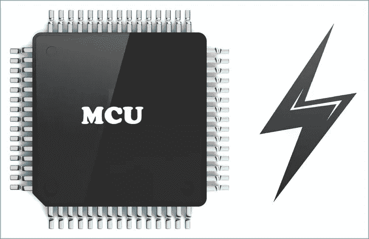
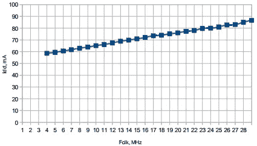

# 最小化微控制器的功耗

> 原文：<https://medium.com/nerd-for-tech/minimizing-power-consumption-in-microcontrollers-b3eb9593c893?source=collection_archive---------3----------------------->

正如天然气(汽油/柴油)对于自行车、卡车和汽车的行驶很重要一样，电力对于电子设备也很重要，对于通常由电池(有限能量)供电的嵌入式设备更是如此。电池电源的有限性意味着这些设备的功耗率应该合理，以鼓励它们的采用和使用。

这些趋势和要求使得**在嵌入式系统设计中实现低功耗考虑变得非常重要**，多年来，设计师、工程师和制造商已经开发出多种有效管理产品功耗的智能方法，以确保产品在一次充电后使用时间更长。

这些技术大多集中在微控制器上，微控制器是大多数器件的核心，在今天的文章中，我们将探讨其中一些技术，以及如何利用它们来最大限度地降低微控制器的功耗。

# 微控制器的节能技术

# 1.睡眠模式

睡眠模式(通常称为低功耗模式)可以说是降低微控制器功耗的最流行的技术。**它们通常涉及禁用驱动微控制器某些外设的某些电路或时钟**。

根据架构和制造商的不同，微控制器通常有不同种类的睡眠模式，每种模式都有能力禁用更多的内部电路或外设。睡眠模式通常从深度睡眠或关闭到空闲和打盹模式。

**下面的**解释了一些可用的模式。应该注意的是，这些模式的特征以及名称可能因制造商而异。

## **一.空闲/睡眠模式**

对于设计人员来说，这通常是最简单的低功耗模式。**该模式允许微控制器以非常快的速度返回到全运行状态**。因此，如果器件的电源周期要求它经常离开睡眠模式，这不是最佳模式，因为当微控制器退出睡眠模式时会消耗大量功率。从待机模式返回活动模式通常基于中断。**该模式通过关闭驱动 CPU 电路的时钟树在微控制器上实现，同时 MCU 主高频时钟保持运行**。这样，一旦唤醒触发器被激活，CPU 就能够立即恢复运行。时钟门控已经被广泛用于在微控制器的低功率模式下切断信号，并且这种模式有效地门控 CPU 上的时钟信号。

## **二。待机模式**

待机模式是另一种低功耗模式，易于设计人员实施。它非常类似于空闲/睡眠模式，因为**它也涉及使用 CPU** 上的时钟门控，但一个主要区别是它允许改变 ram 的内容，这通常不是空闲/睡眠模式的情况。在待机模式下，DMA(直接存储器存取)、串行端口、ADC 和 AES 外设等高速外设保持运行，以确保它们在 CPU 唤醒后立即可用。对于某些 MCU，RAM 也保持活动状态，可以由 DMA 访问，允许在没有 CPU 干预的情况下存储和接收数据。对于低功耗微控制器，此模式下的功耗可低至 50uA/MHZ。

## **三世。深度睡眠模式**

深度睡眠模式通常涉及**禁用高频时钟和微控制器内的其他电路，只留下时钟电路**用于驱动关键元件，如看门狗定时器、掉电检测和上电复位电路。其他 MCU 可以添加其他元件来提高整体效率。这种模式下的功耗可以低至 1uA，具体取决于具体的 MCU。

## **四。停止/关闭模式**

某些微控制器具有这种附加模式的不同变体。在这种模式下，**高低振荡器通常都被禁用，只留下一些配置寄存器和其他关键元件开启。**

上述所有睡眠模式的特性因 MCU 而异，但一般经验法则是:睡眠越深，睡眠期间禁用的外设越多，消耗的电量越低，虽然，这通常也意味着；恢复系统所消耗的能量越多。因此，设计人员需要考虑这种变化，并为任务选择正确的 MCU，而不影响系统规格。

# 2.处理器频率的动态修改

这是另一种广泛流行的有效降低微控制器功耗的技术。这是迄今为止最古老的技术，比睡眠模式稍微复杂一点。**它涉及固件动态驱动处理器时钟，在高频和低频之间交替**，因为处理器频率和功耗之间的关系是线性的(如下所示)。

电流与频率的关系图

这种技术的实现通常遵循这种模式；当系统处于空闲状态时，固件会将时钟频率设置为较低的速度，以使设备节省一些功率，当系统需要进行繁重的计算时，时钟速度会恢复。

> 修改处理器频率会产生适得其反的效果，这通常是由于固件开发不当造成的。当系统执行繁重的计算时，时钟频率保持在较低水平，就会出现这种情况。在这种情况下，较低的频率意味着系统执行设定任务所需的时间会超过必要时间，因此累计消耗的功率与设计人员试图节省的功率相同。因此，在时间要求严格的应用中实现这一技术时，必须格外小心。

# 3.中断处理程序固件结构

这是微控制器中最极端的电源管理技术之一。它在少数微控制器上可用，如 ARM cortex-M 内核，其 SCR 寄存器中有一个退出时休眠位。该位使微控制器能够在运行中断程序后休眠。虽然以这种方式平稳运行的应用数量有限，但对于现场传感器和其他基于长期数据采集的应用而言，这可能是一种非常有用的技术。

在我看来，大多数**其他技术都是上面提到的**的变体。例如，选择性外设时钟技术本质上是睡眠模式的一种变体，在这种模式下，设计人员选择外设来开启或关闭。**这项技术需要对目标微控制器**有深入的了解，可能对初学者不太友好。

# 4.功率优化固件

降低微控制器功耗的最佳方式之一是编写**高效且优化良好的固件**。这直接影响 CPU 每次完成的工作量，并增加微控制器的功耗。在编写固件时，应努力确保减少代码大小和周期，因为每执行一条不必要的指令，都会浪费一部分存储在电池中的能量。

以下是一些常见的基于 C 的优化固件开发技巧；

1.  尽可能使用“Static Const”类来防止数组、结构等的运行时复制。消耗能量。
2.  使用指针。对于初学者来说，它们可能是 C 语言中最难理解的部分，但是对于有效地访问结构和联合来说，它们是最好的。
3.  避免模数！
4.  如果可能，局部变量优先于全局变量。局部变量包含在 CPU 中，而全局变量存储在 RAM 中，CPU 访问局部变量的速度更快。
5.  在可能的情况下，无符号数据类型是您最好的朋友。
6.  在可能的情况下对循环采用“倒计时”。
7.  使用位掩码代替无符号整数的位字段。

降低微控制器功耗的方法不仅限于上面提到的基于软件的方法，**基于硬件的方法，如核心电压控制技术**也存在，但为了将本文的长度保持在一个合理的范围内，我们将把它们留到以后再说。

# 结论

实现低功耗产品从微控制器的[选择开始，当你试图查看市场上可用的各种选项时，可能会相当混乱。浏览时，数据手册可能很适合获取 MCU 的一般性能，但对于功耗关键型应用，这可能是一种非常昂贵的方法。**为了了解微控制器的真正功耗特性，开发人员必须考虑微控制器的电气规格和低功耗功能**。设计人员不仅应该关注 MCU 数据手册中所宣传的每种功耗模式的电流消耗，还应该**研究低功耗模式下可用的唤醒时间、唤醒源和外设**。](https://circuitdigest.com/article/how-to-select-the-right-microcontroller-for-your-embedded-application)

检查您计划使用的微控制器的特性，以确定您对低功耗实施的选择，这一点很重要。微控制器是技术进步的最大受益者之一，现在有几种超低功耗微控制器可以确保您有资源帮助您保持在功耗预算之内。其中一些还提供了功耗分析软件工具，您可以利用这些工具进行有效的设计。个人最喜欢的是德州仪器的 MSP430 系列微控制器。
我在这里的 [Circuit Digest 上发表了这篇文章的副本。](https://circuitdigest.com/article/implementing-low-power-consumption-in-microcontrollers)