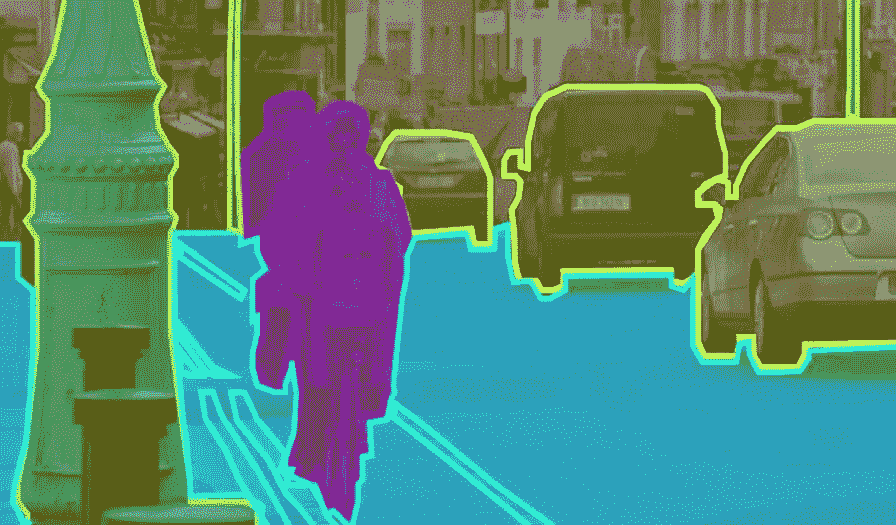

# 关于语义分割标注的误解

> 原文：<https://medium.com/nerd-for-tech/misconceptions-about-semantic-segmentation-annotation-f049641d1333?source=collection_archive---------3----------------------->

*(本文原载作者于*[*https://www . kdnugges . com/2022/01/misconcepts-semantic-segmentation-annotation . html*](https://www.kdnuggets.com/2022/01/misconceptions-semantic-segmentation-annotation.html)*)*

**语义分割**是一个计算机视觉问题，需要将图像的相关元素放入同一类。

语义分割包括三个步骤:

**分类:**对图片中的某个物体进行识别和分类。

**定位:**找到项目并在它周围放置一个边界框。

**分割:**使用分割遮罩对局部图片中的像素进行分组的过程。

语义分段有几种子类型，但它们都是从两个类别中选择一对参数而产生的:数据的维度和输出注释的粒度。

# 维度

数据源中的维度数量被称为。正常的相机图片是 2D 对象的一个例子，因为它只有两个维度:高度和宽度。3D 数据是 2D 数据的变体，增加了“深度”部分。激光雷达和雷达扫描是两种传感器数据。当几个后续 3D 对象沿时间轴分层时，会创建一个 4D 表示，通常称为电影。

我们根据数据的维度利用不同形式的语义分段来创建分段掩码。在 2D 分割的情况下，使用两种方法之一:基于像素或基于多边形的着色。因为像素是这个模型中最小的原子组件，所以每个像素被赋予一个注释类。这导致 3D 中基于点的分割，其中每个 3D 点被标记。如果提供足够的点，分割网格可以从单个对象中提取。

# 粒度

得到的注释的精度被称为粒度。基于类和基于实例的分段是两种最常见的类型。第一个例子中的特定类的分段掩码包含指示该类成员的所有区域。在第二个场景中，为所选类的每个唯一项目构建不同的分段掩码，允许区分不同的实例(例如，像分离两辆不同的汽车)。

# 在机器学习中，哪种语义分割更有用？

为了充分利用[语义分割](https://www.cogitotech.com/blog/what-is-semantic-image-segmentation-types)，应该使用实例感知子类型。这背后有几个原因。

**格式适应性很强**

通过对数据进行分段，您可以训练和试验各种机器学习模型，包括分类、检测和定位、图片创建、前景/背景分离、手写识别、内容更改等。因此，它被用于各种行业，包括自动驾驶、时尚、电影创作和后期制作、农业等。

**精准度无可匹敌**

分段掩码是最精确的，因为它们只覆盖实际项目的位置。另一方面，边界框经常合并或连接相邻的区域。这是由于非刚性物体位于其他非刚性物体的内部或顶部。

**一注两注**

尽管分割遮罩更加精确，但在许多程序中仍然使用边界框。幸运的是，周围的包围盒总是可以使用分割掩模来估计。这就是你如何覆盖你所有的基地！

*尽管有这些好处，使用语义分段作为注释类型的选择还是有明显的缺点。*

# 第一部分是最难的

**1。手工批注既困难又耗时**

手工制作语义遮罩是一项耗时且困难的任务。当遇到不规则的形状或物品之间的边界无法立即辨别的位置时，贴标机必须准确地遵循每个物体的轮廓(见下图)。在没有专门工具的情况下注释单个帧很容易出现错误和不一致，并且可能需要超过 30 分钟。

**2。全自动方法无法提供高质量的结果**

如果我们可以训练一个神经网络做一次语义分割，然后不用做任何事情就可以得到我们所有的注释，这不是很好吗？
其原因是我们对质量的认知与如何评估准确性之间的不一致。项目的轮廓用于生成分割掩模，质量由正确检测到的区域的百分比来确定。

**3。修复错误需要很长时间**

在上述每一个方面，错误都可能是昂贵的。校正不完美的分割掩模需要校正 N 个额外的掩模，其中 N 是相邻掩模的数量(我们稍后将回到这一点)。调整遮罩所需的时间与从头创建遮罩所需的时间一样长。因此，完全自动化分割输出的人工调整同样是不可能的。防止这个问题的唯一方法是使用专门的注释软件和受过充分教育的贴标机。

**4。语义分割标注成本**

正如您可能已经看到的，分段掩码的创建需要使用特定的注释器、设备和自动化。这极大地提高了价格，通常比注释基本边界框的成本高出几倍，并且很快耗尽了预算。