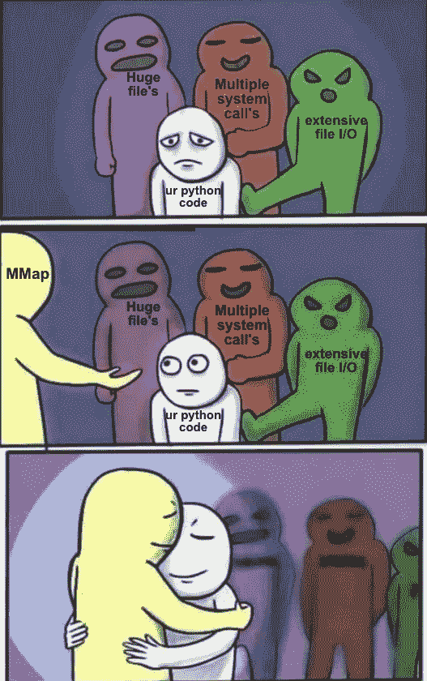

# MMap 是 Python 中的

> 原文：<https://medium.com/nerd-for-tech/mmaps-in-python-63b044c3014a?source=collection_archive---------5----------------------->

是的，你读了，正确的是 2 米

# 那么 MMap 是什么？

多出来的 M 代表“记忆”。内存映射是一个过程，通过该过程，机器级结构被用来从磁盘直接映射文件以供程序使用。它将磁盘中的整个文件映射到计算机程序地址空间中的一系列地址。该程序可以像访问随机存储器中的数据一样访问磁盘上的文件。

mmap 函数使用虚拟内存的概念，让程序看起来好像有一个大文件被加载到了主存中。

但实际上，文件只存在于磁盘上。操作系统只是将文件的地址映射到程序的地址空间，这样程序就可以直接访问文件系统上的数据，而不是使用普通的 I/O 函数。内存映射通常会提高 I/O 性能，因为它不涉及每次访问的单独系统调用，也不需要在缓冲区之间复制数据，而是直接访问内存。

根据您的需要，内存映射文件可以被视为可变字符串或类似文件的对象。映射文件支持预期的文件 API 方法，如 close()、flush()、read()、[、readline()](https://pymotw.com/2/readline/index.html#module-readline) 、seek()、tell()和 write()。它还支持 string API，具有切片等特性和 find()等方法。

# 现在让我们看看如何用 Python 实现 mmap 函数

我们可以使用 mmap 模块进行文件 I/O，而不是简单的文件操作。

1.  我们先[导入](https://www.askpython.com/python/python-import-statement)mmap 模块
2.  然后定义文件在磁盘中的文件路径
3.  然后我们使用 **open()** 系统调用创建 file_object
4.  在获得文件对象后，我们使用 mmap 函数创建文件到程序地址空间的内存映射
5.  然后我们从 mmap 对象中读取数据
6.  并打印数据。

# mmap 功能描述

`mmap_object**=**` `mmap.mmap(file_object.fileno(),length**=**0,access**=**mmap.ACCESS_READ,offset**=**0)`

mmap 需要一个文件描述符作为第一个参数。

参数 length 表示要映射的内存大小(以字节为单位),参数 access 通知内核程序将如何访问内存。

参数 offset 指示程序在 offset 中指定的特定字节之后创建文件的内存映射。

*   第一个参数的文件描述符由 file 对象的 **fileno()** 方法提供。
*   如果我们希望系统自动选择足够的内存量来映射文件，可以指定第二个参数中的长度 **0** 。
*   access 参数有许多选项。 **ACCESS_READ** 允许用户程序只从映射存储器中读取。 **ACCESS_COPY** 和 **ACCESS_WRITE** 提供写模式访问。在 **ACCESS_WRITE** 模式下，程序可以更改映射内存和文件，但在 **ACCESS_COPY** 模式下，只更改映射内存。
*   当我们想从起始地址映射文件时，常常指定 offset 参数为 **0** 。

# 我们已经看到了如何使用 MMap 读取文件，现在让我们看看如何写

要将一些数据写入内存映射文件，我们可以使用 ACCESS 参数中的 **ACCESS_WRITE** 选项，并在通过在 **r+** 模式下打开文件创建 file 对象后，使用 **mmap_object.write()** 函数写入文件。

这里我们必须注意到，mmap 不允许映射空文件。这是因为空文件不需要内存映射，因为它只是一个内存缓冲区。

如果我们将使用**“w”**模式打开一个文件，mmap 将导致 ValueError。

关于上面的例子，我们必须记住的重要一点是，在写入 mmap 之前，输入应该被[转换成字节](https://www.askpython.com/python/string/python-string-bytes-conversion)。

此外，mmap 从文件的第一个地址开始写入数据，并覆盖初始数据。如果我们必须保存以前的数据，我们可以通过在 mmap 函数调用中指定适当的偏移量来实现。

# 结论

简单的读/写操作在执行过程中会产生许多系统调用，这会导致在该过程中在不同的缓冲区中多次复制数据。

使用 mmap 在性能方面为我们提供了显著的改进，因为它跳过了那些函数调用和缓冲操作，特别是在需要大量文件 I/O 的程序中。

这就把我们带到了本文的结尾

如果你已经读到这里…

