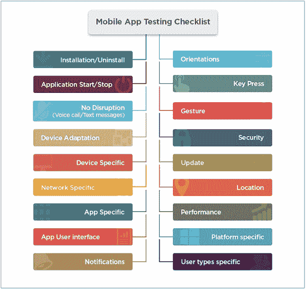
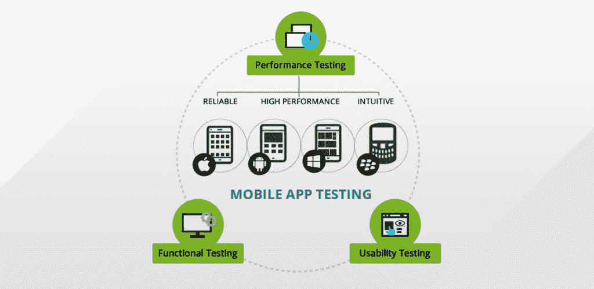

# 移动应用与网站性能测试的差异

> 原文：<https://medium.com/nerd-for-tech/mobile-app-vs-website-performance-testing-differences-d9d172d36a6c?source=collection_archive---------5----------------------->

传统上，桌面 web 应用程序或网页是软件测试的唯一焦点。当时的手机功能不是很强大，多用于简单的通讯。此外，这意味着过去公司必须单独为桌面浏览器测试和优化他们的 web 应用程序。

但在过去十年中，智能手机的发展从根本上改变了数字环境。

企业已经开始开发移动应用程序，以利用智能手机日益增长的使用。这有助于公司让客户更容易获得他们的服务(创建电子商务、账单支付等应用程序)。).

# 为什么要进行手机 App 测试？

随着各种手机的不断普及，由于不断有不同设置的移动设备出现，移动应用程序必须在这些不同的移动设备上进行测试。为了在各种移动设备上提供最佳的用户体验，团队不得不针对所有主要的移动平台优化他们的应用程序(移动设备的数量一直在增加)。

此外，开发人员需要让他们的程序兼容最新和旧版本的 Android 和 iOS。因此，由于移动生态系统中的碎片化问题，对移动测试有着强烈的需求。

为了满足这种需求，除了 web 应用测试之外，企业已经开始将[性能测试](http://www.blazemeter.com/blog/performance-testing-vs-load-testing-vs-stress-testing)整合到他们的整个测试策略中。

[来源](https://www.appsealing.com/rasp-security-runtime-application-self-protection/)

# 网络应用和移动应用的区别

# 基于网络的应用

被称为[网络应用](https://www.javatpoint.com/web-application)的软件程序可以通过网络浏览器访问，并托管在网络服务器上。这些程序被许多浏览器使用，包括 Chrome、Safari、Firefox 和其他浏览器，并且是使用包括 HTML、CSS 和 JavaScript 在内的众所周知的技术创建的。

经过适当优化的 Web 应用可以在各种具有活跃互联网连接的设备上看到，包括智能手机、平板电脑和台式电脑。

# 移动应用程序

顾名思义，移动应用程序是专门为在移动设备上运行而设计的。移动应用程序可以分为三大类。可以通过移动浏览器访问的标准在线应用程序被称为移动 web 应用程序。这些 web 应用程序可能看起来类似于移动应用程序，但它们确实不同。

用户可以从特定的应用商店下载本地程序，因为它们是特定平台的软件(如谷歌 Play 商店或应用商店)。这些程序是利用专门的编程语言为特定的操作系统创建的。例如，原生 Android 应用程序是使用 Java 创建的，但原生 iOS 应用程序是使用 Objective-C 创建的。构建这些应用程序既昂贵又耗时，因为开发人员必须为 Android 和 iOS 维护两个独立的代码库。

本地应用和网络应用的特点结合在一起，创造出了[混合应用](https://www.geeksforgeeks.org/hybrid-application/)。这些应用程序是在许多框架和标准 web 堆栈(HTML、CSS 和 Javascript)的帮助下开发的。这些可下载的应用程序类似于本地应用程序，因为它们可以访问相机、GPS、联系人列表等移动功能。它们比原生应用程序更容易创建，因为可以为 Android 和 iOS 维护单个代码库。

# Web 和移动应用性能测试

从上面的讨论中可以清楚地看到，web 应用程序和移动应用程序的开发有着本质的区别。此外，由于移动用户使用带有缩放和滚动动作的触摸屏手机，用户与他们的互动方式也有所不同。自然，用于测试它们的技术也需要变化。

# 性能试验

测试 web 或移动应用程序最困难的方面之一是性能。性能测试，如果做得正确，可以以惊人的细节和精确度预测产品行为及其对用户活动的响应。所以，值得。

虽然完全不监控您的 web 或移动应用程序的性能会直接导致高流量日(例如，黑色星期五)的崩溃，但是如果您没有准备好处理数量增加的并发用户，不相关的性能测试数据或测试期间选择的不正确指标会使企业付出大量的金钱和精力。

# Web 应用程序性能测试

性能测试通过在推出产品之前识别和减轻潜在的危险，使企业能够主动出击。不适当的系统验证的后果通常包括巨大的机会成本、声誉损害、低转换率和低用户满意度。

性能测试由项目团队完成，具体原因如下。

## 定位系统中的瓶颈

任何性能测试的主要目标通常都是实现这一点。瓶颈会导致软件崩溃或用户体验不佳。响应时间慢、可伸缩性不足、系统中断等。是常见瓶颈的几个例子。测试人员可以改变用户数量、数据量以及他们访问 WPA 的位置。在将产品投放市场之前，他们将能够在严格观察后确定性能问题，并提出具有成本效益的解决方案。

## 确保项目在多个平台上的稳定性

性能测试确保消费者可以在所有支持的平台上访问一定数量的功能。性能测试对于防止由于一个或多个操作系统的不良支持而失去潜在客户的危险是至关重要的。不同的设备、浏览器和操作系统会影响加载时间和其他指标。

## 确保产品自上一版本以来没有降级

在进行任何重要的代码更改后，必须对 web 应用程序运行性能测试。您需要确定系统仍在高水平运行。

# 移动应用性能测试

[来源](https://testinggenez.com/mobile-app-testing/)

移动应用程序的性能测试不同于 web 应用程序的性能测试。用于访问 web 应用程序的笔记本电脑或台式机不会因为不利的网络环境而经历大量的延迟或数据包丢失。

相比之下，在考虑移动应用的性能测试时，我们需要考虑网络环境、数据包丢失、延迟、我们使用的设备类型(如智能手机或智能设备)以及带宽。

对于每一种移动应用程序，都使用不同的性能测试方法。由于每个应用程序都是用一组单独的组件创建的，并且具有独特的处理机制，因此方法会因应用程序而异。

基于移动浏览器的应用程序的行为不同于传统的 web 浏览器应用程序。这种行为是最终用户的数据计划带宽使用的结果，也取决于移动设备的配置。

这种基于浏览器的应用程序的创建成本较低，因为确保与移动设备浏览器的兼容性所需的工作较少。

总之，web 应用测试的目标是确保网站在所有平台和浏览器上提供完美的用户体验。另一方面，移动应用程序测试的目的是在各种 Android 和 iOS 设备上找到本机或混合移动应用程序兼容性的任何错误或问题。

# 摘要

性能测试为公司经理提供了获取大量信息的途径，为有效的决策提供了数据，并降低了团队在引入产品后可能面临的风险。另一方面，省略过程中的关键步骤可能会误导利益相关者，并极大地夸大成品的性能。

因此，理解性能测试非常重要，这样您就可以将它正确地应用到您的测试过程中。