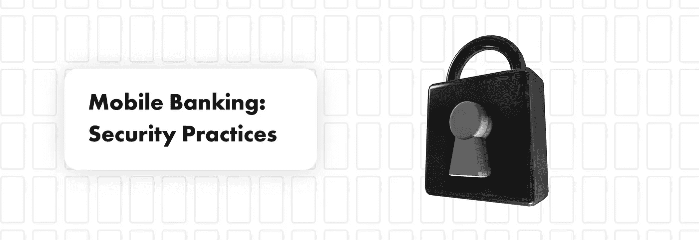
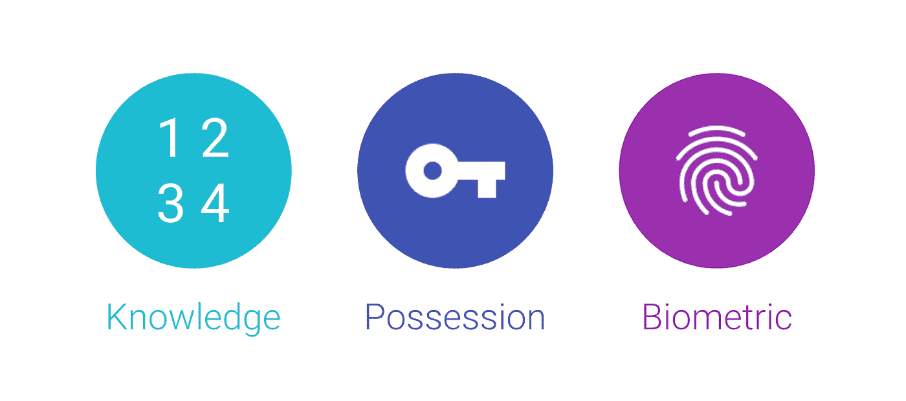
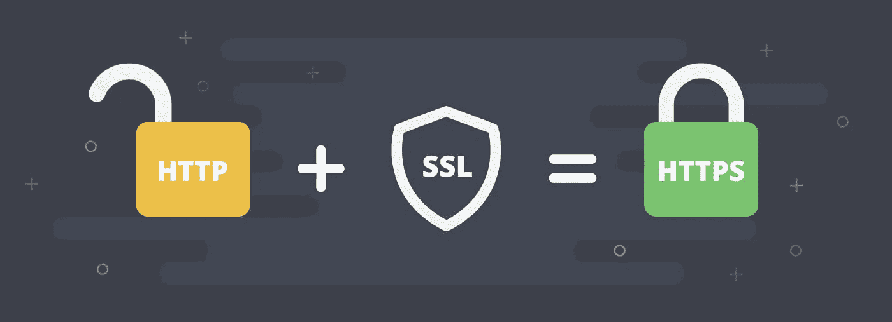
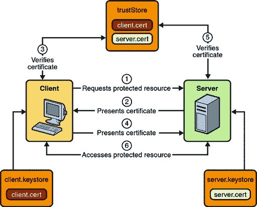
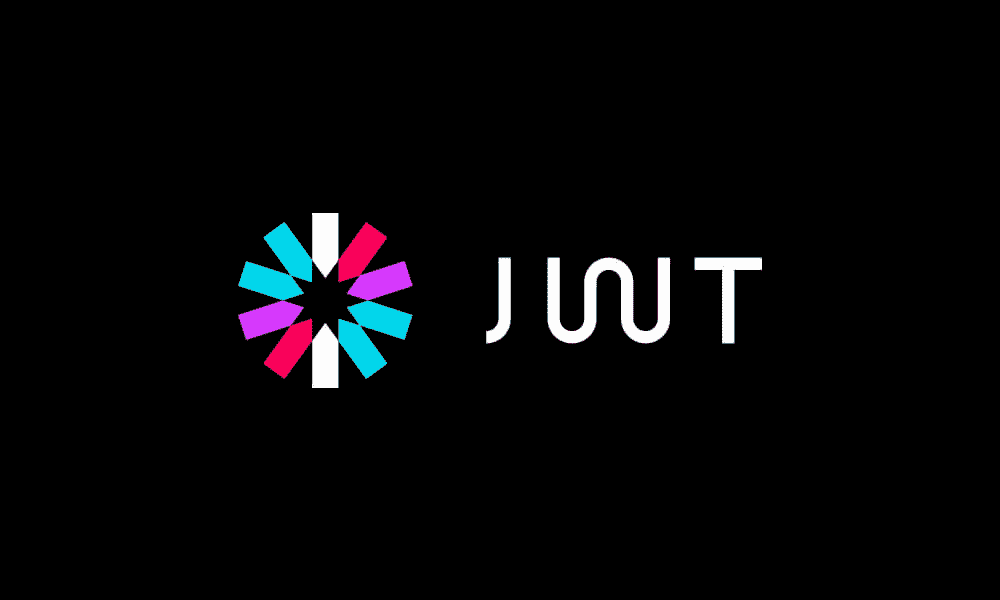
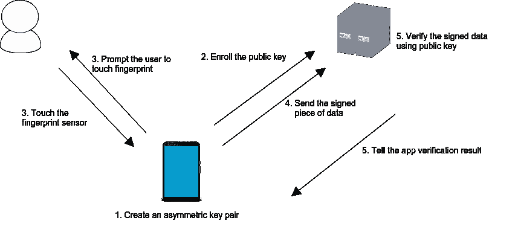
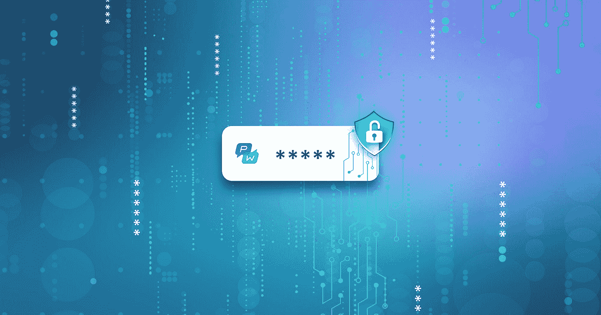

# 手机银行:安全实践

> 原文：<https://medium.com/nerd-for-tech/mobile-banking-security-practices-305e42f9e76?source=collection_archive---------4----------------------->

当你开发任何金融科技应用程序时，安全将是你必须注意的基本问题，尤其是在使用移动银行应用程序时。用户期望金融机构承担责任，因为他们通常将自己拥有的一切委托给金融机构。为了建立这种信任，保证用户数据和资金的安全至关重要。

*当然，这款应用在交付给用户之前，需要通过银行业的许多安全标准和审核。最好为这些考试做好准备。本文将关注在创建安全的银行应用程序时应该实现或需要注意的主要特性。*

**概述**

首先，我们把安全特性分成两组(或层)——**本地**和**远程**。在典型情况下，这些组可以被隔离在它们自己的层上，但有时它们会发生冲突。

**本地**组包含只依赖于前端开发人员工作的特性。这些功能主要是防止本地威胁。通常，这些威胁会导致用户数据(或任何敏感信息)从设备泄露给第三方。要回顾的特性有**数据和文件加密、缓存策略和生物特征安全性**。

我们将覆盖或消除客户机-服务器威胁的功能放入**远程**组*。*这些威胁的主要危险是破坏或干扰客户端-服务器通信通道的能力。这一层将回顾客户机-服务器协议、证书、授权和推送通知的问题。

**数据加密算法**

让我们从本地特性组和数据加密问题开始。在我们看来，这是您需要的最关键的特性。现代应用程序存储任何用户的信息、服务器元数据、敏感文件和基本设置。即使你开发了普通的应用程序，所有这些都会发生，但是一些应用程序也提供了离线模式和离线访问最新用户数据的功能。在这种情况下，本地数据量会随时间呈指数级增长。

所以这里的问题是，你信任设备存储和开发工具吗？因为大多数时候，您在日常工作中可能使用的默认工具没有利用最新的安全实践，或者根本不安全。而设备存储可能有最意想不到的安全漏洞。

例如，允许您使用本地数据库的默认 Android 框架只依赖于数据库存储在安全的系统存储中这一事实，因此没有必要对其内容进行加密。但对我们来说，这是不可接受的。如果黑客可以访问用户的设备，并以某种方式获得 root 权限或访问包含应用程序文件的安全文件夹，或者以某种方式直接从内存访问数据库，会怎么样？简单的解决方案是加密数据库，消除哪怕是微小的攻击机会。有这样的工具——在大多数开发人员中并不常见，但它们确实存在，而且使用起来很简单。

任何加密都需要算法和密钥。至于算法，一切都很明显。移动平台通常有现成的 AES、RSA、SHA 哈希算法。甚至 MD5 散列在简单的情况下也是有用的。我们建议熟悉这些算法。现在让我们来看看加密密钥。

**加密密钥**

几乎所有加密算法都需要加密密钥。它可以是单个密钥或一对公钥/私钥。幸运的是，几乎所有现代系统都为我们提供了生成这种密钥的工具。比如在 Android 中，这个工具叫做 Keystore API。它允许您创建几种类型的密钥，甚至可以立即使用几种不同的加密算法。iOS 也提供了类似的 API。

【https://www.varonis.com/blog/pgp-encryption/】来源:

*这里最重要的特点是，如果设备有单独的加密处理器，这些密钥可以存储在设备的硬件中。不幸的是，这种优势通常只适用于优质设备。否则，密钥将在软件级别生成和存储，但仍具有高保护级别。无论如何，我们需要这些 API。虽然这不可能是盲目的信任，但在这种情况下，我们可以信任操作系统。*

*当您使用跨平台解决方案或开发一些定制应用程序时，您可能无法直接访问系统 API。在这种情况下，您可以搜索第三方解决方案或编写自定义接口来访问必要的平台工具。但你需要仔细研究你正在使用的工具，因为用户的数据保护取决于这些工具的质量。*

***加密什么***

*好了，现在我们有了加密算法和密钥。我们需要加密什么？首先，如前所述—本地数据库。第二—应用程序首选项。通常，它们会存储一些用户或应用程序设置，我们需要保护它们。有时，开发人员将用户令牌、id 或密码保存在首选项文件中，以便更快地访问这些信息。*

*例如，在 Android 中，默认的 API 不为这类文件提供任何保护。除非这些文件存储在普通用户无权访问的私有应用程序文件夹中。但是当谈到入侵者攻击时，我们不考虑普通用户。因此，您有两个选择——自己加密数据或使用加密的安全应用程序首选项。*

*本章的下一个特性是远程请求内容的加密。我们可能会发现自己处于一种无法信任与服务器的通信通道的境地。它更像是一个次要的特性，但是它强调了本地加密算法和密钥的重要性。*

*假设我们没有在架构级别使用请求加密，但是我们需要从服务器获取用户的信用卡 pin 码(或任何其他敏感信息)。要求服务器以原始格式传递这样的信息是不负责任的。您可以选择使用一次性的公钥/私钥对。公钥将被发送到服务器；然后，服务器将加密数据。当我们拿回我们的数据时，我们将使用私钥解密它。任务完成—用户数据已安全传输。*

**

**来源:*[*https://www . egoldfax . com/post/data-encryption-and-cloud-storage-in-internet-faxing*](https://www.egoldfax.com/post/data-encryption-and-cloud-storage-in-internet-faxing)*

*这里要讨论的最后一项是文件安全性。当然，您可以将用户文件存储在私人应用文件夹中。系统会保护这些文件，但它不会给你 100%的把握。您可以考虑额外的文件保护。我们已经展示了加密非常简单。这可能会稍微降低应用程序的速度，尤其是当存储的文件很大时。但与此同时，它增加了应用程序的安全级别。*

*这里还有一个关于文件和数据安全性的棘手问题。如果您允许其他应用程序访问用户文件和信息，请注意您授予哪些代理访问权限。要考虑的常见案例是文件共享和助手(Siri、Alexa、Google、Cortana 等。)集成特性。*

***加密重述***

*整个加密章节的要点——使用系统密钥库作为唯一的真实来源，不要相信其他任何东西，甚至是操作系统的其他部分(系统存储、首选项文件等)。).系统对密钥进行保护，这种保护是由苹果、谷歌等提供商保证的。您可以使用各种加密工具，因为它们非常相似，但是密钥的安全性应该是您最关心的问题。*

*好了，现在让我们进入下一个话题。*

***сache 策略***

*默认情况下，应用程序使用许多不同的缓存策略，但大多数都不是开箱即用的。这就是为什么这里的下一步是检查您的缓存工具，因为它们可能会暴露所有用户的数据，或者至少简化第三方的信息提取。大多数情况下，我们谈论的是应用程序从服务器接收的数据。如果您怀疑用户的信息不够安全，或者由于缓存错误而发现了数据泄漏，我们可以建议两种方法来解决这个问题。*

*首先，完全关闭默认缓存，使用加密数据库存储数据。这种方法并不简单，可能会增加您的开发预算，但它还有另一个好处:您可以离线访问所有数据，并将其转化为有用的功能。第二种方法是将加密添加到默认的缓存系统中。这可以在架构层面上完成，不会花费你太多时间。*

*当然，总有第三方库和框架可以帮助你，但是我们鼓励你在使用之前检查它们。无论如何，请记住，缓存可能很棘手，并不总是像您预期的那样安全。*

***应用程序密码和生物特征识别***

*我们假设现在几乎每个 app 都有这个功能。甚至你的购物清单也可以用本地密码或生物识别技术来保护。对于金融应用程序，这是授权流程的重要部分。*

*生物特征保护是由系统控制的 API 提供的，而且很容易实现，那么我们为什么要在本文中提到它呢？原因是，我们希望主要关注密码功能，因为这是您需要自己实现的部分。它可以是存储在服务器上的远程密码，在 web 应用程序中用作常规密码。我们将在下一节讨论它。*

**

**来源:*[*https://Android-developers . Google blog . com/2018/06/better-biometrics-in-Android-p . html*](https://android-developers.googleblog.com/2018/06/better-biometrics-in-android-p.html)*

*通常不能单独使用生物认证。如果生物特征不能使用，或者设备坏了，或者你能想到的任何其他原因，你需要一个后备。大多数情况下，我们使用本地密码来提供主要和生物识别辅助身份验证方法。如果你也在这么做，我们想警告你—小心你存储此密码的位置和方式。加密技术会帮到你。*

*此外，请仔细考虑“忘记密码”功能，因为如果用户不能正确输入密码，我们会立即陷入怀疑模式。当用户试图恢复他的代码，我们不能让他这样做，除非确认他是真正的客户，而不是黑客。确认流程可能类似于授权，但是需要考虑很多问题。无论如何，最好不要恢复用户的密码，而只是在确认用户身份后强迫他创建一个新的密码。*

***客户端-服务器协议***

*让我们转到**远程**安全特性和问题。这更像是一个前端视图，因为你可以写一些关于后端安全和授权实践的书。*

*当然，最重要的是客户端和服务器端的通信通道。希望我们不需要说 SSL 保护是必不可少的。还是说说这个保障对银行申请来说够不够吧。*

**

**来源:*[*https://previous . agency/digital-marketing/SSL-increase-traffic-and-conversions/*](https://prevail.agency/digital-marketing/ssl-increase-traffic-and-conversions/)*

*答案实际上是肯定的，你完全可以通过 HTTPS 的连接来通过大部分的安全审核。但是也许你应该考虑使用加密技术。至少对于可能携带敏感用户信息的请求是如此，比如获取信用卡数据、pin 码、用户文档等。我们前面提到了 pin 码和一次性加密的例子。*

*如果您想让安全性更上一层楼，可以对所有客户端-服务器通信应用加密。我们会说这将是非常棒的。那么为什么银行不总是这么做呢？通常，原因是所有通信的完全加密是一项复杂的任务。复杂意味着不仅开发成本高，而且支持成本也高。此外，这将降低整个系统的速度，并可能使授权过程过于复杂。*

*但是假设您决定使用 SSL。有没有可能在不使用加密的情况下最大限度地减少威胁？当然，是的，我们可以向您展示几种降低中间人攻击成功概率的方法。*

***证件保护***

*SSL 连接使用的证书只不过是证书颁发机构(CA)给你的一对公钥/私钥。在开始相互对话之前，客户端和服务器执行握手，包括密钥和证书交换。这种技术是一种传输秘密数据的可靠方式，无需担心谁会看到你的内容。但正如我们之前提到的，它可能会被破坏，下面是我们如何在 5 分钟内保护自己。*

*我们正在谈论的特性是 SSL pinning。后端开发人员在服务器上提供证书的散列，前端开发人员将其硬编码到设备的 HTTP 客户端。现在，当服务器或其他人试图连接到应用程序时，我们计算握手时提供的证书的哈希，并将其与客户端的哈希进行比较。如果它们匹配，我们可以确定这是我们的服务器，并且我们可以信任这个连接。否则，我们将拒绝与设备通信的尝试。即使有人从设备或应用程序构建中提取服务器证书的哈希(其实很容易做到)，也无济于事。对第三方没用，几乎不可能逆向工程。*

*SSL pin 是金融应用和整个行业的常见做法。接下来，我们想谈谈一个不太明显的东西——客户端证书。*

**

**来源:*[*https://docs . Oracle . com/CD/e 19879-01/819-3669/BNC bs/index . html*](https://docs.oracle.com/cd/E19879-01/819-3669/bncbs/index.html)*

*客户端证书的工作方式与常规服务器证书相同，只是它存储在客户端。在这个模式中，服务器检查连接的真实性。使用这种技术和 SSL 固定，我们将有两个方面的验证。这似乎是另一个 5 分钟的功能，但不幸的是，它不是。*

*这里的核心问题是，我们不能在应用程序本身中存储客户端证书，因为应用程序包文件很容易被逆向工程。如果有人能这么快拿到证书，那就相当于根本不用它。但是可以有安全的方法将客户端证书从服务器或任何其他可信源传送到设备。*

*如果我们谈论的是服务器，我们需要建立一个可信的、安全的连接。为此，我们可以使用高级加密和密钥交换算法。需要一些验证机制来确保服务器与实际的客户机对话。当设备收到证书时，它可以被保存到安全的存储器中并被加密。*

*将客户端证书集成到应用程序中需要做大量的工作。值得吗？遗憾的是，在这里我们无法给你一个普适的答案。客户端证书不保护客户端本身；它保护服务器免受银行基础设施之外的不必要的连接。但是，如果您确信您的服务器足够安全，您可能会决定不将资源花费在诸如客户端证书之类的功能上。*

***授权***

*这是我们最后一个大话题。手机银行的授权与其他应用很少不同。通常，这与软件开发中常见的 JWT 令牌方案相同。这里，我们想讨论金融应用中两种最重要的身份认证方法——密码和生物特征认证。我们在前面的本地部分提到过，当您想要控制来自服务器的所有授权时，您也可以远程使用它们。*

**

**来源:*[*【https://auth0.com/blog/jwt-json-webtoken-logo/】*](https://auth0.com/blog/jwt-json-webtoken-logo/)*

*我们面临的问题是授权令牌的更新。当用户在输入正确的密码或使用生物识别技术后登录应用程序时，他应该能够从服务器检索新的令牌来使用该应用程序。*

*访问令牌的生存时间(TTL)很短，因此通常在这个过程中，您依赖于刷新令牌，其 TTL 要长得多。但问题是刷新令牌的 TTL 也不能太长。它仍然比访问令牌长，但比续订用户会话所需的时间短；通常，它的寿命不超过 30 分钟。设置为几周或几个月可用的刷新令牌对系统来说是危险的，并且可能被归类为安全威胁源。*

*在第一种情况下，当我们有一个长期令牌时，我们可以使用本地身份验证，然后在用户执行第一个请求时简单地更新令牌。但是如果我们选择安全的短期令牌，我们需要手动更新令牌。为此，我们需要在用户输入密码或通过生物认证后立即发送更新令牌的请求。*

*如果没有证据证明我们是有效的客户，我们就不能续订代币。您最终可以采用的第一种解决方案是使用密码的哈希作为授权因素，以后它将更像普通密码一样为您服务。这可能是一个很好的解决方案，因为一对旧的刷新令牌和密码已经很容易被泄露或窃取。但是我们建议您首先在客户机和服务器之间创建一个可靠的通信通道。为此使用一次性加密密钥。这种方法为您提供了更多的安全性，并且除了几千字节的用户流量之外，成本并不高。*

*这种模式不仅适用于密码，也适用于生物识别。生物认证是你的第二种认证方法，所以你应该有一个密码。你可以将它(当然是加密的)存储在设备上，并在指纹扫描或 Face ID 识别成功后用它来更新令牌。*

*下面，你可以看到一个来自谷歌官方指南的关于在生物认证后实现用户验证的模式。它仅使用一对非对称密钥来建立连接和执行令牌更新，但是我们认为您应该在此基础上使用额外的验证。*

**

**来源:*[*https://Android-developers . Google blog . com/2015/10/new-in-Android-samples-authenticating . html*](https://android-developers.googleblog.com/2015/10/new-in-android-samples-authenticating.html)*

*密码可能是一个很好的解决方案，但前提是你信任存放密码的地方；否则，它根本不应该存储在设备上。但是如果你遵循以上所有的建议，并使用良好的加密机制，你应该能够安全地存储用户的密码。*

***推送通知***

*在远程安全功能部分的最后，我们想提一下这个小东西。推送通知是一个方便有趣的功能；现在几乎每个应用程序都在使用它们。但对于手机银行来说，这可能是危险和棘手的。为什么？因为通知中的数据是开放的，不受保护。它不容易获取，但对于专业黑客来说是可以获取的。我们不能依靠系统或推送通知提供商来保护内部信息。*

*我们能做些什么呢？最简单的方法是不要在通知中传递任何敏感信息。例如，如果您想在 push 消息中发送一个完整的事务模型，以将其保存到本地数据库中供将来使用，这不是一个明智的想法。最好发送事务的 ID，然后应用程序可以启动后台服务，建立到服务器的可靠连接，并获取必要的信息。当然，你需要向用户展示一些东西；为此，使用尽可能少的数据。*

**

**来源:*[*https://www . pushwoosh . com/blog/how-to-work-with-sensitive-data-if-you-want-to-use-push-notifications-2*](https://www.pushwoosh.com/blog/how-to-work-with-sensitive-data-if-you-want-to-use-push-notifications-2)*

*另外两个选项是使用加密。是的，这似乎是一个万能的解决方案，但它不是，相信我们。为什么有两个选择？因为已经有推送通知服务(提供商)可以为您提供良好的通知安全级别。通常情况下，他们使用加密，所以你不需要麻烦自己，花额外的时间。*

***总结***

*如果您想创建一个安全可靠的银行应用程序，我们试图向您展示您必须考虑的主要安全问题和特性。通常会有比本文描述的更多的问题。安全问题的解决办法并不普遍；每一个都需要其独特的方法。您必须根据项目的情况和您想要达到的安全级别来决定使用哪一种。但是最好知道自己能面对什么。*

*正如我们前面提到的，几乎所有的银行应用程序，主要是那些直接处理卡和支付操作的应用程序，都必须经过多次批准和审核。这些审计将帮助您发现安全漏洞和问题，并建议您修补或消除它们。也有单独的公司做安全审计；如果你需要帮助，你可以雇佣他们。*

*另一个有用的东西是 OWASP。它是一套方法、文档和 web 应用程序安全工具。尽管这些文档和实践主要涉及 web 应用程序，但移动开发者也可以从中找到许多有价值的东西。如果你正在努力提高你的安全技能，这是值得你注意的。*

*总之，我们想说的是，用户期望他们最喜爱的应用程序的信息安全。开发人员能够确保这一点。认真对待这项任务，让你的用户满意，让你的应用比实体银行金库更强大。*

**—
亚历山大·卡尔诺伊
在* [*阿尔提*](http://alty.co) 领导安卓开发者*