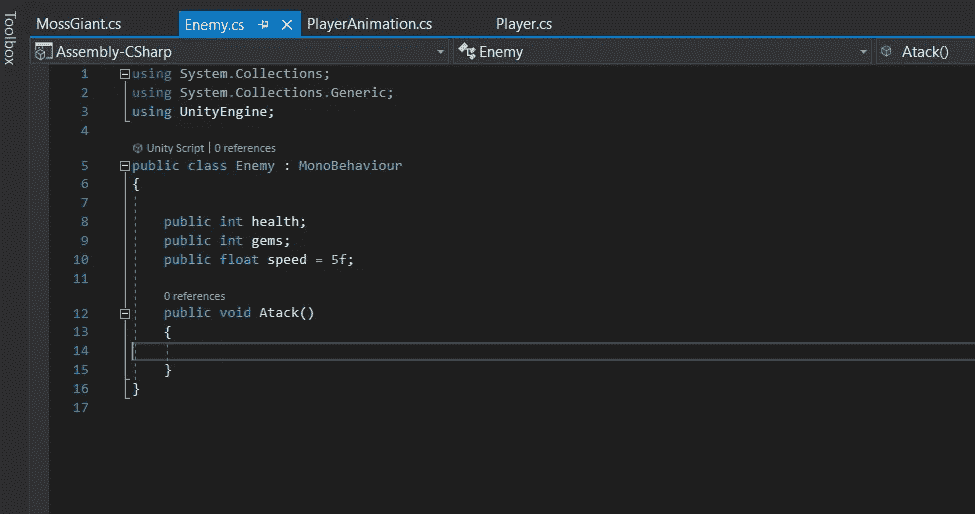
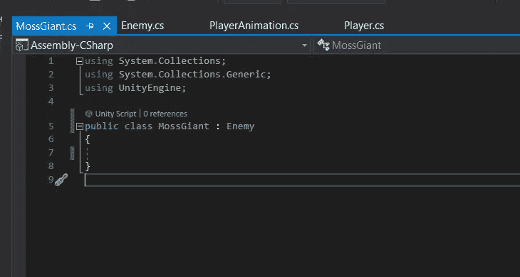
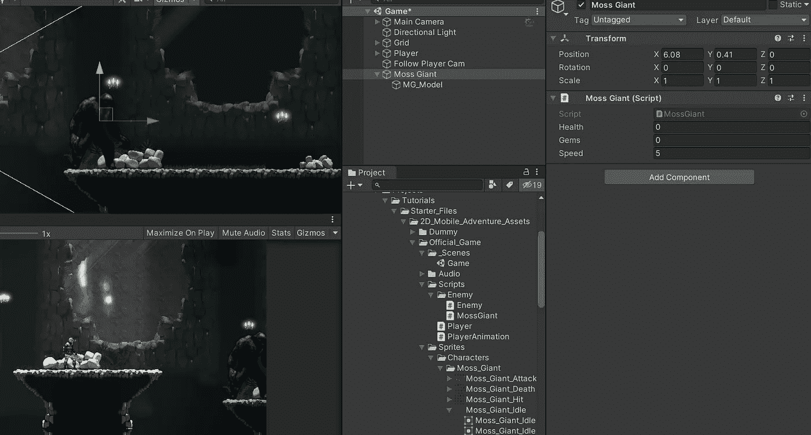
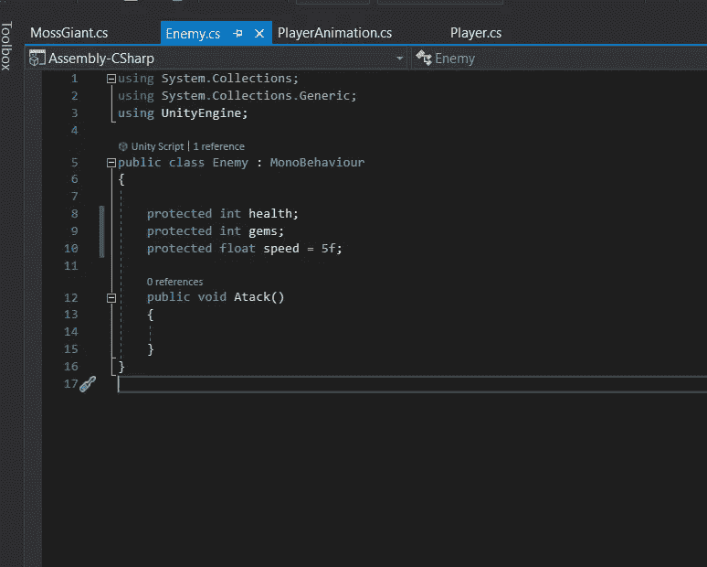

# Unity 中的手游:敌方设计级传承

> 原文：<https://medium.com/nerd-for-tech/mobile-games-in-unity-enemy-design-class-inheritance-957d29c04e06?source=collection_archive---------4----------------------->

在这篇文章中，我将讨论类继承。到目前为止，设置动画应该是轻而易举的事情，所以从这里开始，我所有的敌人都被导入到设置好动画的场景中。在接下来的文章中，我将介绍一些我在动画方面的决定，但我主要是挖掘编程的本质细节。

当涉及到面向对象编程时，类继承是非常有用的。每个敌人都有相似的属性:生命，移动，伤害等。为什么我要做一个单独的脚本，每次都编码出同样的东西？这就是继承发挥作用的地方。

下面你会看到我的敌人脚本。它继承自 Monobehaviour。

我有一些简单的变量，所有的敌人都会共享。我还创建了一个他们都将共享的基本攻击()。现在我需要为敌人制作单独的脚本来继承敌人的职业。下面你会看到脚本。现在甚至没有任何事情发生。

如果我把苔藓巨人的脚本附加到苔藓巨人上，你会在检查器中看到生命值、速度和宝石。这是因为苔藓巨人的剧本是从敌人的职业继承来的。

这看起来非常简单。最终你会明白为什么它如此方便。当我们进入运动行为时，事情变得更有趣了。不过现在，我可以给敌人分配他们自己的生命值、速度和被摧毁时掉落的宝石数量。

我要把我所有的变量都改成`protected`，而不是把它们公开。我不希望外部脚本能够访问这些值。如果我把它们设为私有，单独的敌人脚本将无法访问它们。使用 protected 修饰符使得只有从敌人继承的脚本才能访问它。

在下一篇文章中，我将介绍如何将它设置为一个抽象类，让敌人继承。