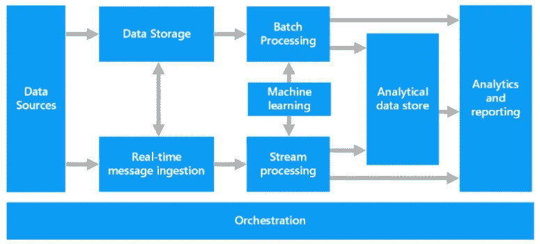
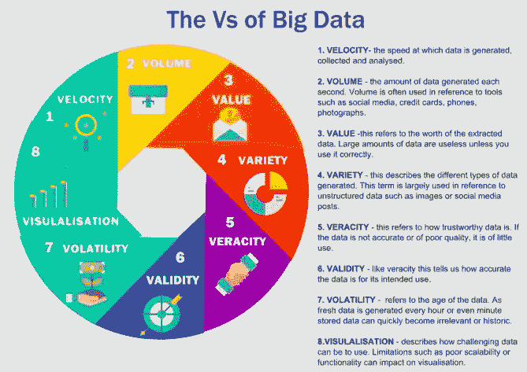
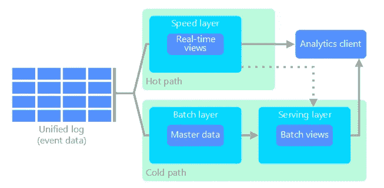
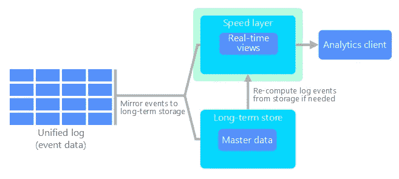
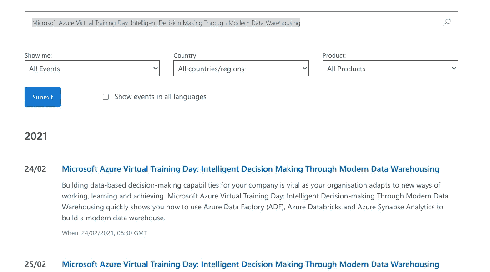

# 现代(大)数据架构。

> 原文：<https://medium.com/nerd-for-tech/modern-day-big-data-architecture-c7b784881af7?source=collection_archive---------3----------------------->

在现代社会，数据被视为组织最大的资产之一。随着组织的快速增长和扩张，其数据的规模、数量和种类也在快速增长。一个组织从如此大量的数据中获得的洞察力是无价的。那么，我们如何处理这样的数据量呢？这就是现代数据架构(也称为**大数据**架构)的用武之地。在本文中，我们将讨论大数据架构的特征和一些实时用例。

**什么是大数据？**

大数据是数据集的集合，其规模和复杂性足以使传统的数据存储和数据处理架构过时。

**何时考虑大数据？**

考虑在以下场景中使用大数据架构，

1.  数据太大，传统的数据存储无法处理
2.  非结构化数据的转换和分析
3.  需要分析低延迟的流数据

**可以考虑哪些类型的工作负载？**

1.  数据的批处理
2.  运动数据的实时处理
3.  涉及使用人工智能和机器学习的分析，如流失、预测和入侵检测

**大数据组件**

大数据组件由各种组件组成，但它们不一定需要在一个用例中一起使用。组件因业务用例而异。

下图说明了大数据架构的各个组件。

数据源—数据源包括各种数据，但不限于传统的关系数据库、业务流程和应用程序的日志文件，以及事件和物联网设备生成的实时消息。

数据存储—此类批处理或实时数据源的数据存储通常涉及分布式数据存储，这些数据存储容量巨大，有助于对这些数据进行分析。这种数据存储示例是 Azure 数据湖存储 Gen1、Blob 存储和 Azure 数据湖存储 Gen2。

实时消息接收—实时数据接收包括接收流消息、存储和处理流消息以获得洞察力的机制。当数据被推送到存储器进行处理时，促进消息接收的组件充当缓冲器。这种消息接收组件示例包括 Azure 事件中心、Azure 服务总线、Azure 物联网中心、Azure 物联网边缘设备、Azure 物联网中心和 Azure 事件中心。

批处理-批处理通常涉及使用批处理作业批量处理的大型数据集，以聚合、过滤和准备数据用于进一步分析。一些批处理组件包括 Azure Data Factory、Azure Batch、U-SQL (Azure Data Lake Analytics)、HDInsight Hadoop 和带有 Azure Databricks 的 Spark clusters。

流处理—这涉及流数据的处理，以定期执行数据的聚合、过滤和处理。Azure Stream Analytics 就是一个很好的例子。这些组件可以使用来自各种其他 Azure 组件的数据，如事件中心、物联网中心和边缘设备。然后，Azure Stream Analytics 可以动态执行和转换数据，并将其接收到数据存储，如 Azure Data Lake、Azure SQL Database、Azure Dedicated SQL Pools、Azure Synapse(正式名称为 Datawarehouse ),以进行进一步的分析和报告。

分析数据存储—大数据解决方案通常涉及可以动态扩大和缩小计算资源的数据存储，还涉及通常对可存储的数据大小没有限制的数据存储。这些被称为 OLAP(在线分析处理)系统。这种数据存储的例子是基于 MPP 架构(大规模并行处理)的 Azure Synapse Analytical(数据仓库)。数据仓库使企业能够构建基于 kimball 的关系数据仓库，并对数据集进行分析。

分析和报告—为了向用户提供数据切片和切块，大数据架构利用了数据建模层，也称为维度建模层。这包括在数据存储之上使用 OLAP(在线分析处理)层来提供数据的多维分析和可视化。Azure 堆栈中的组件示例包括 Azure Analysis Services、Power BI reports 和 Excel reporting。

编排—为了实现成功的批处理或实时处理，数据流的编排对于构建可靠且具有容错能力的批处理或实时流程非常重要。Azure 组件的例子有 Azure Data Factory、Azure Synapse Analytics Workspace 和 Azure Logic Apps。

机器学习——机器学习馈送批处理和流数据，以训练用于回答大多数分析问题的 ML 模型。

**大数据架构的 7 个 V**

大数据架构的某些特征使其有别于传统的数据处理架构。

**大数据架构**

大部分大数据架构实施都涉及以下三种架构之一。

***λ架构***

lambda 架构为同一组数据创建了两条不同的路径。速度层或实时层将数据提供给 Power-Bi 等分析客户端。存储数据的批处理层充当实时数据馈送的补充，以便弥补由于实时数据中的延迟而造成的差距。由批处理层处理的数据被保存为批处理视图，这些视图反过来被提供给分析客户端。服务层聚合并合并来自速度和批处理层的结果，以提供完整的信息视图。

***卡巴架构***

Lambda 架构使用两种不同的路径，这会导致数据的复杂性，有时还会造成数据的重复。由于涉及多个组件，实施 Lambda 架构的成本很高。在某些使用情况下，Kappa 架构可以被视为 Lambda 架构替代。

Kappa 架构的设计方式是数据仅流经一层，即速度层。数据作为事件流被接收到分布式容错统一日志中。这些事件是有序的，事件的当前状态只有在追加新事件时才会改变。类似于 lambda 架构的速度层，所有事件处理都在输入流上执行，并作为实时视图持久化。如果您需要重新计算整个数据集(相当于 lambda 中批处理层所做的)，您只需重放流，通常使用并行性来及时完成计算。

**实时用例**

上述体系结构的一些实时用例是，

1.  Twitter 和脸书使用 Lambda 架构对他们的消息和帖子进行实时和批量分析。—参见[https://blog . knol dus . com/twitters-tweets-analysis-using-lambda-architecture/](https://blog.knoldus.com/twitters-tweets-analysis-using-lambda-architecture/)
2.  电动汽车内置的软件实时(通过物联网/边缘设备)向制造商发送数据，然后制造商对来自传感器的数据进行实时和批量分析，以提高电动汽车的性能。这是基于 Lambda 架构。
3.  电信行业拥有海量数据，可以对这些数据进行实时分析，以识别和修复任何与网络相关的异常。数据可以被实时地馈送到 ML 模型，并且 ML 模型可以建议可以使用 AI 流来实现的建议。这通常遵循 Kappa 架构。

**微软培训课程**

微软正在为现代数据仓库举办一些非常好的培训活动。如果有兴趣，参考链接[https://azure.microsoft.com/en-gb/community/events/?查询=微软+Azure+虚拟+培训+日% 3A+智能+决策+通过+现代+数据+仓储](https://azure.microsoft.com/en-gb/community/events/?query=Microsoft+Azure+Virtual+Training+Day%3A+Intelligent+Decision+Making+Through+Modern+Data+Warehousing)

我希望这篇文章有所帮助，并提供了关于现代大数据架构的急需信息。

# 让我们学习，帮助别人学习！

*版权:本页面的部分内容归美国华盛顿州雷蒙德市微软公司所有。*