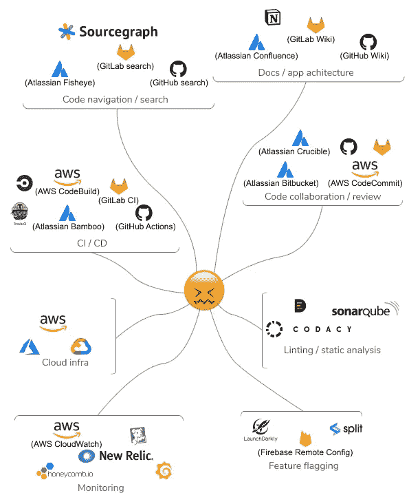

# 工具越多，问题越多

> 原文：<https://medium.com/nerd-for-tech/more-tooling-more-problems-2efb7abb8b5b?source=collection_archive---------12----------------------->

现代软件开发工作流目前停留在本地的 maxima 中，开发人员被迫每天使用无数的工具和 SaaS 服务来完成他们的工作。这些 SaaS 公司聪明地试图成为他们自己领域的佼佼者，但一次又一次地忽略了他们与工具环境的契合度，而开发人员必须掌握这些工具才能完成有意义的工作。

在日常工作中，开发人员可能需要与许多服务进行交互，如下图所示。

这些工具很多，每一个都需要相当长的时间来熟悉它们。

你可能会问的下一个问题是:为一家公司设置如上工作流程有多复杂？我们将指出一些我们从以前在这个行业的经验中注意到的陷阱。

# 设置工作流的人员和资源

让我们假设一下，您想要为您的公司从头开始建立一个运行良好的工作流，理想地覆盖我们前面提到的大部分部分。假设您没有自己的基础设施，那么所需的最少工作就是连接工作流中的所有集成。

一个很大的缺点是，你可能需要一个高级开发人员来为每个任务选择工具，并决定工作流的复杂程度。最重要的是，开发人员需要努力确保设置正确，并遵循最佳实践，而代价是开发人员进行集成，而不是让他们专注于自己的领域并解决公司的核心问题。

如果您想在本地安装工具，您可能需要投入更多的时间和精力，并开始考虑让一个专门的 DevOps 团队来接管这些工具。

建立一个复杂的工作流的另一个陷阱是，很多时候对于什么是最佳实践以及如何实现它存在偏见。这取决于开发人员以前的经验，这将决定工作流的复杂性和设置集成。这里的危害是，如果开发人员的体验不符合环境，它可能会因为忽略重要的任务而导致捷径，从而导致产品级的糟糕结果。

# 成熟度

除了管理、维护和使用作为每个工作流的一部分的工具的问题之外，还有另一个可能使其难以采用的进入壁垒:你的公司在软件开发生命周期(SDLC)的最佳实践方面的成熟度水平。

可以理解的是，考虑到不同的因素，并非所有公司都处于相同的成熟度水平，例如:

*   没有时间实施来自更高级开发人员的自上而下的想法
*   缺乏能够掌控所需基础架构的团队
*   缺乏最佳实践的知识

缺乏复杂性会破坏构建和发布软件的过程，因此导致公司更容易在用户中留下坏印象，因为他们的产品更不稳定。另一个缺点是由于停机时间或缺乏用户采用而造成的收入损失，最后要提到的另一个重要问题是它会给你的团队带来麻烦并产生意想不到的结果。

因此，以开箱即用的方式将最佳实践作为工作流程的一部分来实施，可以提高所有公司的水平，从而避免一些最常见的问题。

# 结论

拥有不同的工具来执行工作流的不同任务并没有错，但是你可能需要一个大的开发团队来承担这种奢侈。不是所有的公司都能负担得起一个专门的团队在需要的时候安装、维护、审计和升级这些工具。此外，在学习以有意义的方式利用这些工具时，有很大的认知负荷。

我们, [Xtages](https://xtages.com) 相信，有一种更好的方法可以用最少的努力实现这些现成的实践，并且对开发人员来说没有摩擦。如果您有兴趣了解更多信息，请访问我们的[网站](https://xtages.com)，继续关注我们即将推出的产品。

*原载于 2021 年 3 月 19 日 https://www.xtages.com***。**