# 床下照明的运动感应

> 原文：<https://medium.com/nerd-for-tech/motion-sensing-under-bed-lighting-de942bf007b5?source=collection_archive---------12----------------------->

有没有试过在晚上悄悄起床，结果却被什么东西绊倒，吵醒了整栋房子？

动作感应夜灯小心翼翼地安装在你的床下，提供足够亮的微光来引导你绕过障碍物，但又足够暗，所以你不会被完全吵醒。除了感应运动之外，还可以根据您的选择将灯光设定为固定(或无限)时间长度的颜色，为任何卧室增添冷光和氛围。

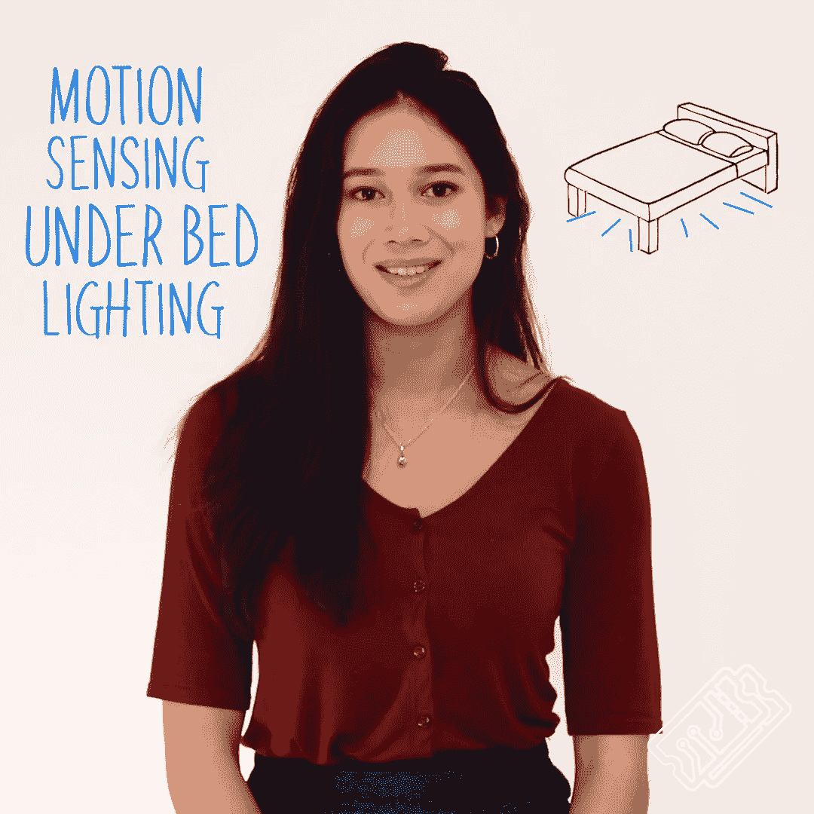

有了一些非常基本的工具，你可以在几个小时内相对容易地安装这些灯。

# 供应

*   电源(5V 6A) [亚马逊](https://www.amazon.co.uk/gp/product/B01D8FLRQ4/ref=as_li_tl?ie=UTF8&camp=1634&creative=6738&creativeASIN=B01D8FLRQ4&linkCode=as2&tag=t3chflicks07-21&linkId=48504560b11eff32a3dfb611f7436d3f)
*   可寻址 LED 灯条[亚马逊](https://www.amazon.co.uk/gp/product/B07439RXD3/ref=as_li_qf_asin_il_tl?ie=UTF8&tag=t3chflicks07-21&creative=6738&linkCode=as2&creativeASIN=B07439RXD3&linkId=528cbedaefa1222a704f3427926114a1)
*   Arduino Nano [亚马逊](https://www.amazon.co.uk/gp/product/B0097AU5OU/ref=as_li_qf_asin_il_tl?ie=UTF8&tag=t3chflicks07-21&creative=6738&linkCode=as2&creativeASIN=B0097AU5OU&linkId=6b2f81cd5af685300bcb5b3d3401fb95)
*   钢丝夹[亚马逊](https://www.amazon.co.uk/gp/product/B001GT4QUE/ref=as_li_qf_asin_il_tl?ie=UTF8&tag=t3chflicks-21&creative=6738&linkCode=as2&creativeASIN=B001GT4QUE&linkId=d4a06ec09964ff627ab8634d8f9aa27e)
*   运动传感器[亚马逊](https://www.amazon.co.uk/gp/product/B00R2U8LLG/ref=as_li_tl?ie=UTF8&camp=1634&creative=6738&creativeASIN=B00R2U8LLG&linkCode=as2&tag=t3chflicks-21&linkId=23534259a56c3ec6b27f14dc821edc95)
*   摇臂开关[亚马逊](https://www.amazon.co.uk/gp/product/B07253LWHS/ref=as_li_qf_asin_il_tl?ie=UTF8&tag=t3chflicks-21&creative=6738&linkCode=as2&creativeASIN=B07253LWHS&linkId=9a0e1aee17eb95b83bdb58fd2348f682)
*   交流插头
*   电线

> [🔗在 Github 上获取床下照明代码的运动感应📔](https://github.com/sk-t3ch/t3chflicks-night-light-leds)

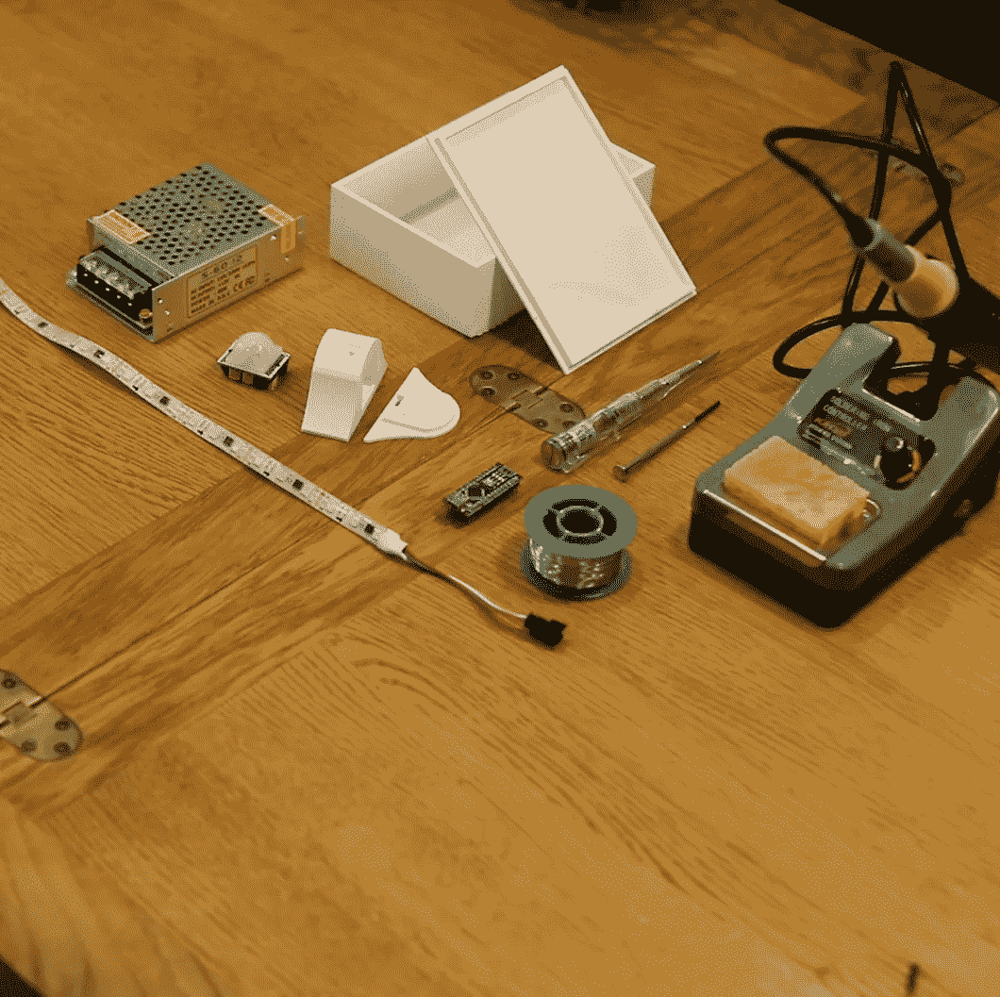

# 辅导的

# 建设🛠️

## 测量床

将床侧过来，这样就可以方便地拿到底座。为控制箱找到一个合适的位置——我们选择了床头附近稍高的地方(见图表)。测量床的周长、长度和宽度(见图表)。记下你的尺寸。

确定三个传感器的位置。你需要一个面向床的三面，而不是靠墙的一面。我们选择的位置靠近床的边缘，但是看不到。测量从传感器位置到控制箱的距离。

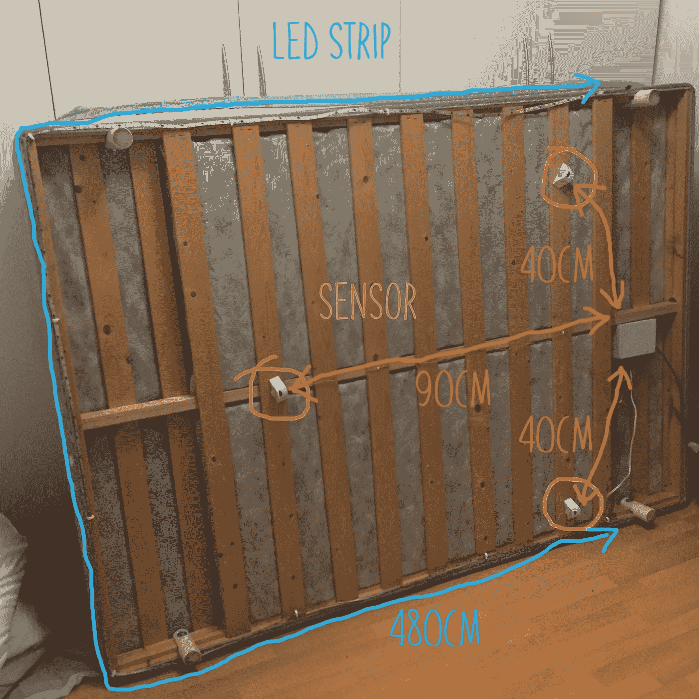

## 切断电线和 LED 灯条

将 LED 灯带切割到床周长的长度。

接下来，切断电线:每个传感器需要三根电线，LED 灯带需要三根电线，每根电线都通向控制箱，所以总共需要 12 根电线。取三段不同颜色的电线，按尺寸切割。我们使用黄色、绿色和橙色——公认的惯例是红色代表电源，黑色代表接地，另一种(粗体)颜色代表信号。只要你知道哪个是哪个，你用哪个颜色并不重要。

## 将电缆焊接到运动传感器上

我们将运动传感器放在 3D 打印的盒子里(你可以在下面找到文件链接)。这并不是完全必要的，但它们可以让传感器更整洁，更容易放在床底。

如果您使用的是 3D 打印外壳，首先将三根不同颜色的电线穿过盖子。运动传感器有三个不同的引脚:接地(GND)、电源(VCC)和信号(如下所示)。如上图所示握住传感器时(即引脚位于模块底部边缘)，将三根不同颜色的电线连接到各自的引脚上，并将它们焊接到位。然后，用热收缩套住电线。对三个传感器中的每一个传感器重复上述步骤。

将运动传感器的圆顶穿过主壳体上的孔。它应该会卡入到位。合上外壳，让三根彩色电线穿过后孔。

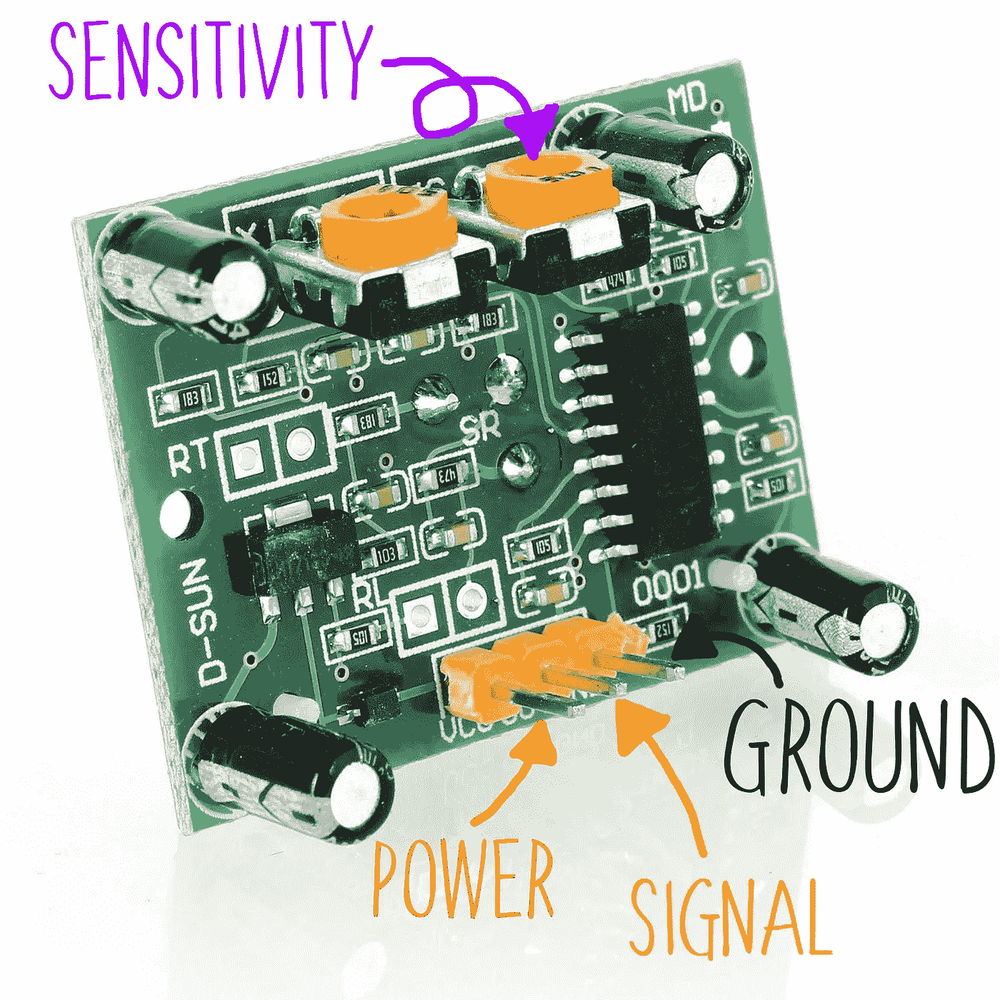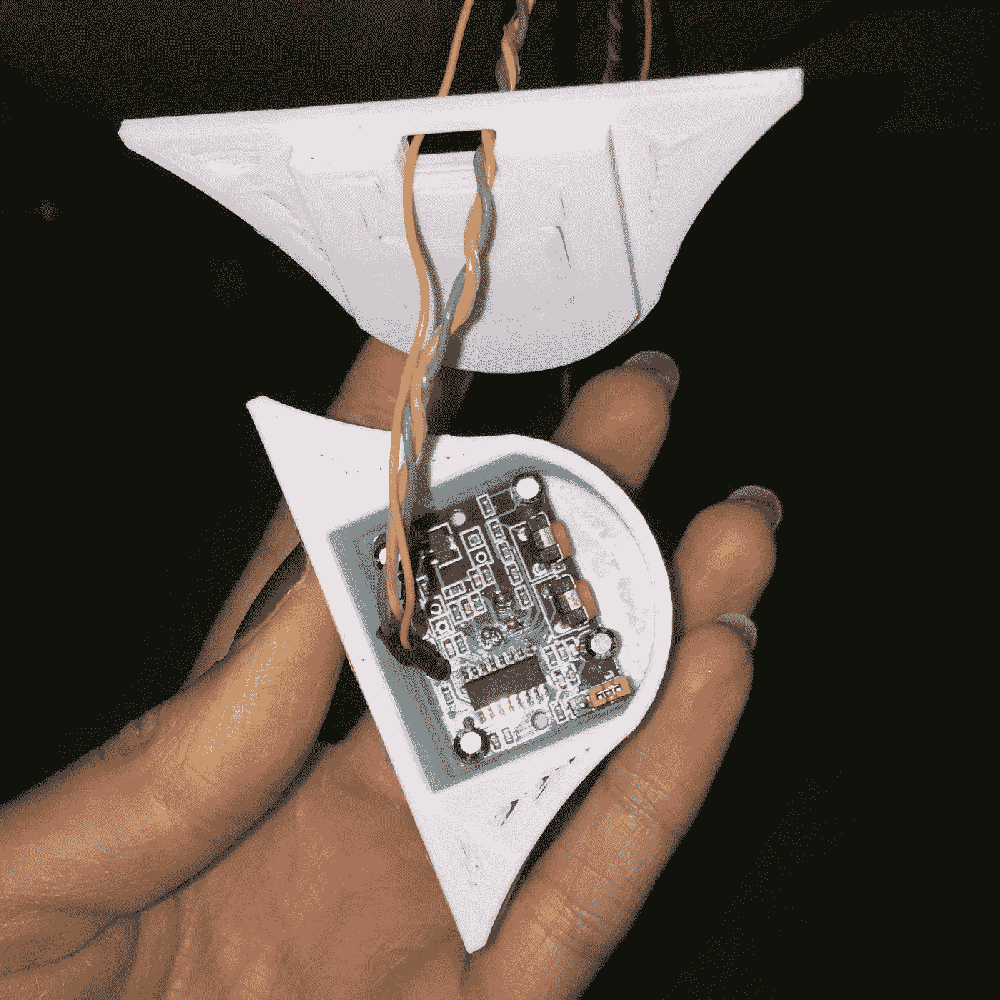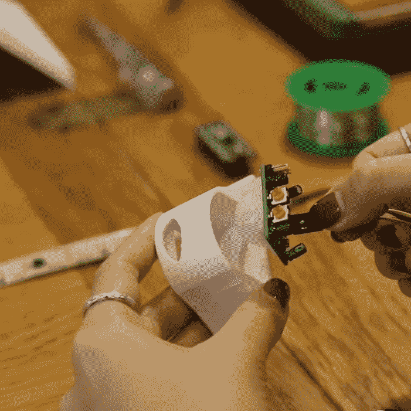

## 给 LED 灯条接线

LED 灯条有三个相同的连接:电源、信号和接地——除了信号引脚是输入。

这些指示灯从 Arduino 接收指令，每个指示灯都是可寻址的。我们可以改变颜色(RGB)和亮度。将三根彩色电线焊接到 LED 灯带上，这些电线稍后将用于连接 Arduino。

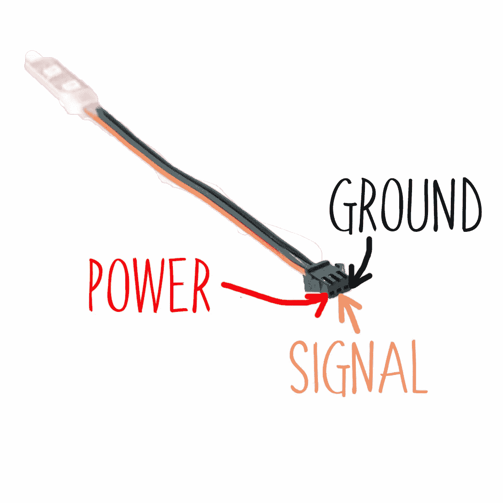

## 电源开关

如果你使用 3D 打印的控制盒，你需要安装电源开关，并将其连接到电线上。

首先，确保你的插头末端没有东西，如果有的话，把它切掉。将电线穿过盒子前面的孔，再从紧挨着它的开关孔穿出。剥去交流电线的外壳，以便可以看到 10 厘米长的三根内部电线(火线、零线和地线)。

然后，切掉 8 厘米长的火线(红色)和零线(蓝色)并放在一边备用。使用交流插头导线末端剩余的 2 厘米，将火线(红色)和零线(蓝色)焊接到底部两个插脚上的开关上(如图所示)。

接下来，将您之前剪下的 8 厘米长的火线(红色)和零线(蓝色)焊接到开关顶部的两个插脚上(如图所示)，这些电线将连接到控制箱内的电源箱。先把电线拉过来，把开关推进盒子里的孔里。

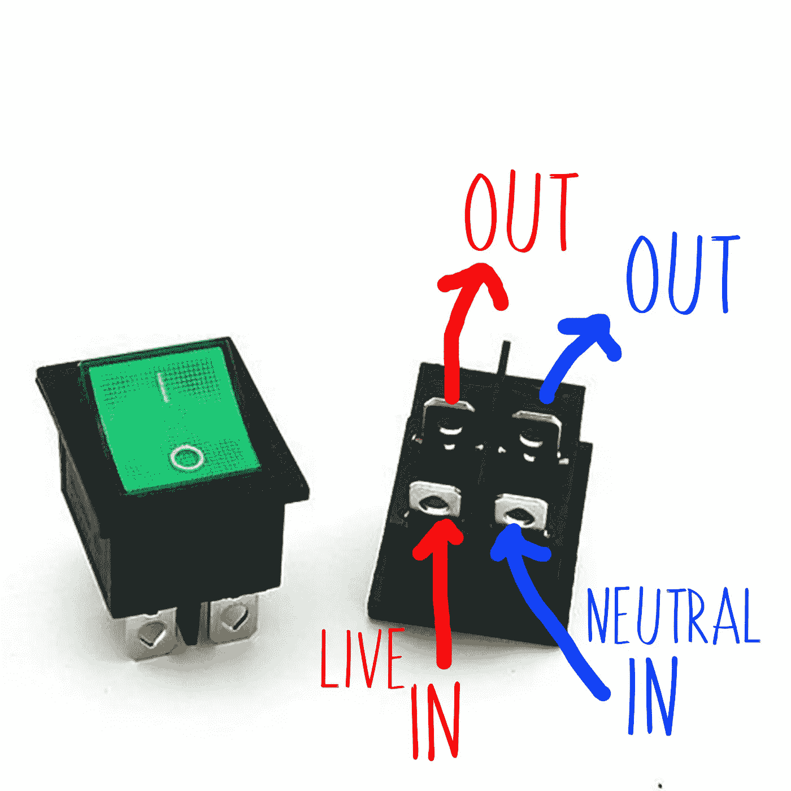

## 连接电源

将电源放入盒子中，使电线连接点朝向开关。

将开关的火线(红色)和零线(蓝色)连接到电源的火线和零线连接点(分别标记为 l 和 n)。电源上的连接点是螺丝，确保一旦电线到位，这些都做得很紧。

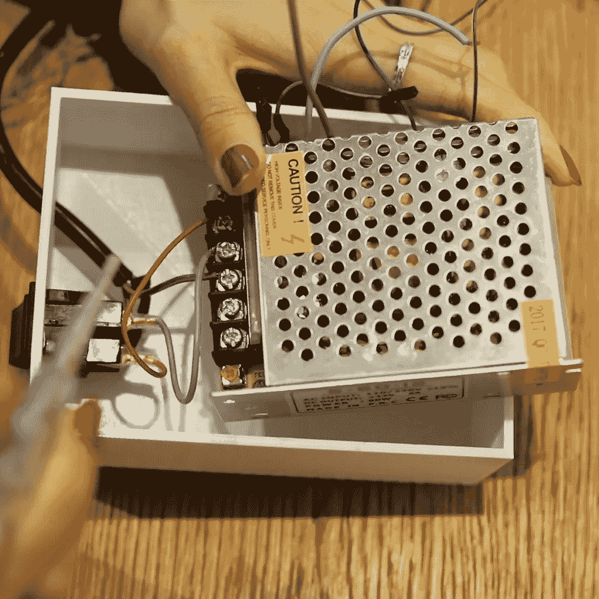

## 连接 Arduino

电源具有 5V 和接地的输出连接(见图表)。拿起 Arduino，剪一根大约 8 厘米长的电源线(通常是红色的，但不管你用什么颜色)。

将电源线的一端拧入“5V”连接点，将另一端焊接到 Arduino 上的“VIn ”,从而将 Arduino 连接到电源。

用接地线(黑色或你选择的任何颜色)重复这个过程，连接电源上的“GND”和 Arduino。

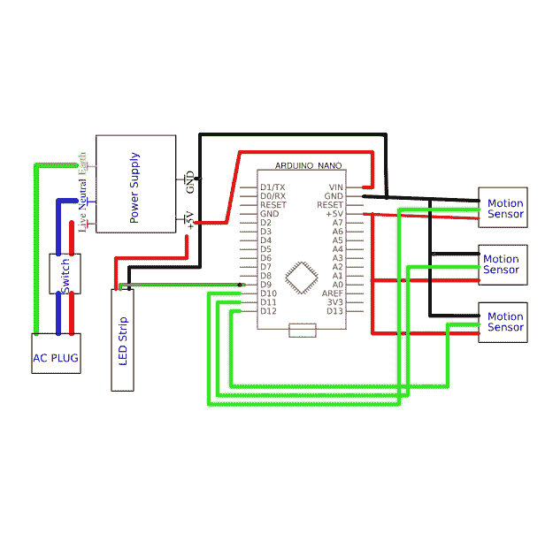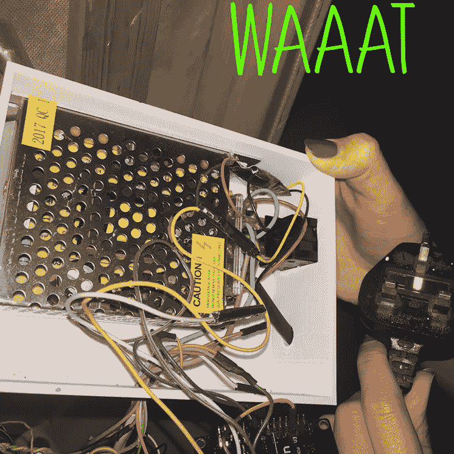

## 将 LED 灯条连接到电源和 Arduino

将 LED 灯带的电线穿过盒子里剩下的空孔。

剥去 LED 灯带的电源线和接地线。将电源线(红色)连接到电源的“5V”连接点(Arduino 已经连接到该连接点)，将地线(黑色)连接到电源的“GND”连接点(Arduino 也已经连接到该连接点)。

将 LED 灯条的信号线焊接到 Arduino 的数字引脚 9。

## 将运动传感器连接到 Arduino

将运动传感器的电线(共 9 根)穿过 LED 灯条电线所在的孔。

将三根电源线焊接到 Arduino 的+5V，将接地线焊接到 Arduino 的 gnd，并将单独的信号线焊接到 Arduino 引脚 10、11 和 12。

## 对 Arduino 进行编程

下载下面名为“motion_sensing_lights.ino”的代码。然后，使用 Arduino 软件可下载表格[此处](https://www.arduino.cc/en/Main/Software)，将代码上传至您的 Arduino 模块。

如果你不确定如何做到这一点，在这里找到更多的。你还需要从[这里](https://github.com/FastLED/FastLED)下载 FastLED 库。

代码非常简单:它不断检查运动传感器是否输出了信号，如果是，启动计时器并打开 LED 灯条发光，保持一分钟，然后发光。

## 躺在床上

关闭控制盒——它外面唯一的东西应该是 LED 灯条和交流插头。

将盒子贴在床底您选择的位置，我们使用了强力双面胶。

然后，用双面胶将运动传感器贴在床的底部。运动传感器应该沿着床的三个侧面朝外，而不是沿着墙壁。接下来，在床的四周安装 LED 灯。

虽然 LED 灯带背面有粘性，但这不足以支撑它的重量。因此，我们用钉在床底的塑料线夹把它固定住。插上电源，打开控制盒，把床翻过来。

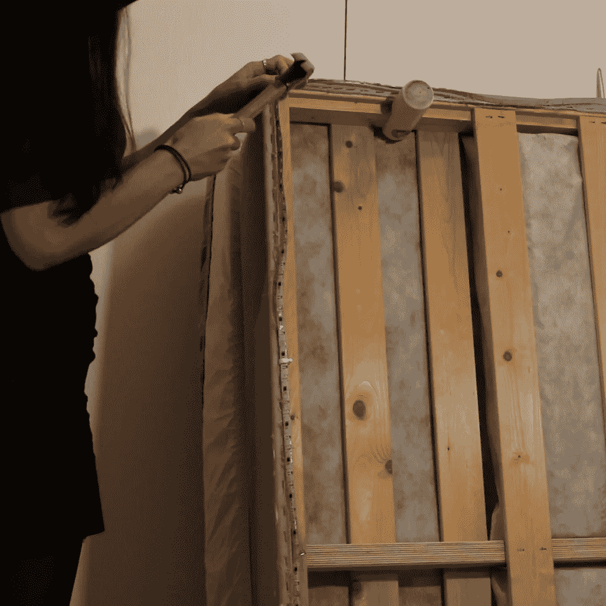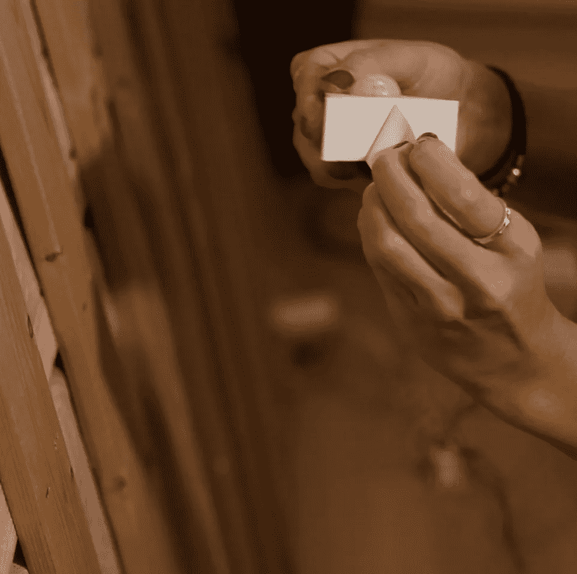

## 调整、测试和欣赏

在床下测试你的动作感应。您可以通过将螺丝刀穿过外壳顶部的孔并扭转灵敏度电阻来调整运动传感器的灵敏度。

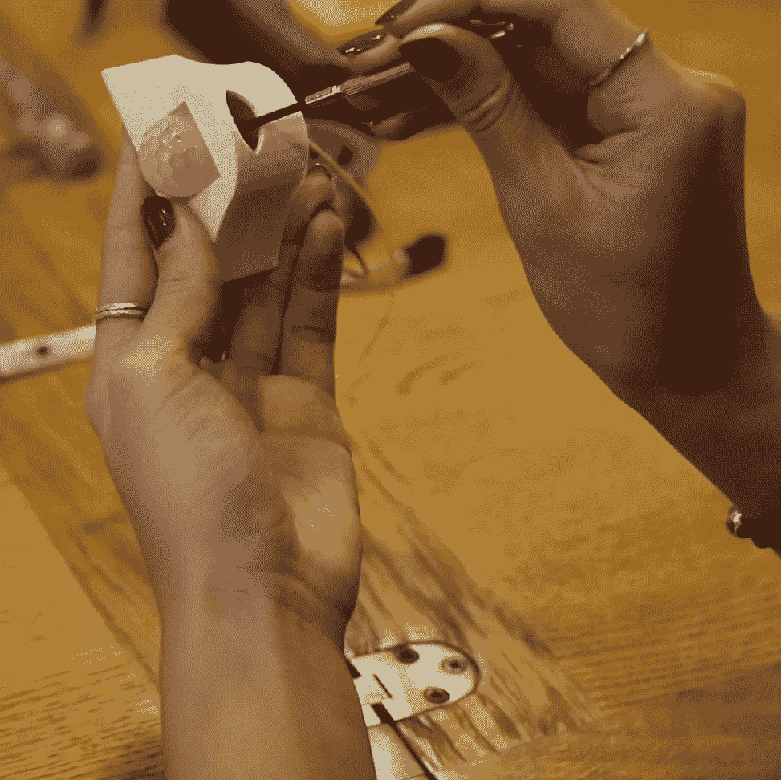

## 更进一步

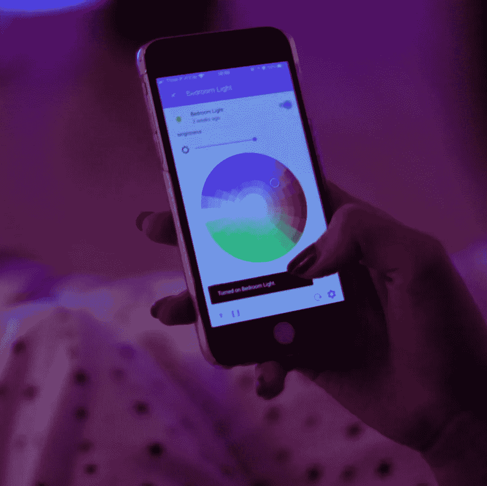

使用 ESP8266 模块( [Amazon](https://www.amazon.co.uk/gp/product/B0791FJB62/ref=as_li_qf_asin_il_tl?ie=UTF8&tag=t3chflicks07-21&creative=6738&linkCode=as2&creativeASIN=B0791FJB62&linkId=13c7d0877d5fe80a032e3da162b9a82e) )而不是 Arduino，可以通过将它链接到开源家庭自动化平台[家庭助理](https://www.home-assistant.io/)来用你的手机或 Alexa 控制 LED 灯条。关于如何做到这一点，已经有一个很棒的教程，你可以在这里找到它[。](https://www.youtube.com/watch?v=9KI36GTgwuQ)

> [🔗在 Github 上获取床头灯下的运动感应代码📔](https://github.com/sk-t3ch/t3chflicks-night-light-leds)

# 感谢阅读

我希望你喜欢这篇文章。如果你喜欢这种风格，可以去看看[T3chFlicks.org](https://t3chflicks.org/)了解更多科技教育内容( [YouTube](https://www.youtube.com/channel/UC0eSD-tdiJMI5GQTkMmZ-6w) 、 [Instagram](https://www.instagram.com/t3chflicks/) 、[脸书](https://www.facebook.com/t3chflicks)、 [Twitter](https://twitter.com/t3chflicks) )。