# 将您的 Jupyter 笔记本移动到 Azure DataBricks 工作区——Python 数据分析系列第 5 部分

> 原文：<https://medium.com/nerd-for-tech/move-your-jupyter-notebooks-to-an-azure-databricks-workspace-python-data-analysis-series-part-5-693f5de36450?source=collection_archive---------1----------------------->

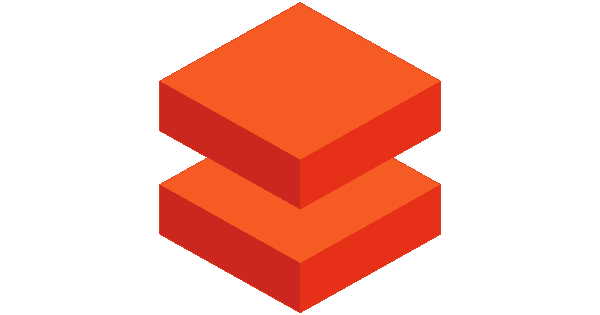

Azure 数据砖块图标

在之前的文章中，我们创建了四种不同的 Jupyter 笔记本，实现了 2020 年堆栈溢出开发者调查数据的不同数据转换和可视化。今天，我们将所有这些都转移到云，更具体地说，转移到 Azure DataBricks 工作区。

作为先决条件，你需要一个 Azure 帐户和一个有效的订阅，当然还有一个 Azure DataBricks (ADB)工作空间(查看这个[文档页面](https://docs.microsoft.com/en-us/azure/databricks/scenarios/quickstart-create-databricks-workspace-vnet-injection#create-an-azure-databricks-workspace)了解如何做)。创建工作空间后，我将向您展示如何建立一个集群来运行您的计算，并上传笔记本和数据。

当然，这些笔记本可以在 ADB 中从头开始创建，而不是使用本地的 Jupyter 环境，但是通过这种方式，您已经完成了与 Jupyter 的合作，现在您正在学习如何迁移到云。如果你一直只使用文章中提供的脚本，那么你可以从我的 GitHub 库[这里](https://github.com/Ze1598/medium-articles/tree/master/Python%20Data%20Analysis%20series%20with%202020%20Stack%20Overflow%20survey)获取笔记本。

如果你需要的话，这里有前面部分的链接:

*   第一部分:[分析年龄分布](/nerd-for-tech/analyse-the-distribution-of-ages-python-data-analysis-series-part-1-cc0fb2ca7f36)
*   第 2 部分:[绘制年度薪酬直方图](https://soulsinporto.medium.com/plot-an-histogram-of-annual-compensations-python-data-analysis-series-part-2-24d5d3bc4ed8)
*   第 3 部分:[分析受访者的教育水平](https://soulsinporto.medium.com/analyse-the-education-level-of-respondents-python-data-analysis-series-part-3-39fee072aba)
*   第 4 部分: [Unpivot 分隔数据](https://soulsinporto.medium.com/unpivot-delimited-data-python-data-analysis-series-part-4-145c06ab75ad)

# 创建集群

我们可以做的第一件事是创建集群。这就是运行笔记本电脑所需的计算资源。

在您的资源组中导航到您的 ADB 资源，然后“启动工作区”。

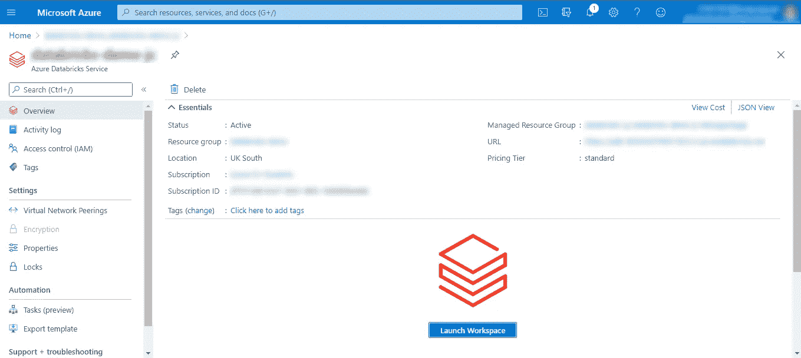

启动 DataBricks 工作区

在那里，您需要打开集群菜单。

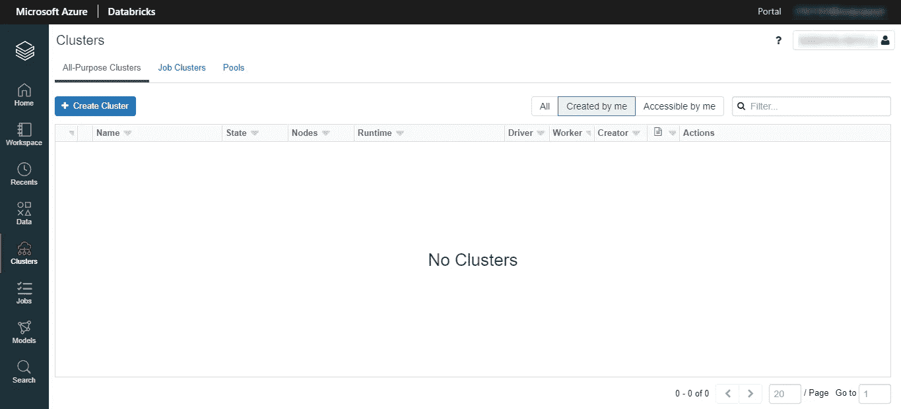

亚行集群

你想点击+Create Cluster 按钮是对的，这是下一步。

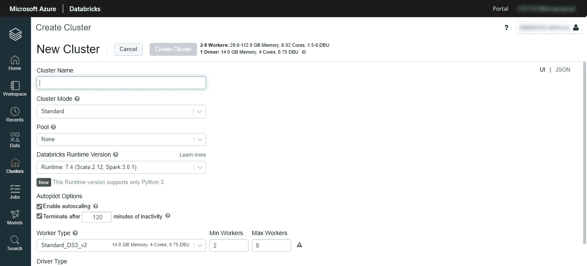

ABD 创建集群

如您所见，您可以为您的集群选择一些不同的设置，包括集群模式、[集群池](https://docs.microsoft.com/en-us/azure/databricks/clusters/instance-pools/)以包含新的集群、运行时，当然还有工作线程。当然，所有的设置都很重要，但请密切关注最后一项，因为它是最直接影响您成本的一项。哦，根据您的订阅情况，您可能会像我一样收到警告，说您正在[试图将工作线程(CPU 内核)数量设置在允许的数量之上](https://docs.microsoft.com/en-gb/azure/azure-resource-manager/management/azure-subscription-service-limits)。

由于我们有简单的笔记本和相对较小的数据集，我们可以将集群模式设置为[单节点](https://docs.microsoft.com/en-us/azure/databricks/clusters/single-node)。这种模式没有工人，直接在驱动程序节点中运行。换句话说，性能更加有限，但这样我们就不需要估计所需的工作人员数量，并且我们可以保持在订阅的限制范围内。如果您想使用不同的集群模式，请继续，这不会影响本演示的其余部分。

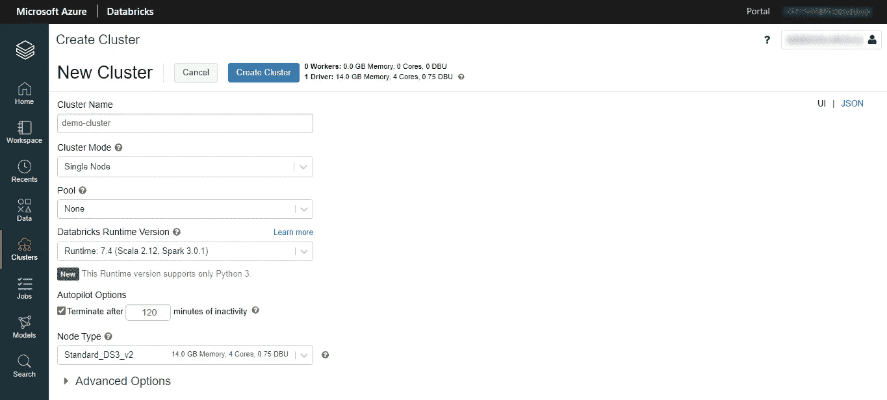

创建单节点集群

# 将数据集上传至亚洲开发银行

要上传 survey_results_public.csv 数据集，我们转到“数据”菜单，选择“创建表”,然后在拖放区上传文件。

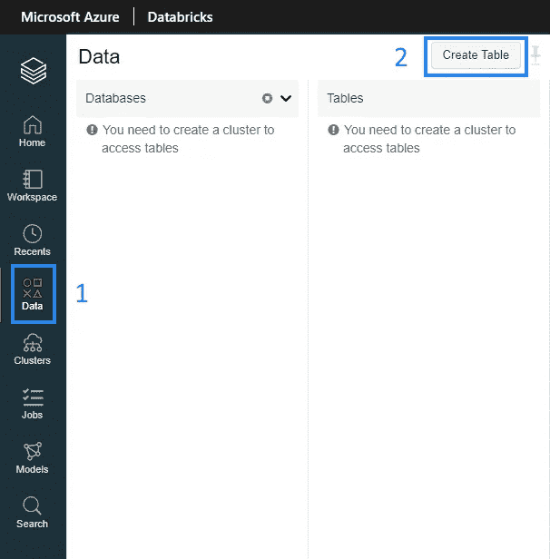

ADB 创建表

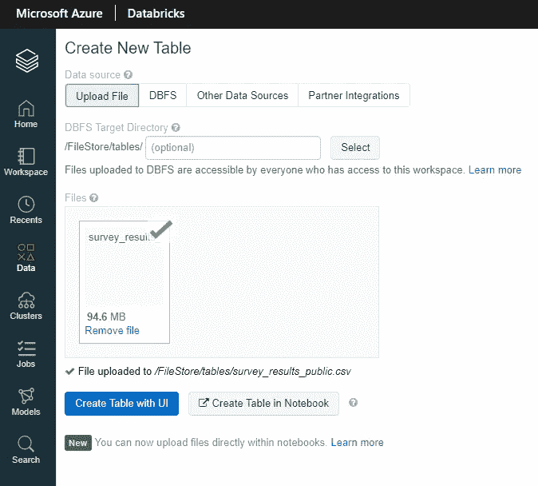

上传数据

正如通知所说，CSV 已经上传到/FileStore/tables 目录。如果您愿意，可以继续为该数据集创建一个表。这允许一些替代方式来访问数据，但上传对于我们的笔记本来说已经足够了。有关创建表格的更多信息，请访问[文档页面](https://docs.microsoft.com/en-us/azure/databricks/data/tables)。


该文件现在可在亚行的 DBFS 查阅

仍然在 Create New Table 菜单中，如果您切换到 DBFS 数据源，即 DataBricks 文件系统，您可以导航到显示的目录并确认 CSV 在那里。

# 上传笔记本

让我们回顾一下迄今为止我们所掌握的情况:

*   Azure DataBricks 工作区
*   单节点集群
*   上传到 DBFS 的数据集

那么，我们在亚行运行笔记本电脑所需的最后一项资源就是笔记本电脑。我们可以很容易地将它们导入亚行。

打开工作区菜单，你会发现[两个默认文件夹](https://docs.microsoft.com/en-us/azure/databricks/workspace/workspace-objects#special-folders) : Shared 和 Users。前者是您在整个组织中创建对象(例如笔记本)的地方。请记住，帐户用户对此文件夹中的所有对象拥有完全权限。后者是每个用户的单独文件夹。在下面的屏幕截图中,“用户”文件夹有一个单独的“我的帐户”文件夹。我们将忽略权限和授权的主题，但是我之前提供的关于文件夹的链接有更多关于它的信息。

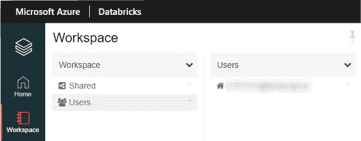

亚行工作空间

回到演示，我们想将笔记本导入到我们的用户工作区文件夹中。单击用户打开他们的文件夹，并选择导入选项。

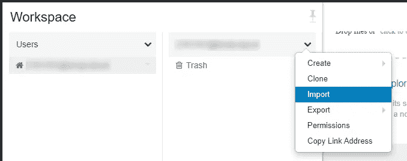

导入到工作区

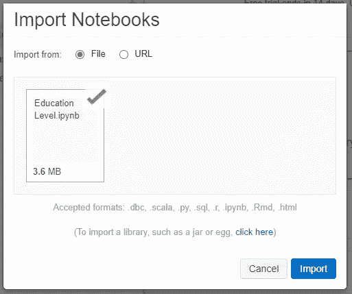

上传 Jupyter 笔记本

现在你知道了。上传本系列前几部分创建的四个笔记本(或者从[我的 GitHub 库](https://github.com/Ze1598/medium-articles/tree/master/Python%20Data%20Analysis%20series%20with%202020%20Stack%20Overflow%20survey)下载)，它们将立即出现在你的工作空间中。

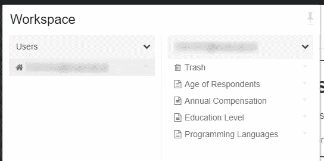

Jupyter 便笺已导入用户文件夹

# 笔记本代码更改

在运行代码之前，我们必须在每个笔记本中更改一些代码:

1.  要么在每个笔记本的开头添加一个命令来安装 Plotly 和 nbformat，要么在集群本身上安装库
2.  添加 [plotly.io.to_html](https://plotly.com/python-api-reference/generated/plotly.io.to_html.html) 导入
3.  更新包含 CSV 路径的字符串

对于 1。，更容易将带有`%pip install plotly`和`%pip install nbformat`命令的单元格添加到笔记本中。然而，由于这是所有四台笔记本都使用的库，我们应该将它安装在集群本身中，以使它普遍可用。

导航回“Clusters”菜单，打开您之前创建的菜单，移至“Libraries”选项卡，然后选择“Install New”

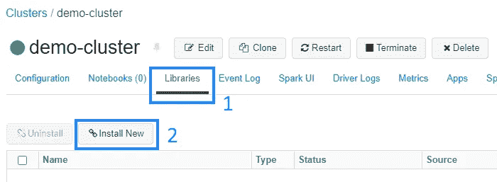

在群集上安装新库

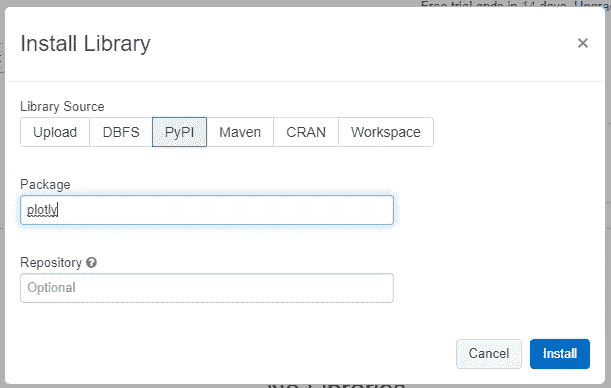

从 PyPi 在集群上安装 Plotly

Plotly 是一个 Python 库，所以可以通过 PyPi 以 plotly 的名称获得。点击 Install，等待一分钟左右安装完成。

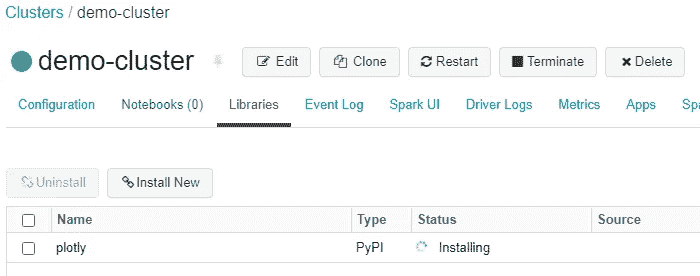

集群库安装状态

对 nbformat 重复相同的过程，这是 ADB 在笔记本上渲染图形所需的另一个库。

一旦两者的状态都更改为已安装，请打开其中一个导入的笔记本。提醒一下，工作区菜单->用户->您的用户->选择一个笔记本。

我们需要的第一个代码更改是在第一个代码单元格中添加一个新导入并删除另一个导入。

```
import pandas as pd
from os import getcwd, path
import plotly.express as px
from plotly.io import to_html
```

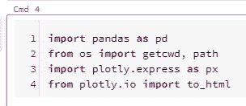

更新代码笔记本导入

我们不需要显式离线运行 Plotly，因为 ADB 默认为我们这样做。我们确实需要添加`plotly.io.to_html`函数来将图形转换成 HTML。

ADB 在渲染我们一直使用的可视化图形时遇到了一些问题。它不需要呈现我们通常从绘图函数创建的图形，而是需要可视化为 HTML。导入`to_html`函数似乎就足够了，不需要进一步的修改，但是如果您有任何问题，那么用下面的代码替换`fig.show()`行:

```
fig_html = to_html(fig, full_html=False)
displayHTML(fig_html)
```

在“受访者的年龄”笔记本中有一个例子:

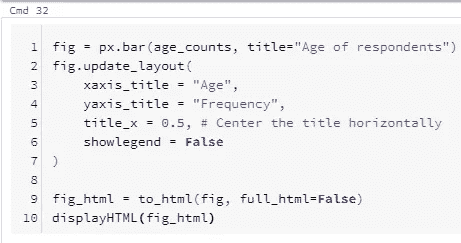

displayHTML 用法示例

这个`to_html`调用接收 Plotly Figure 对象并将其转换为 HTML 字符串。值为 False 的`full_html`参数意味着该字符串是一个 HTML div 元素。这个参数是必需的，因为 ADB [只需要一个 div 元素](https://docs.microsoft.com/en-us/azure/databricks/notebooks/visualizations/plotly)。同样，只有当添加函数导入不足以呈现可视化效果时，才需要这些更改。

另一个需要更改的代码是对 CSV 文件路径的更新。这个变量位于每个笔记本的第六个单元格(在变量中设置这个文件路径并加载文件的单元格)。前面的截屏已经显示了大部分文件路径，但是完整的字符串需要在开头使用`/dbfs`。

```
/dbfs/FileStore/tables/survey_results_public.csv
```


数据集的更新文件路径

在所有笔记本中进行这些更改，您就差不多可以运行这些笔记本了。

# 运行笔记本

在运行笔记本电脑之前，我们需要做的最后一件事是将集群连接到笔记本电脑。您可以通过在页面标题中选择一个集群来完成此操作


将群集附加到笔记本菜单

或者在脱离集群时尝试运行单元

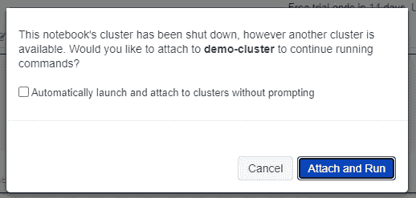

自动附加集群菜单

由于我们在工作区中只有一个集群，ADB 提示您自动将该集群连接到笔记本，以便运行代码。同样，这两种选择都会导致相同的结果:将创建的集群连接到笔记本电脑。现在你只需要运行代码！


运行笔记本

# 结论

至此，我的 Python 数据分析系列到此结束。

在每一部分中，我们通过不同的演示来转换 2020 Stack Overflow 开发者调查的数据，以在最后创建一个 Plotly 可视化。

在最后一部分中，我们使用 Azure DataBricks 将数据和笔记本从本地 Jupyter 笔记本环境转移到云中。我们首先创建了一个单节点集群，然后将 CSV 文件上传到 DataBricks 文件系统(DBFS)。之后，我们将 Jupyter 笔记本导入到我们在 ADB 的用户文件夹中，并更新了代码以在云环境中工作！

希望这个系列对你来说是一次学习经历，如果你需要检查任何代码/笔记本，我在我的 Github 库上有所有的内容。

最后一次，这是浏览这个系列的链接。

*   第一部分:[分析年龄分布](/nerd-for-tech/analyse-the-distribution-of-ages-python-data-analysis-series-part-1-cc0fb2ca7f36)
*   第二部分:[绘制年度薪酬直方图](https://soulsinporto.medium.com/plot-an-histogram-of-annual-compensations-python-data-analysis-series-part-2-24d5d3bc4ed8)
*   第 3 部分:[分析受访者的教育水平](https://soulsinporto.medium.com/analyse-the-education-level-of-respondents-python-data-analysis-series-part-3-39fee072aba)
*   第 4 部分: [Unpivot 分隔数据](https://soulsinporto.medium.com/unpivot-delimited-data-python-data-analysis-series-part-4-145c06ab75ad)

如果您需要联系我，您可以在这些文章中留言，或者在 [LinkedIn](https://www.linkedin.com/in/jos%C3%A9-fernando-costa-397137153/) 上联系我。