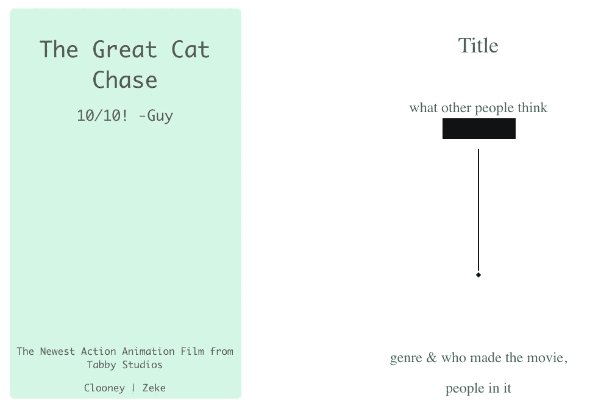
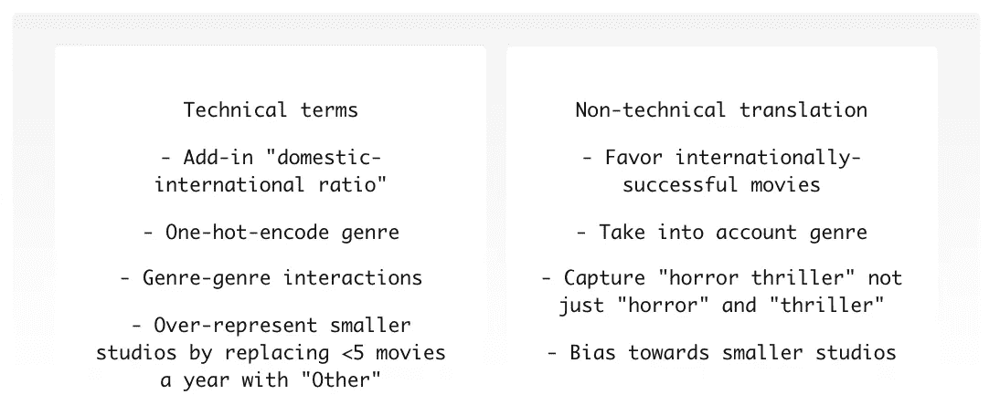
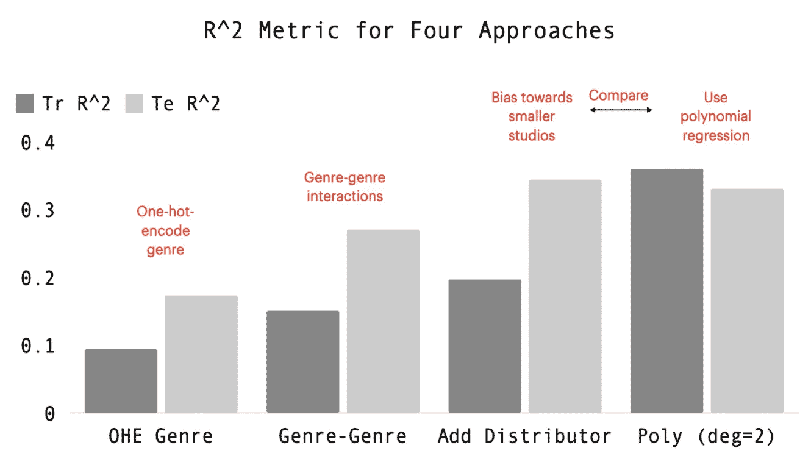
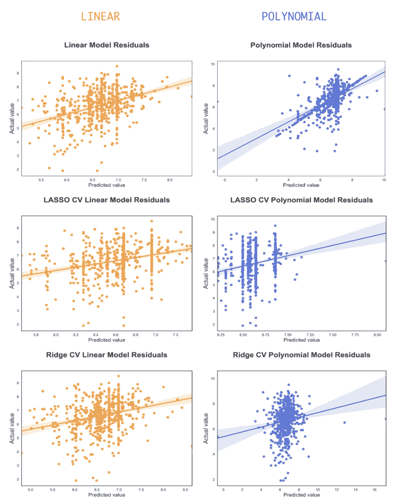
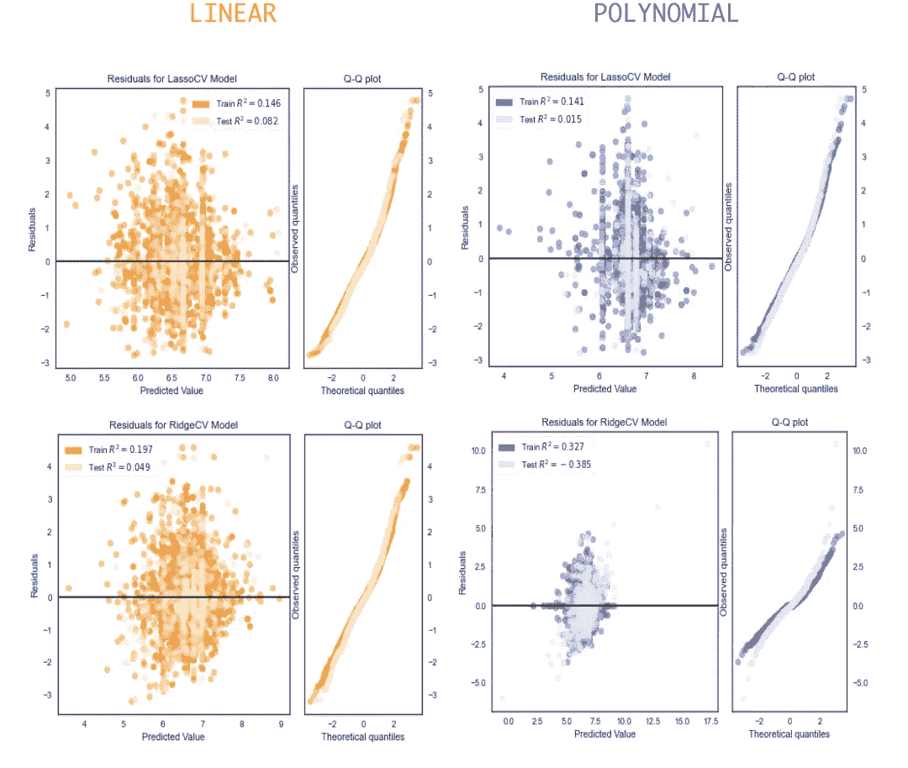

# 国际上成功的小制片厂的影迷对电影的评价

> 原文：<https://medium.com/nerd-for-tech/movie-ratings-for-fans-of-small-internationally-successful-studios-2b296ed179ec?source=collection_archive---------17----------------------->

*通过线性回归模拟评论家*

我很好奇我们如何使用线性回归来模拟一个人对电影的看法。今天，我将通过五个步骤来讲述我们如何从 BoxOfficeMojo 和 IMDB 收集数据，并从一个国际成功的小工作室的粉丝的角度来设计。

# 角。1:我们的评论家从哪里获取信息？

媒体，媒体媒体。如果评论家是厨师，媒体就是配料。那将是我们批评家的*眼睛*，我们完全合理的判断将来自这些数据。就拿我刚编的这部电影来说吧，《大猫追逐战》。你认为对于一个小国际工作室的粉丝来说，哪些信息是相关的？

我们的批评家应该关心什么？

我认为我们可以考虑其他人的想法，类型和谁制作了这部电影。我担心使用演员阵容，因为我们不想过分偏向托比·麦奎尔，而是想维护托米·韦素的正义。通过使用每年生产的电影数量，很容易偏向使用发行商的较小工作室。，但是我想不出用 cast 做这件事的方法。

我找不到偏向托米·韦素的方法。对不起..

下一个问题是:**我们信任哪些评论**？IGN，IMDB，Bon appétit？出于平民主义的原因，我们将使用观众分数。我们可以根据 RottenTomatoes、Metacritic 和 IMDB 的观众分数直方图做出基于数据的决策:

看起来我们的评论都是倾斜的(“7 是平均水平”的心态再次袭来)。既然 IMDB 看起来最正常，那就用 IMDB 吧。

如果你想使用网络搜集，我推荐使用 Scrapy，因为它非常快。你可以在这个项目的 [github repo 中看到我的 crawlers/CSV，我](https://github.com/yi-ye-zhi-qiu/metis-project2)[上周写了一篇关于抓取 BoxOfficeMojo 数据的教程](https://python.plainenglish.io/tutorial-scraping-boxofficemojo-with-scrapy-299e7b35254e?source=your_stories_page-------------------------------------)。

# 角。2:收入，美国电影协会评级(PG-13，R 等。)和预算

几乎是偶然的，在我疯狂的网络爬行中，我收集了收入，美国电影协会评级和预算。收入和预算最终会首先对富裕工作室的电影进行评级；我无法解释为什么我们评论家会关心一部电影是否是 R 级、PG-13 级之类的东西。

# 角。3:用火做饭:设计算法

这就是我们模仿的开始。这是我们的总体规划:

这就是我们将如何构建评论家的观点

# 角。4:我们怎么知道发生了什么？模型评估

我们可以使用线性模型的评估指标来“基准化”过程的每一步。观看这些国际成功电影的人的评论(由上面的术语列表定义)就是我们想要模仿的人。因此，当我们运行我们的模型时，如果我们训练我们的评论家像那些人一样注意电影的同类事物，我们希望评论家的分数和他们一样。换句话说，我们希望我们的模型能够很好地解释数据中的%的方差。这可以用 R 来观察。

一路 r 分

## 稀有

描述二次多项式回归得分 R 的一种技术方法是:我们训练(Tr)数据中 36.1%的方差和我们测试(Te)数据中 33.1%的方差是通过对具有分销商、流派-流派和流派“特征工程”的数据进行二次多项式回归来解释的。由于我们模型的多项式迭代和先前迭代在 Te 数据上具有相似的分数，我们可以比较这两种方法。

## 欠拟合/过拟合数据的正则化和残差图

我们进行训练测试分割的原因不仅仅是为了看看我们在看不见的数据上表现如何——它有助于我们看到我们的模型对于数据集是*欠拟合还是*过拟合。这基本上意味着:我们的批评家是完全没有抓住发生的事情的要点(适应不足)还是 100%的时间都在模仿别人(适应过度)？欠拟合用 Tr < Te 分数表示，过拟合用 Tr > Te 分数表示。

除了多项式回归，我们的模型总是不符合要求。虽然很难确定为什么会发生这种情况，但这可能是因为我们的特征空间太小(我们正在查看的内容列表太短)或者我们的数据源(IMDB 评论数)太少，或者两者都有。由于没有越来越耗时的网络搜集，我无法包含更多的特征或数据，所以我决定跳过这些，直接进入*正则化*。

正则化(这里被视为“脊”和“套索”)通过惩罚我们的模型 100%的时间模仿人来工作。当你过度合身的时候，你可以用它，但是对不合身的模特来说，它也值得一试。当我们开始对我们的模型进行模仿时，我们可以通过观察我们的预测是如何变化的来想象发生了什么。这可以在“残差图”中看到，该图绘制了 Te 数据的预测值与实际值之间的关系。

线性(R 图中倒数第二个)和多项式(R 图中最后一个)回归的残差图

一般来说，我们从看起来有点线性的残差(特别是在多项式回归的情况下)到看起来更加随机的残差。这被称为增加我们模型的同方差(误差)，这意味着我们的模型更少误导和/或偏差(来源:[线性回归的假设](https://people.duke.edu/~rnau/testing.htm))。实际上，这意味着我们的评论家在观点上的创造力更值得信赖；其实是自发的。

## 正则化数据的 Q-Q 图

上面的图更能说明我们的误差中令人瞠目的变化。分位数-分位数(Q-Q)，图中左边是残差图(及其伴随的 Tr，Te R 值)，可以帮助我们可视化残差的分布。他们通过绘制两个概率分布的[分位数](https://en.wikipedia.org/wiki/Quantile)来工作。在我们的例子中，我们绘制残差图的“观察分位数”与正态分布的“观察分位数”。如果我们的数据是正常的，如果这两个分布是相似的，它们将遵循 y=x 线。

线性和多项式回归的 R 值残差图和 Q-Q 图

对于除岭 CV 多项式回归之外的一切，点遵循相当线性的模式，这意味着*我们的残差分布是正态分布的*(检查线性回归的另一个假设)。在电影的“中间部分”(线弯曲)，线性往往会减弱——正如我们在残差图中看到的那样，这是因为有离群值:这些是“失败”的电影，我们预测它们会做得很好，但最终会失败。虽然我们可以选择识别和删除这些电影，但我认为保留它们并拥有一个“有缺陷的批评家”的角色还是有点意思的。

我最终选择了 RidgeCV 线性模型，因为它的残差是正态分布的，Q-Q 图是最线性的，最重要的是分数可以达到 8 左右。此外，多项式模型创建了一个巨大的特征空间(378 到 7000 ),这需要很长时间来计算，更不用说运行 LassoCV 了，因此它对于我们的 WebApp 用例来说是不切实际的。

# 角。5:视觉化电影

我们已经创建了我们的评论家，现在我们可以开始评论一些电影。我只是运行了相同的训练-测试-分割和 LassoCV 线性模型来进行预测，并以网格格式显示出来。我决定保持 IMDB 的评分，只是为了让你知道评论家是否完全偏离了给定电影的轨道。

## 你可以在这里看到自己的评分[。](http://liamisaacs.com/liamometer)

十大电影

# 角。6:反思

我认为这种模式在曝光大量国际电影方面做得非常好。我认为这种方法可能只是在暗示你没有看过的被低估的电影。我很高兴看到最近最受欢迎的《东京教父》进入前 50 名。吉卜力工作室的电影也往往表现很好，这很好。奇怪的是，熊猫电影做得很好。

批评家的观点是一把双刃剑；。由于它与现状相差甚远，所以感觉很随意。我不想考虑评论的数量，但回想起来，这条信息可能有助于淘汰 IMDB 上有 1-10 条评论的纪录片。

由于显示所有测试数据的可视化方法，排名失去了一些分量。出于曝光的目的展示所有内容是很好的，但这降低了 1-10 分评论的价值，并可能质疑给出分数的必要性。我最后问自己，“和随机订单有什么不同？”然而，从我们对 R、残差和 Q-Q 图的分析来看，很明显电影的顺序不是随机的。但是*碰到*还是随机的，所以很难说。最终，我会说“它有点工作。”

# 谢谢你

感谢您的阅读！你可以在这里找到这个项目[的 github 资源库，它概述了这个过程中的每一步，这样你就可以跟着做了。你可以在](https://github.com/yi-ye-zhi-qiu/metis-project2)[我的网站](http://liamisaacs.com/)、 [LinkedIn](https://www.linkedin.com/in/liam-isaacs-7018b9197/) ，或者 [github](https://github.com/yi-ye-zhi-qiu) 上找到我。你可以在这里阅读更多我的文章。