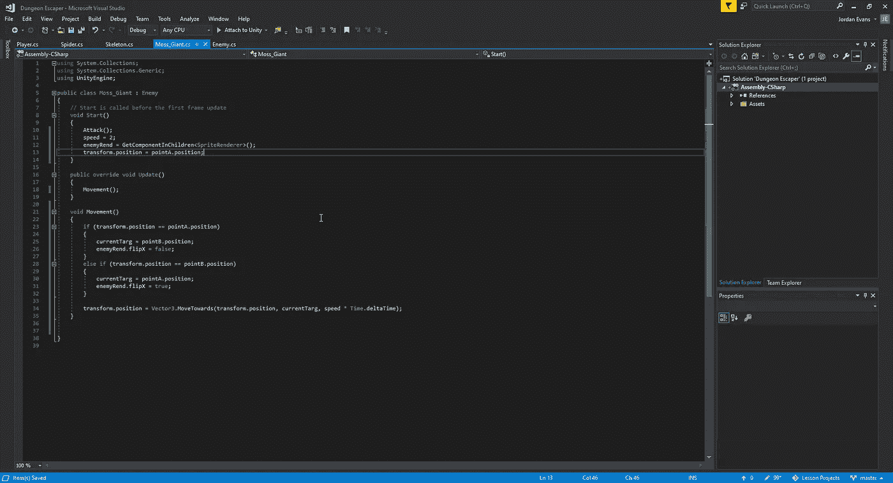
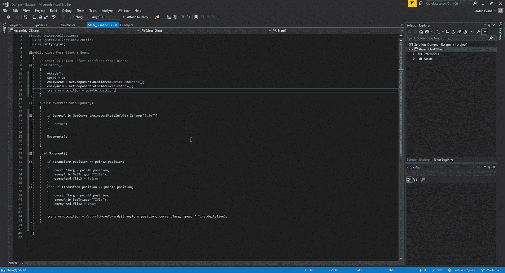
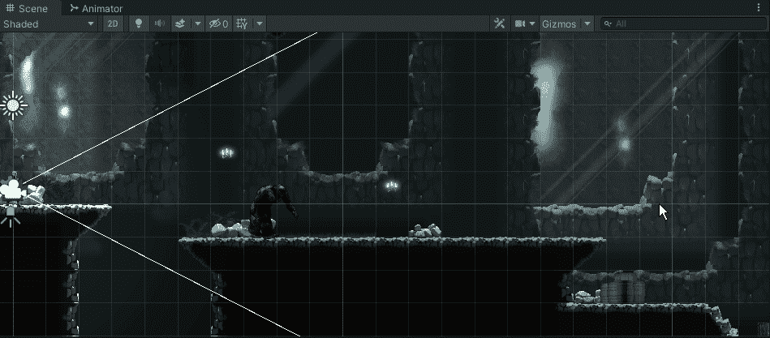
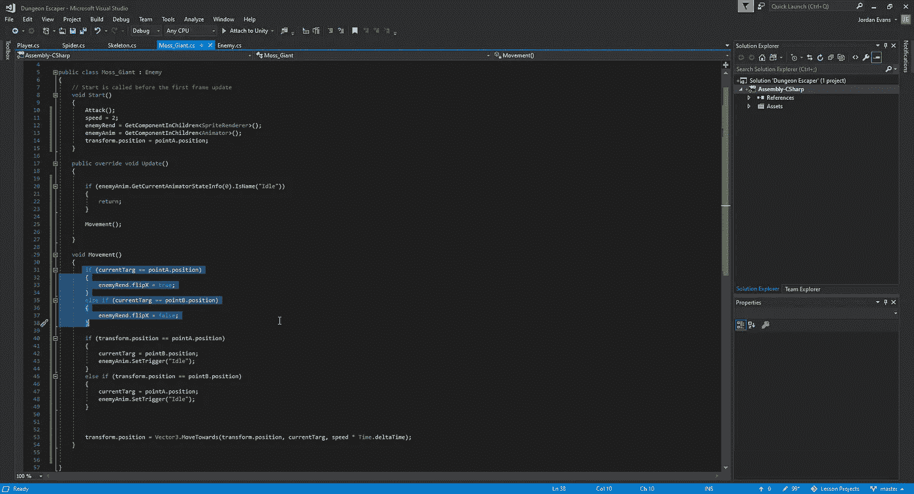
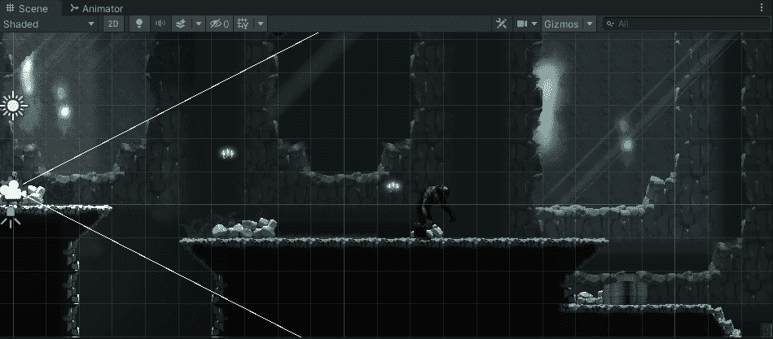

# 转移我们的敌人

> 原文：<https://medium.com/nerd-for-tech/moving-our-enemies-bfac58573886?source=collection_archive---------8----------------------->

现在我们已经建立了抽象类，让我们看看如何让我们不同的敌人类型移动。首先，让我们只研究我们的一种敌人类型，一旦我们完成了所有的工作，我们就可以在我们的其他敌人类型中做这些改变，并改变我们认为合适的值。首先，让我们开始为我们的摩斯巨人创建一个航点系统，一旦他到达目标，让他在动画期间保持空闲。为了让他移动，我们需要为他创建 2 个检查点，在我们的脚本中，我们将创建他移动的逻辑:

我们在这里所做的是设置我们的巨人移动到一个特定的目标。用这个方法，我们不会让我们的巨人冻结在一个点上，因为我们开始的时候一直瞄准点 a，因为巨人的目标目的地会被指定到当前的目标点。至于让我们的巨型翻转，我们将设置它在到达目的地时在 x 轴上翻转:

现在我们已经有了合适的运动，让我们利用我们为巨人准备的空闲动画，并弄清楚如何在动画播放时阻止巨人移动:

为了让我们停止移动，我们将告诉 unity，如果动画已经被触发，我们只想继续返回到正在发生的事情。扳机一扣下，我们就继续前进。每当我们让我们的巨人到达目的地时，触发器就会被设置。现在，让我们看看这在我们的游戏中是怎样的:

我们让我们的巨人停在了我们想要的地方，但是按照我们目前的编码方式，我们的精灵在开始它的空闲动画之前会翻转。因为我们希望我们的巨人在转身之前看向他所面对的方向，所以我们希望对精灵翻转方面的代码进行快速调整:

我们所做的是把 flip 命令放在它自己的 if 语句中，并把它放在 movement 方法的顶部。如果我们把它放在方法的底部，我们将不能让精灵停留在它当前的方向。这是因为当我们到达目的地时，代码将在空闲动画期间停止工作。因此，它不会返回到方法的顶部并调用巨人翻转，直到动画完成它的进程:

现在我们已经为我们的巨人建立了逻辑，我们可以继续将它应用到我们的其他敌人类型，并期待开始在我们的玩家和敌人单位之间建立互动。