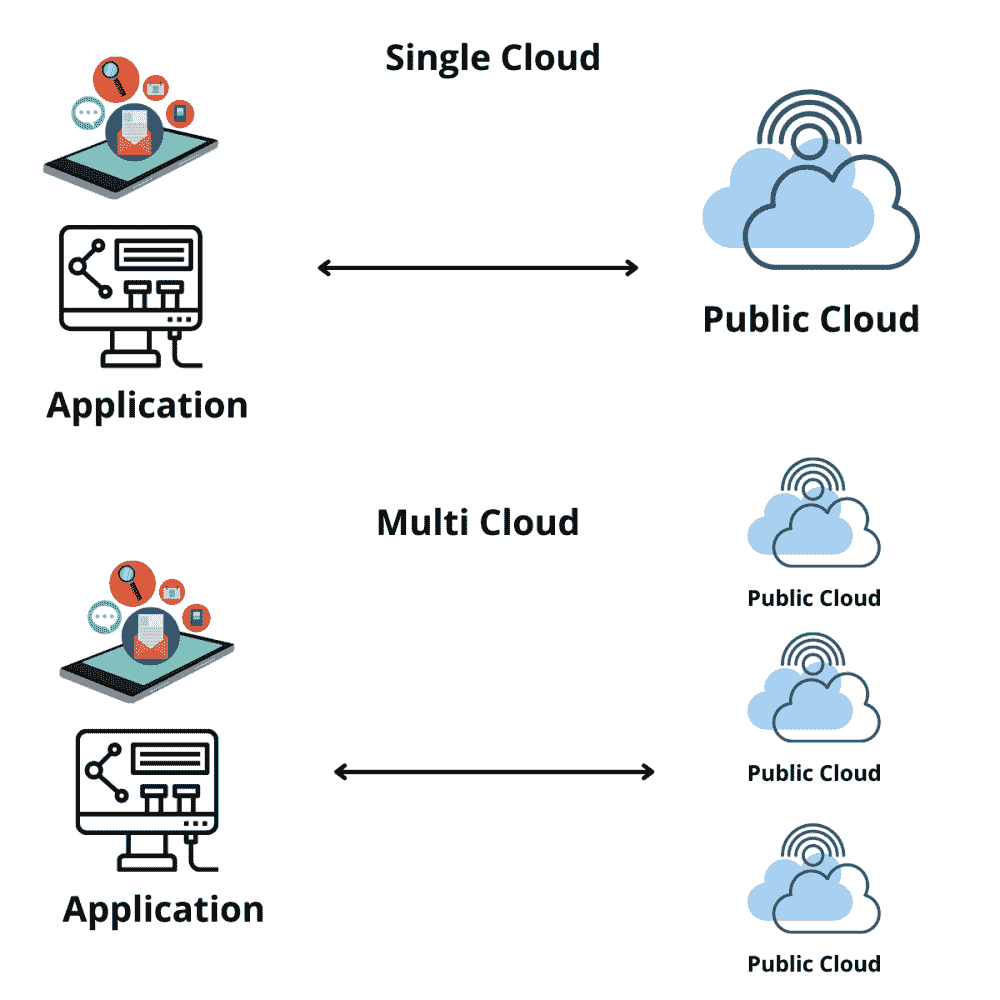

# 多云:必需品还是奢侈品？

> 原文：<https://medium.com/nerd-for-tech/multi-cloud-necessity-or-luxury-6eb9e6b520b9?source=collection_archive---------5----------------------->

## “多云”听起来对你来说很陌生？

**如果是这样，让我用更简单的术语解释一下什么是“多云”:**

**首先，到底什么是云或云计算？**

“云计算是通过互联网按需交付 IT 资源，采用随用随付的定价方式。您无需购买、拥有和维护物理数据中心和服务器，而是可以根据需要从云提供商——亚马逊网络服务(AWS)——获得计算能力、存储和数据库等技术服务

“云计算是通过互联网(“云”)交付计算服务，包括服务器、存储、数据库、网络、软件、分析和智能，以提供更快的创新、灵活的资源和规模经济。您通常只需为您使用的云服务付费，这有助于降低您的运营成本，更高效地运行您的基础架构，并随着业务需求的变化而扩展。”—微软

“云计算是通过互联网按需提供计算资源作为服务。它消除了企业自行采购、配置或管理资源的需要，而且他们只需为所使用的资源付费。”—谷歌

简而言之，我们可以说:云计算是付费按需使用他人的计算资源/服务，即随用随付的模式。

**现在，什么是“多云”？**

多云(又名多云计算)是指使用多个(即 2 个或更多)云计算服务平台/提供商，而不是只依赖一个云服务提供商。

目前，市场上有三家云服务提供商被认为是最好的云服务提供商，即亚马逊网络服务(AWS)、微软 Azure、谷歌云平台(GCP)。当我们说我们想要多云时，这意味着使用上述任何两个或所有云服务提供商。还有其他云服务提供商，但与上述三家相差甚远！

**我们需要多云的原因(或者我们可以说多云的好处):**

**1)避免停机:**

任何云服务提供商都可能在任何时候停机，因为没有云能够保证 100%的正常运行时间，甚至没有人能够做到这一点！

停机对业务非常不利，会损失客户、金钱，当然还有商誉。

但所有云服务同时宕机的几率是前所未有的，也是前所未见的！

因此，我们可以从中受益，所有云服务停机的可能性非常非常小，我们可以跨多个云托管应用程序，如果我们只依赖一个云服务，可以避免不可用停机等事件。

**2)竞争优势:**

各个服务的所有云服务价格都是不同的，如果采用多云，我们可以利用这些价格差异，使用成本更低的服务来实现成本效益。

不仅如此，所有云向客户提供数百万积分，如果采用多云，我们可以利用这一优势，托管应用程序并使用所有提供积分的云服务提供商的服务，以节省成本并将节省的资金投资于快速增长需求。

**3)减少供应商锁定:**

供应商锁定是一个由来已久的问题，即使每个云服务提供商都声称他们没有这样做，但他们仍然直接/间接地在这样做。

开发一种应用程序云原生方式，例如使用容器化和 Kubernetes 来托管它并控制应用程序环境，我们可以在任何云上托管应用程序，从而减少供应商锁定问题。需要注意的一点是，目前多云 Kubernetes 部署非常流行！

**4)增强的可扩展性:**

如果在流量非常高的企业/大型应用程序中工作，您肯定至少遇到过一次这样的问题，例如在特定时刻没有足够的资源来处理额外的峰值，您没有选择，只能将流量重定向到另一个区域，这会产生额外的延迟，这可以通过多云策略来解决，如果任何云中的一个区域没有多余的资源，我们可以利用不同云的同一区域来弥补这一点。

**5)商场后备:**

在某些情况下，对于非常非常重要的文件，我们希望确保数据永远不会丢失，如果可能的话，我们希望 1000%确保数据不会丢失。在这种情况下，我们可以将数据作为备份存储到多个云服务存储选项中，所有备份在任何事件中被移除/删除的可能性为零。

## 挑战:

**1)复杂度:**

每个云服务都有其解决方案设计和实施的复杂程度，而多重云将这一复杂程度提升到了另一个层次。在不同的云服务中使用不同的工具/服务并与它们一起工作确实是一个值得关注的问题。

创建、维护和进一步改进多云战略需要大量的解决方案设计思维和专家意见，这的确是一项非常具有挑战性的任务，最终的解决方案也非常复杂。

**2)安全问题:**

每个云都有自己的缺陷/漏洞/缺点，没有云可以声称 100%安全，使用多云意味着现在你有一个更大的攻击面。在设计多云策略时，安全部分需要特别关注，并需要高效的设计和实施来处理/预防可能的安全问题。

**3)难以找到熟练的资源:**

Muli-cloud 技能型人才/资源很难找到和留住。由于人力资源的稀缺，需要在 muli-cloud 上培训现有员工，这需要花费大量时间。

# 为什么不是混合云？

混合云只是多云的一个子集，在多云中，我们使用多个云服务提供商，对于混合云，我们利用内部/私有云和公共云服务，就可扩展性和成本节约而言，采用多云策略和公共云被证明是更好的解决方案。

# 现在，让我们回到本文的主要问题或主题:多云是奢侈品的必需品吗？

我的观点是，对于需要大量计算资源和处理大量流量的企业应用程序来说，最好利用多云解决方案策略，而不是依赖于单个云服务提供商，他们可以培训或雇佣资源来规划、开发和维护多云解决方案，这对他们来说是必要的。

对于处理的工作负载/流量少得多且对计算资源的需求也少的中小型公司，他们可以依靠采用多区域故障转移或混合云策略等策略的单一云服务提供商来处理停机。对他们来说，追求多云可能是一种奢侈，但如果他们看到了强劲的增长，并且拥有资金和人力资源等资源，这对他们来说是必要的。

如果你觉得这篇文章很有见地，给这篇文章一个赞，并与他人分享😇

# 关于作者:

Sandip Das 是多家科技产品公司/初创公司的高级云解决方案架构师和开发运维工程师，还拥有“ [AWS 容器英雄](https://aws.amazon.com/developer/community/heroes/sandip-das/?did=dh_card&trk=dh_card)的头衔。

他总是处于“不断学习”的模式，喜欢与他人分享知识，目前拥有 6 项 AWS 认证。桑迪普发现写博客是分享知识的好方法:他在 [Linkedin](https://www.linkedin.com/in/sandip-das-developer/detail/recent-activity/posts/) 上写关于云、DevOps、编程等等的文章。他还在他的 [YouTube 频道](https://www.youtube.com/c/SandipDas-official)上创建视频教程。