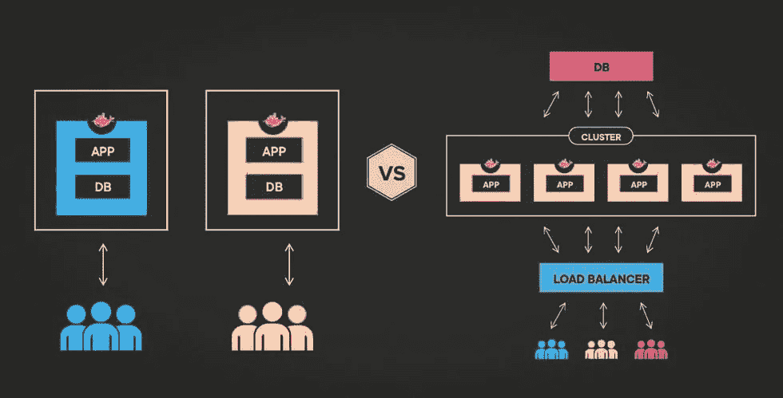
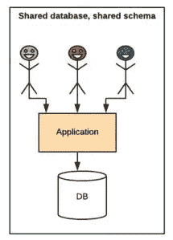
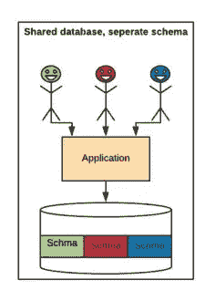
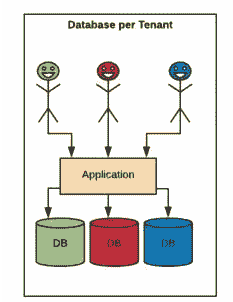

# 简而言之，多租户架构

> 原文：<https://medium.com/nerd-for-tech/multi-tenant-architecture-in-a-nutshell-78dafe7dc847?source=collection_archive---------0----------------------->

# 用简单的语言解释多重租赁

我们将用一个简单的对比来描述多租户的概念。假设你必须去银行。询问银行提供的任何服务，如取现、信贷、保险或任何其他服务。你不和其他客户说话。你甚至可能不会遇到。这就是多重租赁的基本运作方式。云中的用户可以访问同一个服务器，但是他们的访问级别和可能使用的功能各不相同。他们的数据、业务逻辑、使用历史和任何其他信息同时都被完全隔离。

# 用例

多租户架构最适合以下类型的应用:

1.  SaaS(软件即服务)或 AaaS(应用即服务)
2.  平台即服务
3.  IaaS(基础设施即服务)
4.  对于多个客户端使用相同算法堆栈的所有其他应用程序。主要功能要么是相同的，要么是模块化的，可以根据客户的任何需求进行定制。

# 什么是多租户架构定义？

允许租户隔离同时允许他们使用相同的基础设施、数据库或计算机资源的软件设计的一个例子是多租户架构。尽管使用相同的软件，租户是完全匿名的，无法访问彼此的数据，并对自己的数据完全保密。每个租户可能有不同的访问级别，这也可能会影响功能，并能够配置独特的功能，并以这种方式使用具有各种功能的同一应用程序。

# 单租户和多租户模式的主要区别

## 隔离

**单租户**:为每个租户提供独立的应用、基础设施和数据库**多租户**:为所有租户提供单一应用和共享资源

## 安全性

**单租户**:完全隔离潜在更安全的应用
**多租户:**租户可能共享同一个数据库，因此供应商应采取额外的安全措施

## 可量测性

**单租户**:复杂的可扩展性实施，因为每个租户都使用单独的 app
**多租户:**快速扩展；易于添加或删除功能和资源

## 可定制性

**单租户**:租户可以根据需求定制自己的 app
**多租户:**定制机会有限

# 多租户应用程序中的数据管理

根据存储数据的方式，可能有不同的多租户数据库解决方案:

# 单一数据库+单一模式

一个数据库模式包含所有租户的数据

在这种情况下，关心租户的数据分离是最重要的。添加像 *TenantID* 或 *ClientID* 这样的数据库索引来划分租户行。

**好处**

*   维护单个数据库很简单(与其他选项相比)
*   您可以随意添加任意数量的新客户端(添加就像在表中键入新记录一样简单)。

## **缺点**

*   对于可能需要各种数据使用习惯的各种消费者来说，没有太大的灵活性。\
*   当一个非典型的客户到来时，需要进行修补。
*   试图正确分离权限会有浪费时间和精力的风险。
*   备份和恢复可能会导致新的问题。一个表很难删除和重新创建，因为它保存了以前客户端的信息。不得不寻找和替换必要的行确实很烦人。

# 单个数据库+多个模式

在这个场景中，需要多个表来存储来自不同客户端的数据。模式变成了包含特定表、过程和权限的“名称空间”。

## **好处**

*   维护单个数据库很简单(与其他选项相比)
*   您可以随意添加任意数量的新客户端(添加就像在表中键入新记录一样简单)。

## **缺点**

*   对于可能需要各种数据使用习惯的各种消费者来说，没有太大的灵活性。
*   当一个非典型的客户到来时，需要进行修补。
*   试图正确分离权限会有浪费时间和精力的风险。
*   备份和恢复可能会导致新的问题。一个表很难删除和重新创建，因为它保存了以前客户端的信息。不得不寻找和替换必要的行确实很烦人。

# 独立的数据库

另一种可能的模型是当代码和数据在概念上(也可能是物理上)在客户端之间共享时(通过公共用户界面和业务逻辑)。

## **好处**

*   一键扩展性。
*   添加新客户端只需设置新存储，扩展非常容易。
*   各种服务器上的客户端数据库可能受定制支持。
*   每个客户端的设置都可以修改(甚至可以将存储移动到不同的 DBMS)
*   基本备份。
*   即使一个组件出现故障，其他组件也不会受到影响。

## 骗局

*   它很贵。一台服务器只能容纳一定量的存储。可能需要更多的设备(比所有东西都放在一个地方多得多)。请记住，额外的设备需要更多的管理员、服务器机房空间和电力成本。它很贵。
*   当您的服务器托管多个位置，并且总容量超过 RAM 空间时，数据会溢出到交换文件中，从而使访问硬盘驱动器的速度非常慢。

# 多租户使用案例的类型

*   **SaaS(软件即服务)或 AaaS(应用即服务)**:一个完整的软件解决方案，组织以按需购买的方式从云服务提供商处购买。
*   **PaaS(平台即服务):**一个多租户开发环境，用户可以使用它来交付从简单的基于云的应用程序到支持云的企业应用程序的一切。因为开发环境不是本地托管的，所以开发人员可以在世界任何地方开发应用程序。
*   **IaaS(基础设施即服务)**:一种云计算服务，在可扩展的基础上按需提供基本的计算、存储和网络资源。每个资源都是作为一个独立的服务组件提供的，团队只在需要的时候为特定的资源付费。
*   对于多个客户端使用相同算法堆栈的任何其他应用程序。主要功能可以是相同的，也可以是模块化的，可以根据客户的任何需求进行定制。

# 多租户架构:利弊

以下是多租户架构的主要优势:

*   **降低成本**:多租户支持使用单个实例为多个租户提供服务，有助于支持基础设施。由于租户共同承担软件维护、数据中心运营和基础设施方面的责任，因此持续成本较低。它允许提供商以可预测的年或月订阅价格提供 SaaS 软件。
*   **租户的可扩展性和更高的工作效率**:多租户架构支持租户按需扩展。新用户可以访问相同的软件实例，这通常会导致订阅费率的递增。租户无需管理软件或基础架构，从而腾出时间从事其他重要任务。
*   **无需编码的定制**:大多数 SaaS 多租户供应商提供高水平的定制，以确保每个租户客户能够根据特定的业务需求定制应用。它不同于定制开发，因为它可以最小化风险，减少工作时间和成本。
*   **持续、一致的更新和维护:**多租户软件提供商负责补丁和更新。他们应用新的特性和修复，而不需要客户付出任何努力。与要求提供商更新每个软件实例的单租户架构不同，多租户只需更新一次。

以下是多租户架构的显著缺点:

*   **漏洞**:多租户环境允许用户使用多个接入点，这可能会增加安全漏洞的威胁。
*   **复杂性**:在应用程序/数据库的一个实例中服务多个客户端会给代码库和数据库维护增加额外的复杂性。
*   **备份**:多租户环境使得备份和恢复更加复杂，因此并非所有提供商都能提供可靠的恢复服务。
*   **定制更少**:多租户环境提供的定制更少，因此用户对质量的控制更少。为单个租户添加定制可能会有压力，尤其是大型组织。
*   **全球问题**:如果一个技术问题发生在提供商端，它会导致所有用户的问题。这可能适用于正常运行时间、系统升级和其他全球流程。

# 多租户身份验证

构建多租户应用程序的主要挑战之一是管理用户身份:

*   每个用户都有自己的租户提供的凭据。
*   用户应该能够访问他们自己的数据，但不能访问其他租户的数据。

## 认证过程如下:

*   用户使用他们现有的组织凭据登录应用程序。
*   来自同一组织的所有用户属于同一个租户。
*   当用户登录时，应用程序识别相关的租户并提供对它的访问。

## 授权过程如下:

*   当应用程序授权用户的请求(例如，查看资源)时，它必须考虑用户的租户。
*   用户可以在应用程序中分配角色(例如，标准用户或管理员)。客户组织，而不是 SaaS 提供商，应该管理这些角色分配。

# 如何提高多租户安全性

使用以下最佳实践来确保多租户架构的安全性:

*   **有效的治理和合规性流程**:在实施多租户之前，制定隐私、安全和合规性政策，以保护租户的企业和知识产权，或者根据租户的敏感程度适当隔离租户。
*   **启用流程审计:**确保独立方能够审计 it 系统的合规性，尤其是那些托管应用程序和租户数据的系统。
*   **确保有效隔离:**云提供商必须实施虚拟基础架构加密策略和访问控制，以将云部署相互隔离，并有效隔离租户数据。
*   **监控数据共享**:发现并监控应用于共享文件的权限设置，包括通过 web 链接与您组织外的用户共享的文件。
*   **实现数据丢失防护(DLP):** 这个可以保证存储在租户的数据不被攻击者丢失或窃取。它还可以防止将敏感数据下载到个人设备。

# 结论

我希望您已经从这篇文章中获得了足够多的关于多承租的信息

以下是这篇文章的要点:

1.  ****多租户环境**托管共享计算、网络和存储资源的独立用户。**
2.  **当在多租户模式下运行时，您**将受益于**成本节约、资源利用率提高、可重复使用的数据处理元素、简单的版本管理以及更低的维护成本。**
3.  **另一方面，你应该准备好面对诸如复杂的开发、高发布风险、有限的个性化、脆弱的安全性、较低的性能和复杂的变更等缺点。**
4.  **在申请多租户场景之前要三思。但是，在为 SaaS**、PaaS、PaaS、IaaS** 以及其他应用选择它时，您可以肯定，在这些应用中，核心功能要么对所有用户都是相同的，要么是严格模块化的，可以根据典型客户的需求轻松定制。**