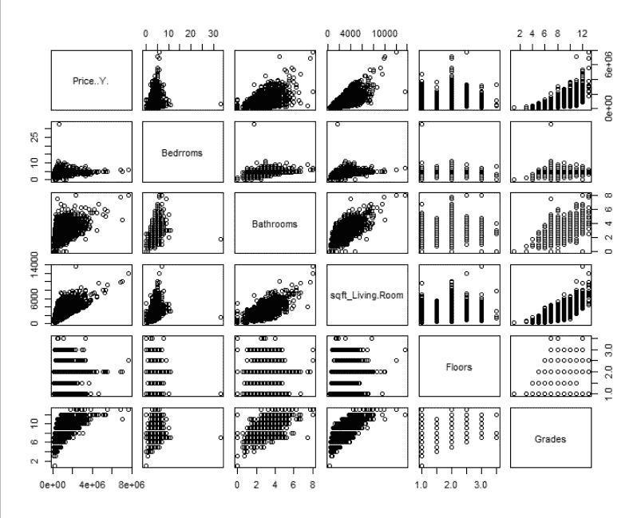
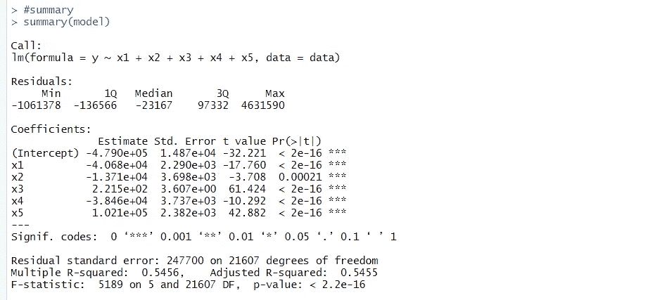
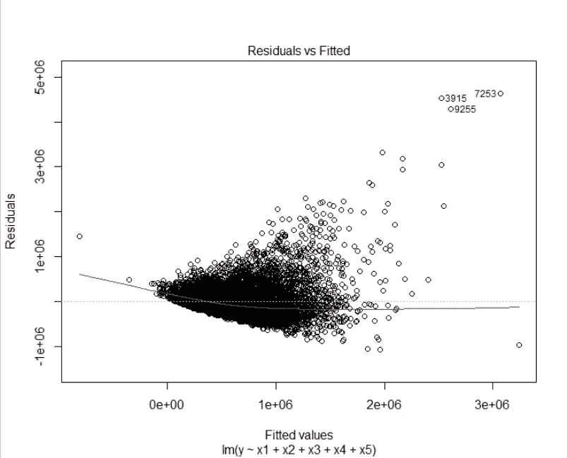
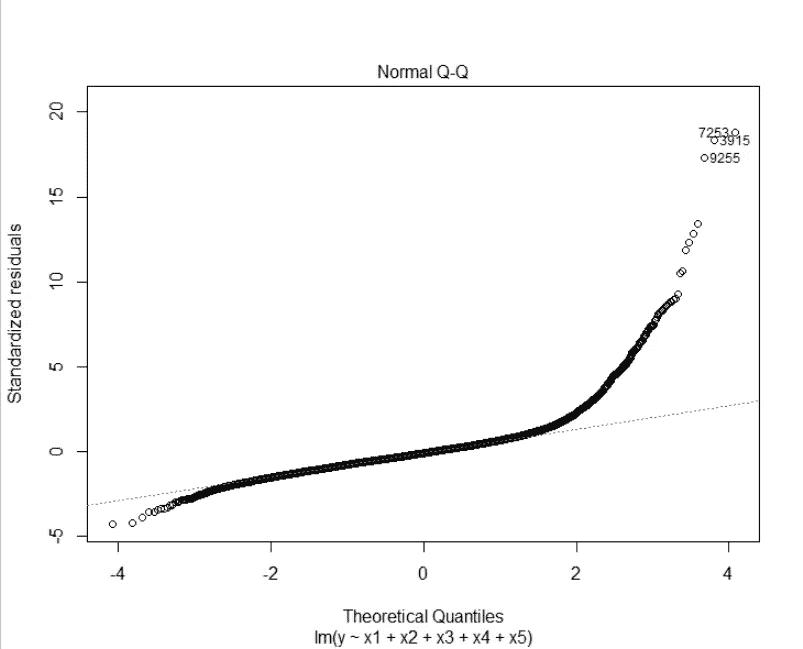
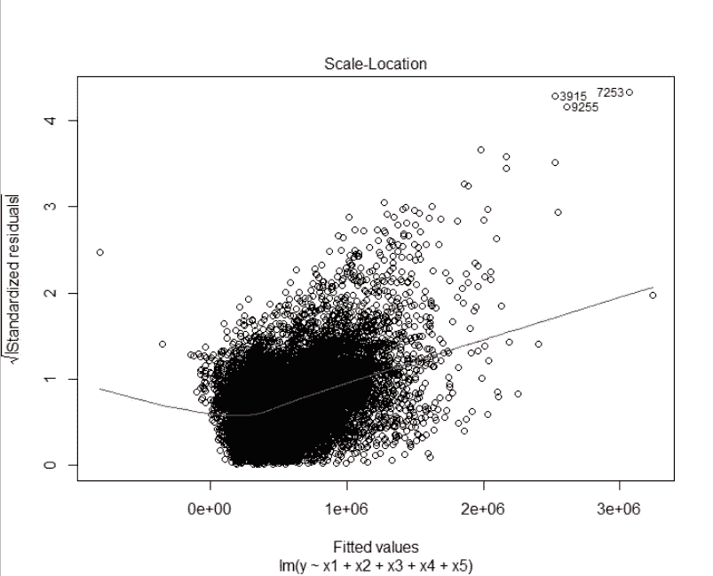
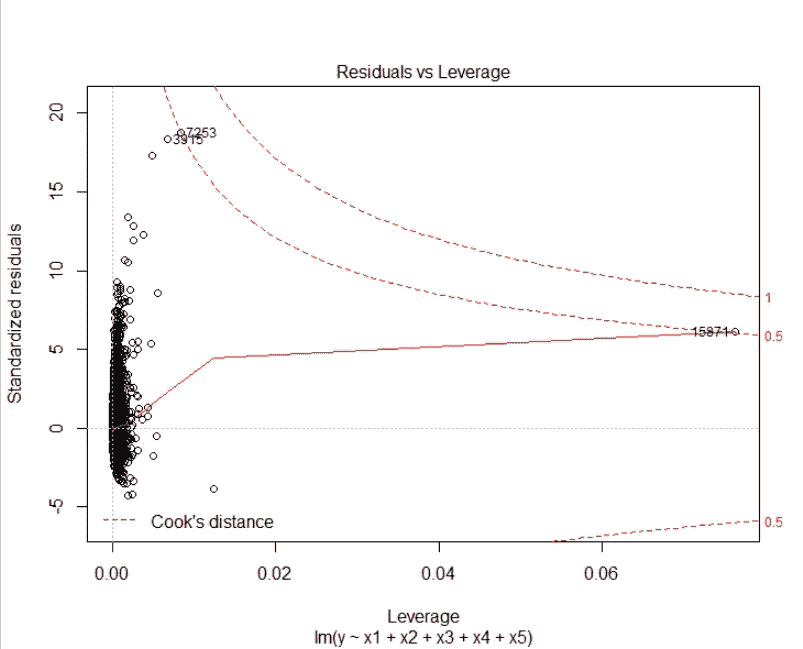

# 多元线性回归

> 原文：<https://medium.com/nerd-for-tech/multiple-linear-regression-edc5c57628f1?source=collection_archive---------15----------------------->

在前两篇文章中，我们探讨了简单线性回归模型的概念(即涉及两个变量的回归)。尽管实际情况需要更大的复杂性，但对于我们在现实生活中应用这一概念的几乎所有情况，我们都有许多变量(*可能会也可能不会显著影响结果变量*)。让我们学习如何建立和优化我们的多元线性回归模型(*模型，有多个解释变量*)。

示例:让我们考虑使用以下数据集，我们打算使用以下解释变量来解释公寓(Y) 的*价格:*卧室数量、浴室数量、居住面积平方英尺、所在楼层以及公寓的等级*(由客户早先给出)。*

*链接数据集:*[https://drive . Google . com/file/d/1 mxvohtxi 8 QE 0 spehtiea 2 _ vFjQxXTGOK/view？usp =分享](https://drive.google.com/file/d/1mxVohtxi8Qe0sPehTiEa2_vFjQxXTGOK/view?usp=sharing)
*来源:Kaggle*

# 在拟合多元回归模型之前

我们可能急于直接进入模型拟合和预测，但请稍等。我们首先要研究数据集中的模式和关系。因此，我们为所有相关变量制作了一个相关性矩阵，以研究它们之间的相关性。

*R 代码:
>绘图(数据)*

作者图片

很明显，从变量的散点图可以看出，有许多线性关系。我们的主要目标是——最小化解释变量之间的相关性，最大化解释变量和结果变量之间的相关性。

在这里，公寓的*价格似乎与所有其他变量线性相关，正如从图的第一行所看到的。尽管解释变量之间存在一些关系，如*浴室数量*和*起居室的平方英尺，但在有效的模型中应当避免*多重共线性。稍后将讨论多重共线性的测试。*

# 拟合多元回归模型解释公寓的 Y 价格

让我们利用 R 软件来了解模型的拟合，并了解需要研究的关键因素，以便优化我们的模型。

> *R 代码:
> >*#模型拟合
> >模型< - lm(y~x1+x2+x3+x4+x5，data=data)
> >模型

R 代码的输出窗口

现在，我们看到截距是估计的，上面提到了每个相应解释变量的截距值。因此，模型变成了，

注意:我们发现系数不在相似的范围内。我们可以通过应用特征缩放来更好地改进模型，在特征缩放中，我们缩放观察值中差异较大的变量，以获得更好、更有效的模型。

通过运行
代码:>总结(模型)

为了开始模型的优化过程，我们查看了多重回归显著性的 f 检验的 p 值。在这里，我们得到 p 值< 2.2e^-16 < 0.05(alpha). Hence, we reject H0 at 5% level of significance and conclude that at least one of the variables is being able to explain the output variable significantly, and that, regression is valid.

Also, the term “R² ” is used very frequently in the modelling phase. Here, we get R² value equal to 54.56%. Now, R² always increases with the rise in the number of variables (*，但是我们知道，我们不希望用变量*填充我们的模型。因此，引入了调整后的 R，该值平衡了由于变量导致的 R 上升与模型效率的实际增加。这里，调整后的 R 等于 54.55%。

# 模型的优化

我们可能倾向于保留数据集提供的尽可能多的变量，但我们必须记住，复杂的模型只会使我们的模型效率更低，并降低其预测能力。

因此，重要的是首先研究变量之间的相关性，研究它们的显著性，确保我们在解释变量本身之间有最小的相关性，而与结果变量有显著的相关性，就像前面所做的那样。

现在，在从模型中移除不必要的变量时，模型的主要优化发生了。令人惊讶的是，上面输出快照中的变量在解释公寓的*价格时都很重要(这是因为，所有估计值的 p 值-斜率和截距-都小于 0.05)。*

不仅如此，对于模型拟合的高级形式，我们必须考虑异方差性。当残差不具有恒定方差时。这种情况的反面叫做同方差。**图:**诊断图的图 3。**检验:**斯皮尔曼秩相关检验。一些高级测试还包括，**布鲁什-帕甘测试**和 **NCV 测试。**如果我们发现异方差，我们可以使用 Box-Cox 变换来改进变量并增加同方差。

**多重共线性测试:** VIF(方差膨胀因子)和法勒·格劳贝尔。

**自相关测试:**自相关是指模型的残差相关。现在，建立多元线性回归的假设之一是残差之间没有相关性。因此，这会导致预测错误，必须加以注意。**测试:**运行测试。

# 诊断图

*R 代码:
>剧情(模式)*

残差与拟合图，作者提供的图像

在上图中，我们看到分散点聚集在一起，这不是线性假设的好迹象。理想情况下，散布点应该是随机的，红线应该是直的和水平的。

正常 QQ 剧情，图片作者

对于 QQ 图来说，这些点看起来应该是沿着一条直线，而在这种情况下，它们倾向于从黑色的虚线开始逐渐变细。因此，我们可以说，残差不完全满足线性回归模型残差的正态性假设。

比例尺-位置图，图片由作者提供

此图用于观察方差的同质性趋势。该图用于分析同质性。随机点和直线是同质性的良好指标。但是很明显，上面的模型不是这样。

剩余与杠杆图，作者图片

此图用于识别模型中的异常值。它突出了那些作为模型异常值并因此显著影响估计值的情况或观察值，以提示它们的行为(*扰乱模型并偏离真实情况)。*在这里，我们可以看到观察值 3915、15871 和 7253 被标记为异常值。

# 分析的局限性

这个模型是从 Kaggle 上的随机数据集构建的。它没有考虑变量的缩放，因为我们的模型包含大的系数值。数据集中有许多离群值，这使得效率很低。

> 进一步的讨论主题

在后面的文章中，我们将学习本文中讨论的各种测试。此外，我们将研究处理异常值的各种方法，以及如何使用各种异常值分析技术来改进我们的模型。

快乐学习！