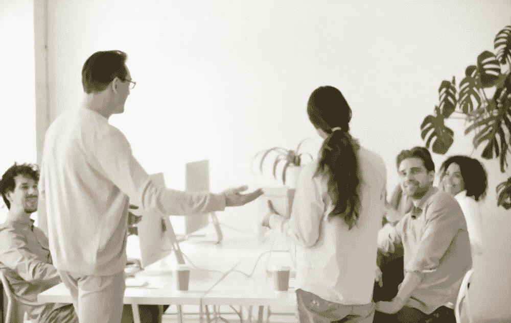

# UX 设计师新工作第一天必做的事情

> 原文：<https://medium.com/nerd-for-tech/must-dos-for-your-first-days-at-a-new-job-as-a-ux-designer-e7c0929cdd87?source=collection_archive---------18----------------------->

T2 他第一天去新工作总是充满压力。新的办公室、新的同事、新的职责、新的一切——需要时间来适应变化了的环境。许多新手感受到的压力与其说是因为害怕无法承担责任，不如说是因为焦虑，因为他们的同事会感觉到这一点。通情达理的雇主明白这一点，给新人以宽慰。同时，对一个人的看法通常是由第一印象形成的，然后要改变它是相当困难的。如果你想成为 UX 设计师的第一天，那么这篇由 [Wondershare Mockitt](https://bit.ly/3ewCXuz) 撰写的文章。

## 会见你的团队、老板和利益相关者

如果你是一家公司的新人，你当然会在第一天认识很多新人——新同事、上司和其他利益相关者。但是反过来也适用:你想了解其他人。作为一名 UX 设计师，上班的第一天绝不是第一次接触你的老板。所以去见见你的老板，试着找出他喜欢什么，讨厌什么。

根据公司的传统，你可以被一位高层经理，人力资源服务主管介绍给团队，或者你可以自己安排一次会面。在第一次会议上，你的任务是给人留下好印象。简单说说你自己，你的经历，和你的计划。当然，你不应该回避交流。像往常一样表现，但不要太绝对——这总是令人害怕。

试着了解你的同事是如何工作的，并遵循所有的工作要点。每个工作团队都有一套丰富的角色和面具。试着去了解谁是谁，然后你会更容易找到自己的位置。

## 见见技术人员

一旦你遇到一个技术人员(可以帮助你的人)并与之建立牢固的关系，这一点就非常重要。作为一个新的 UX 设计师，与一个对 UX 设计有很好的技术知识的人见面并合作是很重要的。和他建立关系对你的工作甚至工作之外都是有用的。

## 结交朋友并与他人合作

UX 设计很少是独角戏。无论你是在大公司工作还是为小客户工作，团队合作都是不可避免的。了解你与他人合作和委派任务的能力在项目中发挥作用的频率是很重要的。成为一名优秀的团队成员意味着理解你在更大范围内的角色，并对他人有用。俗话说:三个臭皮匠，顶个诸葛亮。学会与其他同事有效合作。

作为一名 UX 设计师，工作的第一天从来都不容易，但那些开诚布公、礼貌地接近新同事、提出问题并有所要求的人，会很快融入办公室社区。表现出克制和好奇心的健康结合是很重要的。另外，重点是职场，要调整到自己的人。

## 少说多听

在职场中，新员工的到来有时被视为一种“声明”:也许老板想雇用你，是因为他想改变现有的办公室文化，给工作带来新鲜的视角和想法。不幸的是，办公室是一个非常“狭窄”的地方，抗拒改变，而且极端排外。所以，即使你有世界上最好的想法，即使你是独一无二的，即使你会被你的领导欣赏，在第一天让自己知道就足够了。

"一个好的健谈者知道如何倾听。"在你的新工作中，最好的策略是多问问题，仔细听别人说话，并记住细节。赢得他人信任的最好方法是倾听。研究表明，尊重他人的意见，并在提出新想法之前征求他们的意见是正确的做法。即使被质疑，也要虚心接受。

## 做你自己

想办法放松，展示你自己。努力成为另一个人压力很大，何苦呢？你需要在第一天和第 31 天保持自我的一致性。如果你感到紧张，假装你在商务聚会上或者在你自己舒适的家里与人见面，这些都是互相认识的朋友。这与事实相差不远；你将与他们密切合作，享受建立关系的过程，所以为什么不现在就开始呢？

## 要自信

尽可能在公共场合露脸，树立职业形象。不要害怕表达观点。这样，你会发现谁是公司最重要的人，另一方面，你的公司同事也会逐渐适应在公共场合看到你。

## 不要推动你的优先事项

在新工作的第一天，你会被新的信息和任务淹没。当务之急是优先处理更重要的和需要首先完成的事情。询问你的经理什么需要优先考虑，最后期限是什么。从长远来看，他们会从中受益，因为你会更有效率，你会很容易避免额外的压力。

## 充分了解你的工作内容和工作职责

了解自己的工作内容和工作职责很重要。你清楚自己的工作内容吗？如果没有，那么这就是你工作的第一天。和你的经理或技术人员坐下来，仔细阅读你的工作描述，列出所有不清楚的内容。你会发现这会让你的工作更轻松，你的老板也会对你印象深刻。

## 见见你的人力资源

即使你的工作日在 5 点结束，多逗留一会儿。完成人力资源部的文书工作。记下你学到的东西，并写下第二天要问的问题。不做第一个出门的人向你的同事表明你是来学习的，而不仅仅是来领薪水的。

即使你应该在五点钟下班，最好呆久一点。仔细填写人力资源部给你的表格。把今天学到的都写下来，第二天要问的问题也写下来。这等于告诉你的同事，你来这里不仅仅是为了工资，而是为了学习。

## 每天提前计划你接下来的几周。

对工作日和工作周的合理规划会大大提高员工的效率。根据专家的说法，“通过花前 10%的时间计划和组织即将到来的工作，当它完成时，你将节省 90%的时间”。所以在你第一天结束的时候，计划下一周，写下所有的想法。这些绝对可以是任何个人和工作的想法。写下这些目标后，仔细检查列表，确定哪些目标是最重要的。完成首要任务将确保你的个人和职业发展。记住:你可以成就一切，但一切都有它的时间。

> “你有人生的选择。你可以按照自己设定的计划，有目的地生活。或者你可以偶然地活着，对他人的要求做出反应。”
> 
> ——迈克尔·凯悦(迈克尔·凯悦公司 CEO 兼创始人)

## 始终给予积极的反馈

在工作日快结束的时候，你的老板可能会问你第一天工作怎么样。避免批评，关注积极的方面。展示你在哪些地方可以利用你的经验来熟悉自己，以及在哪些地方你仍然需要培训。这里没人指望你做全面的分析。

## 在新团队或第一周不要做什么

1.不要搞革命。至少在工作的最初几周。仔细看看，给自己定位，你还有机会证明自己。

2.不用关，躲在一个角落里，把眼睛藏在设计里。迟早你还是要沟通的，但是到时候就更难做了。没必要在新认识的人面前布局自己的灵魂，遵循礼貌和品味的规则就好。

3.不要自大。这通常是隐藏你兴奋的一种方式，但是这种态度会疏远你的同事。

4.不要试图立刻取悦每个人，给新同事时间来审视你。

# 结论

新工作的第一天是最重要的——同事、经理和下属会对你形成第一印象，这在以后很难改变。成功适应新的工作不是一件容易的事，需要自己努力和工作。但这是值得的，因为我们生活中的很大一部分时间都在工作！好在一切都在你的掌握之中，提高，自信面对未来。我认为，公司必须不断监控员工满意度的水平和动态，以便能够通过使用特殊技术来影响动机。

感谢您花时间阅读这篇文章。[了解更多关于 Mockitt 的信息](https://bit.ly/3ewCXuz)

我们为 UX 初学者创建了一个[终极指南](https://bit.ly/2OLPPlW)，它收集了来自多个 UXers 的知识、经验和建议。

订阅我们的 [YouTube](https://www.youtube.com/channel/UCESxamaRS8nOGpWYvP1VSqA) [脸书](https://www.facebook.com/mockitt) [Instagram](https://www.instagram.com/wondershare.mockitt/)

*原载于*[*https://mockitt.wondershare.com*](https://mockitt.wondershare.com/ui-ux-design/first-day-at-a-new-job.html)*。*