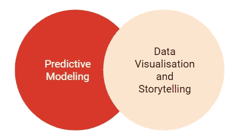

# 必须掌握从事数据科学职业的技能及其免费资源

> 原文：<https://medium.com/nerd-for-tech/must-have-skills-for-career-in-data-science-and-their-free-resources-928cae456b86?source=collection_archive---------13----------------------->

在我的上一篇文章中，我们回顾了数据科学专业人员使用的一些基本主题。为了培养这个职业的必备技能，我们必须充分利用时间，提高技能。

[绿色变色龙](https://unsplash.com/@craftedbygc?utm_source=medium&utm_medium=referral)在 [Unsplash](https://unsplash.com?utm_source=medium&utm_medium=referral) 上的照片

# 必备技能

每当有人申请工作机会时，招聘团队总会寻找一系列技能，可能是一些特定的软技能或一些技术技能。因此，我们应该为这些技能做好准备。一旦我们知道数据科学家的各种停止，我们将能够更好地提高技能。

从头到尾的数据科学，作者图片

从头到尾的数据科学，作者图片

**软技能**

1.  **认识问题**

数据科学家使用数据来解决一些问题，这使得他们的工作对于了解系统中的缺陷至关重要。一旦确定了问题，下一步就是找到潜在的原因，然后进行修复。这种技能是随着经验积累起来的。

照片由 [Diego PH](https://unsplash.com/@jdiegoph?utm_source=medium&utm_medium=referral) 在 [Unsplash](https://unsplash.com?utm_source=medium&utm_medium=referral) 上拍摄

**技术技能**

1。 **统计学基础**

实际上，数据科学家的工作就是处理数据，建立模型，并从逻辑上预测未来。数据科学和预测的所有基本概念都源于高度复杂的统计学。为了能够脱颖而出并了解工具的深层含义，我们必须了解我们所应用的一切事物的直观原因。

因为执行数据清理和探索是一个重要的组成部分，像异常值分析、数据操作等概念。，起着至关重要的作用。

2。 **基本编程**

有了大数据集，我们就不能用笔和纸来分析数据了。编程的作用来了。编程给了我们更准确地进行分析的能力，并且大大缩短了时间。因此，使我们高效和准确。

3。 **模型开发**

如上所述，这一阶段来得较晚，但重要的是从技术上了解各种模型、它们的假设、它们的应用以及它们对数据类型的适合性。这有助于我们建立一个适合我们数据的模型，最终形成一个高效的模型。

4。 **讲故事**

一旦你掌握了上述技能，你现在就必须交流你的发现并展示出来。你应该有沟通技巧才能做到这一点。

*现在，这些是可以让你起步的主要技术技能。但是，这个清单永远不会结束，我们必须每天学习和阅读。因为学习永远不会停止。*

# 免费在线资源

在这个时代，有很多资源可以参考。

由 [Austin Distel](https://unsplash.com/@austindistel?utm_source=medium&utm_medium=referral) 在 [Unsplash](https://unsplash.com?utm_source=medium&utm_medium=referral) 上拍摄的照片

1。 **发表研究论文**

有许多研究论文包含模型开发和预测建模。通读它们并理解它们的数据是了解特定类型模型的适合度的一个很好的方法。

*资源:谷歌学术(毫无疑问，是信息的瀑布)*

2。 **学生期刊**

学生日志让我们看到了各种问题陈述，它们的相关性以及解决问题的方法。从使用的数据类型(*二级或一级*)到应用的方法、工具和测试。这也有助于我们以批判的眼光看待他们的提议，也许可以做出更好的东西。

*资源:imstat、stemeducationjournal、tandfonline、jse . amstat*

3。 **网络社区**

这些都是学习和帮助同龄人解决概念疑惑的绝佳方式。它不仅强迫扭曲的思维，而且奇怪的答案。它帮助我们更客观地看待一个问题。

资源:stackoverflow、Quora、study.com 等。

4。 **Youtube**

毫无疑问，这些资源对从烹饪、缝纫到编程的许多技能都很有用。花一些时间在这里的内容上，有助于学习更多，学习多样化，学习得更快，学习得更好。

5。 **书籍/小说和网站**

这些也是了解虚构或非虚构的伟大人物的好方法。有很多关于统计学和预测建模的好书，这是一个很好的开始。这对喜欢阅读的人来说是一种享受。

来自汉斯·罗斯林的书是一个很好的开始。

浏览与数据科学相关的网站也是一个很好的开始方式。比如:【https://www.gapminder.org/resources/】T2