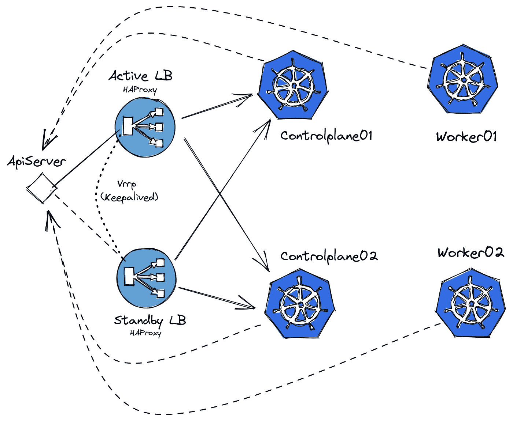
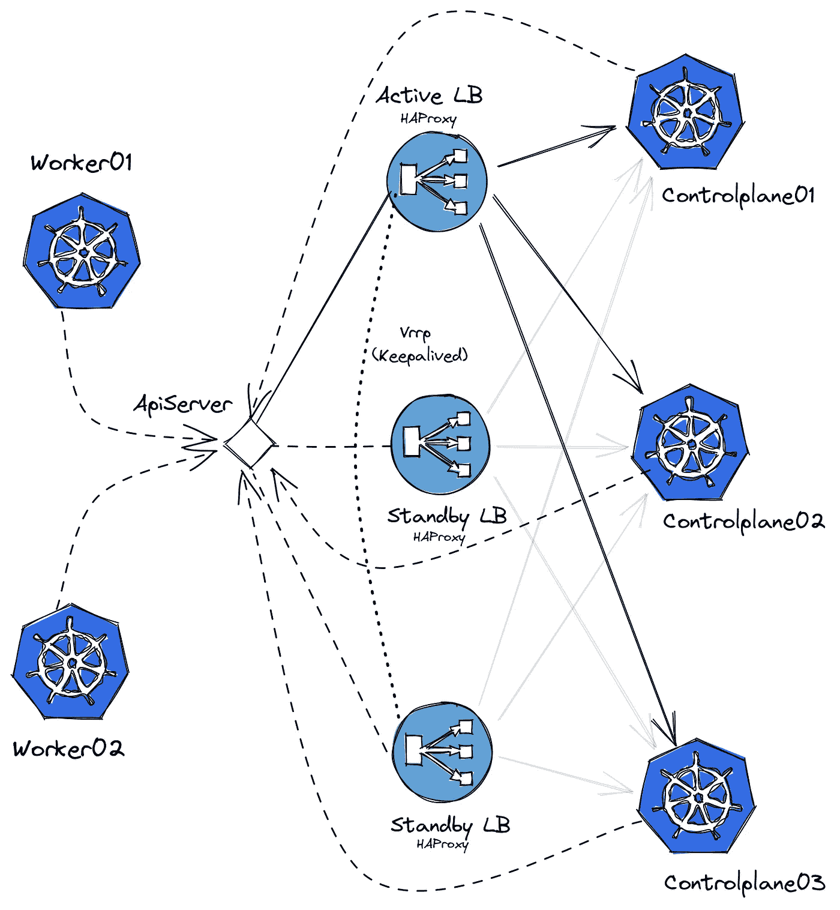
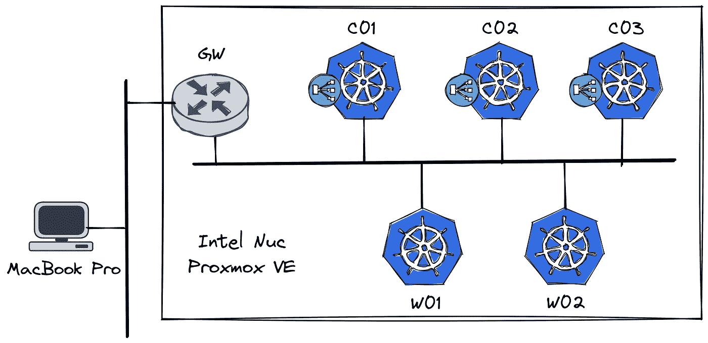
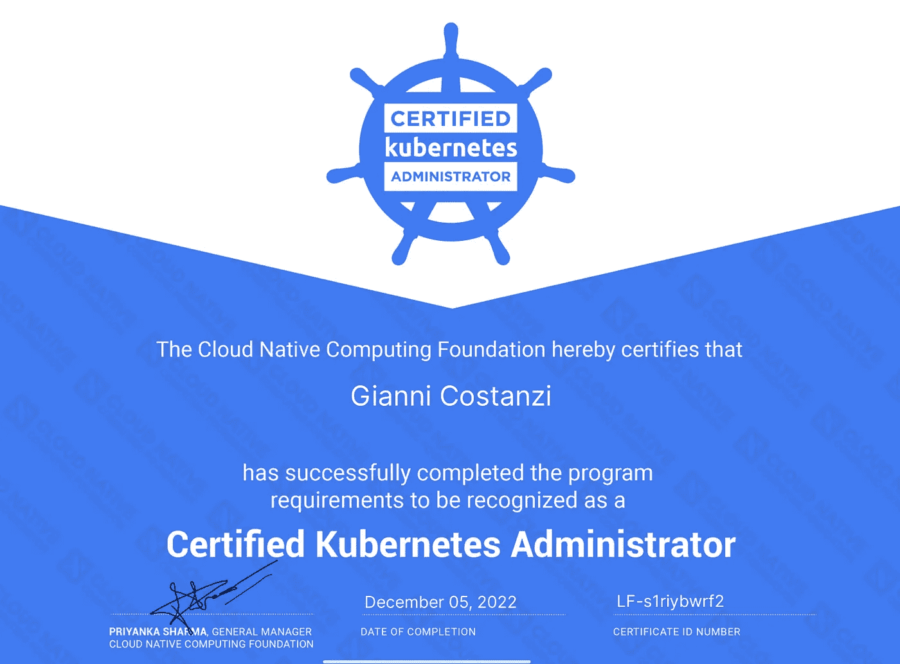

# 我的 CKA 之旅

> 原文：<https://medium.com/nerd-for-tech/my-journey-to-the-cka-d61554c84afa?source=collection_archive---------1----------------------->

# 很久很久以前(在一个遥远的星系中)…

在 2020 年初，我对 Kubernetes(从现在开始 K8s)产生了兴趣，我决定从 Nigel Poulton 那里购买[Kubernetes 的书](https://leanpub.com/thekubernetesbook)(每年免费更新)，从而开始钻研这项非常有趣的技术。

不幸的是，众所周知，2020 年初给我们带来了一个非常大的问题，对我作为网络工程师的日常工作产生了很大的影响(从数百名用户转移到数千名在家工作的用户对基础设施产生了很大的影响，需要做大量的工作)，因此我在旅程开始时就停止了对 k8 的研究。

**重要**:如果不想看完整个故事，可以直接在文末跳转到我的个人提示列表；)

# 是时候重新开始了……带着一个明确的目标

2022 年夏天，我决定是时候再次尝试了解 K8s 了，因为它在我们的 it 世界变得越来越重要(不仅是 K8s，还有 OpenShift 等)。

对我来说，学习某样东西的最好方法是有一个明确的目标，迫使你不断地在一个特定的主题上工作。现在这是一件非常困难的事情，因为我已经在个人电脑上每天工作 8 个多小时，下班后的精神资源几乎耗尽。顺便说一下，我想试一试，所以我决定瞄准 Linux 基金会**的**认证的 Kubernetes 管理员**认证。**

由于我在旅途中有很多疑问，我想分享我对 CKA 认证的经验，希望它可以帮助其他人在第一次尝试时获得相同的结果。

# 我们去乌代米打猎吧

在寻找折扣后，我决定花不到 10 美元从 Udemy 上的 Mumshad Mannambeth 和 KodeKloud 购买经过认证的 Kubernetes 管理员(CKA)€。

课程做得非常好，在 KodeKloud 上的一些真正的 Kubernetes 集群上有练习实验室(他们让你在他们的学习平台上免费访问这些实验室)，我从头到尾看了一遍课程，在进步的同时做了所有的实验，这是在你的脑海中固定你所学内容的最好方法。

# 我第一次用 Multipass+MicroK8s 安装 K8s

KodeKloud 实验室可以进行实验，但如果你真的想学习 K8s，并对它的工作原理、如何进行故障排除以及如何配置对象充满信心，我强烈建议你在笔记本电脑或一些家庭服务器上构建自己的 K8s 集群。

当我在 2020 年开始关注 K8s 时，在我的大停顿之前，我已经在我的笔记本电脑上使用 [microk8s](https://microk8s.io/) 在 [Multipass](https://multipass.run/) Ubuntu VM 上创建了我的单节点 kubernetes 环境。当我今年夏天开始再次学习 K8s 时，我决定使用 Kubernetes 而不是 light &快速版本，通过 kubeadm 安装它，因为这是考试中使用的。因此，我用一个主/控制平面节点和一个工作节点构建了我的第一个集群，再次使用 Multipass 作为我的 MacBook Pro 上的虚拟化工具。这让我获得了一些经验，但是我想向高可用性集群发展，所以在几周的经验之后，我从头开始。

# 移动到流浪者和增加节点的数量

我放弃了我的第一个 K8s 安装，我用[vagger](https://www.vagrantup.com/)工具替换了 Multipass，以便依靠我已经在使用的 VMWare Fusion 虚拟化环境自动构建我的 Ubuntu 虚拟机，以便能够使用快照，这是我在 Multipass 上所缺少的，并且当你想要试验和打破东西时非常重要:)

**重要提示**:实现具有冗余负载平衡器等的高可用性集群绝对不需要通过 CKA，您可以在 KodeKloud labs 和/或单节点测试集群上学习和实验，因此，如果您的 PC 上没有足够的资源来构建这样的集群，或者您根本没有时间这样做，请不要惊慌。

这一次，我决定将控制平面节点增加一倍，以提高冗余度(后来我意识到，具有堆叠 ETCD 的 2 个 CP 并不比单个节点好，因为当一个 CP 失效时，另一个 CP 没有运行的一致性..因此，在堆叠 ETCD 配置中，您必须选择 1CP、3CPS、5CPs。这需要我添加一个负载平衡器来平衡对 apiserver 的请求(在官方的[用 kubeadm](https://kubernetes.io/docs/setup/production-environment/tools/kubeadm/high-availability/) 创建高可用集群指南(在 [kubernetes.io](http://kubernetes.io) 上)和该页面上链接的一些其他资源上)中解释了一切)，并迫使我[定制 kubeadm 安装](https://kubernetes.io/docs/reference/config-api/kubeadm-config.v1beta3/)，以便将负载平衡器虚拟服务器指定为要向节点通告的 ApiServer，以及一些其他参数。这让我学会了如何通过 YAML 文件定制 kubeadm init 和 join 过程，因为这些选项不能在命令行中指定。这对于 CKA 来说并不是必需的，但是再多的经验也不能永远浪费时间。由于我是一名网络工程师，单节点负载平衡器对我来说是不够的，所以我用 Keepalived 构建了一个 LBs 集群，通过 VRRP 公开虚拟服务器的 IP 地址，用 HAProxy 实现 LB 本身。你可以在[软件负载平衡选项](https://github.com/kubernetes/kubeadm/blob/main/docs/ha-considerations.md#options-for-software-load-balancing)上找到关于如何在很短时间内实现 Keepalived+HAProxy 安装的说明，这是我在上面链接的高可用性指南中引用的一个文档。我想让 K8s 节点在内部网络上相互通信，而不暴露给我的 Macbook Pro，因此我必须为虚拟机添加第二个接口。这再次迫使我学习一些关于 kubeadm 定制的细节，因为我必须指定使用哪个 IP 地址作为节点地址，因为默认接口不是要使用的接口。

流浪 K8s 集群—逻辑视图

# 当事情变得严重时

现在应该很清楚，我从不满足于简单的事情，我想升级我的测试环境。我的 MacBook Pro 上的实验室需要改变也有一些原因:

*   磁盘空间很少:我的空间快用完了，我的虚拟机已经使用了大约 50Gbs 的磁盘空间。一个可能的解决方案是将所有东西都转移到外部固态硬盘上，但我没有这样的硬盘，它也无法解决以下问题
*   很少的 ram:6 个虚拟机分配了 2gb 的 ram，我并没有真的耗尽内存，但是没有太多的 ram 可用于操作系统和其他应用程序，如 Visual Studio 代码
*   高 CPU/功耗:我的四核 2013 i7 cpu 持续高负载运行，虚拟机和其他应用程序在后台运行，风扇始终全速运行，CPU 温度始终在 90°C 左右，功耗持续在 60 到 90W 之间。

正如我已经解释过的，CKA 不需要这样的多节点实验室，我可以简单地构建一个 1 或 2 节点的 K8s 群集…但您知道它是如何工作的…这不是我的选择:)

因此，我需要在另一台硬件上，而不是在我的 MacBook Pro 上，建立一个专用的家庭实验室。自从苹果发布 Apple Silicon platform 以来，这种愿望已经在我的脑海中建立起来，这是一项令人惊叹的技术，但对我来说有一个缺点:无法虚拟化 x86 硬件。因此，构建专用虚拟化环境可以解决 K8s 集群问题以及 x86 虚拟机的未来需求。

# 我们去易趣上打猎吧

当您考虑可用于运行虚拟机的小型低功耗机器时，您首先应该想到的是英特尔 NUC 平台……或者至少这是我在过去 2-3 年中遇到的几次情况。我从来没有去过 NUC，因为它的价格，由于过去两年的问题，现在上涨了这么多。我的问题是，我不想花钱买一台小巧的 i3 英特尔 NUC，内存和磁盘空间都很少，所以价格标签总是在 1000€左右或更多。我开始在 Ebay 和其他类似平台上寻找二手或翻新的东西，经过一次罕见的行星排列后，我找到了我想要的东西，大约 600€:

*   英特尔 NUC 性能核心 10i7FNH
*   由 Crucial 提供的 32GB (2x16GB) DDR4 2666Mhz 内存
*   2TB NVMe Sabrent Rocket 4 PCI Gen4 固态硬盘，适用于操作系统和虚拟机
*   2TB 至关重要的 MX500 SATA 固态硬盘，用于通过 [Proxmox 备份服务器](https://www.proxmox.com/en/proxmox-backup-server)进行自动备份

这个不可思议的硬件全部压缩在不到 12 x 12 x 5 厘米的空间内，运行非 CPU 密集型虚拟机时的功耗约为 15W。

所以，是时候学习新的东西了: [Proxmox VE](https://www.proxmox.com/en/proxmox-ve)

我浏览了用户手册、论坛和一些指南，很快我的新虚拟化解决方案就启动并运行了，可以托管 K8s 集群了！这在我学习 CKA 的过程中造成了一个小小的中断，但是绝对值得。

# Proxmox VE 上的新 K8s 集群

在运行 Proxmox VE 后，我很快学会了如何构建 Ubuntu 22.10 cloudimage，以及如何使用 Terraform+Proxmox provider 部署它，并且我准备好了使用 kubeadm 构建的新 K8s 集群重新开始。这一次，我选择使用 3 个控制平面+ 2 个工作节点，但没有在 CP 节点前放置 2 个负载平衡器虚拟机，因此不得不管理和更新另外两台机器，我决定将 LBs 集成到 CP 虚拟机中:

Proxmox K8s 群集—逻辑视图

由于我的 PVE (Proxmox VE)机器不仅要运行 K8s 集群，还要运行其他本地服务(查看我在媒体上发布的关于我的[Pihole+具有广告拦截功能的未绑定递归 DNS 解析器](/nerd-for-tech/recursive-dns-resolver-with-ad-blocking-features-dea766d4f703)的帖子)，我不想在我的“生产”本地局域网上暴露所有 K8s 虚拟机，所以我将它们放在一个隔离桥( *vmbr1* )上，以及一个连接到 K8s 桥和主 PVE 桥*的双宿主网关虚拟机(GW)顾名思义，GW 机器是 K8s 虚拟机通向我的局域网和互联网的网关，也是我可以访问 K8s 机器的 SSH 跳转服务器:*

上面配置的快速解释:

*   gw 是我的家庭局域网上 IP 为 10.0.0.100 的网关虚拟机，可以从我的 MacBook Pro 直接访问
*   c01 是 controlplane01，它在 K8s 网络上有一个 IP 192.168.100.11。这个 IP 不能从我的 MBP 直接到达，但是 c01 的配置告诉 ssh 首先跳转(即建立一个 SSH 会话)到 gw，然后到达 192.168.100.11 IP 地址(必须从 GW VM 到达，而不是从 MBP，这正是我想要的)。
*   c01 上的 LocalForward 允许我通过指向*http://localhost:8081/stats*来访问运行 con controlplane01 的 HAProxy 的统计页面
*   gw 上的 DynamicForward 允许我访问 192.168.100.0/24 网络上公开的每个服务，只需在 Firefox 这样的浏览器上配置代理设置，指向 *localhost:3128* 作为 Socks 代理。

这是新 K8s 群集设置的“物理”视图:

Proxmox K8s 集群—“物理”视图

一切都已准备就绪，可以部署 K8s 集群了，所以我再次使用 Kubeadm 设置了一个高可用性的 K8s 集群。我使用了 [Tigera Calico](https://www.tigera.io/tigera-products/calico/) 作为 CNI，为了在本地实现负载平衡器服务，我在第三层模式下安装了 [MetalLB](https://metallb.universe.tf/) ，在 K8s 控制平面/工作节点和 GW 之间使用 BGP peerings，GW 正在运行 [Bird](https://bird.network.cz/) 守护进程。这允许我通过 BGP 向 GW VM 宣布服务，这些服务可用于测试 K8s 集群中作为负载平衡器公开的服务的可达性(例如 [Nginx 入口](https://docs.nginx.com/nginx-ingress-controller/))。

**更多关于我的英特尔 NUC/Proxmox VE 实验室的详情** [**这里**](/nerd-for-tech/intel-nuc-10-proxmox-ve-homelab-ce2ef63075c) **。**

# 该是努力学习和实践的时候了，大量的实践

现在集群已经启动并运行，没有更多的借口，是时候努力学习并实践了，一次又一次地实践。我说过你应该多练习吗？

我认为你只需要在 Udemy 上学习并完成 KodeKloud 上的任务就可以通过考试，但如果你做大量的练习，想象新的场景并尝试在自己的集群上实现它们，你肯定会准备得更充分。

# 如何第一次通过 CKA 的个人建议

最后，我们在这里提供一些关于如何通过 CKA 初试的建议，主要集中在我自己的经历上:

*   **从头到尾跟着 Udemy 课程**，每天学习一点点**完成 KodeKloud 平台上的所有实验**，每次有不清楚的地方就提问。
*   使用 kubeadm 执行一些 K8s 安装。
*   再次浏览课程和 CKA 考试的主题(显然几乎相同)，**在你自己的集群上做实验**(我还记录了我的测试，以便将概念固定在我的脑海中)。
*   变得对 kubernetes.io 的所有部分非常有信心，以便快速找到不同种类资源的 YAML 框架，如持久卷、网络策略和其他不能用 kubectl 命令创建的东西。
*   尝试**掌握 kubectl 命令式命令**，这些命令允许您通过 *—预演=client -o yaml* 标志为 Pods、部署、角色等资源创建 YAML 框架。
*   了解如何通过 **kubectl explain** 命令快速找到关于 YAML 文件特定部分的信息，比如*kube CTL explain pod . spec . containers . volume mounts*了解可以为容器内的卷挂载指定的参数。
*   当你非常自信地准备好面对考试时，**试试**[**killer . sh**](http://killer.sh)**(如果你购买了 CKA 考试，则免费):在前两个小时内完成尽可能多的任务**看看你在真实考试中的表现，然后完成剩余的任务，看看哪里错了，尝试修复剩余的问题，然后浏览解决方案以了解你的错误。
*   请关注[Linux 基础考试页面](https://training.linuxfoundation.org/full-catalog/?_sft_product_type=certification&sscid=CjwKCAiAs8acBhA1EiwAgRFdw9YPlm7HZdpdkPbDwD_ATFkObJ8dofpfxOX9eApMsTa8FIe4K5m3QBoCwTkQAvD_BwE&gclid=CjwKCAiAs8acBhA1EiwAgRFdw9YPlm7HZdpdkPbDwD_ATFkObJ8dofpfxOX9eApMsTa8FIe4K5m3QBoCwTkQAvD_BwE)和**等待折扣**:今年夏天我在 KodeKloud 上看到了一些 35%的折扣代码，我最终设法在网络星期一上以 50%的折扣购买了考试。我还额外花了 10 美元买了通常定价为 299 美元的库本内特基础课程(LFS258) :它很有用，但与 CKA 的 Udemy 课程相比，它绝对不值全价，即使是全价(不到 90€)。
*   仔细**阅读考试信息/要求**并确认您的计算机满足 PSI 浏览器的要求，该浏览器必须安装并用于参加 CKA 监考考试。
*   **在考试开始时设置终端/shell**为了尽可能快，以最好的方式工作:为 kubectl 配置 bash 补全(*源码< (kubectl 补全 bash)* ，应该放在。bashrc 如果您将使用多个终端会话)，配置一个类似于 *$do* 的快捷方式来创建 YAML 框架(*export do = "—dry-run = client-o YAML " in。bashrc* )可以附加在 kubectl 命令式命令的末尾，检查终端应用程序的首选项以确保“不安全的过去警告”被禁用。
*   **考试时，如果不能快速解决，跳过低分任务**(1–3%)，尝试解决高分任务。最后，再检查一遍任务。
*   **总是在 shell 中或在临时 pods 中使用 curl 或 wget 测试您实现的东西是否正常工作**(检查服务的可达性、网络策略实现等)，并使用 *kubectl describe* 查看对象的细节。例如，您可以启动一个带有 alpine 映像的测试 pod，在 pod 中执行，安装 curl，然后在实施特定任务所需的网络策略之前和之后检查它是否被阻止/允许访问某项服务。
*   **总是复制考试任务**中指定的对象或目标文件的名称，以避免错别字。

# 结论

12 月 3 日，我参加了 killer.sh 考试，在两个小时内完成了 19 项任务(有些错误)，然后继续完成剩下的任务，包括另外两个小时的额外任务。分数不错，而且考虑到 killer.sh 考试应该比真题更难，我想尽快去 CKA 试一试。所以，我马上把它安排在第二天晚上。12 月 4 日晚上 7 点，我开始考试，在大约 100 分钟内完成了任务，剩下 20 分钟来再次检查任务并修复一些错误。

时间结束了，我对自己的表现很满意，但为了拿到考试成绩，我不得不等了 23 个半小时……对我来说是相当长的一段时间……然后嘣:CKA 以 95%的成绩通过了考试！

[验证我在 Linux 基金会的成就](https://www.credly.com/badges/04d53b3b-03c8-4af7-8774-156dc8213828/public_url)

我很努力地在第一次尝试中破解了它，我很高兴我能够完成这个个人挑战:)

我希望这篇文章能对其他想通过 CKA 考试的人有所帮助，欢迎提问，如果答案不违反考试的 NDA，我很乐意提供帮助；)