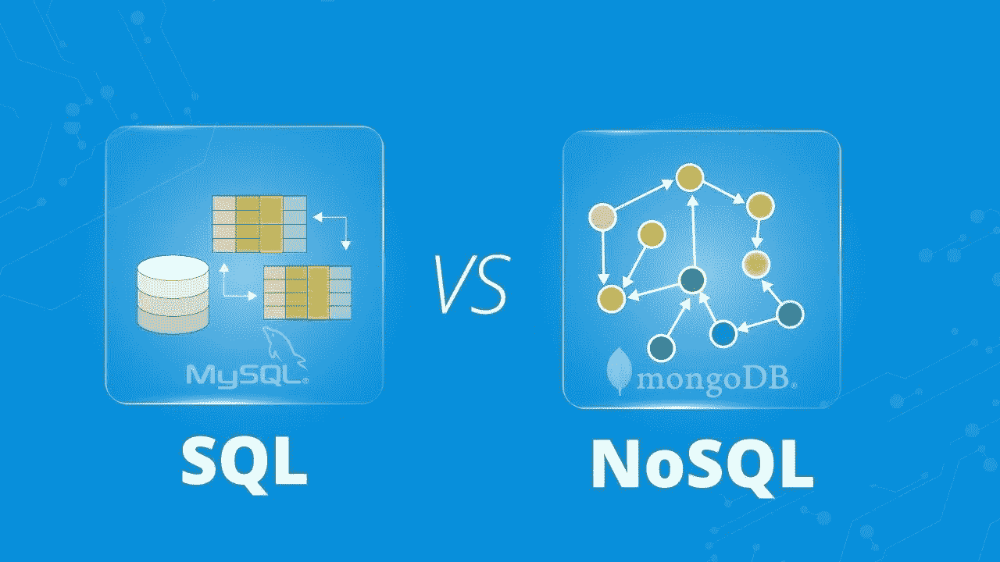
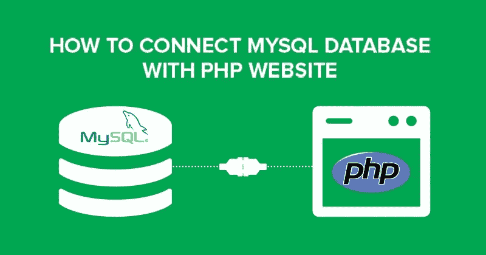
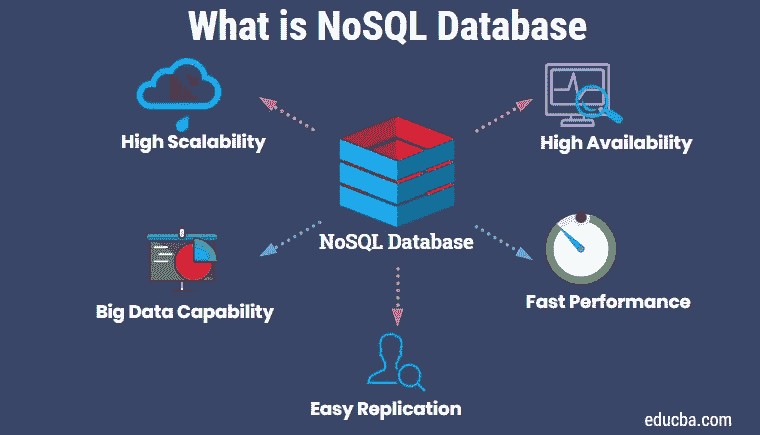

# MySQL vs NoSQL

> 原文：<https://medium.com/nerd-for-tech/mysql-vs-nosql-b0838f6ae10?source=collection_archive---------3----------------------->

## [法典](http://medium.com/codex)

图 1: MySQL 与 NoSQL

# 关系型数据库

MySQL 是一个免费的开源关系数据库管理系统(RDBMS)，它使用结构化查询语言( **SQL** )。SQL 是数据库管理中最强大和最流行的语言。使用这种语言，我们可以通过它的快速处理、可靠性、易用性和灵活性来添加、访问和管理所有的数据库。几乎所有的开源 PHP 应用程序都使用 MySQL 作为他们的数据库管理系统。

MySQL 开发项目已经在 GNU 许可和专有协议的条款下公开了它的源代码。最初，它属于一家名为 MySQL AB 的瑞典公司。但现在归甲骨文公司所有。

图 2: MySQL + PHP

## MySQL 特性

*   ***易于使用******:***我们可以只用几条简单的 SQL 语句与 MySQL 进行交互。**
*   *****安全*** **:** 密码在 MySQL 中加密。此外，它还包括一个坚实的数据安全层，以保护敏感数据免受入侵。**
*   *****客户端/服务器架构:*** MySQL 是客户端/服务器系统。有一个数据库服务器(MySQL)和任意多个客户端(应用程序)，与服务器通信；也就是说，它们查询数据、保存更改等。客户端可以与服务器运行在同一台计算机上，也可以运行在另一台计算机上。所有熟悉的大型数据库系统，如 Oracle、Microsoft SQL Sever 都是客户机/服务器系统。这些与文件服务器系统形成对比，后者包括微软的 Access、dBase 和 FoxPro。文件服务器系统的决定性缺点是，当在网络上运行时，随着用户数量的增加，它们变得非常低效。**
*   *****免费下载:*** 可以从 MySQL 官网免费下载。**
*   *****可扩展:*** 支持多线程，易于扩展。t 可以处理几乎任何数量的数据，多达 5000 万行或更多。默认的文件大小限制约为 4 GB。但是我们可以将这个数字增加到 8 TB 数据的理论极限。**
*   *****速度:*** MySQL 被认为是速度非常快的数据库语言之一，有大量基准测试的支持。**
*   *****灵活性高:*** 它支持大量的嵌入式应用，这使得 MySQL 非常灵活。**
*   *****兼容多种操作系统:*** Novell NetWare、Windows* Linux*、多种 UNIX*(如 Sun* Solaris*、AIX 和 DEC* UNIX)、OS/2、FreeBSD*都是操作系统的例子。和这里一样，客户端可以和服务器运行在同一台计算机上，也可以运行在另一台计算机上。这意味着客户端可以通过本地网络或网络进行通信。**
*   *****允许回滚:*** 允许事务回滚、提交和崩溃恢复。**
*   *****内存效率:*** 效率高是因为内存泄漏问题低。**
*   *****高性能:*** 我们可以使用触发器、存储过程、函数和视图，让开发者给出更高的生产力。**
*   *****平台无关:*** 可以在大多数可用的操作系统上下载、安装、执行。**
*   *****分区:*** 提高性能，提供大型数据库的快速管理。**
*   *****GUI 支持:*** MySQL 提供了一个统一的可视化数据库图形用户界面工具，名为“ **MySQL Workbench** ”，与数据库架构师、开发人员和数据库管理员一起工作。MySQL Workbench 为服务器配置、用户管理、备份等提供了 SQL 开发、数据建模、数据迁移和全面的管理工具。**
*   *****双密码支持:***MySQL 8.0 版提供双密码支持:一个是当前密码，另一个是二级密码，可以让我们过渡到新密码。**

## **MySQL 的缺点**

*   **MySQL 或更低版本不支持角色、提交和存储过程。**
*   **MySQL 不能有效地支持非常大的数据库。**
*   **MySQL 处理事务的效率不是很高，而且容易出现数据损坏。**
*   **MySQL 被指责与付费数据库相比，它没有一个好的开发和调试工具。**
*   **MySQL 不支持 SQL 检查约束。**

# **NoSQL**

****

**图:3**

**NoSQL 代表**“不仅是 SQL”，**是一种数据库设计方法，它提供了灵活的模式来存储和检索数据，超越了关系数据库中的传统表结构。在这里**“NoSQL”中的【不】**是“不仅”的缩写，并不是真正的“不”字。在云、大数据和高容量 web 以及易用性的时代，NoSQL 数据库最近变得更加流行。然而，NoSQL 和关系数据库现在通常在一个应用程序中一起使用。最常见的 NoSQL 数据库类型有键值数据库、文档数据库、列数据库和图形数据库。**

**NoSQL 数据库可以使用四种主要数据模型中的任何一种来管理信息:**

1.  *****键值数据库:*** 一个简单类型的数据库，其中每一项都包含**键值**。在这里，键通常是一个简单的字符串，值是一系列对数据库不透明的连续字节。此外，数据通常是一些原始数据类型，如字符串、整数、数组或应用程序需要持久存储和直接访问的更复杂的对象。**

*   **键值存储没有查询语言。它们只是提供了一种使用简单的 GET、PUT 和 DELETE 命令来存储、检索和更新数据的方法。这种模型的简单性使得键值存储快速、易于使用、可伸缩、可移植且灵活。因此，随着应用程序发展，这允许开发人员容易地修改字段和对象结构。**
*   **键值数据库最适合存储大量数据的用例。但是我们不需要执行复杂的查询来检索它。常见的用例包括存储用户偏好或缓存。Redis 和 DynanoDB 是流行的键值数据库。**

*****2。文档数据库:*** 在文档中存储数据类似于“JavaScript 对象表示法”(JSON)对象。每个包含成对的**字段和值**。值可以是字符串、数字、布尔值、数组或对象，它们的结构通常与开发人员在代码中处理的对象一致。以及文档数据库最适合各种各样的用例，并且可以用作通用数据库，因为有各种各样的字段值类型和强大的查询语言。它们可以横向扩展以容纳大量数据。**

*   **这些是为灵活性而设计的。它们通常不需要模式，因此很容易修改。对于需要存储大量数据和不同属性的应用程序来说，文档数据库是一个很好的选择。MongoDB 和 Apache CouchDB 是这方面的流行例子。**

****3。宽列商店:**这也叫“列数据库”。这允许使用行键、列名和单元格时间戳进行非常快速的数据访问。列存储将数据存储在表、行和动态列中。它们比关系数据库提供了更大的灵活性，因为不要求每行都有相同的列。**

*   **宽列存储用于存储 IOT(物联网)数据和用户配置文件数据。阿帕奇 **卡珊德拉**和 **HBase** 就是这方面的流行例子。**

****4。Graph databases :** 这是一个数据存储和处理引擎，使数据和关系的持久化和探索更加高效。在这里，每个结构包含**顶点**和**边**(数据和连接)。但现在它被称为“数据关系”。节点存储关于人、地点和事物的数据，而边存储关于节点之间关系的数据。**

*   **图形数据库用于可视化、分析或帮助您找到不同数据之间的联系。 **Neo4j** 和 **JanusGraph** 是图形数据库的例子。**

## **何时使用 NoSQL**

*   **用不断变化的模式存储大量非结构化数据。**
*   **当使用云计算和存储时。**
*   **为了快速发展。**
*   **当混合数据环境有意义时。**

# **MySQL 和 NoSQL 的比较**

**下图展示了 MySQL 和 NoSQL 的主要区别。**

****

**图 MySQL 和 NoSQL 的区别**

*   **MySQL 是基于表格设计的关系数据库，而 NoSQL 是基于文档设计的非关系数据库。**
*   **MySQL 由于其严格的模式限制，不容易扩展。但是，NoSQL 可以通过其动态模式特性轻松扩展。**
*   **MySQL 在创建数据库之前需要一个详细的数据库模型。但是，对于 NoSQL 数据库类型，不需要详细的建模。**
*   **MySQL 提供了大量的报告工具来帮助应用程序的有效性，而 NoSQL 数据库缺乏用于分析和性能测试的报告工具。**
*   **MySQL 不太灵活，NoSQL 更灵活。**
*   **MySQL 与一种叫做 **SQL 的标准查询语言一起使用。但是，NoSQL 没有任何标准的查询语言。****
*   **MySQL 可能会给大量数据带来性能问题。所以，接下来需要优化查询。但是，像 MongoDB 这样的 NoSQL 数据库即使在处理大型数据库时性能也很好。**

# **结论**

**如今，NoSQL 数据库正在成为该行业的一个主要部分。因为它具有大数据级别的性能、可扩展性和设计灵活性等优势。此外，其他特殊的东西，如较低的成本和开源特性是其成功的原因。MySQL 也仍然占据着很大一部分市场。MySQL 数据库及其固定的市场包含了一个比 NoSQL 数据库更大的社区。因此，即将到来的问题很容易解决。**

# **参考**

**[**https://www.educba.com/mysql-vs-nosql**](https://www.educba.com/mysql-vs-nosql)**