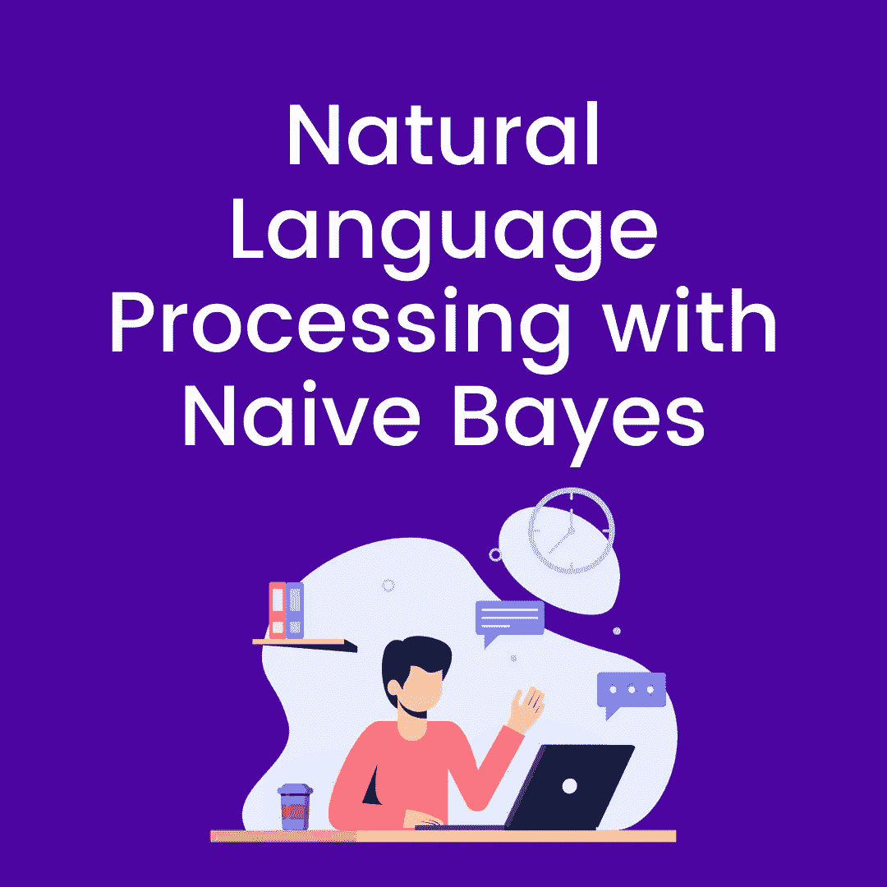
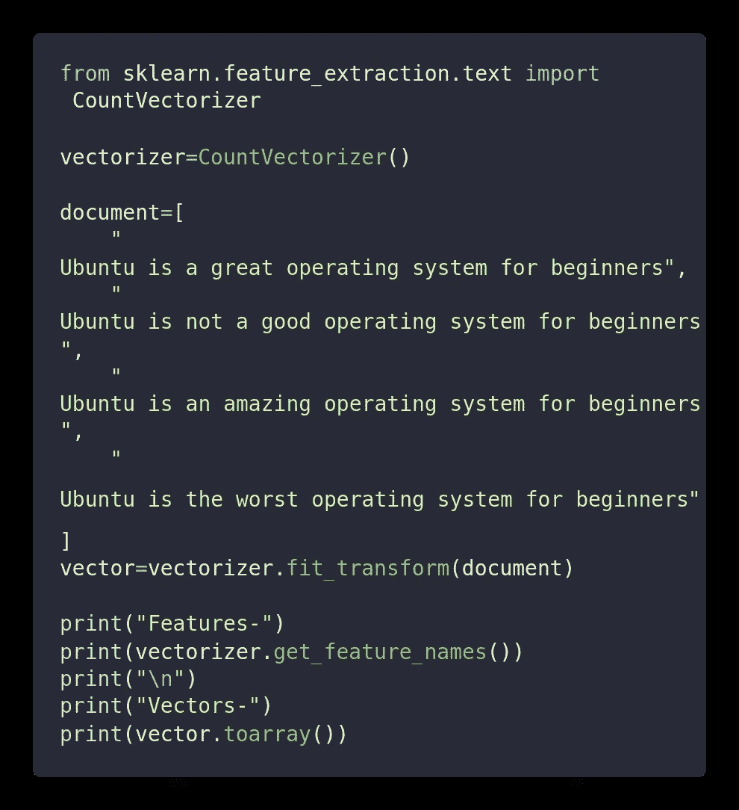
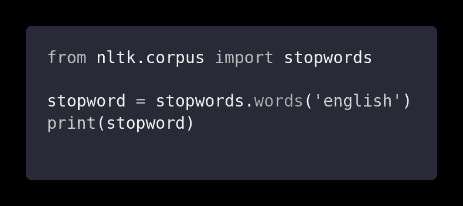
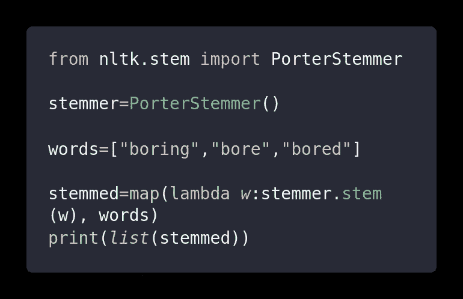
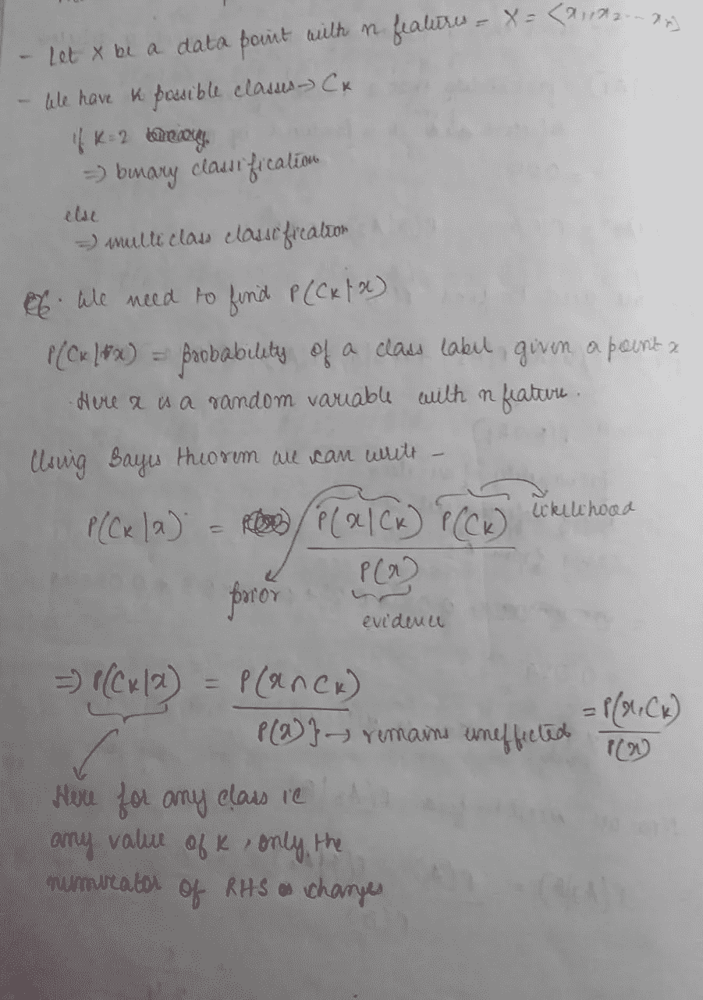
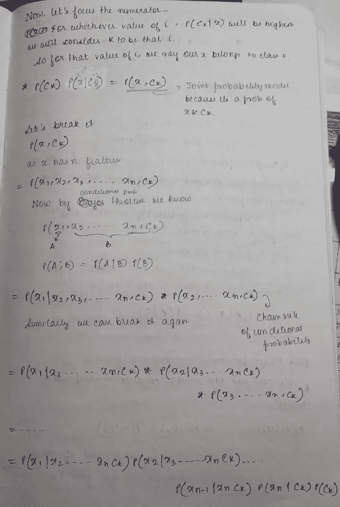
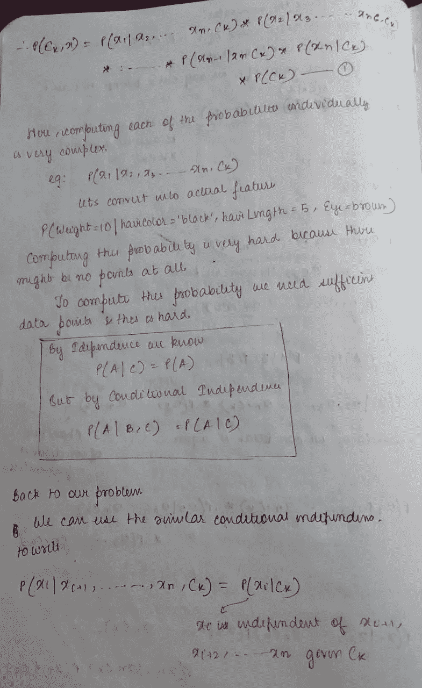
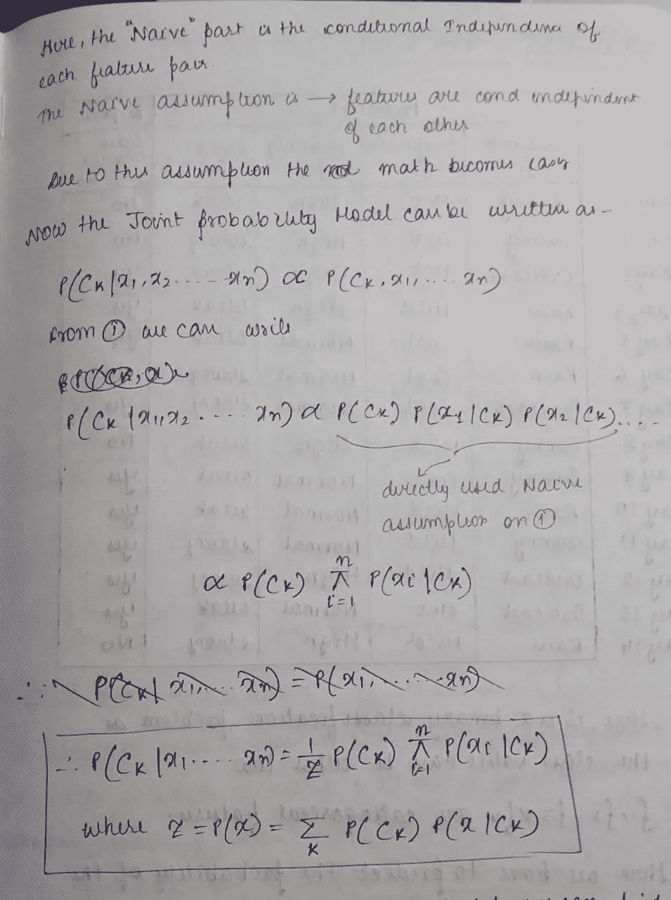

# 基于朴素贝叶斯的自然语言处理

> 原文：<https://medium.com/nerd-for-tech/natural-language-processing-with-naive-bayes-f8a00e8026fa?source=collection_archive---------27----------------------->



我们中的许多人都听说过 NLP 或自然语言处理，可能你在这里是因为你想探索这个领域。所以简单来说，NLP 是一种计算机可以理解人类语言的技术。但是什么是朴素贝叶斯呢？朴素贝叶斯是一种经常用于实现自然语言处理的算法。现在，如果你有一些机器学习的经验，那么你可能知道或听说过像 KNN 算法，逻辑回归，线性回归。但在这篇博客中，我们将使用朴素贝叶斯，因为它比任何其他算法都好，尤其是在文本分类方面，如果你没有听说过上述算法，那也没关系，因为我们在这里几乎不需要它

所以我会把这个博客分成两部分-

1.文本预处理

2.朴素贝叶斯

# 1.文本预处理

好吧，你已经坚持到这里了？很好。我知道你可能不知道什么是文本预处理，但是让我们先了解一下为什么我们需要它。

就拿一句话来说——“我想成为一名计算机科学家”。现在，我们如何在这段文本上执行任何数学运算，而不进行任何修改，因为最终我们的机器学习是一些复杂的数学运算，简单的答案是只使用一段文本，不对它执行进一步的修改，我们将无法执行任何数学运算。你很快就会明白我这里说的修改是什么意思。

因此，修改一段文本，使我们能够执行一些数学运算，就是将该文本转换为一个向量。为什么是向量？因为如果我们能以某种方式将文本转换成向量，那么我们就能在文本上使用所有的线性代数运算。听起来很有趣，对吗？

有很多种方法可以将文本转换成向量

一.词汇袋

二。Tf-Idf

三。Word2Vec

四。平均 Word2Vec

在这篇博客中，我将只讨论第一种方法，即单词袋

# 一袋单词

单词包是一种广泛使用的将给定文本转换成向量的方法。让我们看看单词袋实际上是如何工作的

**步骤 1-** 我们得到了下面的文本数据，为了简单起见，我们将使用四个简单的句子。

D1:“Ubuntu 对于初学者来说是一个很棒的操作系统”

D2:“Ubuntu 对于初学者来说不是一个好的操作系统”

D3:“Ubuntu 对于初学者来说是一个非常棒的操作系统”

D4:“Ubuntu 对新手来说是最差的操作系统”

机器学习领域的这些数据被称为**文档**

**第 2 步-** 接下来我们将创建一个字典，包含这四个文档中所有的独特单词


弓的字典

**第 3 步-** 现在我们将为上述每一个文档创建一个向量。如果一个文档有 d 个单词，那么我们将为它创建一个 d 维向量。我们可以通过使用 hashmap 或类似字典的结构来创建这个向量。这个结构也将具有与我们上面创建的字典相同的长度，并且这个向量的值将是主字典中相应的单词在我们正在处理的文档中出现的次数。好的，我知道这有点复杂！让我们用一个例子来简化这个概念。

第一个文档的向量将是-


文档 d1 的向量

让我们理解为什么产生的向量看起来如此。向量的第一个值是 1，因为字典的第一个单词“Ubuntu”出现在文档 d1 中，假设我们的索引从 1 开始，对于索引 1，2，3，7，11，12，13，14 也是如此。向量的第四个值是 0，因为字典的第四个单词“an”在 d1 中不存在，对于索引 4，5，6，8，9，10 也是如此。

下面这段代码展示了 python 中 BOW 的实现



弓的 Python 代码


现在，如果您仔细观察，您可能会怀疑为什么有 13 个特征，而实际上有 14 个唯一的单词，简单的答案是 CountVectorizer 忽略了一个字母单词，所以它忽略了字母“a ”,所以它显示 13 个特征，而不是 14 个

除了 BOW 这个概念之外，我们还有另一个简单的概念，叫做二进制 BOW，它只是在向量中分别用 1 或 0 来标记一个特定的单词是否存在，它不会显示一个单词在向量中出现的次数。现在，我们需要进一步处理这些向量，并尽可能地简化它们，为此，我们有更多的文本处理技术—

**a)停用词移除**

停用词是从文档中删除后不会真正改变该文档性质的词，例如，如果该文档是一个积极的文档，如我们示例中的“d1 ”,则从该文档中删除停用词后，它仍然是积极的，消极的文档也是如此。

例如:is，a，for，this 等

下面这段代码打印了英语字母表中的所有停用词-



用于打印停用词的 Python 代码


英语字母表中的停用词

**b)词干**

有些词的实际意思是一样的，比如“bore”和“boring”，这两个词实际上指的是同一个意思，所以应该用一个词来代替

下面这段代码展示了如何在 python 中执行词干处理-



用于词干分析的 Python 代码


**c)词汇化**

词汇化基本上是将一个文档分解成单个的单词，或者一组两个甚至更多的单词。如果一个文档被分成单个单词，那么它被称为一元语法，如果被分成一组两个单词，那么它被称为二元语法，它上升到 n 元语法。

例如:如果我们用下面的方法划分 d1，那么它被称为一元语法

' Ubuntu '，' is '，' a '，'棒极了'，' OS '，'适合'，'初学者'

如果我们这样划分 d1，那么它被称为二元模型

Ubuntu 是'，'是一个'，'一个伟大的'，'伟大的 OS '，' OS for '，' for 初学者'

这些是我们在应用 NLP 算法之前需要执行的基本文字处理技术

现在，在我们完成了所有的文本处理之后，我们可以进入实际的机器学习部分，并理解朴素贝叶斯是如何用于 NLP 的

# 朴素贝叶斯

在你进一步学习之前，对你来说，明确概率的概念是非常重要的。你需要有一个清晰的概念——条件概率、独立事件、乘法定理、贝叶斯定理以及所有其他概率的基本概念。如果你清楚了这些概念，那么你就准备好理解这些概念，如果没有，我强烈建议你学习这些概念，然后回来。

好的，与其直接给你们看这个公式，我觉得更重要的是理解它是如何推导出来的，因为推导过程告诉了我们，在推导这个公式时，我们所做的假设。让我们从推导开始



如果你已经经历了整个推导过程，那么很可能你已经明白，在这个整个推导过程中，最重要的部分是条件独立的假设而没有这个假设，整个推导就无法进行。

所以朴素贝叶斯公式是-


朴素贝叶斯分类器

因此，给定任何数据集，我们只需要计算类的可能性和概率值，就可以得到给定数据点的类标签的概率值。对于概率值最大的任何类别标签，数据点 x 属于该类别

使用 python 实现朴素贝叶斯极其容易，并且可以使用 scikit 学习库来完成

```
from sklearn.naive_bayes import GaussianNB
NB=GaussianNB()
```

然后我们可以使用。fit()函数，最后可以使用。预测()

**奖金内容**

这一部分不完全是关于机器学习的，但它是软件工程和机器学习的交叉，我觉得它将有助于人们理解数据结构和算法的概念是如何在机器学习中实现的。在专门针对朴素贝叶斯的 scikit learn 库中，有一个朴素贝叶斯算法的特殊实现，称为“核外朴素贝叶斯”。因此，这种“核外朴素贝叶斯”用于数据量巨大而我们的 RAM 相对较小的情况，基本上整个数据都放不进 RAM。现在，如果您熟悉外部合并排序的概念，那么这里使用的概念几乎是相同的，即，整个数据将被划分为一个可以放入 RAM 的大小，它们将被单独排序，最终将被合并。现在有一个很好的机会，实际的“核外朴素贝叶斯”实际上并不是这样工作的，或者即使是这样，也可能是使用了一些更高级版本或更优化版本的外部合并排序。我只是试图激励你们去理解这些算法是如何在这些场景中实现的。