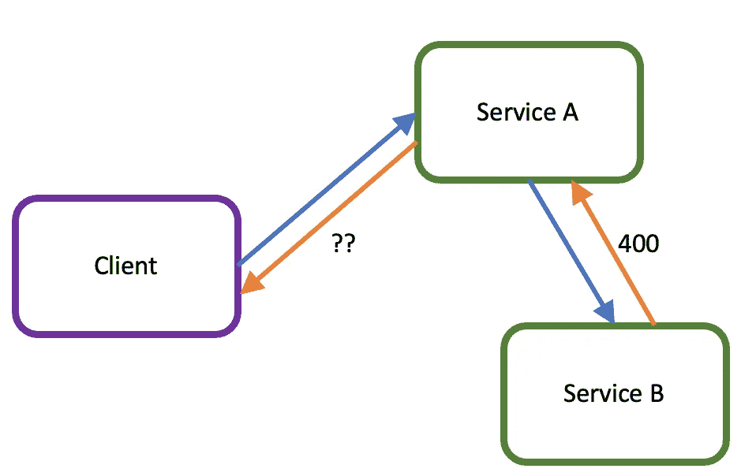

# 为 REST APIs 导航 HTTP 状态代码

> 原文：<https://medium.com/nerd-for-tech/navigating-http-status-codes-for-rest-apis-39f25fcd8cc6?source=collection_archive---------5----------------------->

埃里克·麦克林在 [Unsplash](/s/photos/404?utm_source=unsplash&utm_medium=referral&utm_content=creditCopyText) 上的照片

我喜欢身份代码。我总是觉得，如果我能开状态代码的玩笑，我将最终成为一名真正的 API 专家。虽然我最喜欢的状态代码肯定是 418，但 404 在我心中有一个特殊的位置。在我之前的一家公司，404 是我的员工号，当它出现在文件上时，我总是觉得很有趣。我半期望我的记录消失，没有人会注意到。对不起，乔伊没找到。

不过，找出某个情况下的正确状态代码并记住它们的所有含义可能有点棘手。类似于 [HTTP 方法](/dev-genius/common-http-method-problems-in-rest-apis-3a485db1d635)，在构建 REST APIs 时，HTTP 状态代码通常会带来挑战。从表面上看，[的状态代码列表](https://en.wikipedia.org/wiki/List_of_HTTP_status_codes)似乎非常简单，只有当你开始深入研究它们时，才容易发现在很多情况下不清楚应该使用哪一个。多种代码有时似乎适用，而其他时候似乎没有什么是完全合适的。那么我们如何导航状态代码呢？我们如何选择哪一个适用于特定的场景？

对于所有这些，我将假设有某个客户端向服务器发送 API 调用，而服务器用一个状态代码进行响应。

# 在 4xx 和 5xx 之间抉择

通常，4xx(400 中的任何代码)是“客户端错误”，5xx(500 中的任何代码)是“服务器错误”。棘手的是如何准确解读这一点。一般的经验法则是:如果请求失败是客户端的错(例如参数无效)，则返回 4xx，如果是服务器的错，则返回 5xx。另一种思考方式是，如果客户获得 5xx，他们应该能够预期在未来进行完全相同的呼叫，并获得不同的响应。同时，如果客户端得到一个 4xx，他们需要修改请求中的某些内容，如果他们想要得到的不是相同的 4xx。

对于微服务架构，这开始变得棘手。如果您从一个下游服务得到一个错误，那么很容易忽略这个错误。但是，举个例子，我让客户端调用服务 A，服务 A 调用服务 B。如果服务 B 因为服务 A 损坏了对它的请求而返回 4xx，这可能根本不是客户端的错，因此服务 A 应该向客户端返回 5xx，而不是 4xx。但是，如果服务 B 返回相同的 4xx，因为客户端输入到原始请求中的数据无效，那么服务 A 应该返回 4xx。理想情况下，对于第二种情况，服务 A 中应该有足够的数据验证，这样我们就可以在调用服务 B 之前返回一个错误。但是，很容易错过一些数据验证，所以在决定服务 A 应该返回什么时，仔细查看服务 B 的错误是很重要的。

# 在 400、401、405、403 和 404 之间做出决定

所有的 4xx 响应有时听起来都一样。为了让它们保持直线，我经历了下面的决策过程。

如果客户端发送了一个乱码请求，(无效的 JSON，无效的 URI 格式，等等)，那么他们应该得到一个 **400** 。

如果请求格式是有效的，但是他们没有提供有效的认证(过期或无效的 API 密钥)，那么他们应该得到一个 **401** 。401 意味着拥有这些凭证的客户端无法成功调用*任何*端点(需要认证)。

如果认证凭证是有效的，但是他们试图到达的端点不存在(我们不支持/unicorns)或者他们试图访问的特定 id 不存在(当他们调用/animals/456 时，没有 ID 为 456 的动物)，那么他们应该得到一个 **404** 。考虑 404 的另一种方式是，它表示无效的 URI 路径(即查询或#片段)。在一些授权错误的情况下，API 也返回 404 是很常见的。404 适用的授权情况是不允许客户端知道资源的存在。返回一个不同的错误代码，比如 403，会告诉客户端他们刚刚尝试的 id 是有效的，如果他们不知道这个 ID 的存在，他们就不应该知道。因此，如果从客户端的角度来看，ID 不存在，无论服务器或其他任何人可能会怎么想或知道什么，通常都会返回 404。

如果资源存在，并且调用者有权限查看有问题的资源，但是那个特定的 HTTP 方法还没有实现，他们应该得到一个 **405** 。这是服务器允许客户端获取资源，但不允许发送到该资源的情况(例如)。

然而，如果一些用户可以访问该特定方法，而不是具有当前凭证的用户，那么我们应该返回一个 **403** 。例如，如果我试图编辑一个我只能查看的资源，我应该得到一个 403。403 的其他例子是，如果我试图访问我的企业尚未购买的功能的端点，或者如果我使用的 API 密钥不在我调用的端点的范围内。403 和 401 的最大区别是，对于 401，我无法成功访问任何端点。有了 403，我就不能访问这个特定的。

如果我们已经解决了所有这些问题，但是请求中的一些数据仍然无效。例如，我为一个枚举字段发送了一个无效选项，或者我传入了两个不能同时被接受的不同参数，那么我应该返回一个 **400** 。

如果我们已经解决了所有这些问题，那么应该会返回另一个响应代码。

# 404 对 204

**404** 和 **204** 可能会有点混乱，因为乍看起来，如果一个对象不存在，那么我可能会得到一个 204(有效的调用，但那里什么也没有，因此是空体的成功)。但是，这应该不是 204。204 是为引用的资源存在，但作为响应返回资源没有意义的情况保留的。这可能是因为调用是一个成功的删除调用，所以响应*应该为空，因为资源不再存在(尽管资源在调用之前就存在，所以不是 404 ),也可能是因为执行了标准 CRUD 之外的操作——就像在 controller-resource 的情况下，我们可能希望指示某个函数的成功执行，但实际上没有合适的响应主体或资源。*

# 空列表:404 还是 200？

从表面上看，这听起来非常类似于 404 vs 204 的情况，但实际上略有不同。如果客户端调用 GET /users/{userId}，则客户端将该特定的 userId 指定为 URI 的一部分。如果从客户端的角度来看这个用户 Id 不存在，那么客户端应该得到一个 404(无效的 URI)。然而。如果客户端调用 GET /users？name=joy，那么客户端将请求一个包含所有名为 joy 的用户的列表。在这种情况下，URI/users 确实存在并且有效。如果没有人的名字是 joy，那么我们就把这个列表过滤掉，客户端应该会得到一个 200 的空列表。URI 是有效的，但是客户端过滤掉了所有内容，所以返回一个空列表。

# 400 对 422(和其他 WebDAV 代码)

这里的基本答案是，如果你没有实现一个 [WebDAV](https://en.wikipedia.org/wiki/WebDAV) API，你不应该返回任何 WebDAV 错误代码。有些情况下，WebDAV 错误代码听起来可能比其他任何代码都更适用。然而，如果你不是 WebDAV，返回这些通常被认为是不正确的。这同样适用于许多非官方的或服务特定的代码。如果您选择尝试实现其中的任何一个，只需知道您的客户端可能使用的任何标准响应处理程序都无法处理响应或者会错误地处理它。

这是我最近遇到的棘手案例的总结，但我肯定我漏掉了一些。如果你还有其他难以破译的，请告诉我。此外，就像任何边缘有点灰色的东西一样，不同的团队和公司对其中一些东西的解释与我略有不同。这突出了一件事，我认为它比任何一件事情都更重要——你自己的 API 内部的一致性和你的 API 的清晰文档。在您自己的 API 中清楚地说明错误代码的含义是很重要的。更好的是，提供定制的错误消息和文档比获得任何给定的错误代码都要准确得多。

要进一步阅读 REST APIs，请查看我在 [HTTP 方法](/dev-genius/common-http-method-problems-in-rest-apis-3a485db1d635)上的帖子。