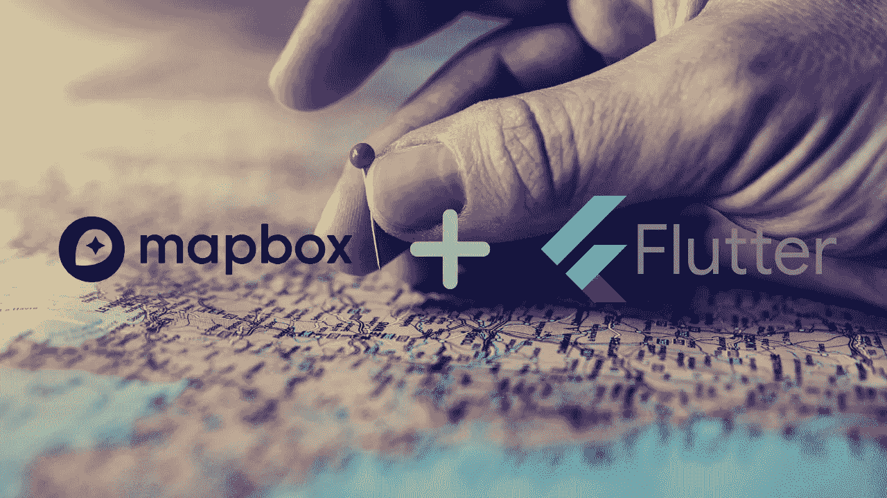
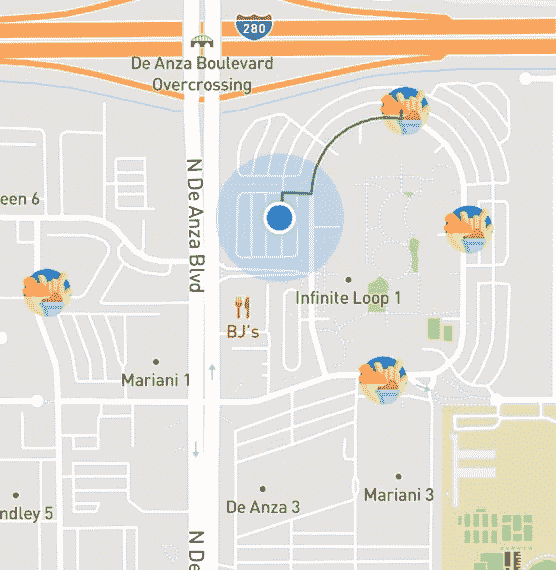
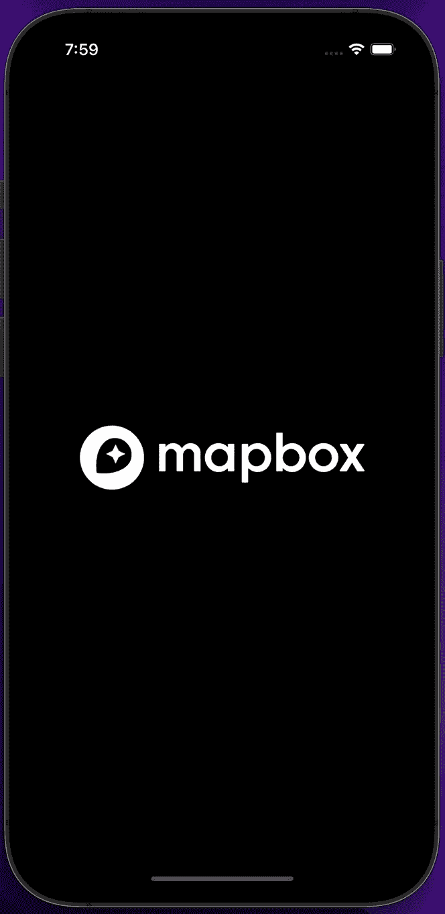
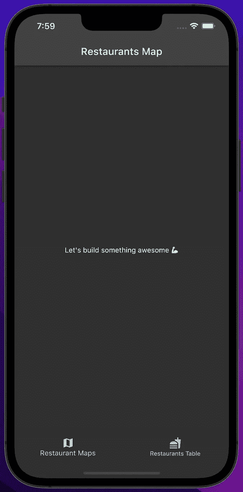
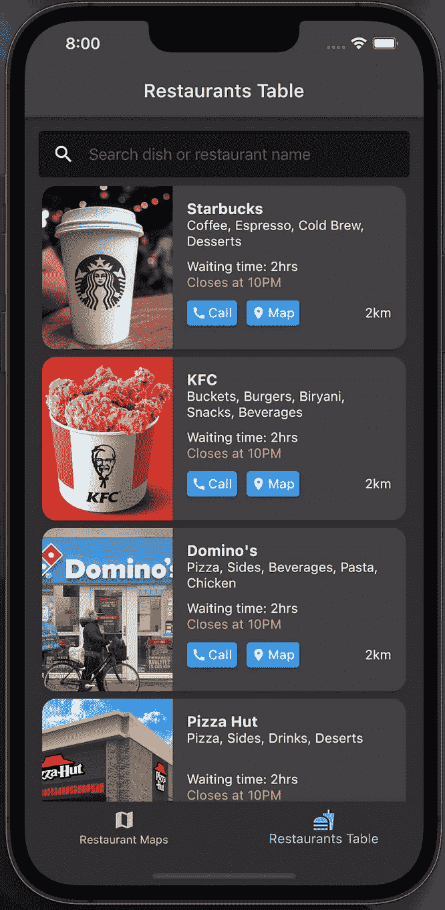
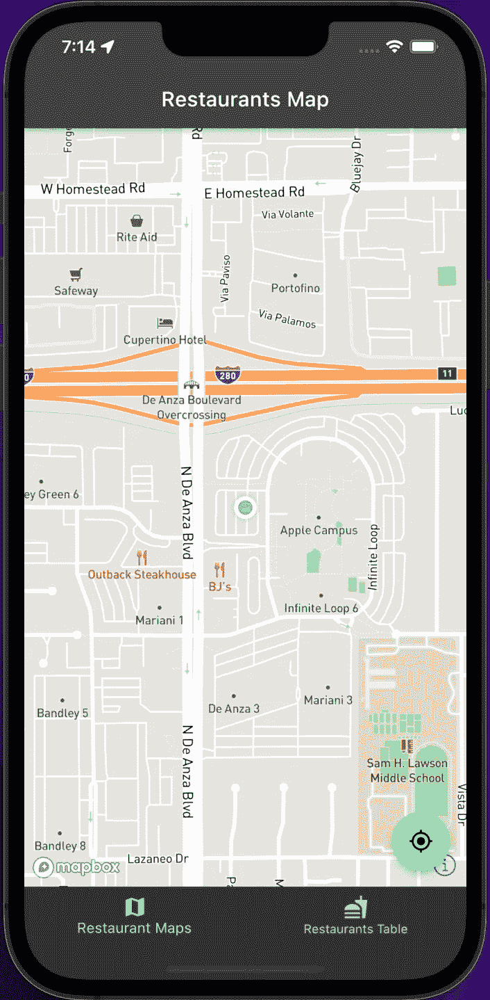
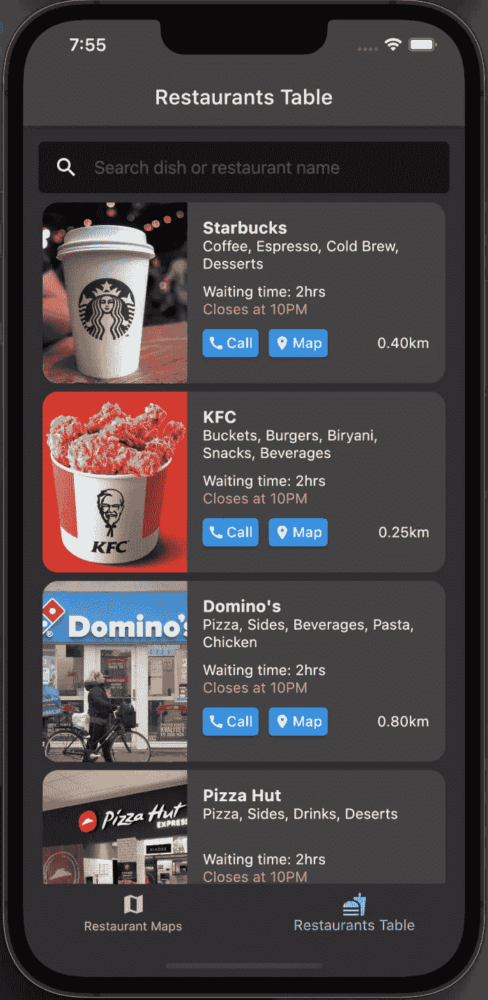
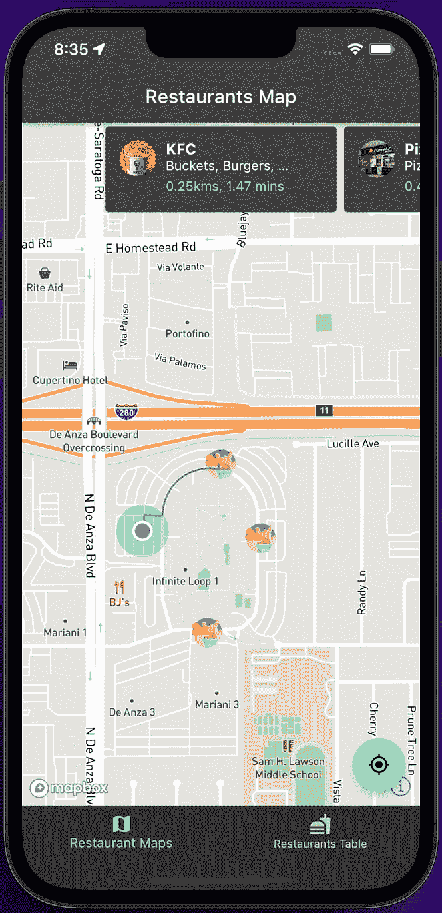
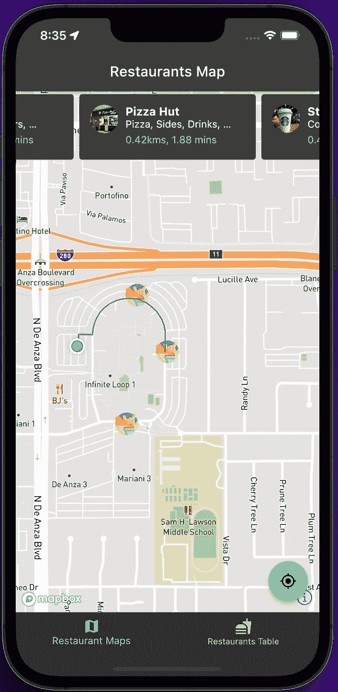
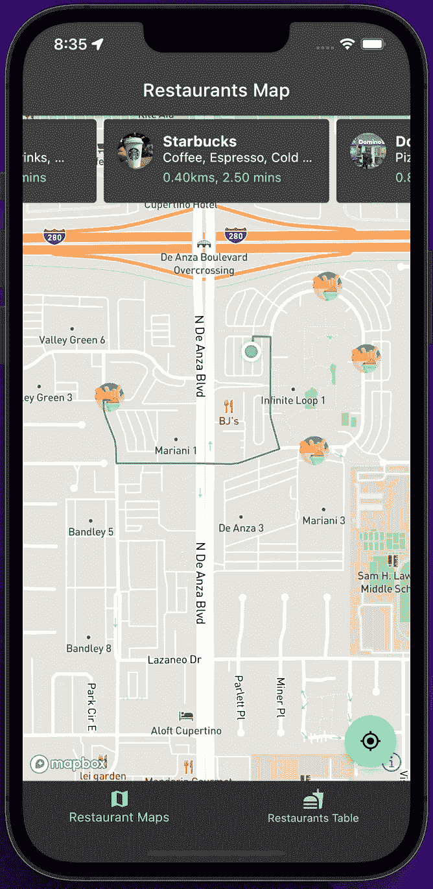

# 针对 Flutter 应用程序的地图框导航

> 原文：<https://medium.com/nerd-for-tech/navigation-with-mapbox-for-flutter-apps-313687778686?source=collection_archive---------0----------------------->

## Mapbox 是谷歌地图平台的强大替代品



说到构建优秀的应用程序，地图的重要性不容忽视。从物流和汽车到交通和政府，各种各样的行业每天都在使用位置、地图和导航来为他们的移动应用提供出色的用户体验。

*爱视频又觉得文章难读？我掩护你。😇观看下面的完整教程视频。*

首先想到的选择之一是谷歌地图平台。然而，假设你是一家刚刚进入市场的初创公司，一个希望在 App Store 上发布下一款优秀应用的开发者，或者一个为你的学校构建解决方案的学生社区。在这种情况下，谷歌地图对你来说可能有点太贵了，尤其是随着用户群的扩大。这就是像 Mapbox 这样的替代解决方案发挥作用的地方。

Mapbox 是一种高级而灵活的地图服务，可以轻松集成到您的移动和 web 应用程序中。它有一些奇妙的功能，如 Mapbox Studio、Vision、Atlas 和其他众所周知的 SDK。包括脸书、Snap Inc .和 Shopify 在内的许多公司都从其地图服务中受益。

在本文中，让我们看看 Mapbox 在 Flutter 应用程序中的实现，并演示其地图和导航 SDK 的用法。**我们将通过构建一个简单的项目来做到这一点，该项目包括一个骑自行车的饥饿的你和一组餐馆和咖啡馆！**是的，一如既往，请务必观看上面的视频，获取完整的教程。

# 项目描述

所以今天是你的幸运日，你发现自己在加州库比蒂诺的苹果公园，骑着自行车*。但是你像往常一样饿，你有*四家餐馆*，需要找到离你最近的*一家*。如果能额外知道*他们有多远*和*你需要多长时间*才能到达他们那里，以及到达那里的最佳路线，那就太好了。这就是你的问题在视觉上的样子。*



# 首先要做的是…

在深入研究 Mapbox 和实现上述项目之前，我们需要设置我们的 Flutter 应用程序。我为您准备了一个入门应用程序，您可以使用它来跟进。克隆存储库，在 VS Code 或 Android Studio 中打开文件夹[map box _ navigation _ starter](https://github.com/Imperial-lord/mapbox-flutter)，按照自述文件中的说明开始操作。

[](https://github.com/Imperial-lord/mapbox-flutter) [## GitHub-Imperial-Lord/mapbox-flutter:一个展示 map box 使用的库，它的地图和…

### 一个库演示了 Mapbox 的使用——它的地图和导航 SDK 在一个 Flutter 应用程序中——GitHub…

github.com](https://github.com/Imperial-lord/mapbox-flutter) 

总之，在开始之前，你必须添加一些令牌，并分别对 Android 和 IOS 进行一些初始设置。您可以在下面的文档中找到完整的说明，我也在视频教程中演示了这一点。

[](https://docs.mapbox.com/#maps) [## 证明文件

### 在 web 和移动应用程序中嵌入自定义地图。生成并托管矢量切片，以便在您的应用中使用。测试和…

docs.mapbox.com](https://docs.mapbox.com/#maps) 

# 理解现有代码

这是 starter 应用程序成功运行后的初始外观。



我们在`constants/restaurants.dart`文件中有 4 家餐厅的数据。每个餐馆都有一个 id、名称、商品、图像和坐标。其他数据(等待时间、关闭时间等。)都是虚设。请注意，2 公里对于所有的餐馆都是一样的，但是我们稍后会解决这个问题。让我带您快速浏览一下项目的`lib` 文件夹中的其他文件。

*   `helpers`文件夹包含 4 个帮助器函数，用于管理从 API 获取的数据，管理共享偏好数据，格式化或修改数据。
*   `requests`文件夹包含 1 个文件— `mapbox_requests.dart`，其中包含向地图框方向 API 发送请求的代码。当我们开始实现这个特性时，我们将会看到更多这样的内容。
*   `screens`包含我们在应用中看到的 3 个实际屏幕——一个用于家庭，一个用于地图，一个用于餐馆的表格视图。
*   `ui`包含 1 个文件— `splash.dart`，这是我们的闪屏。在它的`initState()`功能中也有一些至关重要的逻辑。
*   `widgets`包含 1 个文件— `carousel_card.dart`，稍后将用于在地图上创建一个旋转木马，然后在餐馆选项之间切换。

# 实现位置捕捉

在本节中，我们将首先捕获用户位置，然后将其显示在餐馆地图屏幕上。为此，我们将首先确保所有必需的权限都可用，然后捕获用户位置。然后，我们会将这些数据存储在共享首选项中。最后，我们将移除如何使用`Future.delayed()`进行导航。功能`void initializeLocationAndSave()`的内容如下:

现在位置被存储在`sharedPreferences`中，我们所要做的就是在`RestaurantMap`类中捕获它，并将数据显示给用户。为此，我们使用辅助函数`LatLng getLatLngFromSharedPrefs(){}`。

# 使用 Mapbox Maps SDK

现在我们可以在屏幕上显示地图，并在上面显示我们的位置。为此，我们必须声明两个变量——

```
late CameraPosition _initialCameraPosition;
late MapboxMapController controller;
```

然后我们可以在`initState()`函数中初始化`_initialCameraPosition`，并将其设置为当前用户位置。同样，控制器被设置为控制器内部返回的`_onMapCreated()`函数。

```
@override
void initState() {
  super.initState();
  _initialCameraPosition = CameraPosition(target: latLng, zoom: 15);
}_onMapCreated(MapboxMapController controller) async {
  this.controller = controller;
}
```

最后，我们修改 flutter 代码，使用`MapboxMap`小部件和 yaaay 在屏幕上显示地图！我们在屏幕上的地图上显示了用户的位置！



第二张图显示了地图上餐馆的准确距离。请阅读以下部分，了解我们是如何做到这一点的。

我们还在右下角添加了一个浮动操作按钮，它将用户重定向到当前位置，它有以下代码—

```
floatingActionButton: FloatingActionButton(
  onPressed: () {
    controller.animateCamera(
        CameraUpdate.newCameraPosition(_initialCameraPosition));
  },
  child: const Icon(Icons.my_location),
),
```

# 使用地图框方向 API

在这一节中，让我们看看 Direction API、它的响应以及我们如何在应用程序中使用它。我们可以在这里的地图框游戏中看到 API 的响应—

[](https://docs.mapbox.com/playground/directions/) [## 方向 API |游乐场

### 方向 API 使用四种不同的地图框路线配置文件生成路线指示…

docs.mapbox.com](https://docs.mapbox.com/playground/directions/) 

在回复中，有三件事对我们很重要。它们是代表坐标的`geometry`对象，用于线层、`distance`和`duration`。我们记下这些，并在`splash.dart`文件的`initState()`函数中添加以下几行。

```
// Get and store the directions API response in sharedPreferences
for (int i = 0; i < restaurants.length; i++) {
  Map modifiedResponse = await getDirectionsAPIResponse(currentLatLng, i);
  saveDirectionsAPIResponse(i, json.encode(modifiedResponse));
}
```

最后，作为检查，我们重新启动应用程序，删除硬编码的距离，并在`Restaurants Table`文件中显示从 API 获得的实际距离。

# 在地图上堆叠传送带滑块

由餐馆卡片组成的旋转滑块可以堆叠在地图的顶部。这个想法将显示一个特定的路线，每当一个特定的项目被突出。我们还会根据到达餐馆所需的时间对餐馆进行排序。

# 添加符号和线图层

现在，我们终于可以在地图上添加符号和线图层来表示路线了。为此，我们将在控制器对象上使用`addSymbol`和`addLineLayer`方法。此外，我们将确保删除以前的线层，使我们没有多个层。

在添加了这些代码后，我们的`restaurants_map.dart`文件最终看起来像这样

# 终于结束了！

最后，我们可以运行我们的应用程序，在热重启后，这里是我们可以看到的最终屏幕:



您也可以在 Android 模拟器上运行它，如果您将当前位置设置为稍微远离上面的位置，会看到不同的结果。这表明，如果你可以动态跟踪用户位置，而不是将他们添加到共享首选项中，应用程序将会工作得很好。

# 结论

这篇博客展示了如何轻松地将 Mapbox 集成到 Flutter 应用程序中，但这同样适用于任何类型的应用程序。我们还可以实现一个逐向导航来引导用户到一个地方，即使他们正在旅行，这将是一件有趣的事情。

如果你以前在 Flutter 或其他地方使用过 Mapbox，请告诉我你的体验与谷歌地图平台相比如何。如果博客中的任何一步让你困惑，评论区就是你的了！

Github 的知识库可以在这里找到(之前在博客中已经提到过，但是仍然！) —

[](https://github.com/Imperial-lord/mapbox-flutter) [## GitHub-Imperial-Lord/mapbox-flutter:一个展示 map box 使用的库——它的地图…

### 一个展示 Mapbox 使用的库——它的地图和导航 SDK 在一个 Flutter 应用程序中——GitHub…

github.com](https://github.com/Imperial-lord/mapbox-flutter) 

你也可以在 LinkedIn 上联系我

[](https://www.linkedin.com/in/ab-satyaprakash/) [## AB Satyaprakash -软件开发人员 LinkedIn

### 我是数学和计算机专业的毕业生，IIT·古瓦哈蒂。作为一名热情的程序员，我喜欢解决问题和…

www.linkedin.com](https://www.linkedin.com/in/ab-satyaprakash/) 

**一如既往，快乐黑客！！！😄**