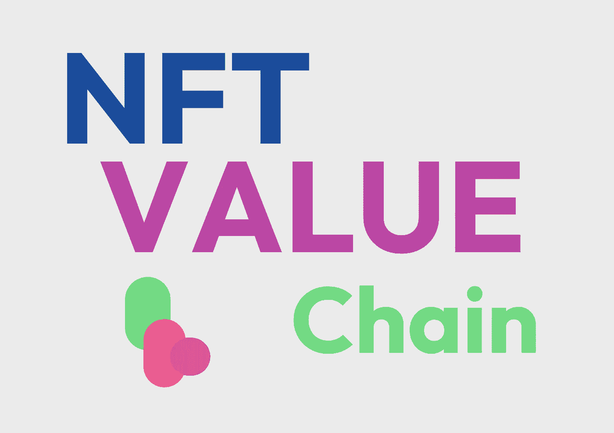
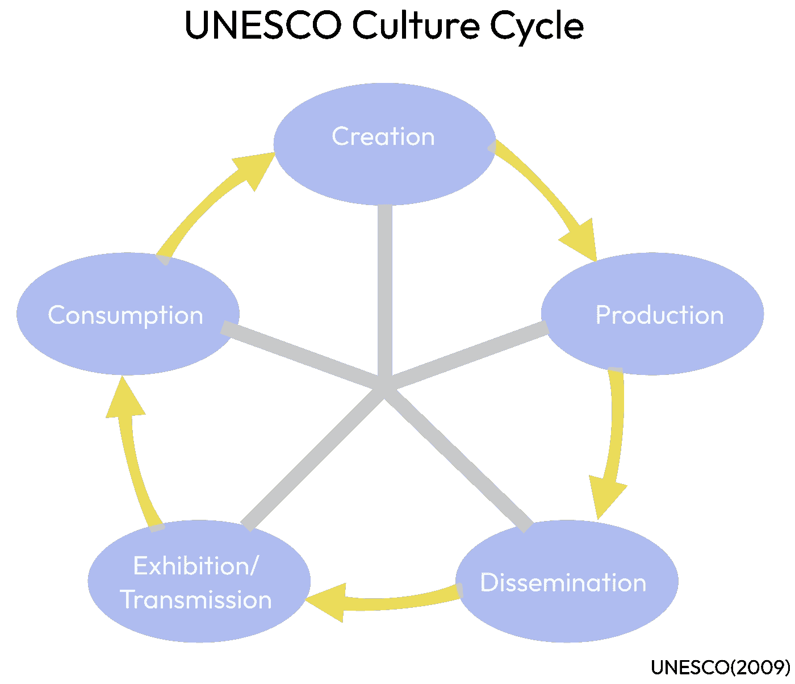
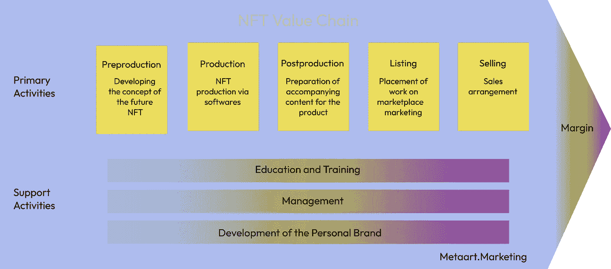

# NFT 价值链:提高 NFT 价格的最佳技巧

> 原文：<https://medium.com/nerd-for-tech/nft-value-chain-the-best-tips-how-to-increase-the-price-of-nft-ab91446e5034?source=collection_archive---------3----------------------->

## 正如我们从各种研究中所知道的，确定产品的创造活动对于发展战略分析和提高价格的方法是必要的。价值链允许通过检查个人或公司的活动来识别竞争优势的来源。此外，该方法还提供了有关每个行动成本的信息以及增加最终成本的可能方法。

在这篇文章中，我想概述一下 NFT 价值链的形成。我首先回顾价值链的基本概念，这在管理理论中是众所周知的。此外，我认为创意周期，因为 NFT 是文化产业的一部分。然后，我制定了 NFT 价值链的主要和支持活动。最后，我提出了利用 NFT 价值链对艺术家进行战略分析的一些想法。

# 价值链概念的历史

美国经济学家迈克尔·波特在 20 世纪 80 年代末提出了价值链的核心概念。根据波特的观点，价值链是向市场提供有价值产品的一系列活动。最初的价值链包含了创造和向市场交付产品的主要和支持活动。根据波特的说法，主要活动包括入境和出境物流、运营、营销和销售以及服务。支持的活动是不变的基础设施、人力资源管理、技术和采购。这种内容变得非常流行，直到今天，经理们还在广泛地暗示它。
价值链概念为不同产品和行业的价值链配置奠定了基础。例如，其他研究发展了价值商店和价值网络，发展了波特关于形成创造价值的活动链的思想。价值商店可以决定服务业活动的顺序。相比之下，价值网络有助于考察企业的类型，即主要目标是连接不同的方面。因此，价值网络也解释了 NFT 市场的价值创造，因为市场工作的主要目的是在他们的平台上连接艺术家和交易者。

# NFT 是什么类型的产品？

波特的价值链为生产行业发展了一系列的活动。首先，NFT 作为一种不可替代的符号，是一种产品。此外，NFT 是文化产业的一部分，它需要考虑创意产业中创意成果的特点。此外，NFT 结合了影响价值链其他特征的艺术和技术元素。

# NFT 价值是如何产生的？

联合国教科文组织创造了代表文化价值创造的文化周期。这一循环包括五个步骤，这五个步骤依次进行且相互关联。这样，它包括创造、生产、传播、展览和消费。

# 这些步骤通常与创造价值的 NFT 主要活动相关。

# 预生产

这个步骤最初的名字是“创建”。这一步意味着为内容准备想法的过程。按照更进一步的步骤如制作、后期制作，逻辑上更好叫前期制作。无论如何，第一步的概念保持不变。在这一步中，艺术家发现创意，设计制作计划，了解他们需要什么软件或其他工具。如果当前开发的作品与已经展示的系列相关，艺术家需要检查与之相关的想法。此外，作品创作的目标也可以在这里观察到，例如，如果有人认为 NFT 市场是他们项目的宣传工具。通过这种方式，这一步骤致力于在制作之前创建系列的概念、内容的形式和其他功能。

# 生产

这个阶段包括由一个艺术家或一群艺术家开发最终产品。由于 NFT 主要是一个数字产品，必须考虑软件和工作空间的需求。这一阶段发现内容生产的全过程，如创建草稿、准备、使用软件以及到成品的整个过程。

# 后期制作

最初，这一步被称为传播，但在 NFT，它更多的是在上市前需要完成的后期制作活动。这一阶段涉及到解释 NFT 的核心理念，从而创建 NFT 的名称，描述和其他必要的内容上市。

# 列表

文化周期中这一阶段的最初名称是展览。由于 NFT 不是一种纯粹的艺术形式，而是以在市场上销售为主要目的，所以称这个阶段为“上市”更为恰当，因为它是“制作”和“后期制作”之后的下一步。因此，这个阶段包括所有的“列表”任务。例如，它是对支付哪种类型的汽油、使用哪种市场等的理解。另外，每件艺术品的推广都属于这个阶段。

# 出售

在上市阶段之后，文化周期的最后一个阶段是消费，或 NFT 销售。销售管理至关重要。这一阶段对最终利润有重大影响。这项活动包括选择买家、安排交易以及向买家传达需求。

# NFT 价值链的支持活动

我们已经了解了 NFT 价值链的主要活动。于是就产生了支助活动的问题。辅助活动就足够了，其必要性不亚于主要活动。之所以称之为支持活动，只是因为它与物料的生产没有直接关系，但却是主要活动的基础。

# 教育和培训

NFT 需要高水平的多样化知识。它需要知道如何创建艺术品和有效地使用不同的软件。此外，它需要了解元宇宙的趋势，特别是与 NFT 上市和销售相关的知识。此外，艺术家需要学习很多营销知识来成功组织价值链，因为促销是销售的唯一工具。因此，教育是 NFT 价值链中影响最终利润的辅助活动。

# 管理

由于 NFT 执行者通常是自由职业者，项目经理必须发展到一个高水平。它对上市和促销效率的影响以及最终利润的影响。此外，糟糕的管理会导致低利润，即使其余的活动都经过检查和验证。

# 个人品牌的发展

个人品牌可以影响每件艺术品的最终价格，这已经不是什么新闻了，这条规则也适用于 NFT 市场。艺术家必须考虑这方面的时机，因为它可以有力地提高价格。

# 在 NFT 的战略分析和 NFT 竞争优势的识别中应该寻找什么？

由于这个 NFT 属于文化部门，很难讨论纯粹形式的竞争优势的寻求，因为在将艺术家推向市场之前，将创意从属于评估艺术家和最小化风险的营销理由是具有挑战性的。然而，与此同时，互联网让我们有机会不去关注某个有限目标的偏好，而是去寻找自己的偏好。因此，STP 模型在任何情况下都有助于了解目标受众以及如何与他们交谈。但这是在创建价值链之前需要做的事情。

**前期制作阶段**有助于确定你想做什么，以及它如何与你的目标受众的当前议程相关联。它可以提供最佳的竞争优势。

**后期制作阶段**是最重要也是最耗时的阶段之一。由于没有其他媒介来帮助定义或发展艺术作品的意义，这个任务就落在了艺术家自己身上。对想法和概念的详细描述，以及 NFT 中的其他相关信息，可以增加作品的价值。

此外，NFT 的正确名称至关重要。人们倾向于使用相同的词或关键字来搜索相似的东西。由于目前市场上没有用于 NFTs 的工具，这是在互联网的早期。如果你研究评估这个名字是否合适，会有所帮助。这会让你的目标受众很容易找到你。

在**列表阶段**，所有准备内容的工作已经完成。你要做的就是把那些数据贴出来，然后做推广营销。促销营销需要什么类型？只取决于你的目标受众。对一些人来说，脸书帖子可能是有效的(但我完全怀疑在 LinkedIn 和脸书上发帖的有效性)。对一些人来说，是抖音或 Instagram 上的视频。还有许多其他的方法来推广 NFT，稍后我会做一个详细的帖子。

此外，销售的有效性会受到市场的影响，因为不同的市场意味着不同的氛围、策略和目标群体。

最后的关键阶段是**销售**。尽最大努力完成出售 NFT 的交易也就足够了。

# 结论

在这篇文章中，我研究了 NFT 价值链，它是如何形成的，什么行为影响了 NFT 的价值，最重要的是，艺术家可以做些什么来提高效率，最后是销售价格。我们现在有了一个概念，确切地说是创造了什么价值，以及我们如何影响它。

我在这篇文章中使用了什么？

2.绘制创意价值链。数字时代的文化经济研究。最终报告。ISBN 978–92–79–66638–4 doi:10.2766/868748