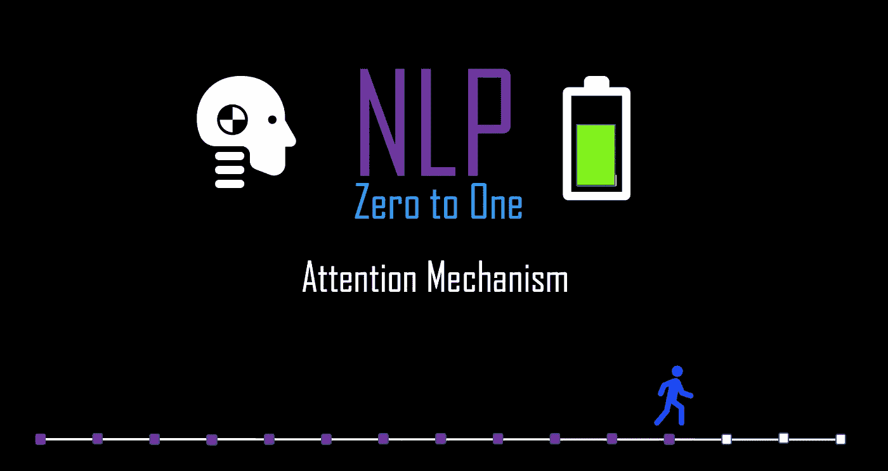
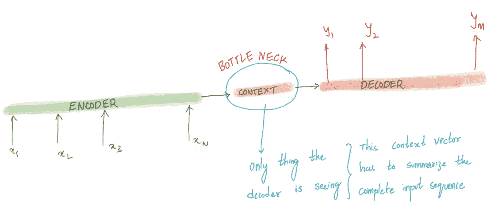
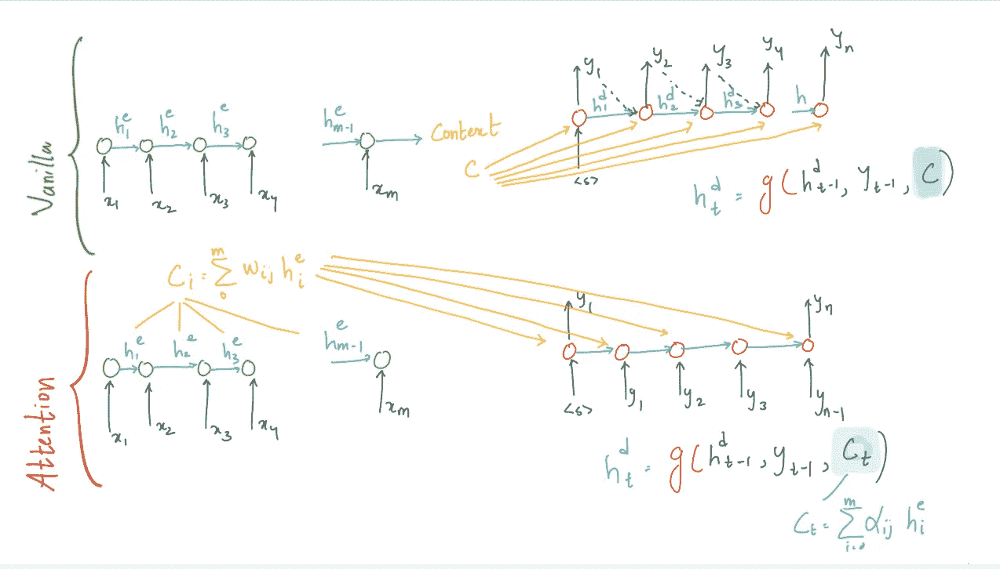
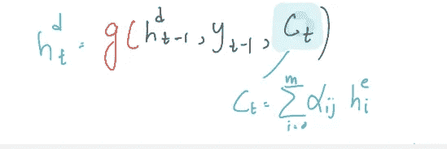
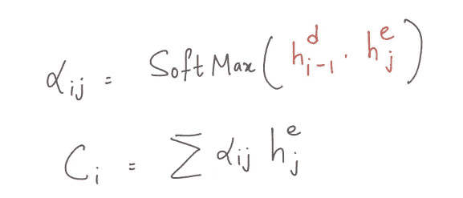

# NLP 零对一:注意机制(第 12/30 部分)

> 原文：<https://medium.com/nerd-for-tech/nlp-zero-to-one-attention-mechanism-part-12-30-c5c36670c81f?source=collection_archive---------17----------------------->

## 瓶颈问题，点产品关注

由作者生成

# 介绍..

基于 RNN 的编码器和解码器模型被证明是非常强大的神经架构，其为许多序列到序列预测问题，如机器翻译、问题回答模型和文本摘要，提供了实用的解决方案。模型中的编码器负责构建输入序列的上下文表示。解码器，它使用上下文来生成输出序列。在我们在上一篇博客中描述的 RNN 上下文中，上下文向量实质上是输入序列链中最后一个时间步“hn”的最后一个隐藏状态。这个最终隐藏状态/上下文向量必须绝对地表示关于输入序列的意义的一切，并且最终隐藏状态/上下文向量是解码器关于输入文本所知道的唯一事情。

瓶颈问题的图示，由作者生成

很明显，最后一个隐藏状态是某种瓶颈。随着输入的输入序列长度增加，在该上下文向量中编码整个信息变得不可行。注意机制以这样一种方式解决了这个瓶颈问题，即解码器不仅知道最终的隐藏状态，而且知道所有编码器时间步长的隐藏状态。在这篇博客中，我们将讨论注意力机制以及它如何解决瓶颈问题。

# 注意机制..

在普通编码器-解码器模型中，上下文是单个向量，该向量是编码器 RNN 的最后隐藏状态的函数。注意机制建议使用来自编码器网络的所有隐藏状态，因为每个隐藏状态携带可以在任何时间步长影响解码器输出的信息。注意机制是基于这样的概念，即我们不是使用最后一个隐藏状态，而是在输入序列的所有时间步使用隐藏状态，以便更好地模拟远距离关系。

为了实现这一点，注意力的思想是创建一个上下文向量“Ci ”,它是所有编码器隐藏状态的加权和。因此，上下文向量不再是静态的，在解码的每个时间步，我们将有不同的上下文向量。通过应用编码器所有隐藏状态的加权和，在每个解码步骤 I 重新生成上下文向量“ **Ci** ”。

说明香草和注意力编码器-解码器模型，由作者生成

## 注意力的权重

权重用于关注输入序列中与解码器当前产生的令牌相关的特定部分。

由作者生成的解码步骤 t 的隐藏状态计算

因此，在解码的每个时间步，我们计算上下文“ct ”,其可用于计算时间步 t 的解码隐藏状态。计算 ct 的第一步是计算每个编码器状态的权重/相关性。权重可以被视为在时间步长 t 计算解码器时每个编码器状态 hj 所具有的相关性分数

## 点积注意力

我们可以通过计算解码器隐藏状态和编码器隐藏状态之间的相似性来计算相关性或权重。

分数等式，由作者生成

这个点积的输出为我们提供了相似度，所有隐藏状态的这个分数将为我们提供每个编码器状态与解码器当前步骤的相关性。我们将不得不把分数归一化以得到权重。

动态上下文向量方程，由作者生成

现在，我们终于找到了一种计算动态上下文向量的方法，该方法在对输入序列进行编码时考虑了所有隐藏状态。点积注意有助于我们理解注意机制本身的本质。但是也可以创建更复杂的评分函数。我们将在接下来的章节中简要讨论它们

## 参数化注意力

通过参数化评分函数而不是使用简单的点积，我们可以得到更强大的评分函数。其中权重 Ws 是在训练过程中学习的。

# 注意:

**软与硬注意:**迄今为止讨论的技术是软注意机制，其中解码器选取编码器网络中所有隐藏状态的加权平均值。软注意和硬注意之间的唯一区别是，在硬注意中，它选择一种编码器状态。硬注意是不可微的，因此不能用于标准的反向传播方法。

由作者生成

上一篇: [**NLP 理论与代码:编码器-解码器模型(第 11/30 部分)**](https://kowshikchilamkurthy.medium.com/nlp-theory-and-code-encoder-decoder-models-part-11-30-e686bcb61dc7?source=your_stories_page-------------------------------------)

接下来: [**NLP 零比一:变形金刚(第 13/30 集)**](https://kowshikchilamkurthy.medium.com/nlp-zero-to-one-transformers-part-13-30-5cd5a3ddd93b?source=your_stories_page-------------------------------------)