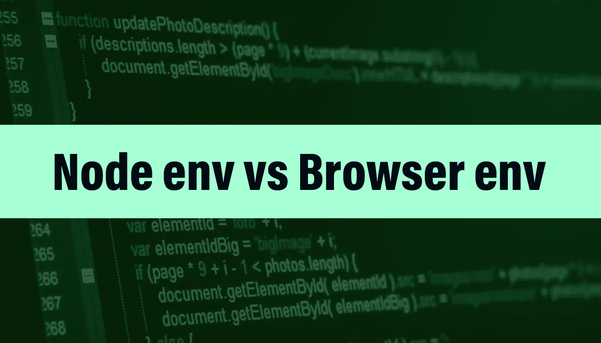

# NodeJS 环境与浏览器环境

> 原文：<https://medium.com/nerd-for-tech/nodejs-environment-vs-browser-environment-5c59c052f8cd?source=collection_archive---------29----------------------->

NodeJS 是 JavaScript 的运行时环境。

在 NodeJS 之前，只有浏览器可以执行 JavaScript。但是在 NodeJS 之后，我们可以在浏览器之外运行 JavaScript。但是这里的节点环境和浏览器环境差别不大。

在 NodeJS 中，我们没有窗口对象，因为大多数操作都与浏览器的窗口有关。但是浏览器环境有默认的窗口对象。Window 对象包含几个属性和方法来处理浏览器窗口上的不同操作。

NodeJS 有默认的“全局”对象。全局对象包含执行服务器端任务的几个函数和模块。这在浏览器环境中是不需要的。但是浏览器没有全局对象。因为浏览器端不需要全局对象中的一些操作。

在 NodeJS 中，您可以控制环境。但是在浏览器中，你没有权利选择你的浏览器的版本环境。这将取决于客户端浏览器的版本。

在节点中，我们可以使用最新版本的 ES-6–7–8–9，具体取决于您的节点版本。为了使用 JavaScript 的 ES6–7–8–9 特性，我们使用 transpiler 来转换 ES5 中的代码。因为有些浏览器没有实现 ES-6–7–8–9 的所有功能。

在 NodeJS 中，一切都是模块。这是 NodeJS 环境的核心部分之一。在 NodeJS 中，我们把所有东西都保存在一个模块中，而在客户端 JavaScript 中建模并不是强制性的。

节点是无头的，但浏览器不是无头的。

节点处理请求对象，浏览器处理响应对象。