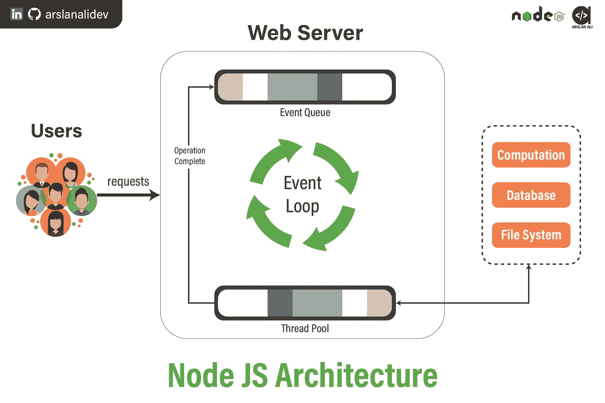
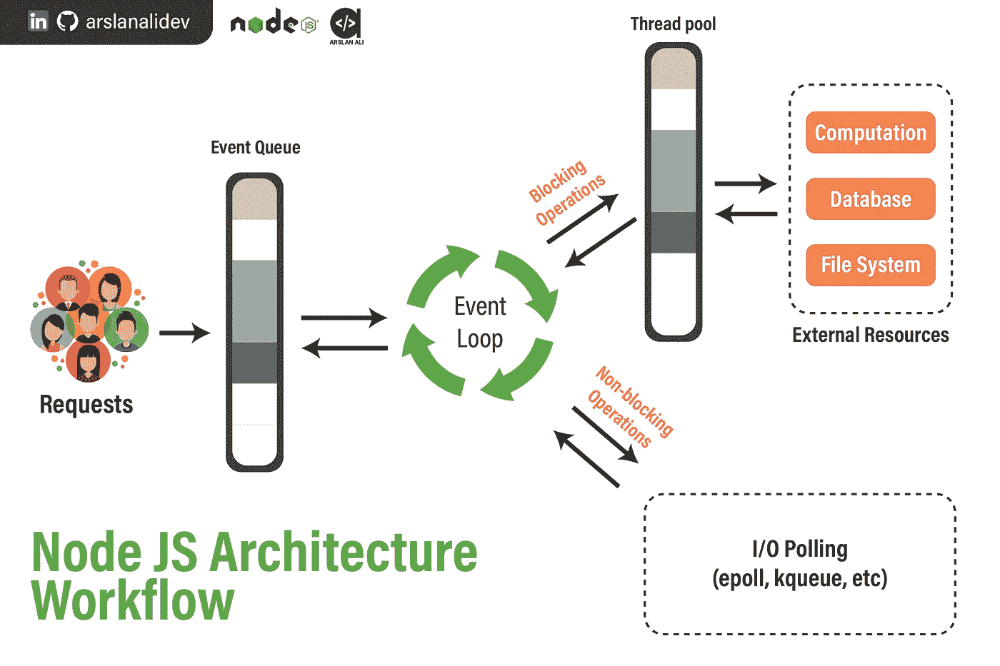

# NodeJS Web 服务器架构

> 原文：<https://medium.com/nerd-for-tech/nodejs-web-server-architecture-a21d02a33bad?source=collection_archive---------3----------------------->

节点是执行 JavaScript 代码的运行时环境。

等等…什么是运行时环境？因此，我们需要回到几年前的 JavaScript 来构建在浏览器中运行的应用程序。在每个浏览器中，都有一个 JavaScript 引擎，它获取 JavaScript 代码并将其转换为机器代码。比如微软 edge 用的是 Chakra，火狐用的是蜘蛛猴，chrome 用的是 V8。由于这些引擎，有时 javascript 代码在其他浏览器中的行为会有所不同。这里 browser 为我们提供了 javascript 代码的运行时环境。例如，我们有*document . getelementbyid(" # id ")*，我们可以在运行时使用 document 对象来执行不同的操作。这就是为什么在 2009 年之前，javascript 代码只能在浏览器中执行。

2009 年，谷歌的一名开发人员将 chrome 的 v8 引擎放入一个 c++程序中，称之为节点。与浏览器类似，Node 只是一个执行 javascript 代码的运行时环境。它包含与浏览器相同的 javascript 引擎，还包含一些环境对象。这些对象不同于浏览器对象，如节点中没有文档对象，相反，我们有不同的对象，如用于文件系统任务的“fs”，用于网络任务的“http”，等等。

# NodeJS 服务器架构:

NodeJS 使用“单线程事件循环”架构来处理多个并发客户端请求。当请求到达节点服务器时，它就像一个事件驱动的 javascript 处理模型，带有回调机制。NodeJs 服务器有不同的部分。

NodeJS Web 服务器架构

1.  **请求:**

请求来自客户端，用户希望服务器做出响应。这些动作可能是非阻塞的简单动作，也可能是阻塞的复杂任务。

**2。NodeJS 服务器:**

NodeJS 用于服务器端。它接收来自用户的客户机请求，处理这些请求，并响应特定的客户机或用户。

**3。事件队列:**

在 NodeJS 中，事件队列存储请求，并将它们一个接一个地传递到事件循环中。

**4。事件循环:**

事件循环从事件队列接收请求，处理请求，并将响应返回给特定的客户端。

**5。线程池:**

线程池由 NodeJS 服务器中的可用线程组成，这些线程将执行一些任务来完成客户端请求。

**6。外部资源:**

外部资源是那些需要在客户端请求中完成阻塞操作的资源。这些资源可以用于计算、数据存储等。

# NodeJS 架构的工作流程:

NodeJS web 服务器将接收来自客户端的请求，这些请求可能包含阻塞或非阻塞操作。服务器将检索这些请求，并将它们添加到事件队列中。

节点 JS Web 服务器架构工作流

在事件队列中，这些请求将被逐一处理并传递给事件循环。事件循环将检查请求是否包含任何阻塞操作或者它是一个简单的请求。

如果请求被阻塞，那么它将被传递到线程池，否则它将处理简单的请求，如 I/O 轮询，并将响应返回给客户端。

线程池中的单个线程被分配给单个复杂请求。该线程将负责通过使用诸如计算机、数据库、文件系统等外部资源来完成特定的阻塞操作。任务完成后，它会将响应传递给事件循环，然后事件循环会将响应发送给客户端。

**总结**:

NodeJS 是执行 JavaScript 程序的运行时，而不是浏览器。

NodeJS 由一些额外的全局对象组成，然后是 browser。

默认情况下，NodeJS 是异步的，可以处理成千上万的请求。这使得它更有效率。