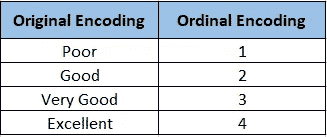

# 数据科学中的名词和序数编码！

> 原文：<https://medium.com/nerd-for-tech/nominal-and-ordinal-encoding-in-data-science-c93872601f16?source=collection_archive---------4----------------------->

在我们之前的博客中，我们谈到了**什么是编码？以及它在数据科学中的重要性！**

如果你没看过，请读出来。这里有一个[到之前博客](https://sagardhandare3.medium.com/what-is-encoding-and-its-importance-in-data-science-6a2b0cce8e8e)的链接。

在这篇博客中，我们将了解数据科学领域中的名义编码和序数编码。

当我们处理一些数据集时，我们发现一些特征是分类的。我们都知道机器无法理解分类数据。模型只能处理数值。为此，有必要将特征的分类值转换为数字值，以便机器可以从这些数据中学习并给出正确的模型。这个将分类数据转换成数字数据的过程被称为**编码**。

有两种最流行的编码类型，

1.  **名义编码**

当我们有一个特征，其中变量只是名字，并且这个变量的特征没有顺序或等级。

例如:人居住的城市，人的性别，婚姻状况，等等…

在上面的例子中，我们没有任何顺序或等级，或序列。各个特征中的所有变量都是相等的。我们不能给他们任何命令或军衔。那些特征被称为**名义特征**。

2.**序数编码**

当我们有一个特性，其中变量有一些**顺序/等级**。

例如:学生的表现、顾客的评价、人的教育等…

在上面的例子中，我们有顺序/等级/序列。我们可以根据学生的表现，根据顾客的反馈，根据学生的最高学历来划分等级。那些特征被称为**序数特征**。

**结论:**

处理分类数据时，编码是必需的预处理步骤。

请随时留下你的评论、建议或任何错误。😊

**帮我接通:**[**LinkedIn**](https://www.linkedin.com/in/sagar-dhandare-a401271a3/)**|**[**GitHub**](https://github.com/SagarDhandare)**|**[**邮箱**](mailto:%20sagardhandare3@gmail.com)

**快乐学习！！！❤🥀**