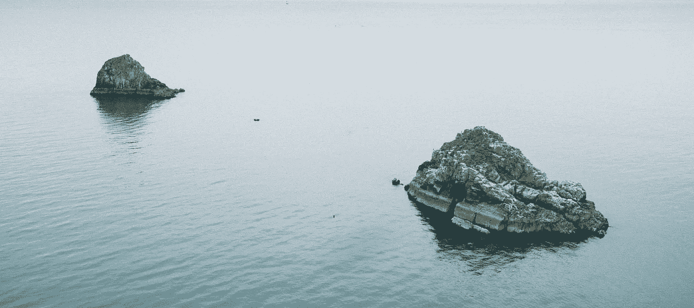
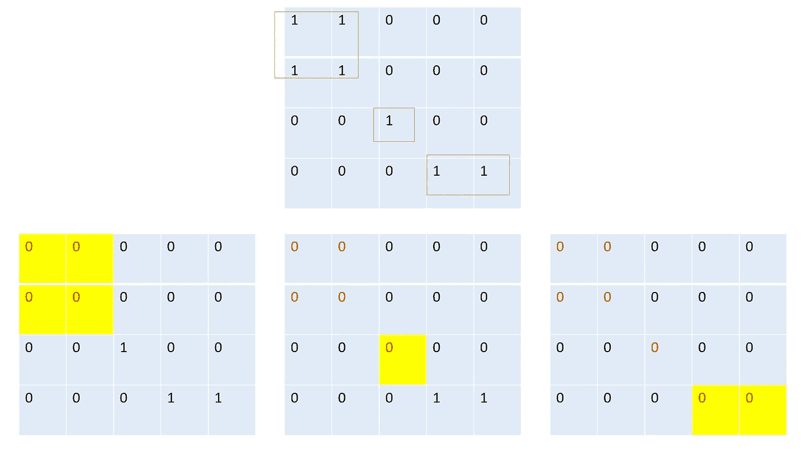

# 岛屿数量— BFS 和 DFS

> 原文：<https://medium.com/nerd-for-tech/number-of-island-bfs-dfs-e4888886dbb0?source=collection_archive---------13----------------------->

照片由 [Jonny Kennaugh](https://unsplash.com/@jonny_k?utm_source=unsplash&utm_medium=referral&utm_content=creditCopyText) 在 [Unsplash](https://unsplash.com/s/photos/islands?utm_source=unsplash&utm_medium=referral&utm_content=creditCopyText) 拍摄

在我的 [**上一篇博客**](/nerd-for-tech/dfs-bfs-introduction-26a65fca2344) 中，我讨论了 BFS & DFS。在这篇博客中，我们将通过解决一个 Leetcode 问题来看看这两者的作用。

## 问题:

给定一个代表`'1'` s(陆地)和`'0'` s(水域)的地图的`m x n` 2D 二进制网格`grid`，返回*岛屿的数量*。

**岛**被水环绕，由相邻的陆地水平或垂直连接而成。你可以假设网格的四个边缘都被水包围。

## **方法:**

我们遍历网格，每当我们看到 1，我们的结果就增加 1。使用该坐标或行列值，我们继续将每个连接的 1 标记为零。为此，我们要么使用 BFS，要么使用 DFS。因为我们可以从多个方向到达一个点，所以我们也跟踪访问过的节点，并且只处理它们一次。

## 使用 BFS 的解决方案:

> 运行时:**132 ms
> 内存使用量: **19.5 MB****

## 使用 DFS 的解决方案:

> 运行时:**128 ms
> 内存使用量: **19.3 MB****

希望对你有用。