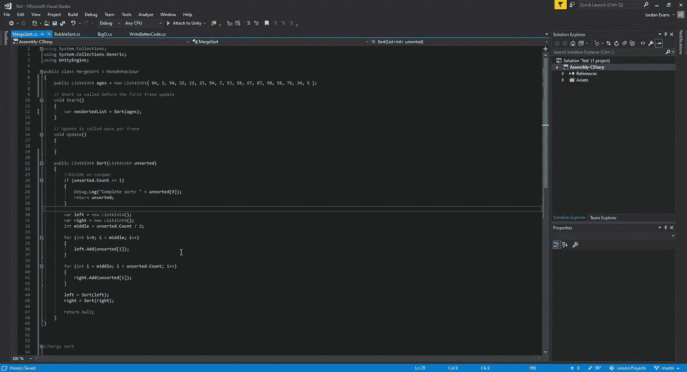
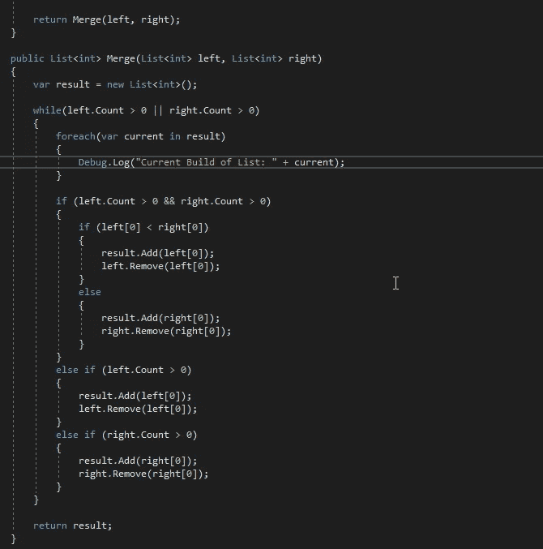
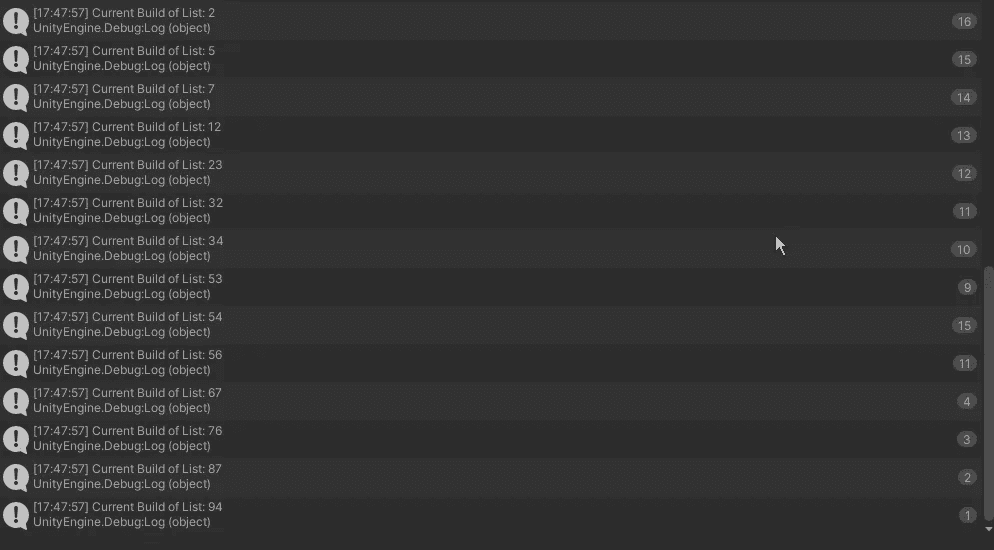
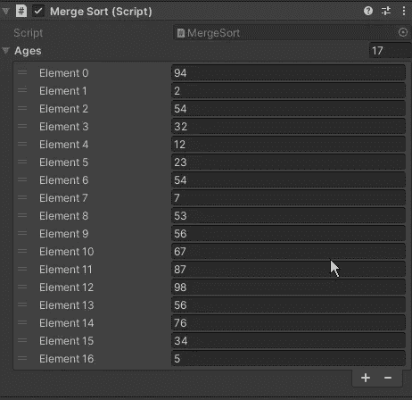
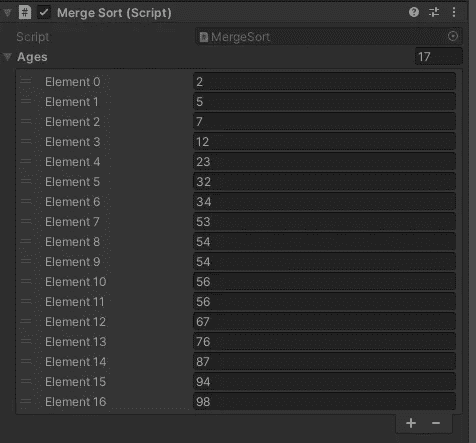
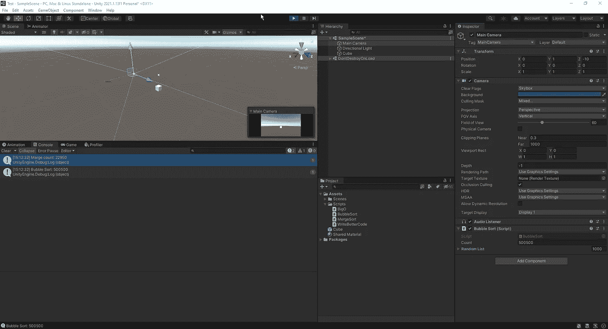

# o/N 对数 N 法

> 原文：<https://medium.com/nerd-for-tech/o-of-n-log-n-method-7963db98c185?source=collection_archive---------6----------------------->

现在我们已经看了 4 个大的 O 符号[这里](https://jevans4114.medium.com/understanding-big-o-69c02aa59bd2)，让我们花点时间看看 O(n log n)。这也称为合并排序。这里发生的事情是，我们将数组分成两半，然后按顺序将它们缝合在一起:

现在我们可以看到合并排序是如何完成的了，让我们开始尝试找出如何编码这个方法。首先，我们将使用上一个示例中使用的同一组数字，首先将所有数字转换为各自的值:

我们在这里做的是创建一个左列表和一个右列表。然后，这些列表将继续进行排序，直到每个列表中只剩下 1 个值。完成后，我们可以看到每个值是否都显示在我们的控制台上:

正如我们所看到的，个体价值正在显现。接下来，我们需要编写一个方法，让我们将这些值按数字顺序排序:

我们在这里所做的是告诉 unity，根据哪个数字小，我们想把它添加到我们的列表的末尾，并重复直到我们完成排序。为了让我们在控制台中查看流程，我们将在新 while 循环的开头运行 foreach 循环，以告诉我们循环在流程中的位置:

从控制台开始我们就可以看到，列表开始整理了。它将我们的值移动到下一个数字顺序，并移动到下一个数字:

在控制台的最后，我们可以看到我们的列表已经按数字排序，除了最后一个数字，因为一旦最后一个数字被正确放置，我们的循环就不会回到开头:

在我们的检查器中，我们可以看到从未排序列表到排序列表的变化。

现在让我们快速看一下 O(n log n)和 O(n)之间有多大的差别。为此，我们将创建一个包含 1000 个项目的随机列表，并计算对每个列表进行排序需要多少个过程:

在我们的两种分类中设置好这个之后，我们只需在每个流程循环中添加一些计数，让我们看看 2:

正如我们所看到的，只有 1000 个条目的列表，我们的冒泡搜索需要 50 万次计数，而合并排序方法只需要不到 23 万次计数。

我们找到了。我们建立了一个 O(n log n)来排序我们的列表。这个方法需要一点代码来构建，但是作为 O(n)的竞争对手，当处理需要排序的数千个不同的值时，它通常是一个更好的方法。否则，我们通常最好使用 O(n)方法。