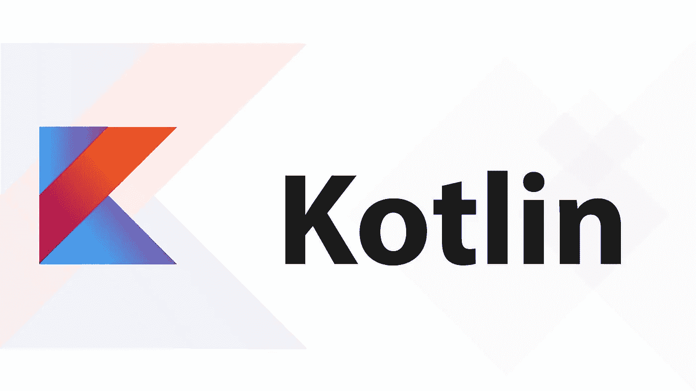

# Ktor/Kotlin 中的对象验证

> 原文：<https://medium.com/nerd-for-tech/object-validation-in-kotlin-c7e02b5dabc?source=collection_archive---------0----------------------->



# 介绍

作为我的系列[一个固执己见的 Kotlin 后端服务](/p/87f814e3dffd)的一部分，我检查了几个库来验证客户端请求。

我的要求是使用一个 Kotlin 库，有一个简洁流畅的 API，没有典型的 Java 冗长(因此这些都没有出现在我的列表中:【http://java-source.net/open-source/validation)。

我不想要的(【https://sebthom.github.io/oval】T4):

```
public class BusinessObject { @NotNull
   @NotEmpty
   @Length(max=32)
   private String name; @NotNull
   private String deliveryAddress; @NotNull
   private String invoiceAddress; @Assert(expr = "_value ==_this.deliveryAddress || _value == _            
           this.invoiceAddress", lang = "groovy")
   public String mailingAddress;}
```

更合我意( [https://joi.dev](https://joi.dev/) )，虽然它不是 DSL，但“只是”一个流畅的 API:

```
username: Joi.string()
             .alphanum()
             .min(3)
             .max(30)
             .required(),
email:    Joi.string()
             .email({ minDomainSegments: 2, tlds: { allow: ['com', 'net'] 
```

我想用一种语言来构建我的应用程序。正如 *mailingAddress* 示例所示，注释往往会模糊配置和代码之间的界限。配置文件(yaml、json、xml 等)也是如此。).真实配置文件(例如部署配置)是可以的，但是用于对象验证的配置文件呢？绝对不行。

无论如何，我检查了以下 5 个图书馆:

1.  [简易验证](https://github.com/wajahatkarim3/EasyValidation)
2.  [卡梅东](https://github.com/kamedon/Validation)
3.  [加碱](https://github.com/rcapraro/kalidation)
4.  [Valiktor](https://github.com/valiktor/valiktor)
5.  [Konform](https://github.com/konform-kt/konform)

# 坏事

前三个图书馆没有进入我的候选名单。

## 简易验证

*   329 个 Github 星，7 个守望者，63 个分叉
*   最后提交时间:2020 年 10 月 23 日

API 是流畅的，但是它没有 DSL:

总的来说，API 看起来过时了，而且它还依赖于一些 Android 特定的库。

## 卡梅东

*   19 个 Github 明星，2 个守望者，6 个分叉
*   上次提交时间:2018 年 10 月 8 日

不活跃，没有社区，死项目。

## 验证

*   43 颗 Github 星，7 个守望者，5 个叉子
*   最后提交时间:2020 年 9 月 11 日

验证 DSL 似乎非常灵活，也许太灵活了:

与 Valiktor 和 Konform 相比，似乎有更多的样板代码。再加上对这个库的兴趣相对较低，我决定先给另外两个库一个机会，只有在另外两个库中发现一些令人失望的东西时，我才会回到 Kvalidation。

# 好人

我的一个需求是能够以一种描述性的方式向客户端显示验证错误，这样就可以清楚哪个参数验证失败了。

创建错误消息的逻辑必须封装在验证代码中，以确保验证库的细节不会泄漏到应用程序的其他组件中(例如路由或错误处理模块)。为此，我希望验证库抛出一个带有错误消息的 *IllegalArgumentException* 。然后我会捕获这些异常，并把它们转换成 HTTP 400 响应(使用 Ktor 特性):

```
exception<IllegalArgumentException> **{** e **->** logger.error("Exception occurred: ${e.message}")
    val response = TextContent(e.message ?: "Bad Request",
        ContentType.Text.Plain.*withCharset*(Charsets.UTF_8),
        HttpStatusCode.BadRequest
    )
    *call*.respond(response)
**}**
```

## Valiktor

*   279 个 Github 星，10 个守望者，27 个分叉
*   上次提交时间:2020 年 10 月 11 日

图书馆马上升起了两个(次要的)红旗。
第一个事实是，尽管声称自己是 DSL，但示例是 DSL 和 Builder type / fluent api 的混合:

```
data class Employee(val id: Int, val name: String, val email: String) {
    init {
        validate(this) {
            validate(Employee::id).isPositive()
            validate(Employee::name).hasSize(min = 3, max = 80)
            validate(Employee::email).isNotBlank().isEmail()
        }
    }
}
```

第二个问题是验证不返回结果，而是抛出一个*ConstraintViolationException*，这对扁平的调用结构没有帮助。

在任何情况下，我仍然将一个简单的例子放在一起，作为真实应用程序的一部分来测试验证。使用一些扩展函数和 [runCatching](https://kotlinlang.org/api/latest/jvm/stdlib/kotlin/run-catching.html) ，我去掉了大部分样板代码:

实际的验证逻辑非常紧凑，包含可接受的样板代码:

```
init {
    *runCatching* **{** *validate*(this) **{** validate(Account::accountUUID).*matches*(*uuidRegex*)
            validate(Account::createdAt).*isNotNull*()
            validate(Account::modifiedAt).*isNotNull*()
            validate(Account::status).*isNotNull*()
        **}
    }**.*throwOnFailure*()
}
```

向客户端显示的错误是自我解释的，尽管对我来说有点冗长:

> account uuid:defaultconstraintviolationmessage(property = account uuid，value = 20836570-d4ef-420 e-b500–7b7f 6，constraint=matches(pattern=^[0–9a-fa-f]{8}-[0–9a-fa-f]{4}-[0–9a-fa-f]{4}-[0–9a-fa-f]{4}-[0–9a-fa-f]{12}$)，message =必须与^[0–9a-fa-f]{8}-[0–9a-fa-f]{4}-[0–9a-fa-f]{4}-[0–9a-fa-f]{4}-[0–9a-fa-f]{12}$匹配)

## Konform

*   300 个 Github 星，10 个守望者，16 个叉子
*   最后提交日期:2021 年 3 月 21 日

这里我们有一个“真正的”DSL:

```
val validateUser = Validation<UserProfile> {
    UserProfile::fullName {
        minLength(2)
        maxLength(100)
    }

    UserProfile::age ifPresent {
        minimum(0)
        maximum(150)
    }
}
```

与 Valiktor 的更长的*validate(Account::Account uuid)*相比，我喜欢非常短的 *Account::accountUUID* 。

使用扩展函数进行调用和错误处理，我们为 Account 对象获得以下代码:

实际的验证逻辑非常紧凑，样板代码甚至比 Valiktor 还要少:

```
init {
    Validation<Account> **{** Account::accountUUID **{** *pattern*(*uuidRegex*)
        **}** Account::createdAt *required* **{ }** Account::modifiedAt *required* **{ }** Account::status *required* **{ }
    }**.*validateAndThrowOnFailure*(this)
}
```

出现在客户面前的错误是自我解释的，并且非常简短:

> [验证错误(数据路径=。accountUUID，message =必须与预期模式匹配]]

# 裁决

1.  Konform(获胜者)
2.  Valiktor(亚军)
3.  验证(承诺)

我仅仅触及了这些库的表面，一旦我添加了更复杂的验证，肯定会有更多的内容要讲，但目前我将并行使用 Konform 和 Valiktor。

请随意评论并提供反馈。编码快乐！

# 附录 1

添加此库[https://github.com/michaelbull/kotlin-result](https://github.com/michaelbull/kotlin-result)Valiktor 的错误处理部分可更改为:

```
import com.github.michaelbull.result.Result
import com.github.michaelbull.result.onFailurefun <V> Result<V, Throwable>.throwOnFailure() {
    *onFailure* **{** val error = (component2() as ConstraintViolationException)
        throw IllegalArgumentException(error.*getMessage*())
    **}** }
```

runCatching 部分保持不变，只是多了一个导入:

```
import com.github.michaelbull.result.**runCatching* **{** *validate*(this) **{** validate(Account::accountUUID).*matches*(*uuidRegex*)
        validate(Account::status).*isNotNull*()
    **}
}**.*throwOnFailure*()
```

# 增编 2

在试验不同的 JSON 序列化器/反序列化器库时(参见[https://medium.com/p/feae3d06eadb](/p/feae3d06eadb))，我意识到在 *init { }* 中触发验证不起作用，因为例如 GSON 在不使用主构造函数的情况下构造对象(参见例如[why-kotlin-data-classes-can-have-nulls-in-non-nullable-fields-with-GSON](https://stackoverflow.com/questions/52837665/why-kotlin-data-classes-can-have-nulls-in-non-nullable-fields-with-gson)或[data-class-init-function-is-not-called-when-object-generated-from-GSON-in)因此，我必须通过将 *init {}* 转换成常规的 *validate()* 函数来改变验证的触发方式。大概是这样的:](https://stackoverflow.com/questions/54767493/data-class-init-function-is-not-called-when-object-generated-from-gson-in-kotlin)

```
data class Account(
    var accountUUID: String,
    var createdAt: Instant,
    var modified: Instant,
    var status: AccountStatus
) {
    fun validate(): Account {
       // do validation
```

在路由器中，我现在需要显式地调用 validate()函数，所以不用做:

```
val account = *call*.receive<Account>()
```

我愿意:

```
val account = *call*.receive<Account>().validate()
```