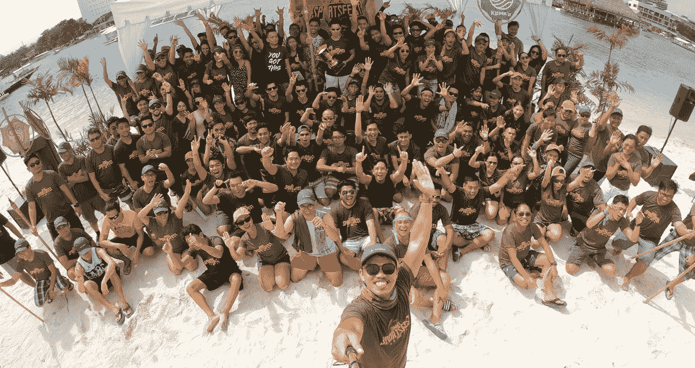

# 离岸软件团队:长期客户满意度的 9 个关键驱动因素

> 原文：<https://medium.com/nerd-for-tech/offshore-software-teams-9-key-drivers-of-long-term-customer-satisfaction-594febcccf8b?source=collection_archive---------7----------------------->

一个软件项目的成功通常基于它在软件开发的*铁三角*:**(按计划完成)、**(在分配的预算内)和**范围**(具有预期的特性和功能)中的表现。现在很容易认为当项目被外包给一个离岸软件团队时，客户满意的程度也将主要取决于团队在这些标准方面的成就…这部分是正确的。但是还有更多。****

****经验让我们认识到，长期的客户满意度通常源于与项目没有直接关系的因素。是的，围绕三角要素一起工作是至关重要的，但是你如何达到这一点以及你如何处理合作关系对于成功的结果同样重要。****

****在本文中，我们讨论了 Arcanys 认为在离岸团队服务提供商和客户公司关系中提高客户满意度的关键驱动因素。作为一家公司，这些指导原则使我们能够保持合作关系，多年来，作为菲律宾值得信赖的外包软件开发服务提供商，为各行业的客户提供了宝贵的帮助。****

# ****驱动因素 1:要有选择性。****

****我们一直引以为豪的一件事是，我们在选择合适的合作公司和项目方面投入了大量精力。这似乎不是一件很难做到的事情，但是当你想尽快获得业务时，坚持我们的直觉和我们早期设定的标准可能不是最明智的决定。至少乍一看，与任何一家有一点钱的公司合作可能会更容易，更有诱惑力，但我们知道这可能会是一个代价高昂的错误。****

****作为一名企业主，我坚信，我们能为自己和客户做的最大贡献之一，就是毫无歉意地坦诚与谁合作最好，以及我们最适合与谁合作。看，有数百种可能的方式来设想软件开发外包合作伙伴关系。就像 Arcanys 不可能与所有寻求外包软件开发的公司完美匹配一样，也不是每一家我们谈过的公司都符合我们的期望。这是因为我们重视只与价值观与我们一致的企业合作。****

****然而，有选择性并不意味着我们高傲自大。相反，它实际上是完全相反的:我们确保将我们的客户与对他们的业务、他们的软件项目和所涉及的技术感到兴奋的开发人员相匹配。我们指派我们知道会与客户配合得很好的团队。因为这是一个简单的现实:与具有不同文化、质量标准或愿望的组织合作对每个人来说都是一次痛苦的经历，包括客户公司。我们正在做的事情——在选择客户之前进行尽职调查——可能不会迅速扩大我们的客户名单，但它会让我们满意，成为回头客。****

*****底线:了解你对优秀客户的标准。*****

# ****驱动因素 2:了解客户的业务、长期目标、痛点、挑战和用户。****

****了解客户不仅仅是了解他们的价值观和组织愿景。满足甚至超越他们对您作为值得信赖的合作伙伴的期望的方法是了解他们企业的整体——他们的业务生命周期、市场、优势、困境，甚至日常运营风格。只有这样，您才能推荐最能满足他们的应用程序开发需求的合适的软件工程设置和服务。****

****我们确保执行和管理团队对客户也有坚实和高层次的业务理解，能够将他们的需求转化为可操作的见解。这一点很重要，因为我们知道客户指望我们为重要决策提供相关建议，比如最合适的外包团队设置。例如，客户需要项目经理(PM)，业务分析师(BA)，还是两者都需要？开发人员需要什么程度的资历？多少个 QA 就够了？我们的按需 CTO 应该介入吗？我们甚至可以为他们的软件产品提出建议。****

****如果不能很好地理解客户的长期业务目标、棘手问题、挑战和技术需求，服务提供商提供的任何见解都可能基于不准确的信息，从而导致误解和/或不明智的决策。因此，我们的目标是不遗余力地了解我们的客户，以便我们能够推荐最适合的技术和团队结构。****

*****底线:了解你客户的业务和挑战，以满足他们的需求。*****

# ****司机 3:告诉你的顾客他们不想听的话。****

****我们从不把自己的担忧藏在心里。这样做只会让失望以这样或那样的方式恶化，并在以后以令人不快的方式出现。例如，由于未表达的沮丧和未解决的问题，可能会有项目延迟或工作关系受损。正如在任何健康的关系中一样，我们认识到沟通和透明是良好商业伙伴关系的支柱。正如我们期望我们的客户告诉我们关于他们外包软件团队表现的真相(全部真相，仅此而已)，我们也将诚实的反馈作为一种荣誉——无论是关于不完整或薄弱的规格、糟糕的沟通、工作量和日常操作的不一致、糟糕的项目管理，还是不相关的技术选择，等等。****

****我相信，我们所培养的坦诚的文化已经为 Arcanys 成为菲律宾最值得信赖的软件开发外包合作伙伴做出了巨大的贡献。如果你不相信频繁、有益的反馈的重要性，就看看这些[研究](https://www.nytimes.com/2016/02/28/magazine/what-google-learned-from-its-quest-to-build-the-perfect-team.html?mcubz=1&_r=0)。研究表明，反馈的传递方式强烈影响团队的生产力、动机和创新能力。伯克希尔·哈撒韦公司(Berkshire Hathaway)副董事长查理·芒格(Charlie Munger)说得比任何人都好:“基于你已经知道的东西，你不会在生活中走得很远。”****

****持续的学习是必须的，只有当你从别人那里得到直接的反馈时才能做到。现在我在这里谈论诚实和直接的反馈。我们避免向团队和客户交付简单的“狗屎三明治”，也就是说，将负面反馈夹在两片赞扬之间。它们听起来像是简单事实的诱人替代方案，但这些只会让事情变得更糟。Arcanys 所信奉的[激进透明](https://onlinemba.wsu.edu/blog/what-is-radical-transparency/)的概念倡导工作场所的开放文化——它已经在许多组织中显示出有希望的结果。因此，即使客户当时不想听，我们也会直截了当地告诉他们，尽管是以一种建设性的方式，并希望他们也这样对待我们。****

*****底线:不要等到问题出现后才收集(和传递)反馈。*****

# ****驱动因素 4:学习如何将他们的反馈转化为行动/增长。****

****众所周知，软件开发可以从接收输入和能够建设性地处理这些反馈中受益匪浅。但是，如何以最高效、最及时的方式做到这一点呢？在 Arcanys，我们发现一种方法是不断地从以前实施了全功能解决方案的客户和目前正在与软件的一些工作功能进行交互的客户/用户那里征求反馈。****

****我们也为[使用关键软件开发性能度量标准](http://admin.arcanys.com/blog/performance-in-the-software-industry-principles-of-measurement-and-how-to-optimize-your-business)测量性能设定了标准。该过程迫使开发团队定期收集反馈，并以更小、更频繁的周期测试软件。例如，团队可能会选择在特定的时间内增加部署的数量，这样他们就可以很快看到软件的工作情况，然后在需要的地方进行小的、增量的更改。****

****这种敏捷方法让客户有机会在特定的 sprint 期间发送关于已完成工作的即时反馈，并让开发团队在合理的时间内采取行动。持续的部署和反馈周期允许双方实现更小、更可行的目标，即使我们努力在更长的时间内完成整个项目。****

*****底线:在进行过程中收集反馈，并利用它来不断提高你的产出。*****

# ****驱动因素 5:优先考虑员工满意度。****

****确保客户满意不仅仅是让他们(客户)开心；这也是为了让你的团队开心。让客户满意没有捷径可走，只有当从事他们项目的软件团队有动力看到项目完成时，客户满意才能实现。IT 行业的人才稀缺是非常真实的，我们知道任何公司最不需要的就是让你的员工简单地离开。****

********

****需要做的是让员工觉得自己的技能得到认可，自己在组织中的存在受到重视。通过实施开放政策赋予他们权力，让他们可以自由说出自己的想法。鼓励团队成员主动解决问题，让他们在这个过程中获得更多自信。发展一种公司文化，在这种文化中，每个人都有相同的价值观，这在与客户打交道时得到了一致的体现。创建一个丰富的训练场，开发者可以在那里学习和提高他们的技能。****

****这些是我们在 Arcanys 努力坚持的原则和工作环境。我们对员工的工作方式、我们提供的额外津贴以及我们如何维持一个激励员工留下来而不去别处寻找其他机会的工作环境保持透明和放心。我们尽一切努力建立客户引以为豪的定制团队，同时确保我们的开发人员能够从事激动人心和富有挑战性的项目。****

****底线:照顾好你的员工，这样他们才能照顾好你的客户。****

# ****驱动因素 6:发展强大、有弹性的工程文化****

****我们学到的另一件重要的事情是尽可能远离官僚主义。这是一个杀手，尤其是在初创企业。它通常用于确保每个人都有一个明确的角色(并坚持下去)，但过一段时间后，一些人会想要更多的控制，更多的权力，并开始害怕变化。这时他们将开始创建大部分无用的流程，这将导致更少的灵活性、更多的懒散以及生产力和积极性的下降。****

****我们已经尽了很大努力来避免这些官僚主义的陷阱。我们意识到，你需要有一个强大的对抗官僚主义的力量，通常是一个允许实验、冒险和在失败时分担责任和问责的领导人。正确的领导会坚定地指导，同时授权给一个有弹性、敏捷的团队，让他们在力所能及的地方做出贡献，并根据他们拥有的所有数据和知识做出明智的决策(所以给他们所有他们需要的信息)。不必要的管理层只会把人们隔离开来，把信息储存起来。****

****我们努力保持强大的 DevOps 文化，在这种文化中，自动化——测试、集成、部署——是一切的中心。当你不准备在交付范围上妥协时，避开不可行的最后期限也是至关重要的。这迫使团队交付低质量、低效且极其昂贵的软件。相反，我们正在实践的是使用基于结果(客户满意度、成功部署)而不是输出(代码行、故事、时间或基于点的估计)的现代度量来适当地评估团队绩效。****

*****底线:通过关注行动而不是过程来完成事情。*****

# ****驱动因素 7:永远不要盲目地执行软件开发。鼓励每个人都充当顾问，而不仅仅是编码机器。****

****给开发团队一个出发信号，让他们在最少的指导下开始编码，而没有对整个项目的整体看法，这是一个公司可能犯的最大的错误之一。当组织将他们的 IT 项目的一部分外包给离岸软件团队，然后[让他们对项目的关键方面一无所知](http://admin.arcanys.com/blog/4-things-your-software-development-team-wish-you-knew)时，情况尤其如此。****

****这不仅限制了团队成员的知识，从而限制了他们在项目中最佳工作的能力，还降低了他们的士气和动力。客户和供应商都应该记住，外包是一种伙伴关系，需要双方的信任、透明和参与。我们经常提醒客户合作伙伴，一个成功的项目结果取决于所有团队成员的努力(不管哪一方)，所以让每个人从相同级别的信息开始是最有意义的。****

****对于一个客户公司来说，将软件开发需求外包的好处是，你不只是花钱雇佣一个 4 或 5 人的开发团队；您还可以获得每个人的编程专业知识和解决问题的技能。Arcanys 的合作伙伴知道，通过将他们的离岸团队不仅仅视为开发人员，还视为顾问，他们不仅仅掌握编程语言，他们[获得了最大的资金价值](http://admin.arcanys.com/blog/software-development-outsourcing-value-for-money)。****

*****底线:给你的团队正确的指导和信息，这样他们就能以最好的方式实现你的愿景。*****

# ****驱动因素 8:保持对代码质量和安全性的清晰关注。****

****区分代码质量的优先级为代码安全奠定了基础，并影响了整个软件质量。因此，软件开发公司或团队的核心优势是其生产高质量代码的能力——而 Arcanys 的目标正是如此。一切从我们的招聘流程开始。这是[当我们给出相对具有挑战性的技术考试](https://www.youtube.com/watch?v=Jm9b98GinRc)来恰当地评估开发人员的技术熟练程度、解决问题的方法和人际交往技能，向我们保证我们为给定的项目找到了最好的人才。****

****然后，对于我们参与的每个客户项目，我们通过遵循[干净代码最佳实践](http://admin.arcanys.com/blog/the-importance-of-clean-code)来确保我们的代码总是高质量的。我们也相信[写代码时，两个人的眼睛总比一个人的好](http://admin.arcanys.com/blog/code-review-what-is-it-and-why-its-critical-for-developers)，因此我们确保[我们交付的每一位代码都经过了正确的检查](http://admin.arcanys.com/blog/8-golden-principles-when-writing-code)。经历这些过程有助于确保编写的代码具有可靠性、可测试性和可重用性——高质量代码的所有属性。****

****我们也认识到用最好的工具武装自己的价值。团队中的开发人员应该掌握几种编程语言，这是他们参与的每个项目的基础。软件框架的知识，以及其他代码质量工具，如代码格式化程序和调试器，对于团队来说也是必须的。****

*****底线:关注代码质量，并持续改进。*****

# ****司机 9:让他们看看你到底是谁。建立人际关系。****

****扩展软件开发团队对任何公司来说都是一项巨大的投资，共同建立的关系的质量将决定合作关系的稳固性。正如我们了解客户很重要一样，让他们了解我们是谁、我们公司的立场以及我们的日常工作场所文化也很重要。建立这些联系不仅巩固了我们与他们的伙伴关系，也为未来与其他志同道合的组织合作打开了大门。****

****那么，我们如何在阿卡尼斯做事呢？****

*   ****我们的联合创始人 Alan Debonneville 和 Frederic Joye 每年都会尽可能拜访客户一次。这些旅行主要是去澳大利亚、瑞士和瑞典，我们的许多客户都在那里。客户有时也会选择拜访他们在宿务的团队，这样他们可以更好地了解彼此(尽管他们已经通过游戏和在线活动远程工作时进行了互动)。****
*   ****Arcanys 的联合创始人都得到了一份每周报告，让他们对每一位顾客进行把脉检查。这使他们能够了解每个客户的开发进度、新的需求和要求，和/或可能的障碍，如果有必要，让他们直接联系我们的合作伙伴客户。****
*   ****我们的首席执行官 Alan 和首席技术官 Eric 根据合作伙伴的需求，定期与他们进行沟通。电子邮件有利于日常交流，但我们更喜欢偶尔与他们进行“面对面”的视频通话。我们利用这些机会，通过询问有关他们的团队、项目、业务进展以及我们如何提供帮助的问题，来发现尚未解决的需求。这是我们的客户敞开心扉谈论他们当前面临的挑战的时候，这给了我们一个提供即时解决方案的机会。****

****底线:通过让客户了解你来建立联系。****

****在 Arcanys，我们相信透明、真实的业务关系。毕竟客户是合作伙伴。正如他们所说，一个巴掌拍不响。****

****[*离岸软件团队:长期客户满意度的 9 个关键驱动因素*](https://arcanys.com/blog/9-key-drivers-of-long-term-customer-satisfaction) *最初发表于 2021 年 11 月 10 日的* [*Arcanys 博客*](https://www.arcanys.com/blog) *，作者*[*Frederic Joye*](https://www.arcanys.com/blog/author/frederic-joye)*。*****