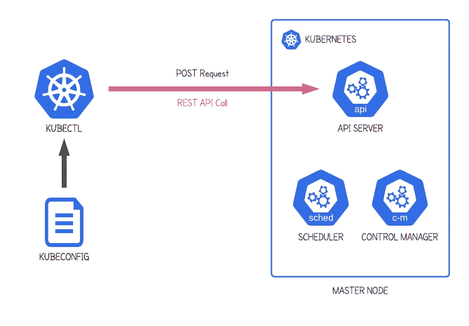
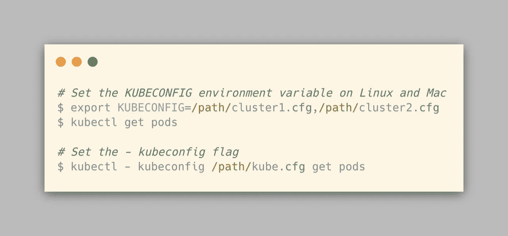
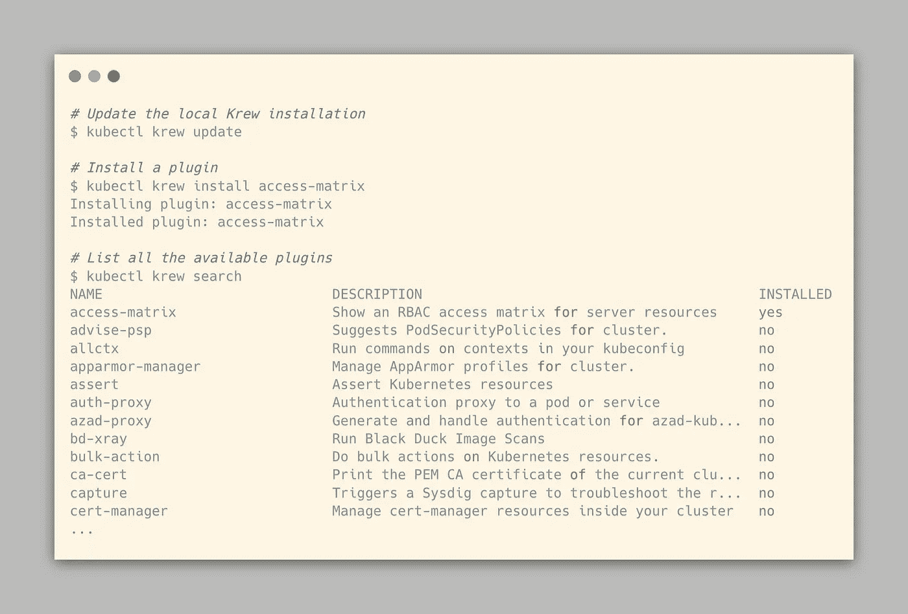
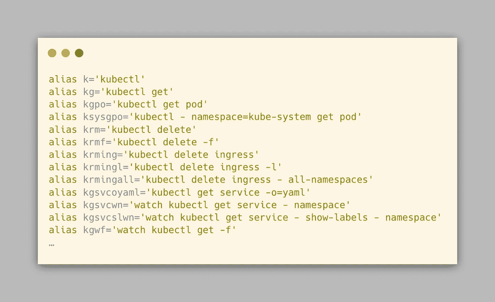
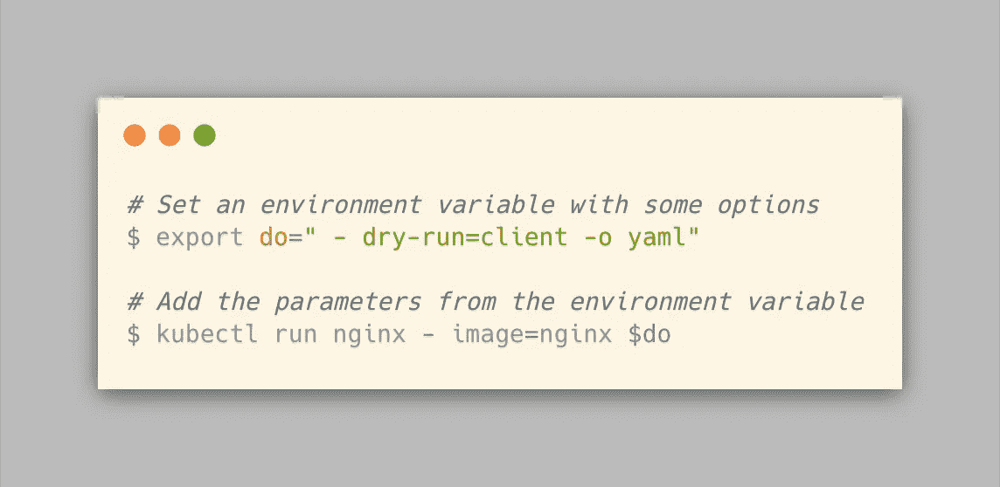

# 一个 CKA/CKAD/CKS 的要求:掌握 Kubectl

> 原文：<https://medium.com/nerd-for-tech/one-cka-ckad-cks-requirement-mastering-kubectl-85486bc0a3aa?source=collection_archive---------2----------------------->

在 [Unsplash](https://unsplash.com/?utm_source=unsplash&utm_medium=referral&utm_content=creditCopyText) 上由 [Ibrahim Boran](https://unsplash.com/@ibrahimboran?utm_source=unsplash&utm_medium=referral&utm_content=creditCopyText) 拍摄的照片

今天，Kubernetes 是用于管理和扩展容器化基础设施的最流行的容器编排工具。

作为一名 SRE、DevOps、系统管理员、开发人员或无论你的职位名称是什么，如果你必须管理、操作或只是阅读 Kubernetes 资源，你可能需要了解一些基本原则，如 Kubectl 命令行。

本文的目的是分享一些掌握 Kubectl 命令行工具的指南。在通过 Kubernetes(开发人员、管理员和安全人员)认证的学习过程中，掌握 Kubectl 非常重要，因为认证依赖于 Kubectl 命令，所以本指南中提供的一些技巧可以在认证过程中为您提供帮助。

# 什么是 Kubectl？

和每个集群管理工具一样，Kubernetes 附带了一个缺省的命令行工具来管理资源:Kubectl for Kube Control。

Kubectl 是创建、更新、读取和删除(CRUD)每个 Kubernetes 资源的默认入口点。基本上，它允许您执行所有可能的 Kubernetes 操作。

Kubectl 是一个命令行工具，几乎可以安装在任何地方(Linux、Mac OS、Windows 等),与 Kubernetes 集群的唯一入口点 API 服务器进行交互。

Kubernetes 基于一个 HTTP REST API。这意味着每个 Kubernetes 操作都被公开为一个 API 端点，并且可以通过对这个端点的 HTTP 请求来执行。Kubectl 的职责是创建和格式化发送到 Kubernetes API 服务器的 POST 请求。

在[安装了 Kubectl](https://kubernetes.io/docs/tasks/tools/) 之后要做的第一件事是配置[自动完成功能](https://kubernetes.io/docs/reference/kubectl/cheatsheet/)以更容易的方式与 Kubernetes 资源交互。自动完成将允许您轻松地找到一个动作、一个资源名称、一个名称空间名称等，使您的命令行(CLI)操作更有效率。Kubectl 可以为期望的环境自动生成自动完成脚本:

一旦安装了 Kubectl 并配置了自动完成功能，下一步就是获取一个 Kubeconfig 文件来访问远程 Kubernetes 集群。

# 什么是 Kubeconfig 文件？

Kubernetes 集群需要身份验证来操作资源。身份验证过程需要一个正在运行的 Kubernetes API 服务器来进行身份验证，还需要一个包含一系列信息的配置文件来连接到远程集群。为了在多个集群和/或多个用户之间轻松切换，定义了一个 Kubeconfig 文件。

该文件可以包含一系列结合到集群连接信息的身份验证机制。这种结合引入了一个新的概念，叫做 Kubernetes context。上下文将访问参数分组到一个方便的名称下，以便通过 Kubectl 轻松访问远程 Kubernetes 集群。

默认情况下，Kubectl 在当前用户的主目录中查找名为 config 的文件(例如$HOME/。kube)但是可以通过设置 KUBECONFIG 环境变量或者通过在 Kubectl 命令行中设置— kubeconfig 标志来覆盖该设置。得益于上下文概念，在标志的反面，KUBECONFIG 环境变量可以保存一个 Kubeconfig 文件列表(在 Linux/Mac 上用冒号分隔，在 Windows 上用分号分隔)，以便于访问多个集群。

# 如何扩展 Kubectl 功能？

Kubectl 就像 Kubernetes 一样，模块化，可扩展。Kubectl 几乎可以完成操作员要求的所有事情，但是在某些情况下，在命令行中添加新的“特性”会更容易。Kubectl 可以用外部插件进行扩展，添加 Kubectl 主发行版中没有的新的子命令和自定义特性。

插件的数量不断增加(目前超过了 [140 个插件](https://krew.sigs.k8s.io/plugins/)，为了方便管理它们的安装，Kubernetes 社区开发了一个名为 [Krew](https://krew.sigs.k8s.io/) 的 Kubectl 命令行扩展。

一旦安装了[Krew](https://krew.sigs.k8s.io/docs/user-guide/setup/install/)，它就可以作为每个包的管理器来发现、管理和安装 Kubectl 插件:

# 十大 Kubectl 插件

如前所述，插件的数量不断增加，以提高我们的 Kubectl 生产力。这里列出了你应该知道的 10 个插件:

*   [Kubectx / Kubens](https://github.com/ahmetb/kubectx) 可能是最重要的插件，也是第一个安装的。从一个上下文转移到另一个上下文，从一个名称空间转移到另一个名称空间可能是最常用的命令。这个插件使得用 Kubectl 在上下文和名称空间之间切换变得更加容易。
*   Kail 是对 Kubernetes 集群上的任何问题进行故障诊断所需的插件。它可以根据服务名称、副本集、部署等跟踪多个 pod 的日志…通过在一个终端窗口中跟踪所有日志来快速识别潜在问题，从而提高工作效率。
*   [Kube-score](https://github.com/zegl/kube-score) 旨在通过执行 Kubernetes 对象定义的静态代码分析来提高 Kubernetes 工作负载的安全性和可靠性。非常适合应用资源之前的 CI/CD 管道。
*   [Ksniff](https://github.com/eldadru/ksniff) ，一切尽在名称中，这个插件利用 Tcpdump 和 Wireshark 来启动对 Kubernetes 集群中任何 pod 的远程捕获。绝对是解决任何容器网络接口(CNI)问题所需的插件。
*   Kubectl tree 探索 Kubernetes 对象之间的所有权关系，以优化信息的显示，使其更易于阅读。这个插件减少了识别 Kubernetes 资源的父/子关系所需的命令数量。
*   [kube bug](https://github.com/rikatz/kubepug)是完美的升级前 Kubernetes 集群检查器。这个命令行下载较新的 Kubernetes 版本的信息，并将其与当前的工作负载进行比较，以确定潜在的新弃用所需要的更新。这肯定是升级前需要运行的东西。
*   [Kubectl-cost](https://github.com/kubecost/kubectl-cost) 是通过 Kubecost APIs 访问 Kubernetes 成本分配指标的命令行方式。显然需要在 Kubernetes 集群中部署 [Kubecost](https://www.kubecost.com/) 来访问信息。在生产中，分析每个实时工作负载的资源消耗尤其有趣。
*   [大力水手](https://popeyecli.io/)是一款很好的 Kubernetes 集群洗手液。它扫描实时资源并报告潜在的资源问题和错误配置。结合 metric-server，它还可以推荐资源分配以优化工作负载。这个实用程序可以确保 Kubernetes 集群管理的最佳实践得到应用。
*   Starboard 是另一个水上安全项目，旨在统一 Kubernetes 环境中的安全性。这个工具包集成了安全工具，以 Kubernetes 特有的方式识别和报告与不同资源相关的风险。它是添加到 CI/CD 管道中运行漏洞扫描器、工作负载审计器和配置基准测试的完美工具。
*   [Kubectl-debug](https://github.com/aylei/kubectl-debug) 是一个很棒的项目，可以很容易地对任何正在运行的 pod 进行故障诊断。该插件在 pod 内创建了一个新容器，其中包含调试潜在问题所需的所有工具，而不需要预安装或更新正在运行的 pod。

这是由社区开发的现有插件的非详尽列表。也许没有一个可用的插件能满足你的需求。在这种情况下，你可以选择[开发你自己的模块](https://kubernetes.io/docs/tasks/extend-kubectl/kubectl-plugins/#writing-kubectl-plugins)。

# 聪明懒惰的家伙的别名

别名是一个短名称，shell 将其转换为另一个更长的名称或命令。别名允许您通过用字符串替换简单命令的第一个标记来定义新命令。通过减少运行 Kubectl 这样简单命令所需的字符数，通常有助于在命令行中更快地工作。

再一次，Kubernetes 社区做了很好的工作，开发了一个简单的项目，轻松地将大量别名添加到您的 shell [中，以提高 Kubectl 的工作效率。这个项目被命名为](https://github.com/ahmetb/kubectl-aliases/blob/master/.kubectl_aliases) [kubectl-aliases](https://github.com/ahmetb/kubectl-aliases) ，它基本上提供了一个 shell 脚本，必须在 bashrc 文件中配置这个脚本才能添加别名。以下是可用别名的一个小示例:

# 认证技巧

CNCF 认证的目标是将你置于必须解决 24 个问题的环境中。这些问题可以是不同种类的，从从现有资源中提取简单信息到集群的管理。

考试期间要记住的第一件重要事情是，你将只有 6 组 24 道题。这意味着每个问题都有一个 Kubernetes 上下文。上下文将决定您必须在哪个集群上获取信息或解决问题。这就是为什么在 Kubernetes 世界中理解上下文的概念很重要，并且不要忘记在每个新问题开始时改变上下文。

考试是基于网络终端的，所以很明显，你唯一需要的就是 Kubectl，这就是为什么掌握命令行很重要。在任何考试中，节省时间都很重要，以便专注于最难的问题，或者仔细检查你是否回答了问题并做了需要做的事情，等等。所以你必须熟悉命令行。为了更快，你可以做的一件事是**配置本文开头提到的自动完成**，或者你甚至可以配置别名，如果你熟悉它们，但不要浪费太多时间，无论你选择什么，你必须适应它，你不需要让考试变得更复杂。

在这种考试中，一个好的做法是不要直接应用所有的更改。Kubectl 附带了 **—预演**选项来预览将要发送到集群的对象，而不是实际发送它。这是考试期间的最佳实践，以便在应用错误内容并可能影响其他问题之前验证更改。

最后一点，考试会要求你从现有资源中获取信息，并创建新的资源。出于多种原因，强烈建议**了解从 YAML 文件中现有的 Kubernetes 资源中提取信息的过程**。主要的一点是，开发一个 YAML 文件需要时间，并且容易出错，提取信息并更新它来回答问题更好更快。导出信息需要您遵循一个**文件命名约定**来保存它们，并快速识别您可能用作模板的每个文件，以快速回答另一个问题，而不必覆盖原始文件。

下面是一个快速命令，可以运行它来轻松地组合两个推荐、预览和保存 Kubectl 输出:

在开始考试之前花几分钟来设置您的环境可以节省您的时间。

# 下一个？

Kubectl 可能是最常用于操作 Kubernetes 集群的命令行工具。这是一个高效且易于理解的工具，每个对 Kubernetes 认证感兴趣的人都需要掌握。

但在日常生活中，Kubectl 可能不是最有效的工具，这就是为什么一些受 Kubectl 吸引的项目出现了，如 [Lens](https://k8slens.dev/) ，这是一个管理 Kubernetes 集群的令人惊叹的开源 IDE， [K9s](https://k9scli.io/) ，这是一个基于终端的 UI，可以更容易地导航、观察和管理 Kubernetes 集群上的任何应用程序。

这只是一长串项目中的两个，欢迎在评论中分享你最喜欢的工具！

有关 Kubectl 的更多信息:

*   [Kubectl oveview](https://kubernetes.io/docs/reference/kubectl/overview/)
*   [Kubectl CheatSheet](https://kubernetes.io/docs/reference/kubectl/cheatsheet/)
*   [使用 kubeconfig 文件组织集群访问](https://kubernetes.io/docs/concepts/configuration/organize-cluster-access-kubeconfig/)
*   [Krew 网站](https://krew.sigs.k8s.io/)
*   [Krew 插件列表](https://krew.sigs.k8s.io/plugins/)
*   [牛逼的 Kubectl 插件](https://github.com/ishantanu/awesome-kubectl-plugins)
*   [掌握 Kubeconfig 文件](/@ahmetb/mastering-kubeconfig-4e447aa32c75)

# 关于作者

Hicham Bouissoumer —现场可靠性工程师(SRE) — DevOps

Nicolas Giron —现场可靠性工程师(SRE) — DevOps