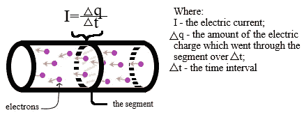
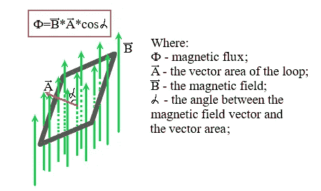
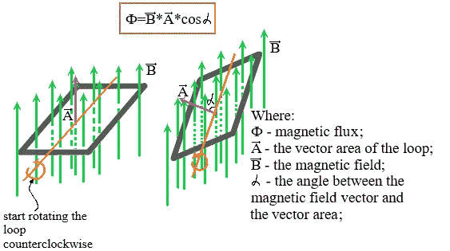
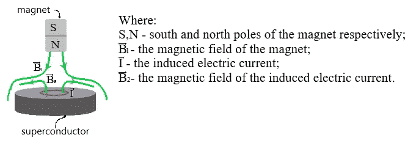

# 一，二，三，漂浮起来！

> 原文：<https://medium.com/nerd-for-tech/one-two-three-levitate-417de9420f32?source=collection_archive---------7----------------------->

魔术师把毯子盖在一个人身上。魔杖挥了三下，毯子掉了，这个人慢慢升到桌子上方，漂浮起来。

朱利叶斯·德罗斯特在 [Unsplash](https://unsplash.com?utm_source=medium&utm_medium=referral) 上的照片

果不其然，我们大多数人一生中至少见过一次这种把戏。众所周知，事实上，魔杖的全部魔力隐藏在高超的技巧、持久的准备和旁观者的疏忽之中。

然而，悬浮在现实世界中存在吗？如果人们只能在受过训练的魔术师的帮助下才能看到悬浮，那将是一个遗憾。还好，只要物理在就没什么好担心的！在本文中，我们将讨论使用磁铁和磁场产生悬浮的三种方式。

那句“简直就是魔术！”太简单了，无法解释真实悬浮背后的复杂机制。真正的解释需要我们更深入地研究物理学中称为磁学和电学的部分。

穿越这段狂野但惊险的旅程的第一步是揭示什么是电流。电流是有序的带电粒子流:例如，离子或电子(电子带负电荷)流过导体。基本的铜线被认为是导体——一种具有在材料中自由移动的不受约束的外层电子的材料。有时，这些自由电子甚至被称为电子气，因为它们有很大的自由度。电子是导体中出现电流的原因。

请注意，电流不只是“一股带电粒子流”，而是“有序粒子流”。这种秩序不是来自电子的突发奇想，而是来自电场，电场是由电势或变化的磁场产生的，这将是磁悬浮最重要的方面之一。

当电场作用于导体中的电子时，它们开始向特定方向移动，获得所谓的漂移速度。此外，我们的小电荷载流子还有另一种速度——热速度。这个速度比漂移速度高得多，但它没有特定的方向，使电子无序地移动。所以，电子正在非常缓慢地向它们的“目的地”(漂移速度)移动，这是由电场决定的，与此同时，它们正在变得疯狂(热速度)。因此，漂移速度越低，随着时间的推移，通过导线选定部分的电荷就越少，换句话说，电流就越小。

电流

例如，提高导线的温度会提高电子的热速度。除了电子，导体还有原子、离子。随着热速度的增加，电子将更频繁地“撞上”那些原子，流动将会变慢。(想象一辆汽车试图高速穿过挤满其他车辆的道路:它每次都要撞击并减速，降低整体速度以到达期望的目的地。)因此，材料的电阻将增加，导致电流减小。(应该注意的是，在这个模型中，我们把电子、原子、离子想象成很小很小的球体，但是，在现实生活中，这并不十分准确)。

然而，如果我们冷却一种材料呢？我们不能把温度降低到任何可能的值——可能的最低点有一个极限:0 开尔文或-273，15 摄氏度。通过接近这个温度，导体的电阻率也将接近零(几乎消除它)。这种材料就是超导体。甚至它的名字“超级”和“导体”也暗示了这种材料的性质。

有人提到，变化的磁场是产生悬浮的一个重要方面。每当带电粒子运动时，就会产生磁场。关于磁场最令人兴奋的事情是，变化的磁场会产生变化的电场，反之亦然——变化的电场会产生变化的磁场。没有这种令人难以置信的两个场的特性，我们就无法生存，因为光，一种电磁波，就不会存在。然而，当我们将要讨论感应电流时，将会用到磁通量的变化(不是在磁场中)。磁通量与磁场相同，但有两个例外——它考虑了磁场穿过的电路/材料的面积，以及电路矢量面积与磁场线之间的角度。

磁通量

因此，当磁通量要改变时，这将是因为磁力线与电路的矢量面积之间的角度、磁力线通过的面积或磁场本身的变化。不管是哪种情况，通过电路的磁场强度也会发生变化。这就是为什么不仅要注意磁场的变化，而且要注意整个磁通量的变化是很重要的。

它把我们带到了最重要的定律——楞次定律。这是说，如果我们有一个改变磁通量的电路(或材料)，它将在电路中感应出电流，该电流将朝着产生磁场的方向移动，该磁场将与磁通量的初始变化相反。这听起来很沉重，但是，换句话说，我们可以说，材料/电路无法忍受改变穿过它们的磁场的大小，所以它们尽力补偿这种变化。它们这样做的方式是通过产生磁场，这与磁通量的初始变化相反。

这种现象的一个典型例子是最简单的发电机。取一个线圈，将其放入恒定磁场中。等等等等。如果磁场是恒定的，我们将如何改变它？请记住，当我们谈论电路/材料时，我们将着眼于磁通量的变化，而不是磁场本身。那么，它是如何工作的呢？当线圈处于恒定磁场中时，我们开始旋转它。由于角度的变化，现在通过回路开放区域的磁场量将会改变。

发电机

我们可以把它看作是我们的线圈没有移动，而磁场本身只是发生了变化。由于磁通量的变化，感应出电流，因此产生了与磁通量变化相反的磁场。因此，我们得到了电。

现在，我们终于可以实现磁悬浮了。

产生磁悬浮的第一种方法涉及到超导体。如果把一块永久磁铁放在超导体上面，它会悬浮起来。为什么？即使永久磁铁的磁场不变，当我们把它放在超导体上面时，磁通量也会变化，从零增加到某个特定值。然而，超导体内部不能有任何(不仅仅是变化)磁通量。原因是超导体的电动势(ε)为零(ε=I*R=I*0=0)，这意味着磁通量也为零(ε= dф/dt = 0 = > dф= 0—磁通量的变化)。因此，磁铁的磁场在超导体内部感应出电流，排斥任何磁通量。因为没有电阻——没有能量浪费——初始感应电流不会降低。因此，即使磁场是稳定的，电流仍然会沿着产生相反磁场的方向流动，排斥初始磁场并保持磁体稳定。

第一种方式，涉及磁铁和超导体

第二种方法是使用导体和永久磁铁。我们放置一块导电板，并在上面移动一块永久磁铁(这就是一些磁力火车的工作原理)。想象一下，磁铁刚刚开始进入空间，它就在一小部分导电板的正上方。在此过程中，它改变了暴露在永久磁铁磁场中的板部分的磁通量。根据楞次定律，这部分板块内部会产生电流，产生相反的磁场。这个磁场将试图抵消磁通量的变化，因此，它将朝着与初始磁场相反的方向前进，将我们的永磁体推开。在导体的整个区域，永久磁铁将改变极板新部分的磁通量，感应电流并使其保持在空气中。

第二种方式，涉及磁铁和导电板

我们要讨论的最后一种方法涉及到一块导电板和一块电磁铁，而不是一块永久磁铁。电磁铁由铁磁性材料(磁铁)组成，包裹在线圈中，线圈中有不断变化的电流。我们知道，电流，即运动的带电粒子，会产生磁场。因此，变化的电流会产生变化的磁场。如果我们将这个电磁体放在一块导电板上，根据楞次定律，变化的磁场将在导体内部感应出电流，这将产生一个相反的磁场，使电磁体保持悬浮。

第三种方式，涉及电磁铁和导电板

现在，当你下次看到悬浮的魔术时，你会确信这个魔术可以通过一撮物理学变成现实。