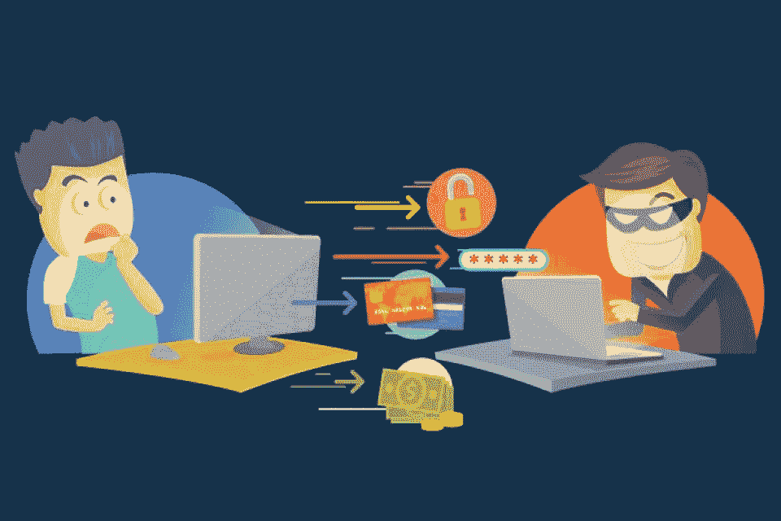
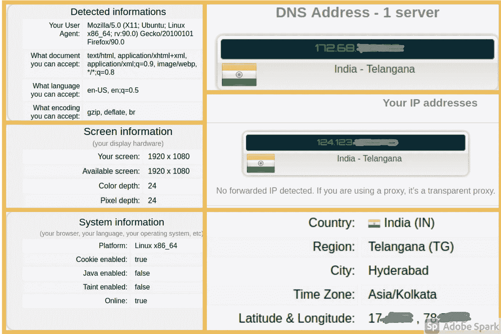
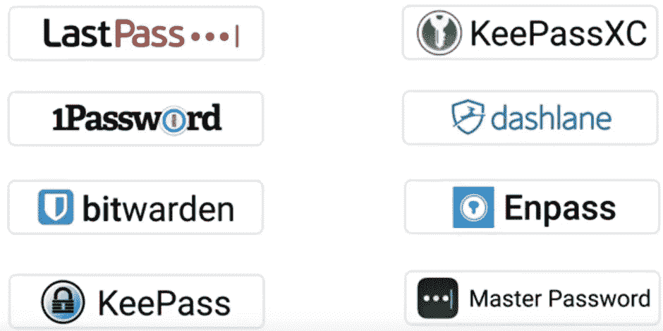
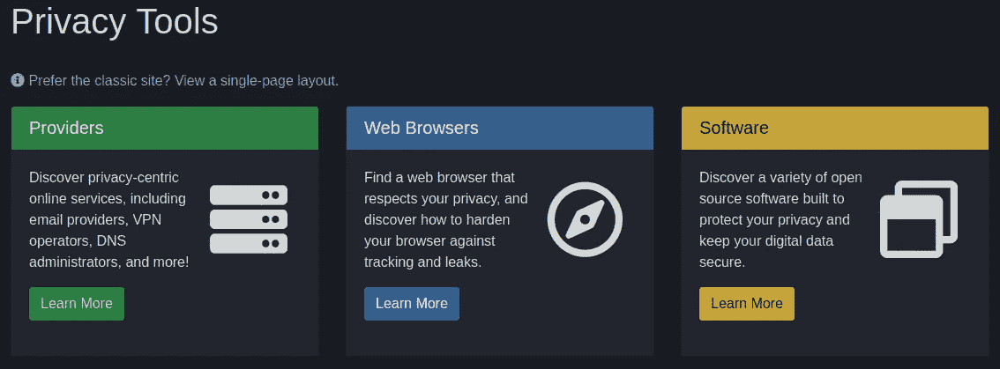
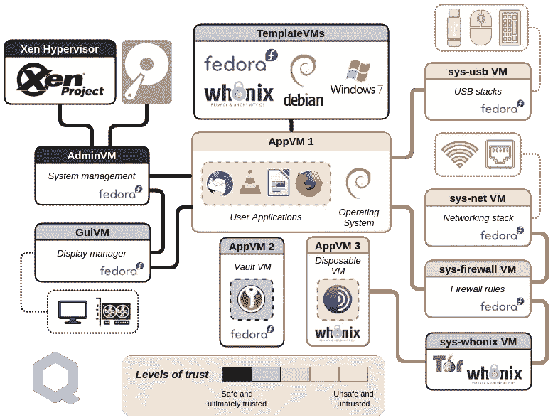

# 在线隐私——成本和神话

> 原文：<https://medium.com/nerd-for-tech/online-privacy-cost-and-myths-436b55a240d9?source=collection_archive---------3----------------------->

人们常说，网络隐私是一个神话。维护网络隐私真的这么难吗？为什么你应该维护在线隐私？你的个人资料真的是你拥有的最有价值的资产吗？科技公司真的花费数十亿美元来收集你的个人信息，并向你提供免费产品吗？免费电子邮件、免费游戏、免费搜索引擎、免费应用、免费存储、免费服务等等，真的是免费的吗？你真的没有付出任何代价吗？

让我们做一个小练习。拿起手机解锁，数手机里的应用总数，然后数你为应用付费(或一次性付费)的应用数量。

你很可能有像网飞或亚马逊 Prime 或 LinkedIn(高级账户)这样的应用，你可能已经支付或支付了一些及时的订阅费。其余几乎 90%的应用都是免费的。绝对免费。免费。免费。免费。没钱。不收费。没有订阅。全部免费。免费。免费。免费。

如果您浏览 web 服务或 web 应用程序，情况也是如此。脸书、Instagram、Quora、Reddit、Gmail、Twitter 等都可以免费使用。

你有没有想过，当你和你的朋友在 WhatApp 上聊天，不经意地提到你的鞋子旧了，打算买新鞋的时候。接下来，每个网站都会开始展示阿迪达斯、耐克和其他品牌的广告。WhatsApp 是端到端加密的，但信息会从你用来打字的键盘上泄露，就像默认的安卓谷歌键盘一样。

# 真正的问题是——我没有什么可隐瞒的！

大多数情况下，人们认为他们没有在网上从事任何非法活动，所以他们没有什么可隐瞒的。所以，让我澄清这个流言，它不是也从来不是关于非法活动的。它是关于你在网上分享了什么，以及它是如何被公司、政府和黑客所利用的。

让我们做一个小练习。拿起一支笔和一张纸，试着写下一些关于你的独特要点。尽可能多的点。任何关于你的信息，如你的名字，你的位置，你去哪里度假，你在食品杂货上的平均支出是多少，你购买的最昂贵的物品是什么等等。任何关于你或你在网上做的事情的信息。这样的点你能写几个？可能是 100 分，也可能是 500 分。剑桥分析拥有超过 **5000 个关于每个美国人**的独特数据点，可能还有全球每个人。记住，每个人都有 5000 个独特的数据点。我们都知道，这些信息是如何被利用(滥用)来操纵 2016 年美国大选的。印度另一家名为 **IPAC** 的公司在印度的议会或大选中做几乎同样的事情。

**你和你的数据**远比你做梦都想不到的更有价值。您的电子邮件、姓名、生日、邮政地址、IP 地址、电话号码、社会安全号码或身份证号码、银行账户详细信息、信用卡/借记卡详细信息、您的购物历史、您的社交生活(您何时在哪个地方入住)，甚至您的密码，都可以在**公开获取或出售**。

想象一下，如果有人想要伤害你，并得到所有这些数据，那么会造成多大的损失。IP 或邮政地址暴露了您的物理位置，您的电子邮件、姓名、社会安全号码和生日可用于在线窃取您的身份，银行或卡的详细信息可用于以您的名义进行非法购买，或可用于任何其他货币欺诈，您的社交签到可轻松用于绘制您的生活时间表，并为侵入您的个人生活提供了一个自由的窗口。不仅你的个人信息暴露了你，也暴露了你爱的人和你的孩子。

有些情况下，在线个人数据甚至被用来绘制个人生活模式，这有助于罪犯计划杀人和绑架。

# 我的信息是如何泄露的？

信息可以通过多种方式泄露，大多数时候你会不假思索地随意交出你的信息。

1.  每次打开任何一个网站。
2.  每次发邮件的时候。
3.  每次登录或注册任何应用程序或网站时。
4.  每次你在网上购物或者浏览商品页面时。
5.  数据泄露
6.  您的设备中存在间谍软件、恶意软件、广告软件、病毒、特洛伊木马等

如果你想知道浏览互联网会泄露多少信息，请点击下面的链接。

https://ipleak.net/第一检查站—[T4](https://ipleak.net/)

一个简单的点击上面的链接会显示很多信息，这些信息会被泄露到你浏览或访问的每一个网站。所有这些信息都可能在很多方面对你不利，例如

*   **操作系统和浏览器信息**可以告知攻击者攻击者可以利用什么类型的漏洞。
*   **Cookie** 信息和 Cookie 盗窃会告诉您的浏览历史，在某些情况下，还会告诉您用户、密码、令牌和其他个人信息。
*   **屏幕大小**可以判断出你使用的**是什么类型的设备**，并据此进行定制攻击。

我自己的信息是从 ipleak.net 获取的，暴露了操作系统、浏览器、IP、位置、Cookie、屏幕大小等。

想知道你最私人的信息，如电子邮件，电话，密码，地址等是如何泄露的吗？大多数人对每个应用程序或在线服务都使用相同或相似的密码。因此，如果一个网站的信息或密码被泄露，它会使你所有其他的在线帐户容易受到攻击。如果**的电子邮件密码也是相同的**，那么攻击者将会更改包括银行账户在内的所有在线账户的密码，从而**完全窃取你的在线状态**。单击下面的链接，了解哪些个人信息通过漏洞泄露，以及攻击者可以获得哪些个人信息。

**检查点 2—**[https://haveibeenpwned.com/](https://haveibeenpwned.com/)

当我检查时，如果我的数据曾经被泄露，那么令我惊讶的是，我的电子邮件、姓名、电话、地址、密码、pin 等都在多次数据泄露中被泄露，而且像 Bigbasket、Dominos、Adobe、LinkedIn、Yatra 等热门公司的数据泄露也是如此。下面是一些网站数据泄露的截图。

在上述和其他违规事件中，我的个人数据，如我的姓名、电子邮件、电话号码、个人识别码、实际地址、购买历史、出生日期，甚至密码都被泄露了。**任何拥有这么多信息的攻击者都可以很容易地用我的名字**创建一个假身份，然后为所欲为。如果我对每个服务都使用相同的密码，那么我会失去所有网站的在线账户，包括我的电子邮件和银行账户。

2015 年，印度在为网络中立和反对脸书的 internet.org 而战。超过 100 万网民向 TRAI(印度的管理机构)提交了一份支持网络中立的在线请愿书。TRAI 把那一百万封电子邮件和手机号码都放在了他们的网站上。任何人都很容易下载或收集这些细节。任何营销公司都会很乐意向能够提供 100 万封活跃邮件和电话号码的人支付数百万卢比。

说数据是新的黄金，个人数据是金矿，一点也没错。

# 让我们保护隐私

1.  **网络浏览器**

我们使用浏览器浏览各种网站。如果我们访问一个易受攻击的网站，我们可能会泄露我们的数据，但如果您的浏览器本身侵犯了您的隐私，即使您没有访问任何网站，又会怎么样呢？

每个浏览器收集一些数据，并将数据发送给开发该浏览器的公司。最流行的网络浏览器 Chrome 向其母公司谷歌传输大量数据。这就是为什么这么棒的浏览器**可以免费获得**，因为你是在用你的个人数据**付出代价。**

都柏林三一学院的道格拉斯·J·利斯做了一项非常受欢迎的研究，他测试了 6 种流行的网络浏览器，并分析了这些浏览器与母公司共享的数据。这项研究涉及 Chrome、Firefox、Edge、Safari、Brave 和 Yandex 浏览器。论文链接—[https://www.scss.tcd.ie/Doug.Leith/pubs/browser_privacy.pdf](https://www.scss.tcd.ie/Doug.Leith/pubs/browser_privacy.pdf)

共享的数据包括 IP 地址、MAC 地址，在某些情况下甚至包括浏览历史和页面内容。根据这项研究，网络浏览器从隐私角度被分为三类。

*   最差— Edge 和 Yandex(共享 IP、硬件序列号、MAC 地址)
*   平均——Chrome、Safari 和 Firefox(客户端标识符，无硬件标识符。Firefox 和 Safari 略好于 Chrome)
*   **最佳——勇敢**(最私密的网络浏览器。没有发送标识符。)
*   荣誉提名权——TOR 浏览器(完全匿名，但也打开了通往黑暗网络的门户)

结论——如果你是一个注重隐私的用户，那么 chrome 根本不应该是你的浏览器选择。要么使用 Firefox 及其扩展，要么使用 Brave 和 Tor 等注重隐私的浏览器。

**2。搜索引擎** 搜索引擎市场被完全垄断。90%以上的市场份额属于谷歌。下一个最接近的竞争对手是必应，其市场份额为个位数。这些搜索引擎不仅捕捉你的私人信息，还会感知搜索结果或修改搜索结果。搜索结果不是中立的，你也在泄露个人数据。这里有一些私人搜索引擎，它们为你提供不带偏见的搜索结果，而无需跟踪你的 IP、Cookies 或任何其他个人信息。

*   **start page**——[https://www.startpage.com/](https://www.startpage.com/)
    通过代理匿名浏览，它给谷歌结果，不跟踪 ip 或 cookies。
*   **duck duck go**——[https://duckduckgo.com/](https://duckduckgo.com/)最好的搜索引擎之一。它不会跟踪或收集任何信息。装载了独特的功能。
*   **旺旺**——[https://www.qwant.com](https://www.qwant.com)

如果你使用的是 Mozilla Firefox 或 Google Chrome，你仍然可以使用 duckduckgo 作为默认的搜索引擎。只需进入设置，搜索“默认搜索引擎”，将搜索引擎从 Google 改为 Duckduckgo 即可。

**3。密码**

针对受损数据和漏洞的最佳防御机制是为每个服务或网站使用唯一的密码。我们都知道，强密码必须至少有 10 个字符长，必须包含小写和大写字符以及数字和特殊字符。通常，人们会将自己的姓名、生日或爱人的名字组合成密码。这是一种非常糟糕的做法，会让攻击者利用字典攻击猜测您的密码。

每年五月的第一个星期四是全球庆祝世界密码日的日子。这是对每个网民的提醒，让他们反思自己糟糕的密码，并认真对待他们的网络安全。

因此，始终为每个网站和服务创建和使用唯一的复杂密码。手动创建复杂密码的一个好方法是使用**密码技术**。【https://theworld.com/~reinhold/diceware.html】T5

你可以访问下面的链接，并检查任何随机密码的强度。我不建议放你原来的密码，但是你可以放一些类似于检查强度的东西。[https://howsecureismypassword.net/](https://howsecureismypassword.net/)

对于一个普通人来说，记住 100 个独特而复杂的密码并不容易。我建议使用商用密码管理器。这些不是免费的工具或软件，需要订阅费。记住，如果你不为产品付费，那么你就是产品。

**密码管理器** 密码管理器通过管理每个服务或在线帐户的唯一密码，让生活变得简单。这是保护您所有在线帐户的有效方法。一些著名的密码管理器如下:

*   **LastPass
    数据在存储到 LastPass cloud 之前会在本地加密。**
*   **1Password** 它可以作为网络浏览器、桌面应用(Windows 和 Mac)和移动应用的扩展。在本地存储密码、支付卡信息和笔记，但也会定期与云同步。
*   **Enpass** 本地存储密码等信息，并提供按需云同步选项。桌面使用不需要帐户或订阅。尽管它对移动设备收费。作为桌面浏览器扩展提供。
*   **KeePass 和 KeePassXC(社区版)** 它是最古老的密码管理器之一，在本地存储数据。选项可用于将加密数据与任何流行的云同步。KeePass 不需要创建任何帐户，它是开源的，适用于所有平台。
*   与其他密码管理器类似，Dashlane 也在本地存储数据，但允许云同步。它需要一个帐户，并提供免费和付费计划。它会在任何在线帐户遭到破坏时发出警报。
*   **BitWarden** BitWarden 是一个开源的密码管理器，但是是商业化的。它需要帐户，适用于所有平台。在本地存储数据，但允许云同步。
*   **主密码** 这个密码管理器和其他密码管理器很不一样，因为它不会在任何地方存储你的密码信息。它每次都使用复杂的算法生成相同的密码，该算法以用户名、网站和主密码作为种子值。它是一个开源工具。

自动填充，离线随机密码生成器所需的长度，支付卡信息，加密笔记，旧密码和弱密码警报是一些很好的功能，几乎所有上述密码管理器。使用任何密码管理器仍然比把密码写在便利贴上并用 Chrome 或 Firefox 等浏览器保存密码要好。这些密码管理器为整个家庭提供每月 2 到 5 美元的付费订阅。隐私是无价的，每月 2 美元是保护它的非常便宜的价格。

我个人最喜欢的是 Dashlane 和 KeePass。

**4。隐私浏览器扩展**

*   **uBlock Origin**
    优于 Add Block Plus。它是一个通用的内容拦截器，因此它消除了安装多个附加组件的需要。
*   **NoScript(Firefox)&script safe(Chrome)** 这些都是脚本拦截器，可以拦截恶意网站的 javascript 代码。
*   **Privacy Badger** 这是一个智能拦截器，它随着时间的推移了解那些试图跟踪或获取用户信息的网站，并阻止它们。
*   https 无处不在
    这个扩展确保你总是访问 HTTPS 版本的网站，从而确保你的数据被加密。
*   **断开** 此扩展阻止追踪器并提供私人搜索。该插件还提供 VPN 服务。
*   这是一个非常有用的扩展，因为一旦浏览器标签关闭，它会自动销毁网站 cookie。这个扩展提供了白名单，以防您想要保留活动登录。
*   **BetterPrivacy** 这个扩展删除超级 cookies。超级 cookie 不同于普通 cookie，因为即使你清除了整个浏览器历史，超级 cookie 也不会被删除。这种 cookies 几乎总是用来跟踪用户。
*   分散式内容分发网络(CDNs)现在被广泛使用，因为它加快了下载速度。问题是，几乎所有的网站都在使用一些 CDN，所以这些 CDN 很容易跟踪不同网站的用户。分散化阻塞了到这些 CDN 的连接
    这将需要另一篇文章来更详细地讨论 CDN。

**5。保持匿名比保护隐私更容易。可以使用各种技术和一些假数据来保持匿名。您对使用 web 应用程序或访问网站感兴趣，因此没有必要总是提供您的真实个人信息。这里有一些在不损害你的利益的情况下保持匿名的工具和技巧。**

*   **一次性电子邮件** 有很多免费的一次性电子邮件服务。如果网站不允许你在没有注册他们的时事通讯的情况下继续，为什么要输入你真实的电子邮件 ID。尽可能使用垃圾邮件登录，自己注册。一些流行的垃圾邮件服务有:
    [https://10minutemail [。]com](https://10minutemail.com/)
    [https://maildrop . cc](https://maildrop.cc/)
    [https://www.guerrillamail.com/](https://www.guerrillamail.com/)(我个人的最爱)
*   如果已经有很多公开共享的账户可供使用，为什么还要在任何网站上创建一个新账户呢？这是一个理想的解决方案，网站不允许你不登录就访问他们的内容。
    [http://bugmenot.com/](http://bugmenot.com/)
*   **假名字生成器**
    假名字生成器生成一个假的个人资料供你在线填写。它甚至提供假的电话号码，地址，支付卡，车辆细节，网站，电子邮件等。在任意一个网站上创建账户所需的一切。这个网站不支持印度人的名字或地址，但是匿名的想法不就是你不提供你的真实数据，所以穿上美国人或中国人或巴西人或冰岛人或任何其他身份。
    [https://www.fakenamegenerator.com/](https://www.fakenamegenerator.com/)
*   像 Gmail 这样的公共电子邮件服务很好，但不私密。您的电子邮件可以用来跟踪您的个人信息，也可以阅读电子邮件的内容，以针对特定内容的广告。
    使用私人电子邮件服务，这种服务可能是免费的，但空间有限，或者费用很低。【https://protonmail.com/】
    [https://mailbox.org/en/](https://mailbox.org/en/)
    [https://posteo.de/en](https://posteo.de/en)
*   **VPN** 非常流行的保持在线匿名的方法是使用 VPN 或代理服务器。你的内容被加密了，所以即使你的网络服务提供商也无法跟踪你的活动。就像我上面几次提到的，不要去找免费的产品(自由/开源软件是例外)，因为如果一个产品是免费的，那么你就是这个产品。VPN 也是如此。现在一天的 VPN 已经变得非常实惠，成本非常低。连接到 VPN，看看你在[https://ipleak.net/](https://ipleak.net/)
    泄露了多少信息在[https://www.safetydetectives.com/best-vpns/](https://www.safetydetectives.com/best-vpns/)
    [https://protonvpn.com/](https://protonvpn.com/)
    [https://www.expressvpn.com](https://www.expressvpn.com)
    [https://nordvpn.com/](https://nordvpn.com/)有大量关于各种 VPN 提供商的信息和比较图表
*   **DNS 服务器
    为了保持匿名性，将公共 DNS 服务器改为私有 DNS 服务器是很重要的。
    [https://1.1.1.1/](https://1.1.1.1/)(这是一个由 CloudFlare 提供的关于免费和私有 DNS 服务器的真实网站)**
*   **云驱动—文件加密**
    有多个云存储提供商，如 Google Drive、Dropbox、box 等。在公共云存储上存储文件时，您可以使用以下开源工具对文件进行加密。
    [https://cryptomator.org](https://cryptomator.org/) https://www.axcrypt.net

除了上面提到的工具之外，如果你想了解更多关于其他隐私工具、附件、扩展、浏览器、VPN、DNS、电子邮件提供商、社交网络、托管服务、软件等的信息，请访问下面的链接，查看维护你的在线隐私所需的分类列表。
[https://www.privacytools.io/](https://www.privacytools.io/)

[https://www.privacytools.io/](https://www.privacytools.io/)

**6。操作系统**

爱德华·斯诺登是一个众所周知的名字，他是美国国家安全局的前雇员。爱德华透露了很多机密信息，暴露了政府对每个人的监视程度。您可以遵循 Edward 在他的在线公开帖子中推荐的工具或软件。从隐私的角度来看，最常被忽视的软件是操作系统。

Mac OS 被认为是更好、更隐私的 OS，但由于它是闭源的，受美国政府管辖，我们永远无法 100%确定是否没有后门侵犯隐私。

像 Fedora、Ubuntu、Mint、Debian 等 Linus 发行版是向更私人的操作系统迈进了一步，因为这些发行版是开源的，但仍然不是完全安全的。

过去，爱德华·斯诺登曾使用过一个名为 Tails 的**操作系统。Tails 被设计成可以作为一个活动的 DVD 或闪存驱动器启动，并且不会留下任何痕迹。当然这个 OS **不能作为永久 OS** 的替代，但是绝对可以**用于一些敏感任务**。Tails 是一个私有的便携式操作系统。**最好的好处是你可以随身携带加密的操作系统和个人文件，并且可以再次打开任何人的电脑。

后来爱德华推荐了另一款操作系统，名为 **QubesOS** 。这个操作系统可以**用作永久操作系统**。Qubes 背后的主要思想是**“隔离安全”**。所有程序，如浏览器、办公套件、电子邮件客户端等都在**本地虚拟化环境**中执行，从而将程序相互隔离，并且**还使用沙箱**来隔离存储和网络组件。最棒的是 Qubes 还与 windows 操作系统的软件兼容。甚至浏览器标签都是在它们自己的独立容器中打开的，因此限制了 cookies 和其他细节的共享。当然，为了增强隐私和安全性，需要做一些小小的折衷，并且这种折衷是关于硬件容量的。这将需要更多的内存和 CPU 处理能力。

[https://www.qubes-os.org/intro/](https://www.qubes-os.org/intro/)

**7。其他重要步骤**

*   **虚拟电话号码的使用** 虚拟电话号码是免费提供的，可以在您的实际号码上使用。这些可以很容易地被丢弃，而不会影响你的实际人数。
*   **使用邮箱** 邮局和其他服务提供商提供一种服务，让你获得一个邮箱，作为你的永久地址。你不必在网上向陌生人或网站透露你的实际常住地址。
*   **删除个人信息** 您可以删除任何与您的个人信息相关的搜索结果。你可以请求谷歌或必应删除搜索结果。
    [https://support . Google . com/web search/troubleshoot er/3111061？hl=en](https://support.google.com/websearch/troubleshooter/3111061?hl=en)
*   **虚拟 ID 的使用**
    很少有人知道你可以在任何地方用虚拟 ID 代替 Aadhar 号。
    [https://resident.uidai.gov.in/vid-generation](https://resident.uidai.gov.in/vid-generation)
*   **使用多因素认证** 使用基于物理 USB 密钥或 authenticator 等应用的多因素认证。MFA 是一个很好的机制来保存您的在线帐户，即使密码被泄露。
*   **没有昵称或假名** 有些用户确实为多个服务或网站使用不同的电子邮件地址，但他们经常使用相同的假名或昵称。即使使用单独的电子邮件地址，也可以很容易地根据假名进行搜索并找出所有帐户。想象一下，5 年前你出于愤怒或一时冲动在社交媒体上写了一篇充满仇恨或种族歧视的帖子，而那篇帖子在背景调查期间妨碍了你的新工作。现在，所有大公司都在对你的社交媒体帖子、喜欢和支持进行背景调查，以建立心理档案，看看你是否适合这个组织。我们都知道一个公众人物在社交媒体上发布的帖子是如何在几年后用来攻击他们的。

**8。隐姓埋名是一个神话** 很多人都有一个误解，认为隐姓埋名可以保护他们免受任何攻击。如果使用匿名模式，他们无法被跟踪或没有个人信息被泄露。这是神话，是完全错误的认知。
匿名模式只提供不在您的本地系统中存储任何 cookie 或浏览历史。它不提供保护，如隐藏你的 IP，你的网络流量，跟踪和个人信息泄漏。为了真正保护自己，最好使用带有私有 DNS 的 VPN，而不是使用匿名。

# 删除我

如果你想纠正你过去所有的错误，这些错误可能会损害你的隐私，那么幸运的是，有一些服务可以从互联网上删除你的个人数据，从而使你的生活更加安全。

Delete Me 是一项从互联网上删除您的数字足迹和个人信息的服务。他们对自己的辛勤工作收取很少的费用，他们还提供 DIY 指南，以防你想自己动手而不想付钱。

【网站—https://joindeleteme.com/
删我实例报道—[https://joindeleteme.com/example-report.pdf](https://joindeleteme.com/example-report.pdf)
删我 DIY 指南—[https://joindeleteme.com/help/diy-free-opt-out-guide/](https://joindeleteme.com/help/diy-free-opt-out-guide/)
删我小贴士维护隐私—[https://joindeleteme . com/help/Delete me-help-topics/privacy-tips/](https://joindeleteme.com/help/deleteme-help-topics/privacy-tips/)

# 结论

隐私影响着你、你所爱的人、你的社会和你的国家。这是一件很严重的事情，远比我们所能想到和想象的要严重。我们很少考虑个人、国家和国际层面的影响。我们每个人的个人隐私或集体隐私都会间接或直接影响到我们每个人。

最常见的例子是 2016 年的选举，你的个人数据被用来垄断选举，从而引起连锁反应，导致骚乱，战争和全球政治紧张局势。

隐私影响的另一个最近的例子是，一名印度男子在 20 个月后从沙特监狱返回。他因为在他的脸书账户上发表了一篇亵渎神明的帖子而被监禁。调查显示，该帖子是从他被泄露的账户发出的。没有人能把那 20 个月还给那个人和他的家庭。[https://www . aninews . in/news/national/general-news/man-hold-in-Saudi-Arabia-jail-for-Facebook-posting-he-do-not-make-returns-to-India-after-20 months 210819132827/](https://www.aninews.in/news/national/general-news/man-held-in-saudi-arabia-jail-for-facebook-posting-he-did-not-make-returns-to-india-after-20-months20210819132827/)

**我们不仅需要隐私来防范黑客或攻击者，还需要隐私来防范大公司、政府机构和部门。**

我甚至没有讨论后门，或者在你的手机或智能助理设备如 Alexa 或 Google home 中使用麦克风是如何侵犯隐私的，这比上面讨论的要严重得多。

保护在线隐私是一个持续的过程，它不是不提供信息，而是更多地保护信息。如果一个随机的人问你的电话号码，你会问 10 个问题，仍然不会分享细节，但在网上你会不假思索地提供同样的数据。

我强烈建议限制或尽量减少对脸书、Instagram、Twitter 等平台的使用，转而使用他们的免费开源社交媒体，这些媒体不会跟踪你的信息。【https://itsfoss.com/mainstream-social-media-alternaives/】T5

让我们重新思考隐私的重要性，尽量保持隐私。