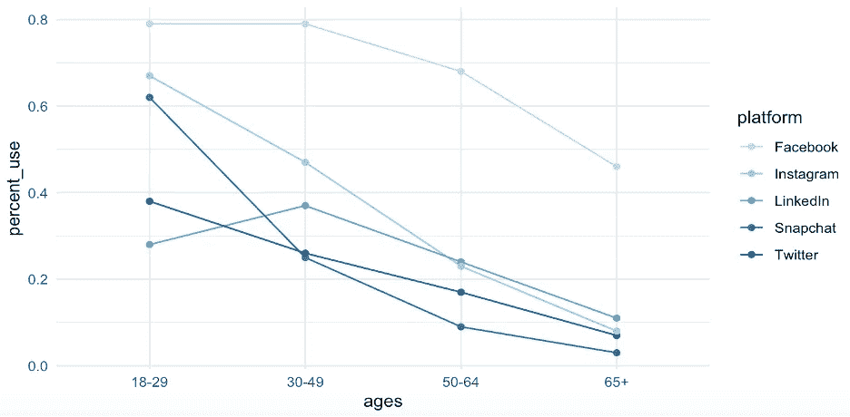
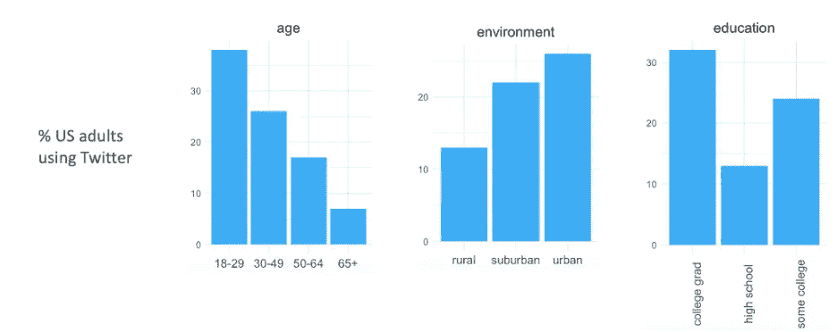
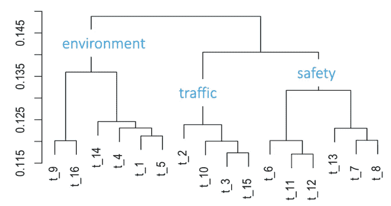

# 开源社交监听

> 原文：<https://medium.com/nerd-for-tech/open-source-social-listening-278bd5e84011?source=collection_archive---------3----------------------->

## 公共部门的应用程序

托马什·高夫斯基在 [Unsplash](https://unsplash.com?utm_source=medium&utm_medium=referral) 上的照片

社交监听被用来掌握公众意见的脉搏。传统上，社交倾听被用于评估私营部门的消费者意见，但它也可以适用于公共和政府用途，产生巨大的影响。社交倾听[可以用来](https://marketingland.com/social-listening-267175):

获取对产品或政策的反馈

监控行业背景

分析竞争

管理公共关系和声誉

在营销活动中创造销售线索或目标

更多

这些信息对政府和政府机构来说是有价值的，特别是在代议制民主中，选民对政策的反应是关键的决策输入。政府机构和行动者需要管理自己的声誉，甚至评估竞争对手。

已经建立了许多平台来提供社交收听服务，但是它们通常很昂贵，并且较便宜的选项并不总是非常可定制的。在私营部门的预算中，通常会为昂贵的软件留出空间，但在公共部门，这种情况不太常见。幸运的是，像 Python 和 R 这样的开放编码语言提供了构建免费、开源、完全可定制的分析工作流的工具，您可以根据自己的需要进行挑选和更改。

让我们来看一个简单的例子:一个市政当局想了解其居民对在市中心扩建自行车道的提议有何感受。

# 数据源

我们(市政府)需要做的第一件事是考虑我们的数据来源。社交媒体平台是特定于地点和人口统计的。例如，如果我们想研究老年人的想法，抖音可能不是我们的最佳选择。数据源应该与我们的社交倾听目标相匹配。

皮尤研究中心发布了一些有趣的关于美国不同平台用户的人口统计数据。

使用 Pew Research 的数据在 R 中创建的图表

那么，当我们想到自行车道时，我们担心的是谁的意见呢？

使用皮尤研究中心的数据绘制的图表

市中心的居民年轻，城市化，受过教育。他们通常在政治上很活跃。Twitter 将是我们开始的好地方。

# 代表性

当处理社交媒体数据时，代表性的问题经常出现。不，当然社交媒体数据不能代表整个人口，但我们既不期望也不需要它。

在社交倾听中，最有发言权的社会成员——也是最有可能在网上发布问题的人——是我们最感兴趣的声音。与传统统计数据相反，社交媒体捕捉民众最极端声音的倾向实际上是社交倾听的一项资产。

# 提取数据

## 蜜蜂

正如他们所说，有许多方法来剥猫的皮。一些社交媒体网站，如 [Twitter](https://developer.twitter.com/en/docs/twitter-api) ，有官方 API，或应用程序编程接口([脸书](https://developers.facebook.com/docs/graph-api/)和 [Instagram](https://rapidapi.com/collection/instagram-apis) 可以通过各种官方和非官方 API 访问)。API 要求用户注册接收一个访问令牌，用户可以使用这个令牌通过个人密钥在脚本中提取数据。注意，并不是所有的 API 都兼容所有的编码语言——[LinkedIn API](https://www.linkedin.com/developers/)只兼容 Bash、NodeJS 和 Java。

API 的一个问题是它们习惯于阻止更多“热情”的用户。当被封锁时，用户可以尝试跳转服务器或伪装自己，但通常这是一个死胡同。在这些情况下，好的老式网络抓取是另一种获取数据的方式。

## 通用刮削工具

社交媒体平台只是网站，因此可以使用普通的网络抓取工具进行抓取，如 [Rvest](https://blog.rstudio.com/2014/11/24/rvest-easy-web-scraping-with-r/) 、 [Beautiful Soup](https://pypi.org/project/beautifulsoup4/) 或 [Selenium](https://pypi.org/project/selenium/) 。然而，每个网站的结构都可能是特定的、重复的，并且导航起来很乏味，这意味着不断创新的开放代码社区已经产生了许多方便的特定于平台的工具，可以将社交媒体数据拉到您的机器上。

## 特定于社交媒体的包

在 R 中， [twitteR](https://www.rdocumentation.org/packages/twitteR/versions/1.1.9) 是从 twitteR 中提取数据的一种简洁方式，而 [instaCrawlR](https://github.com/JonasSchroeder/InstaCrawlR) 和 [iscrape](https://github.com/royfrancis/iscrape) 从 Instagram 中做同样的事情。Python 有做同样事情的工具，从[抖音](https://github.com/drawrowfly/tiktok-scraper)到 [Linkedin](https://pypi.org/project/linkedin-scraper/) ，步骤相对较少。一个特别用户友好的抓取 Twitter 的工具是 [twint](https://github.com/twintproject/twint) ，安装后，可以从命令行或 Python 中的[运行，只需要很少几行代码。](/@erika.dauria/scraping-tweets-off-twitter-with-twint-a7e9d78415bf)

由于社交媒体网站不断变化的性质，这些软件包的创建者必须不断地[监控和更新它们](/@jonas.schroeder1991/update-instacrawlr-still-crawling-6500cd376ea3)以[跟上网站的变化](https://github.com/twintproject/twint/issues/1023)，其中一些最终可能会失修。快速搜索通常会告诉您选择的工具是否需要更新。

# 原始数据，检查。现在怎么办？

一旦我们有了我们的数据，我们开始与任何其他 [NLP](https://en.wikipedia.org/wiki/Natural_language_processing) 项目相同的[基本预处理](https://towardsdatascience.com/nlp-text-preprocessing-a-practical-guide-and-template-d80874676e79)。我们去掉标点符号——仔细考虑像' # '和' @ '这样的字符会如何影响分析——并去掉[停用词](https://en.wikipedia.org/wiki/Stop_word)。特别是在社交媒体文本中，表情符号很常见，可能有重要的意义。虽然有时它们会从文本中删除，但更有意义的管理方式是将它们转换成单词。我们还可以使用更高级的技术，比如使用 R 的[拼写](https://github.com/ropensci/spelling)包或定制的[模糊匹配](https://en.wikipedia.org/wiki/Approximate_string_matching)工具等工具，对文本进行拼写检查(因为社交媒体上到处都是拼写错误，这可能会影响考虑每个新单词拼写错误的算法)。请注意，这些工具根据接受单词的字典检查输入文本，以识别输入单词与接受单词非常相似的情况，并用接受的单词覆盖它们。根据你的主题的特定词汇，修改或调整基本词典可能很重要。

[词汇化](/swlh/introduction-to-stemming-vs-lemmatization-nlp-8c69eb43ecfe)是另一项重要的技术，它对文本数据的影响有很大的帮助。除了词干化之外，词汇化还用于折叠一个单词与不定式或词根的所有变形:不是将“am”、“are”和“is”视为三个功能不同的单词，而是将所有这些单词注册为单个动词“be”。这个不定式或词根的出现将是其变化的总和，因此比每个变化单独产生更大的影响。这可以用 Python 中的 [SpaCy](https://stackabuse.com/python-for-nlp-tokenization-stemming-and-lemmatization-with-spacy-library/) 或者 R 中的 [textstem](https://www.rdocumentation.org/packages/textstem/versions/0.1.4) 来完成，有些工具比如 R 的 [hunspell](https://cran.r-project.org/web/packages/hunspell/vignettes/intro.html) 会把词干、分词和拼写检查都打包在一起。

在除英语之外的语言中，词汇化可能越来越重要——而预建的包/字典越来越少。例如，浪漫语言在每种时态中都有动词变化，而不是像英语那样只有一些时态。最近发布的西班牙语词汇化版本[考虑到了词性，在之前的版本上有了很大的改进。](https://github.com/pablodms/spacy-spanish-lemmatizer)

回到我们的自行车道的例子，关于政策接待，我们想知道什么样的事情？

人们对自行车道扩建的看法

他们关心政策的哪些部分

什么样的人对该政策的感受足够强烈，以至于会在推特上发布相关信息

从政策角度来看，这些信息能让我们做些什么？

# 理解上下文的无监督学习

既然不想主导分析，就从一些简单的探索性技术开始吧。像 Python 的 [textblob](https://stackabuse.com/sentiment-analysis-in-python-with-textblob/) 或 R 的[DP lyr/get _ voices()](https://www.rdocumentation.org/packages/tidytext/versions/0.2.6/topics/get_sentiments)这样的开箱即用的情感分析让我们对大众的接受有了一个基本的感受。

对于提议的自行车道，我们可以使用预设词典“afinn”对相关推文进行两极情绪分析，以查看自提议宣布以来的几天里，接收情况基本上是积极的，在发布新闻稿解决该问题的当天达到高峰:

使用 afinn 包情感分析在 R 中制作的图形

虽然软件包包括更具体的情绪词汇——即区分悲伤和愤怒，而不仅仅是“消极”——但这可能对上下文高度敏感。预设词汇“nrc”将“警察”一词与安全联系在一起，鉴于去年发布的许多社交媒体内容，这充其量是一种讽刺。

在第一次处理数据之后，我们可以使用主题建模技术获得更详细、更具体的信息。r 的 [textmineR](https://www.rtextminer.com/) 和 [tidytext](https://www.rdocumentation.org/packages/tidytext/versions/0.2.6) 包以及 Python 的 [scikitlearn](/mlreview/topic-modeling-with-scikit-learn-e80d33668730) 、 [gensim 和 nltk](https://towardsdatascience.com/topic-modelling-in-python-with-nltk-and-gensim-4ef03213cd21) 包提供了使用两种技术进行定制主题建模的工具:

Tf-idf ( [术语频率-逆文档频率](https://en.wikipedia.org/wiki/Tf%E2%80%93idf))

LDA ( [潜在 Derichlet 分配](https://en.wikipedia.org/wiki/Latent_Dirichlet_allocation))

Tf-idf 使用两组统计数据(不出所料，术语频率和逆文档频率)，这是一种非常基本的“矢量化”单词的方法，以便确定单词在文档上下文中的重要性。潜在的狄利克雷分配是一种生成概率模型，有点像单词袋矢量化和聚类的 lovechild，用于将文档分类到主题中。这两种技术有助于我们提取关键词等特征，并了解哪些话题是最常被“谈论”的。

在某些情况下，就像我们的自行车道的例子，LDA 模型可能会产生一个优化的主题数量，这个数量对于我们的分析来说太高了。在这种情况下，我们可以生成一个树状图来进一步手动聚类主题。这是在 R 中使用 [CalcHellingerDist()](https://www.rdocumentation.org/packages/textmineR/versions/3.0.4/topics/CalcHellingerDist) 和 [hclust()](https://www.rdocumentation.org/packages/stats/versions/3.6.2/topics/hclust) 函数对现有 LDA 模型的结果生成的[。](https://towardsdatascience.com/beginners-guide-to-lda-topic-modelling-with-r-e57a5a8e7a25)

使用 CalcHellingerDist()和 hclust()对主题进行分组，在 R 中生成树状图

因此，我们可以将最常见的话题缩小到安全、交通和环境方面。

这种无监督的/探索性的分析奠定了基础，并帮助我们了解人们对政策的总体感受，以及他们对政策的哪些部分最感兴趣。

# 指导学习规定行动

一旦我们理解了问题的大致背景，我们需要决定如何行动。我们可以使用两类监督技术来规定行动。

## 分类

分类可以用来根据用户的意见类型或优先事项将用户分类，从而确定政府应该采取什么行动来解决这些公民的问题。流行的 NLP 分类技术包括 [tf-idf](/analytics-vidhya/tf-idf-term-frequency-technique-easiest-explanation-for-text-classification-in-nlp-with-code-8ca3912e58c3) (我们在上一节中讨论的特征提取器可以与简单的 NN 分类器结合，以创建 NLP 分类模型)和词袋技术，如 [word2vec](https://towardsdatascience.com/introduction-to-word-embedding-and-word2vec-652d0c2060fa) 和 [doc2vec](https://towardsdatascience.com/implementing-multi-class-text-classification-with-doc2vec-df7c3812824d) 。

稍微复杂一点的 RNN 模型提供了逐字分析文档的好处，这允许更大的灵活性。最近[像 LSTM](https://arxiv.org/abs/1611.06639) 和[埃尔莫](https://allennlp.org/elmo)这样的双向 RNN 模型(一项著名的为谷歌[伯特](https://github.com/google-research/bert)模型提供燃料的技术)已经成为最先进的技术

这些不同的技术都做同样的事情——当对相关的标记文本数据进行训练时，它们将文档(这里的“文档”是指任何独立的文本块)分类。对于我们的自行车道示例，我们可以使用分类将推文分类，以便进一步查看。请注意，在大多数情况下，分类对于每个模型只产生一个结果——也就是说，它将每个文档分类到一个类别中，即使该文档理论上可能属于多个类别。

单一类别的分类示例

## 注释

在每个模型一个结果会限制分析准确性的情况下，注释可以提供更好的解决方案。从命名实体识别(NER)到复杂的模式匹配，注释在文档文本中搜索特定的字符串或模式，并用找到的任何和所有结果标记文档。一些包，比如 R 的 [trinker/entity](https://github.com/trinker/entity) 识别预设的实体，比如日期、人和货币金额，并且可以有效地用于特定的目的。对于复杂的/定制的模式，Python 的 SpaCy(或者 R 等价的 spacyr)提供了高度可定制的包，用于 NER、模式匹配、词性标注和[等](https://realpython.com/natural-language-processing-spacy-python/)。对于那些除了 R 和 Python 这两种通用数据分析语言之外还拥有编程知识的人来说，有一些强大的工具，比如由 Java 等语言驱动的斯坦福大学的 CRF-NER。

下面的推文涉及多个主题——安全、交通和儿童——以及自行车线路本身的主题。

包含多个类别的示例文本

虽然大多数分类器会被迫选择一个类别，但注释可以在每条推文中标记多个关注的问题，如下所示:

注释后的示例文本显示了基于找到的标记标记的多个类别

# 公共部门的应用

上面讨论的建模技术可以应用于广泛的公共部门社交监听功能。我们已经详细考虑了它们在获得对提议的政策的反馈方面的有用性。情绪分析和主题建模还可以用于监控行业背景，甚至在新政策提出之前预测对新政策的接受度。

这些无监督的技术，以及注释(如果上下文是众所周知的),也可以用于分析相互竞争的政府，了解什么主题与一个政府相对于另一个政府相关联，以及管理公共关系和声誉。类似地，分类可以用来根据人们对某个实体或政策的态度将他们分成不同的组。

我们通常认为潜在客户挖掘是以客户为目标的业务，但它对于以特定的公众群体或部门为目标也很重要。回到自行车道的例子，如果我们发现一些人对政策有错误的信息，我们可能想开展一个信息活动，分类将使我们能够更好地确定哪些人应该成为这个活动的目标。

可以创造性地应用这些 NLP 和机器学习工具，使用 R、Python、Unix shell、Java 等 100%开源的编程工具来回答许多社交听力问题。虽然特定用途的软件在开始时可能需要较少的工作，但开源工具提供了无与伦比的灵活性、定制性、可复制性和透明性(这是公共工作中经常很重要的一个特征)，而且成本无与伦比。