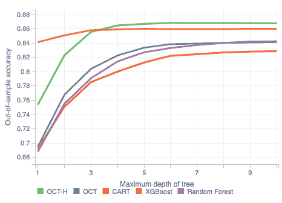

# 最优分类树论文总结与分析

> 原文：<https://medium.com/nerd-for-tech/optimal-classification-trees-paper-summary-analysis-de5f20e130e1?source=collection_archive---------14----------------------->

论文:[https://link.springer.com/article/10.1007/s10994-017-5633-9](https://link.springer.com/article/10.1007/s10994-017-5633-9)

由智能系统子团队[彼得·胡西安](https://github.com/peterhusisian) & [朱莉娅·艾伦](https://github.com/julia-allen)主持讨论

# 纸张目标

*   利用硬件改进带来的令人难以置信的混合整数优化加速(8000 亿倍)(尽管这些方法在过去被认为过于昂贵而不实用，但本文表明这些方法在现实世界的数据集上实际上是可解的，甚至优于分类和回归树(CART))

**决策树**是一个类似流程图的结构，其中每个节点代表一个属性的“测试”，每个分支代表一个测试的结果，每个叶节点代表一个类标签，或者在考虑所有属性后做出的决定。

因为它们是使用自上而下的方法创建的，所以第一次拆分是在不考虑未来拆分的情况下进行的，这意味着它们很少是最佳的。为了解决这个问题，在创建树之后需要一个修剪步骤。优化决策树是 **NP-hard** ，这意味着它以前没有被很好地探索过。

本文使用**混合整数优化**来优化树，这是一种整数程序技术，其中一个或多个变量被约束为整数。

MIO 编程在过去计算量很大，但是像 Gurobi 和 CPLEX 这样的解算器在过去的一二十年里有了很大的改进，这意味着 MIO 比以往任何时候都更有用。

# 论文投稿

作者在优化理论和硬件改进的快速发展的推动下，提出了一种利用混合整数优化(其中 1 个或多个变量被约束为整数的线性程序)的算法。

研究人员使用最先进的 MIO 公式方法重新研究了经典的最优决策树创建问题。

以前，为了找到最优决策树，最常见的方法是通过诸如自顶向下归纳和剪枝的试探法，并且没有提出在时间约束内运行的有效算法。

通过放松约束，产生的分类方法——具有超平面的最佳分类树——易于训练。

通过比较最优轴对齐树与普通决策树、线性分裂最优决策树与 XGBoost 和随机森林的性能，在各种合成数据集上评估了其结果。他们用准确性作为比较的标准。下图显示了该方法在 60 个不同任务中的平均性能:

[https://medium.com/r/?URL = https % 3A % 2F % 2 flink . springer . com % 2f article % 2f 10.1007% 2fs 10994-017-5633-9](https://link.springer.com/article/10.1007/s10994-017-5633-9)

# 潜在的进一步研究和应用

本文可以进一步讨论这种方法的计算限制。该论文提到这种方法对于 1000 年代的数据集是可行的，但是很少具体分析这个数字是从哪里出现的以及硬边界是什么。

进一步的研究还可以考虑提高这些模型的准确性，许多应用程序将受益于能够清晰描述其诊断背后的推理的模型，但它们可能需要比模型当前提供的性能更高的全面性能。此外，未来的研究可以着眼于提高其在低维问题中的性能，因为这些问题也可以从可解释的结果中受益。

另一个潜在的方向可能涉及寻找自上而下归纳法以外的替代方法来优化拆分，以便考虑未来拆分的影响。虽然这可能在计算上更加昂贵，但是自顶向下归纳的贪婪方法通常会导致树不能捕获数据的底层特征。

# 结论

决策树非常有用，因为它们为学习到的规则提供了透明度，这是许多现实世界应用程序(如金融和医疗保健)所需要的。具有轴对齐拆分的决策树在这方面表现出色，因为我们可以遵循路径并为每个决策给出一个容易解释的边界(例如。价格/收益< 5 with revenue > 10 万=买股票)。通过本文提出的改进，我们可以使用 MIO 更有效地创建最佳决策树，从而比其他算法更容易地捕获底层数据集的模式，其他算法可能会优先考虑较弱的分裂并需要大量修剪。他们的实验结果表明，创建最优决策树是易处理的，并且可以在实践中使用。