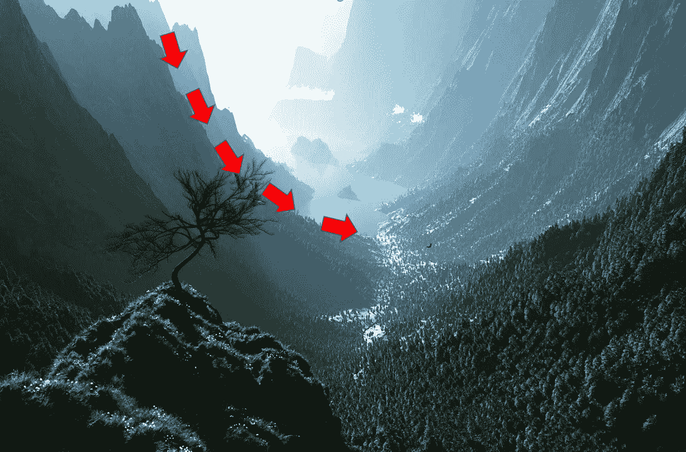
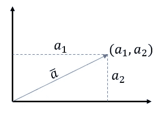
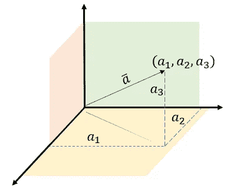
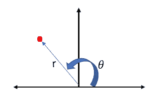
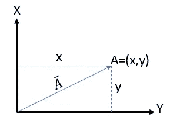
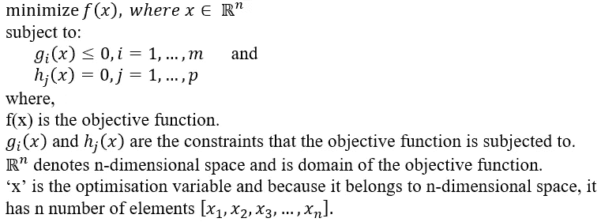

# 机器学习的优化算法

> 原文：<https://medium.com/nerd-for-tech/optimization-algorithms-for-machine-learning-4601f8815626?source=collection_archive---------13----------------------->

***第一章:简介***

照片由[皮埃特罗·詹](https://unsplash.com/@pietrozj?utm_source=medium&utm_medium=referral)在 [Unsplash](https://unsplash.com?utm_source=medium&utm_medium=referral) 上拍摄

这是优化算法系列的第一章。在这个系列中，我们将研究不同的优化概念，从凸规划问题到几何和动态规划问题。

在本章中，我们将了解:

*   什么是优化？
*   理解最优化问题的数学形式所需的基本概念
*   最优化问题的一般数学形式
*   最优化问题的应用

那么，我们所说的'**优化**'是什么意思呢？术语“优化”仅仅意味着找到特定问题的最佳结果——优化问题。“最佳结果”可能意味着找到问题的最小值，也可能意味着找到问题的最大值，这取决于我们正在处理的问题的类型。例如，假设你在一个山顶上，你的目标是最小化你的势能。势能由下式给出:PE = m*g*h，其中“m”是质量，“g”是重力加速度，“h”是高度。那么，这个问题的解决方法是什么呢？当然是下山，找到高度最小的点(因为‘m’和‘g’是常数)。在这种情况下，我们可以通过最小化来找到问题的最优解。同样，可能会有这样的问题，我们可能必须找到问题的最大值，以便对其进行优化。所以简而言之，‘优化’就是“找到最佳价值”。

最小化问题(由作者修改的原始图像；图片来源:[https://wallpaper.dog/valley-wallpapers](https://wallpaper.dog/valley-wallpapers)

现在让我们看看理解最优化问题的一般数学形式所需的一些初步概念。

**向量和向量元素的概念:**

那么，什么是矢量呢？向量可以被认为是 n 维空间中的一个点。所以，如果 n=1，向量代表直线上的一点。如果 n=2，向量代表平面上的一个点。如果 n=3，向量就是三维空间中的一个点。因此，对于较高的“n”值，向量将是高维空间中的一个点。n 维空间表示为:

下图显示了不同维度空间中的向量:

二维平面中的向量(图片由作者提供)

三维矢量(图片由作者提供)

表示向量有很多种方法。然而在我们的例子中，我们只需要知道两种表示向量的方法。下面列出并详细说明了这些问题:

1.  **极坐标向量表示法:**在这种表示法中，向量用向量的长度和向量与 x 轴正方向所成的角度来表示，以逆时针方向测量。下面是一个例子，显示了一个红点矢量和矢量的极坐标表示。r '是矢量的长度，即红点和原点之间的距离。“θ”是 x 轴和矢量之间的角度，代表矢量的方向。

向量的极坐标表示(图片由作者提供)

由红点表示的上述矢量将表示为:

2.**笛卡尔矢量符号:**在这种符号中，矢量由它的直角坐标来表示。这是我们进一步讨论中最需要的符号。从下面可以看出，矢量 Q 由它在 x-y 平面上的坐标来表示。x 和 y 被称为矢量的元素/分量。

向量的笛卡尔表示(图片由作者提供)

请注意，向量中元素的数量取决于它所在空间的维度。如果向量位于二维空间，它将有两个元素，如上图所示。如果向量位于三维空间，它将有 3 个元素，依此类推。

优化问题的一般数学形式由下式给出:

注意，优化问题也可以以最大化 f(x)的形式给出。在这种情况下，需要通过在 f(x)前面使用'-'符号，并通过相应地改变不等式约束以符合上面所示的一般形式，将问题转换成最小化问题。上面的一般形式基本上意味着找到向量 x 的“n”个元素的值，对于这些元素，函数值具有最最小值。这样找到的 n 个元素的值将是向量 x 的元素的最佳值。优化问题的域由问题中提到的约束来定义，即由 g(x)和 h(x)以及目标函数的域来定义。当我们讨论数学问题时，我们将进一步研究这个概念。需要注意的另一点是，这两个约束可能存在，也可能不存在。这样的优化问题称为无约束优化问题、等式约束优化问题等等。我们将在后面深入研究这些概念。值 x1，x2，…xN 不过是 N 维空间中不同点的元素。

现在，让我们看一些可以使用优化概念的实际例子。

1.  **股票投资组合优化:**假设我们想投资属于 3 个组织的股票，即谷歌有限责任公司、苹果公司和微软公司。假设 x1 代表要购买的 Google LLC 的股票数量，x2 代表要购买的 Apple Inc .的股票数量，x3 代表微软公司的股票数量。目标函数可以代表投资组合中需要最小化的总体风险的“度量”，并且是 x1、x2 和 x3 的函数。因此，X=[x1，x2，x3]并且目标函数可以由 f(x1，x2，x3)表示。在许多其他事情中，不等式约束可以表示对谷歌和微软股票投资金额的限制，这显然是 x1 和 x2 的函数。类似地，等式约束可以表示可以为苹果公司购买的股票的确切价值数。正如人们现在可以看到的，等式和不等式约束一起对原始问题的域施加了限制。例如，假设投资组合中的风险度量由函数 ax1+bx2+cx3 = 10 给出，并且该函数需要最小化。不等式约束和等式约束也可以分别是 yx1+zx3 < 500 和 x2=20。这些约束虽然没有以标准形式出现，但对 x1、x2 和 x3 的值施加了限制，因此有助于定义目标函数的域。
2.  **分布参数值选择:**对于熟悉统计建模的人来说，在我们希望从一系列潜在模型中找到最佳模型的任务中，该模型以尽可能最好的方式拟合训练数据和先验信息(关于训练数据的分布)，变量 x1，x2，…，xN 将代表训练数据的统计分布的参数(例如正态分布情况下的均值和方差)，目标函数将是参数的概率分布函数，我们试图使其最大化。
3.  **优化 ML 中的成本函数:**在机器学习的情况下，目标函数可以表示需要最小化的模型的成本函数。在基本意义上，成本函数表示训练数据的实际标签和相应的预测之间的误差。所以，这里有一个简单的问题:

在线性回归中，其成本函数由下面的公式给出，如果在优化中将成本函数与目标函数相关联，目标函数中的 X 向量有哪些元素？线性回归的成本函数由下式给出:

这个问题的答案在第二章的末尾。来看看吧，找到答案。

因此，我们可以清楚地看到优化概念将在数据分析和机器学习领域帮助我们的方式。在某种程度上，优化概念被用来从内部提高机器学习引擎的性能。

准备好摇滚了吗？！！

第二章:凸集与函数的链接是这里的。看看吧！！