# 机器学习的优化算法

> 原文：<https://medium.com/nerd-for-tech/optimization-algorithms-for-machine-learning-acffa886a343?source=collection_archive---------10----------------------->

***第三章:一些重要的凸集***

图片来源:【https://wallpaperaccess.com/crystal-ball】T5

“第二章:凸集与函数”的链接在这里是。第三章是关于最优化领域中使用的不同种类的凸集。这些集合变得非常重要，因为它们给了我们一个在 n 维空间中如何思考和处理问题的想法。

在本章中，我们将了解:

*   更多的向量概念
*   超平面
*   半空间
*   分离支撑超平面定理
*   标准球
*   多面体

最后，我们将看看第二章中提出的问题。这一章是我们在第二章中所采取的优化路线的延续。所有这些主题都将在后面的章节中与优化相关联。

本章将使用的一些符号是:∀表示“所有”，⊆表示“子集或等于”，∈表示“属于”，∩表示“交集”，∨∨表示“量级”

让我们从矢量的点积开始。向量乘法有两种类型，即点积和叉积。这里我们不需要向量的叉积。所以我们就不深究了。但是仅仅为了有一个概念，向量叉积分别关注向量的幅度和向量方向分量的乘积。另一方面，矢量的点积(也称为标量积)考虑了矢量的标量分量(长度)以及它们之间的角度。点积的数学表示由下式给出:

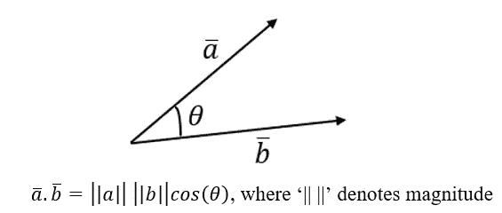

2 个向量的点积(图片由作者提供)

单位向量是长度被认为是 1 的向量。所以，如果你用一个向量除以同一个向量的大小，合成向量就是一个单位向量。如下图所示:

现在，让我们用向量的矩阵形式来看看点积。

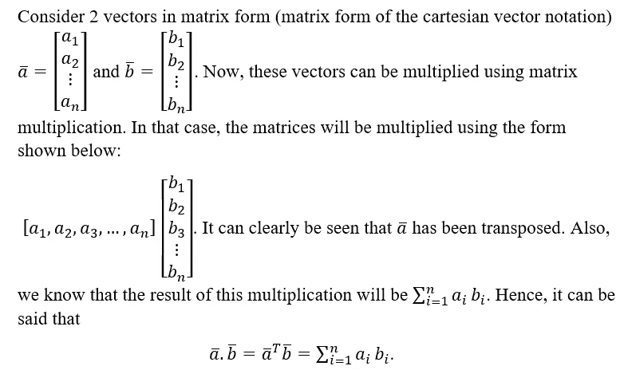

另一个需要注意的要点是，矢量的大小∑a ∨(比方说)可以用下面的公式计算。记住∨a∨也叫向量 a 的‘范数’。

现在让我们看看什么是**位置向量**。这个简单！位置向量是从系统原点到空间中特定点的向量。这些向量是不可移动的，因此也被称为约束向量。此外，这些向量不能彼此相加。但另一方面，这些向量可以相减。下面是一个位置向量的例子。

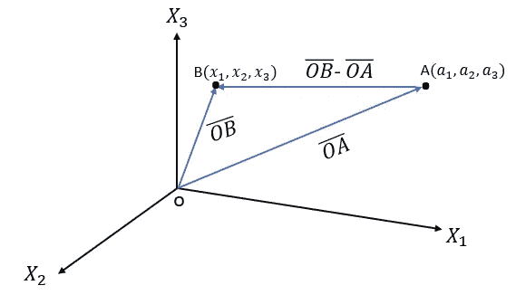

位置向量(图片由作者提供)

在上面的例子中，OB 和 OA 是位置向量，因为它们描述了点 B 和 A 相对于原点的位置。AB 是一个矢量，是 OB 和 OA 的矢量差。但是怎么做呢？是的，让我们看看什么是向量加法和向量减法。假设在上图中，你做了一个动作，从 O 点移动到 A 点，然后从 A 点移动到 b 点。那么，总距离是多少？当然是 OA+AB。但是，从 O 到 B 的总位移是多少呢？卒于所以，OA+AB=OB(注意 AB 不是位置向量。因此，可以将其添加到 OA 中)。现在，看看下面的例子。

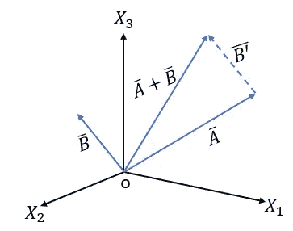

矢量加法(图片由作者提供)

看看矢量 A 和 B(这不是位置矢量)。既然一个不从另一个的终点开始，你怎么把它们加起来呢？这里我们使用了向量中一个非常重要的概念。如果两个向量具有相同的大小和方向，则它们被认为是相同的向量，无论这两个向量位于空间的何处。因此，矢量 B 已经被移动(不改变大小或位置)到不同的位置，这是矢量 A 结束的点。现在，我们可以使用之前用过的加法技术，发现合成位移由矢量 A+B 给出。

现在让我们看看什么是**超平面**。超平面的概念只不过是直线概念的延伸。是的，就是这么简单，你很快就会明白怎么做了。首先，让我们看看直线的一般方程。我们知道 2D 一条线的一般方程是:y=mx+c，从高中数学我们知道这个方程来自 ax+by+c=0。这个等式也可以写成 y= -(c/b) +(-a/b)x，其中(-a/b)形成直线的斜率‘m’，而(-c/b)是 y 截距。因此，你可以清楚地看到上述两个方程之间的相似性。现在，如果轴是 x1 和 x2 而不是 x 和 y，等式也可以写成 w1x1+w2x2+w0=0，其中 w1 和 w2 只不过是 x1 和 x2 的系数，并且在 ax+by+c=0 的情况下与“a”和“b”相同。还有，w0 只是一个常数。

稍微向前移动到三维几何中，平面的方程由下式给出:w1x1+w2x2+w3x3+w0=0。那么，你认为一个平面的方程在 n 维会是什么样的呢？简单。它将是 w1x1+w2x2+w3x3+…+wNxN+w0=0。**在 n 维中，一个平面被称为超平面**，超平面的方程，以更简洁的形式，可以写成:

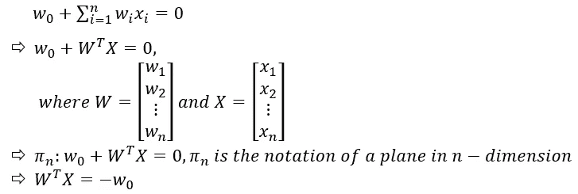

现在我们需要弄清楚 w0 是什么。让我们回到二维来看看一条直线的方程是什么意思。w1x1+w2x2+w0=0。这里，y 轴截距由 c=-(w0/w1)给出。现在，如果直线通过原点，那么 c=0，这隐含地意味着 w0=0。在这种情况下，

我们可以把同样的概念推广到一个超平面，得到上面的方程来表示它。我们一会儿会做的。现在，如果我们把 W 和 X 看作矢量，上面的等式基本上意味着矢量的点积，正如我们在前面章节中看到的。如果两个向量的点积为 0，这意味着向量之间的角度为 90 °(因为 cos90=0 ),因此向量彼此垂直。让我们记住这一点。

现在参考下图:

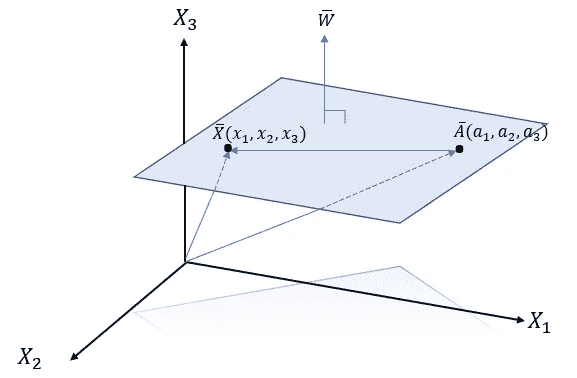

3D 平面(图片由作者提供)

在上图中，矢量 W 是平面的法向量。这意味着 W 垂直于平面，这暗示着它垂直于平面上的任何向量。同样，矢量 A 是一个位置矢量，指向坐标为(a1，a2，a3)的平面上的特定点‘A’。x 是另一个位置向量，用坐标(x1，x2，x3)指代平面上任意一点。现在，平面上的矢量 AX 由下式给出:

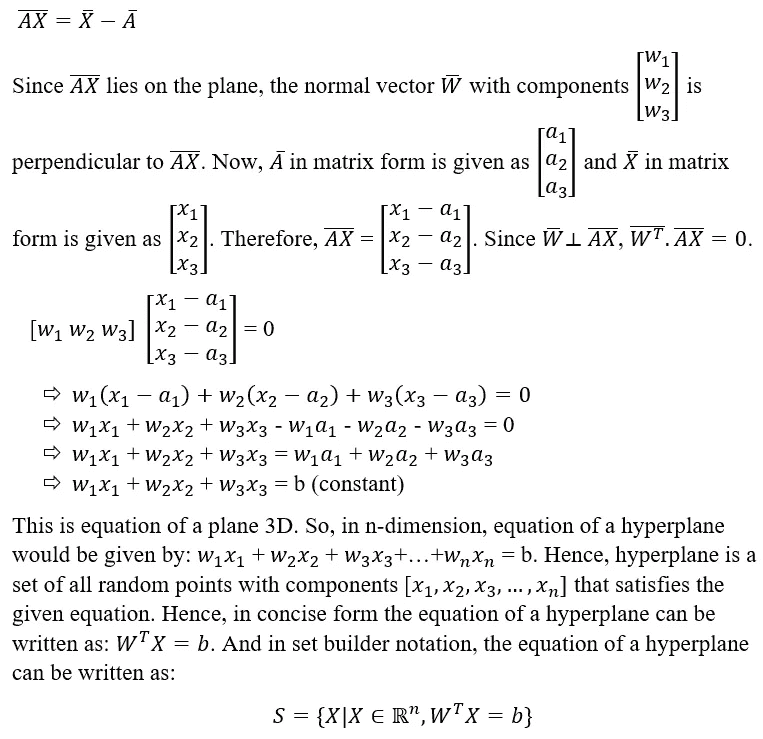

在某种程度上，“b”决定了超平面离原点或超平面的“偏移”有多远。所以，让我们看看当超平面通过原点时，超平面方程会发生什么。当这种情况发生时，向量 A 可以取为[0，0，0]，因为平面通过原点。因此，我们得到:

生成超平面的 python 代码如下所示:

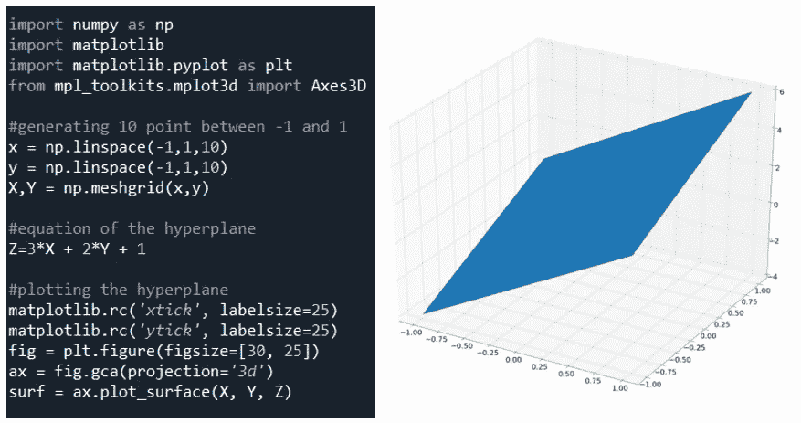

作者代码和图像

现在我们对超平面有了很好的理解，让我们看看下图中的**半空间**是什么。

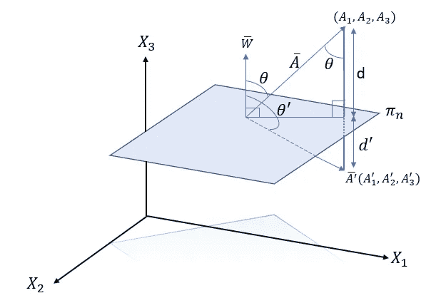

半空间(图片由作者提供)

如上图，假设∏n 是 3D 中的超平面。向量 W 是超平面的法向量。设(A1，A2，A3)是平面上的一个点，使得它位于与向量 W 相同的方向。设 A 是从 W 的底到点(A1，A2，A3)的向量。因此，为了测量点(A1，A2，A3)到平面的距离，我们从给定点向平面投一条垂线，使得该垂线平行于法向量 w，设该垂线的长度为‘d’。现在，由于 W 平行于 A 的垂线，下图中标为θ的角度相等。所以从这里，我们可以说:

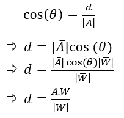

现在，我们可以清楚地看到，超平面将 3D 空间一分为二。一半位于超平面之上，另一半位于超平面之下。这些一半只不过是半个空间。半空间是整个 n 维空间的子集，由空间中超平面的存在而创建。现在让我们理解θ在确定半空间中所起的作用。在上图中，向量 W 和点(A1，A2，A3)位于超平面的同一侧。因此，

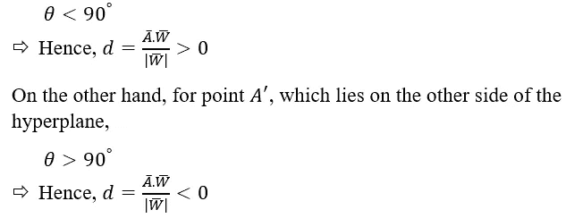

由于距离不能为负，我们取“d”的绝对值。然而，通过观察 d 的符号，我们可以确定这个点位于哪个半空间。因此，集合生成器符号中的半空间的等式由下式给出:

因此，法向量 W 位于与关注点相同方向的半个空间由大于/等于号给出。另一半空间由小于/等于号表示。所以，我有一个问题要问你。你认为过原点的超平面创建的半空间的方程会是什么？要找到答案，请看下一章的最后一节。

让我们在这里解决一个问题。证明半空间是凸集。

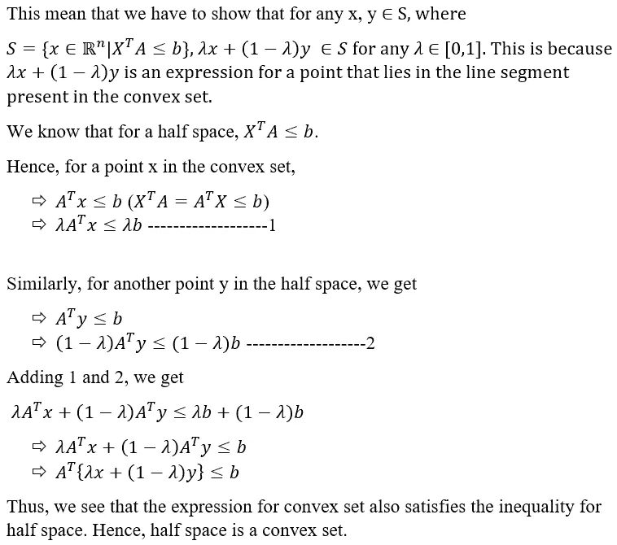

同样的证明也可以用于本章讨论的其他凸集。

我们现在需要看看超平面上的几个重要定理。这些定理规定了超平面如何与凸集相互作用。以下是定理。

**定理 1(分离超平面定理):**

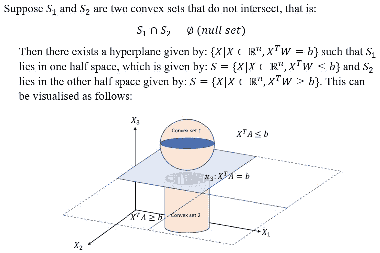

分离超平面定理(图片作者提供)

**定理 2(支撑超平面定理):**

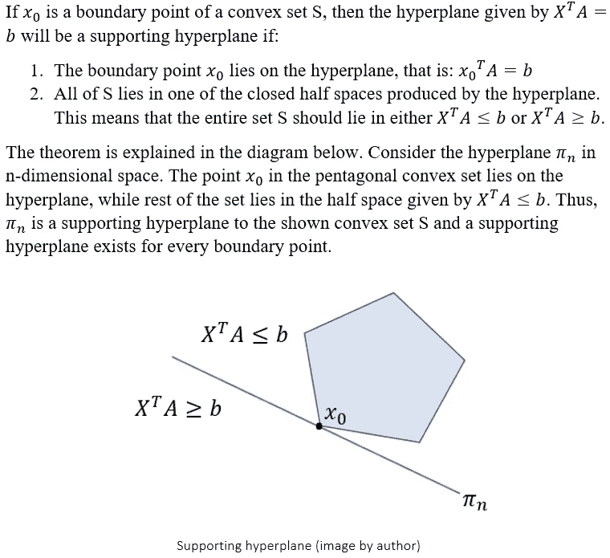

现在，让我们看看什么是规范球。为此，让我们理解规范的含义。范数是指向量的大小或长度，由∨x∨给出。求范数有很多方法。现在让我们来看看 2D 的空间。同样的概念可以扩展到 N 维。因此，考虑 2D 的向量 A，其分量[2，3]如下所示:

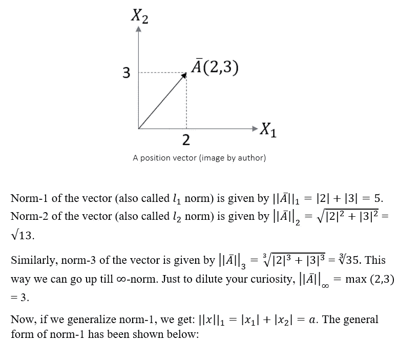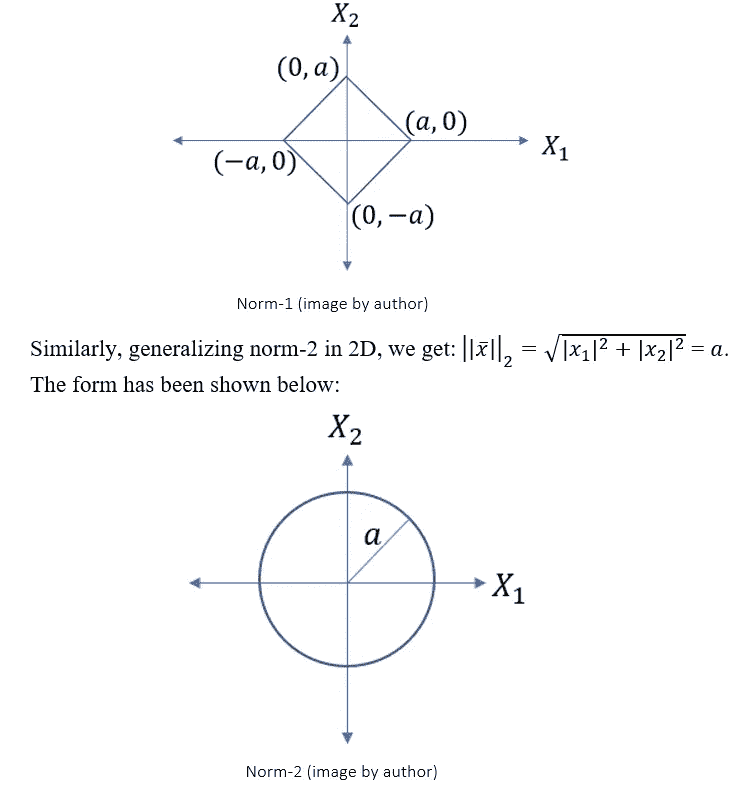

如果范数-1 和范数-2 等于 1，我们得到一个单位正方形和一个单位圆。现在，假设有一个圆心在原点，半径为 r 的圆。因此，由向量 x 表示的位于圆(向量 x 的范数-2)内或圆上的任意点的方程由下式给出:

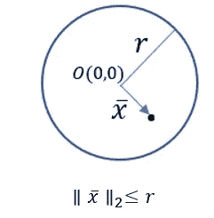

作者的方程式和图像

这里要记住的一点是，上面显示的圆只是由一个特定向量的长度创建的空间，而向量 x 只是该空间中的一个点。进一步推广该方程，如果我们将圆心移动到另一个点 Xc，由位于圆内部的向量 x 表示的任何点的方程由下式给出:

当这个概念扩展到 3D 时，我们得到一个规范球。范数球只不过是向量长度在 3D 中的范数 2 形式的表示，并且是由向量长度创建的空间。同样，如上所述，矢量 a 表示该空间中的任意点。请看下图，以便更好地理解它。

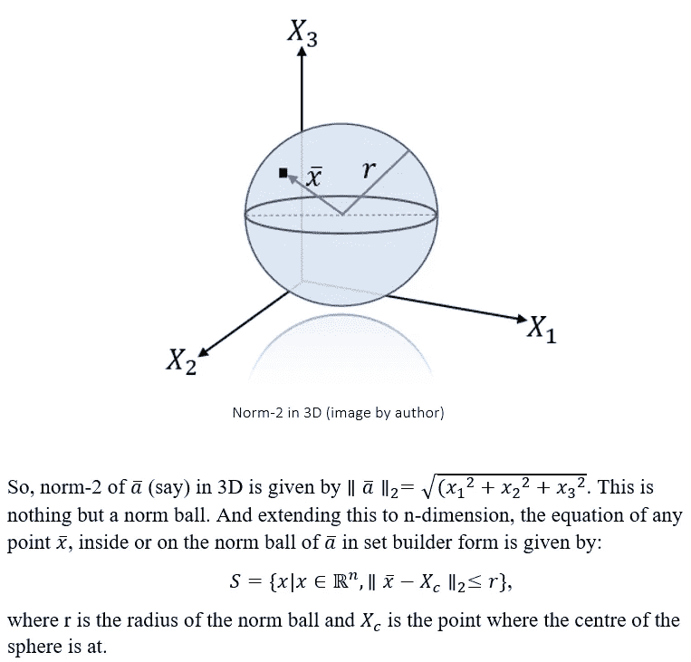

在这里，我有一个问题要问你。你能说出上图中范数球已显示的向量的大小吗？要找到答案，请看下一章的结尾。

本章最后一个题目是多面体。你必须从高中几何知道什么是多面体。如果没有，看看下图。那么现在，你能根据我们在这一章中讨论的主题解释什么是多面体吗？

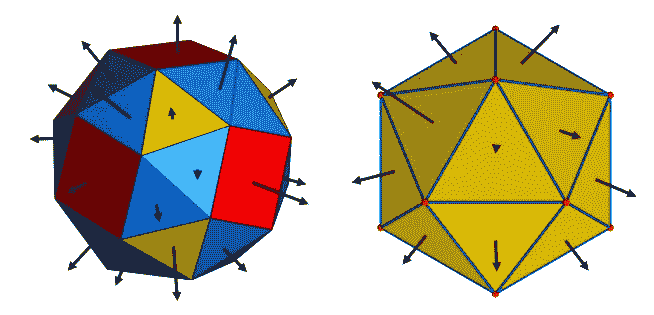

多面体和多面体中每个平面的法向量(图片由作者修改；原文出处:[https://commons.wikimedia.org/wiki/File:Polyhedron_20.png](https://commons.wikimedia.org/wiki/File:Polyhedron_20.png)；[https://commons . wikimedia . org/wiki/File:Uniform _ 多面体-43-s012.png](https://commons.wikimedia.org/wiki/File:Uniform_polyhedron-43-s012.png)

看上面的图表，你能猜出上面问题的答案吗？你认为箭头是什么？如果你能猜对，那就恭喜你了。箭头是相应平面的法向量。因此，多面体可以定义为 n 个超平面和半空间的交集。每个三角形和正方形都是由超平面以一定角度相交而形成的。同时，如果你稍微扩展一下你的想象力，你会意识到，即使是每个超平面所创造的半个空间，也是在多面体内部的空间中相交的。所以，这是一个多面体。数学上，多面体由下式给出:

最后，我们来到这一章的结尾。

前[章节](/nerd-for-tech/optimization-algorithms-for-machine-learning-23a4b71588a9)问题解答。

1.  我曾问过下面的表达方式是如何具有相同的含义的:

这两个表达式是相同的，因为如果只有两个点 x，y，并且第二个表达式被展开，那么 x1(在第二个表达式中)=x(在第一个表达式中)和 x2(在第二个表达式中)=y(在第一个表达式中)。因此:

2.接下来，我要求提出一个凹函数的不等式。这应该是相当简单的。凹函数的不等式条件可以是:

继续 ***第四章:重要凸函数与凸性质*** [此处](https://aviejay-techie-1989.medium.com/optimization-algorithms-for-machine-learning-d98d0feef53e#ed95-bff53a376901)。