# 需要了解的工具

> 原文：<https://medium.com/nerd-for-tech/osint-tool-to-know-768834d32898?source=collection_archive---------0----------------------->

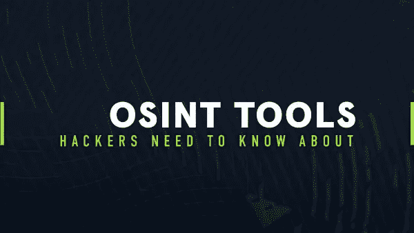

在之前的博客中，我们知道了什么是 OSINT，现在我们必须知道用什么工具来做 OSINT。

这篇博客给了你关于这些工具的见解。所以，让我们来看看。

# 肖丹

Shodan Seach 发动机

Shodan 被称为物联网设备的谷歌。Shodan 是一个搜索引擎，就像谷歌一样，但它不是搜索网站，而是搜索互联网连接的设备——从路由器和服务器到物联网(IoT)设备。安全专家用 Shodan 分析网络安全。

**Shodan 的工作原理是请求连接到互联网上每个可以想象的互联网协议(IP)地址，并索引从这些连接请求中获得的信息。**

Shodan 使用全天候运行的全球计算机和服务器网络来搜索设备。

IP 地址是你的设备的数字签名——它允许谷歌根据你的位置定制搜索，它允许所有连接互联网的设备相互通信

连接互联网的设备有特定的“端口”,用于传输特定类型的数据。一旦您建立了设备的 IP 地址，您就可以建立到其每个端口的连接。有用于电子邮件的端口，用于浏览器活动的端口，以及用于打印机和路由器的端口——总共 65，535 个端口。

Shodan 每天全天不停地“敲打”每一个可能的 IP 地址的每一个可以想象的端口。其中一些端口不返回任何内容，但许多端口会以横幅响应，其中包含 Shodan 请求连接的设备的重要元数据。

# Censys

Censys 帮助组织、个人和研究人员找到并监控互联网上的每一台服务器，以减少暴露并提高安全性。

***攻击面管理(ASM)***

在 Censys，我们可以看到这一切。我们世界领先的攻击面管理平台赋予组织第六感——无情地监控资产，发现未知，并主动给予安全团队解决问题的机会，以免问题发生。

这不是国防保安。这是一个警惕攻击的系统，不断地查看从 HTTP 主机到消息代理到远程桌面暴露到网络打印机的一切。寻找潜在的漏洞，弥补协议中的漏洞，并找出任何潜在的弱点。

***发现&调查互联网资产***

包括主机、服务、SaaS 登录、网站、存储桶和 ICS/IoT 设备，而不考虑最终记录系统的云、帐户、网络或位置。

***进行快速反应***

快速识别和保护可能被关键漏洞利用的互联网资产。

***分清轻重缓急&补救风险***

在上线后几小时内发现、区分优先级并补救关键风险(*，例如潜在的数据丢失、关键漏洞、暴露的设备/API/登录信息*)。

***识别云曝光***

查明所有提供商的云中的弱点。

***管理收购，子公司&第三方风险***

了解与不受控制的公司(收购、子公司、承包商和其他依赖关系)相关的安全风险。

# 佐梅耶

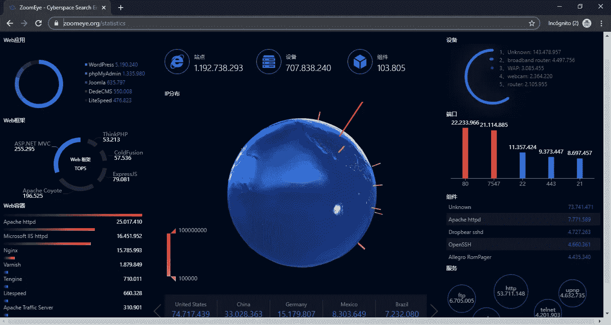

Zoomeye 是一个允许你搜索设备、网站和服务的搜索引擎。这是一个黑客搜索引擎网上有很多与 Zoomeye 有关的高调新闻。搜索引擎具有方便的功能、灵活的搜索设置和自己的 API。

[Zoomeye](https://www.zoomeye.org/) 是由中国安全公司 Knownsec Inc .开发的搜索引擎，第一版于 2013 年发布。ZoomEye 在其核心使用 Xmap 和 Wmap 从开放设备/web 服务收集数据，并用于指纹分析。

得益于大量使用全球 IPv4、IPv6 地址和网站域名数据库的全球测绘节点，它可以一天 24 小时连续扫描和识别大量服务端口和协议，并最终绘制整个或局部网络空间的地图。您还可以检查漏洞影响评估并搜索特定主题。数据库，工业，区块链，防火墙，路由器，网络存储，相机，打印机，WAFs，网络存储，

# 马尔特戈:

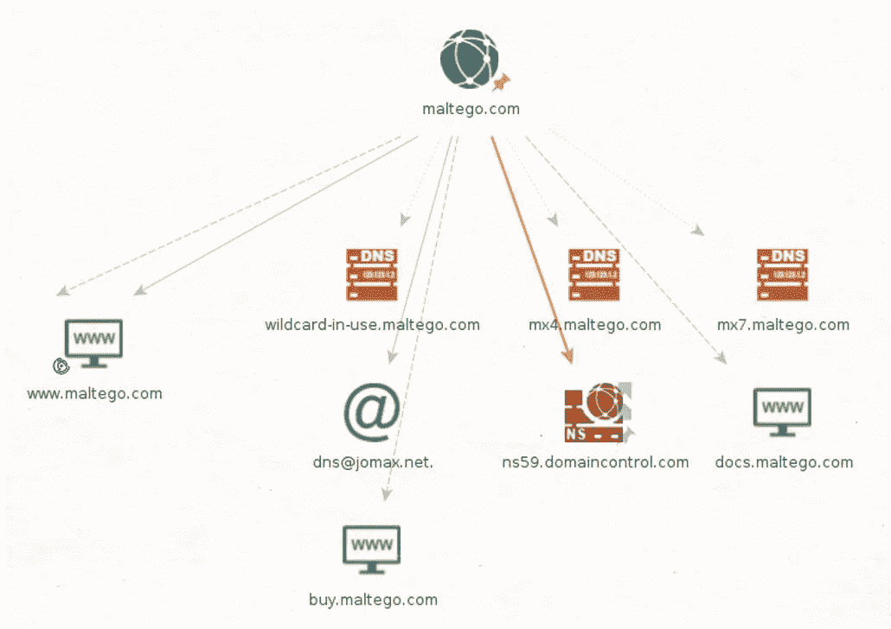

Maltego 通过出色的地图和变换使复杂的操作变得简单。 **Maltego** 是用于[开源情报](https://en.wikipedia.org/wiki/Open-source_intelligence)和取证的软件。Maltego 专注于提供一个转换库，用于从开源中发现数据，并以图形格式可视化这些信息。Maltego 是最好的信息收集和数据挖掘工具之一。

事实上，你可以收集任何信息——人、化学武器、IP 地址、恐怖分子、银行账号等等。… Maltego 使用转换来获取所需的信息。转换中心是获取数据的大量网站(例如 Shodan、VirusTotal 等)。在大多数情况下，您必须手动安装每个转换，因为它们不是预安装的。此外，转换是获取输入并以特定方式输出与输入相关的可视输出的代码片段。然后在空白画布上可视化地呈现数据挖掘。Maltego 包含数百个变换。因此，你可以实时筛选数据。

# 收割机

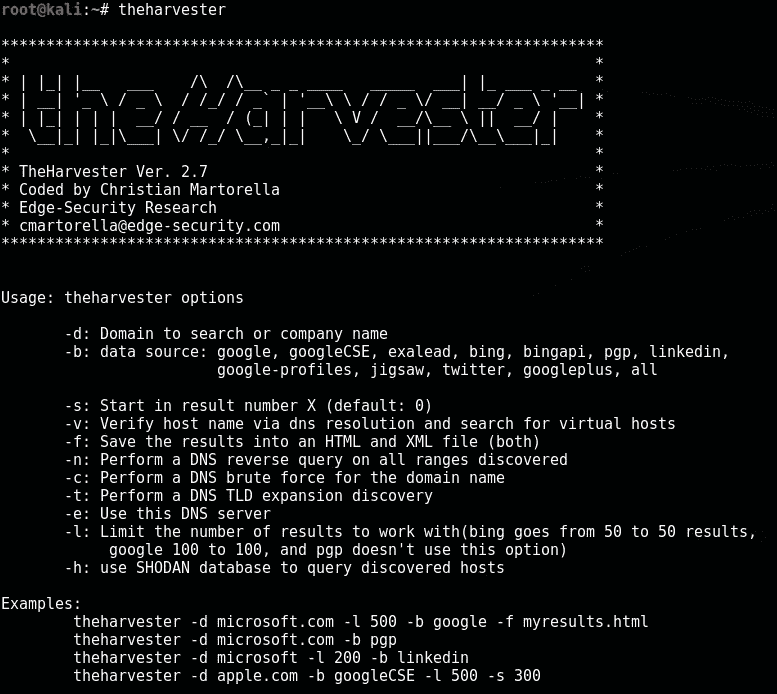

我们可以称网络收割机为 OSINT。收割机是一个简单易用但功能强大的工具，设计用于红队评估或渗透测试的侦察阶段。它执行开源情报(OSINT)收集，以帮助确定域的外部威胁形势。它用于从不同的公共来源(如搜索引擎和 PGP 密钥服务器)查找与某个域相关的电子邮件帐户、子域名、虚拟主机、开放端口/横幅和员工姓名。

此外，这将有助于描绘出目标的互联网足迹有多大。此外，对于那些希望在可免费访问的网页上看到多少员工信息可供公众使用的组织来说，这也很有用。

本质上，给定一定的标准，收割机将作为您的代理在互联网上运行，抓取任何和所有符合一定标准的信息。在继续讨论之前，我还想指出一件事。该工具可用于收集电子邮件地址，这对于试图破解在线登录凭证或获取个人电子邮件帐户的攻击者来说非常有用。

# 侦察

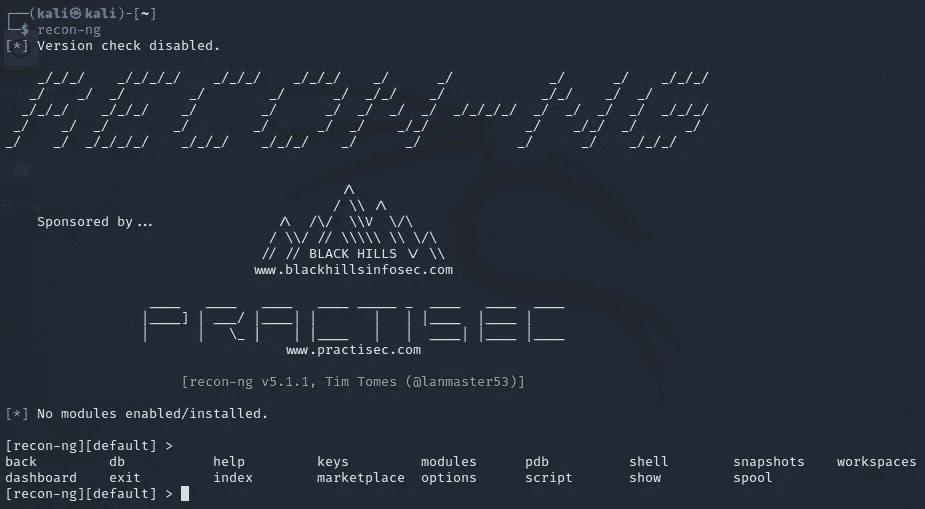

Recon-ng 是一个用 Python 编写的全功能网络侦察框架。通过独立模块、数据库交互、内置便利功能、交互式帮助和命令完成，Recon-ng 提供了一个强大的环境，在其中可以快速、彻底地进行开源的基于 web 的侦察。

***我们在哪里用侦察***

*   侦察用于探测**目标的 IP 地址。**
*   侦察可用于查找敏感文件，如 **robots.txt**
*   我们使用 Recon-ng 来检测使用**目标 web 应用程序**的**内容管理系统(CMS)** 。
*   侦察包含几个模块，我们可以用它们来收集目标的信息。
*   识别端口扫描器模块找到用于保持对服务器访问的关闭和打开的端口**。**
*   识别子域查找器模块用于**查找 **singer 域**的子域**。
*   我们可以使用 Recon-ng 查找与使用 WHOIS 信息的**地理 IP 查找、端口扫描、标题抓取、子域名信息、** **DNS 查找、反向 IP** 相关的信息。
*   我们可以使用 Recon-ng 来寻找基于错误的 SQL 注入。

# 用户搜索:

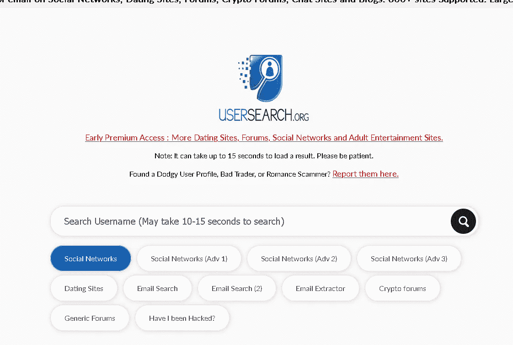

用户搜索是最大的免费反向搜索工具。用户搜索是一个存在于网络上的巨大的搜索引擎网络，它能找到用户名或电子邮件地址的精确匹配。它有一个详尽的服务列表，如电子邮件查找、论坛用户、加密网站用户、约会网站查找和成人网站查找。它甚至可以分析一个网页，并找出该页面上的所有电子邮件。

# 米塔卡

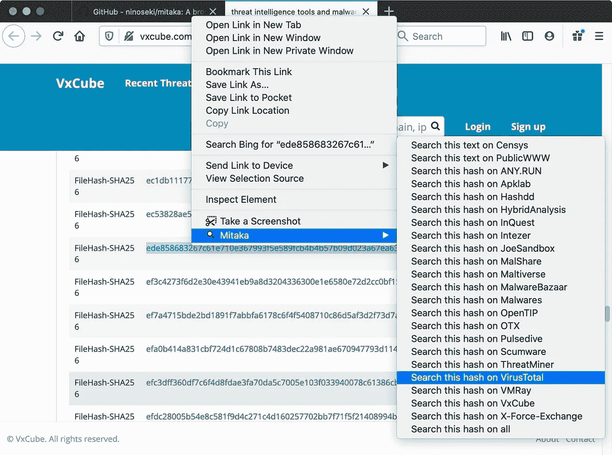

Mitaka 用于查找 IPs、MD5、ASN 和比特币地址。

Mitaka 用于识别恶意软件，确定电子邮件地址的可信度，并发现 URL 是否与错误的内容相关联。您可以选择并检查某些您认为可能可疑的文本和妥协迹象(IoC ),方法是在各种不同的搜索引擎中运行它们，只需到处点击几下。

Mitaka 用于执行浏览器内在线调查，以识别恶意软件、粗略网站和可疑电子邮件，并帮助个人获得意识和安全。

**通过使用 Mitaka 你可以做这些事情:**

*邮箱地址检查*

*可疑网址*

*恶意软件分析*

*检查场地是否粗糙*

# 蜘蛛脚

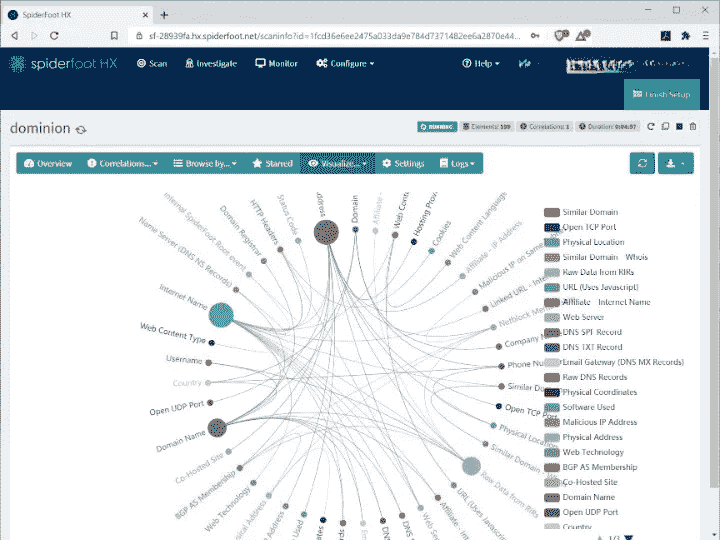

Spiderfoot 是一个 OSINT 工具，可以自动化整个 OSINT 过程。它自动化了大量手工需要很长时间才能完成的查询。由于 web 上有大量关于不同服务、网络和协议的数据……从每个地方一次一个地收集所有这些信息成为一项非常耗时的任务。

这时候 SpiderFoot 就来帮忙了，因为它可以用来自动收集信息，在一个工具中找到关于你的目标的任何信息。

为了自动化 OSINT，Spiderfoot 查询 100 多个公共信息源，并处理来自域名、电子邮件地址、姓名、IP 地址、DNS 服务器等的所有情报数据。

指定目标，选择要运行的模块，Spiderfoot 将为您执行整个工作，收集所有数据以构建您正在调查的任何内容的完整档案。

***蜘蛛脚主要特征***

*   ***开源:*** 这个安全工具是用 Python 写的，托管在 Github 上。最棒的部分是它是开源的，这意味着任何人都可以贡献自己的力量使它变得更好。
*   ***多平台:*** Spiderfoot 可以在 Linux 和 Windows 两种操作系统上运行。
*   web 界面: 默认情况下，Spiderfoot 可以从 CLI 界面运行，但是，它也支持一个很酷的 Web 界面，适合那些想要易用性、花哨的图标和丰富的图形可视化的人。
*   ***模块支持:*** 它的工作原理包括 100 多个+模块，可以帮助针对目标网络运行几乎任何种类的测试。蜘蛛脚模块被编程为彼此交互，允许所有相关模块共享关于目标的相同数据。
*   ***文档:*** 与其他 OSINT 工具不同，Spiderfoot 不仅在代码方面写得很好，而且它还有一个出色的[文档](http://www.spiderfoot.net/documentation/#overview?rel=nofollow,noopener,noreferrer&target=_blank)区域，可以让你发现、阅读和理解所有东西是如何工作的，包括安装过程、用法、模块等。
*   ***蜘蛛脚 HX:*** 虽然标准版可以在任何环境下工作，但你也可以选择从自己的[自托管云平台](http://www.spiderfoot.net/hx/)运行蜘蛛脚，它比自托管版包含了更多的高级功能。

# Spyse

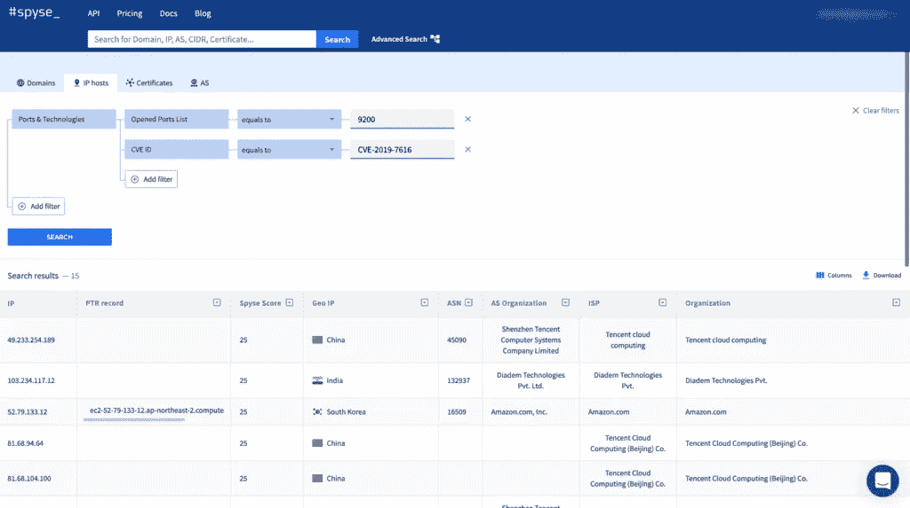

Spyse 是一个网络安全搜索引擎，用于查找有关不同互联网实体、商业数据和漏洞的技术信息。这是一个一体化平台，无需使用任何额外工具即可快速轻松地进行侦察。

Spyse 如此独特的一个特征是它的数据收集。Spyse 使用全球 60 台服务器收集数据。将这些服务器放置在地理上不同的区域可以避免速率、地理位置和 ISP 阻塞。Spyse 使用 38 台自行开发的扫描仪进行定性数据收集，这些扫描仪将其数据合并到一个扫描管道中。

Spyse 还在目标域上执行网络爬行，因此，也可以检索链接、robots.txt 文件和 HTTP 头等信息。这有助于识别网站范围内使用的现有技术，识别敏感 URL 和映射应用程序。Spyse 还能够发现存在于同一 IP 地址上的其他域。这是渗透测试报告中的常见发现，因为同一主机上的多个域增加了攻击面。

[Spyse](https://spyse.com/) 还可以通过识别开放端口并将端口发现与 CVE(常见漏洞&暴露)号进行匹配来执行漏洞发现。搜索功能还允许该服务的用户通过 CVE 号码进行搜索:

# 智力 X

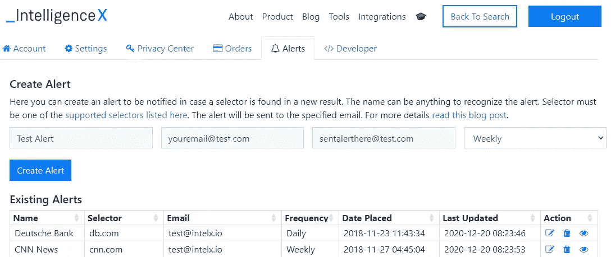

我们实际上可以称智能 X 为一个几乎包含所有信息的数据库。

[Intelligence X](https://intelx.io/) 是一款首创的档案服务和搜索引擎，不仅可以保存网页的历史版本，还可以保存由于内容的不良性质或法律原因而从网络上删除的所有泄露的数据集。虽然这听起来可能类似于互联网档案馆的 Wayback 机器所做的，但 Intelligence X 在服务重点保存的内容类型方面有一些明显的差异。说到保存数据集，不管有多大争议，Intelligence X 都不会歧视。

# 搜索代码

Searchcode 也被称为代码的谷歌。 [Searchcode](https://searchcode.com/) 是一种独特的搜索引擎，在免费源代码中寻找智慧。开发人员可以使用 Searchcode 来识别与代码中敏感信息的可访问性相关的问题。

该搜索引擎的工作方式类似于谷歌，但它不是索引网络服务器，而是在运行的应用程序或开发中的应用程序的代码行之间寻找信息。

搜索结果可以帮助黑客识别用户名、漏洞或代码本身的缺陷。

# Metagoofil

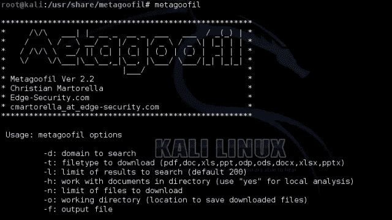

Metagoofil 是一个信息收集工具，用于提取目标公司或组织的公共文档的元数据，这些文档在网站上很容易找到。

它用于从目标网页或任何其他公共网站上找到的 PDF、DOC、XLS、PPT、ODP 和 ODS 等文档中提取信息。该工具使用 Google 来查找文档，然后将它们下载到本地磁盘，并提取所有元数据。

Metagoofil 分析这些文档的元数据并收集大量信息。它可以找到敏感信息，如用户名、真实姓名、软件版本、电子邮件和路径/服务器。

黑客可以使用 Metagoofil 来收集用户名信息，并执行更容易的暴力攻击。它还可以向黑客展示可能泄露操作系统、网络名称、共享资源等信息的文件路径。

# Tineye

TinEye 是另一个很好的工具，可以帮助你在网上进行与图片相关的搜索。你甚至可以检查图片是否在线，以及图片出现在哪里。它使用机器学习、神经网络和水印/模式识别在网络上寻找相似的图像，而不是关键字匹配。该工具有助于使用反向图像搜索选项在社交媒体网站上搜索图像

可以使用图像 URL 或图像本身进行图像搜索。也可以使用 API 和浏览器扩展来直接查找特定图像，而不是重复访问 web 应用程序。

# Exiftool

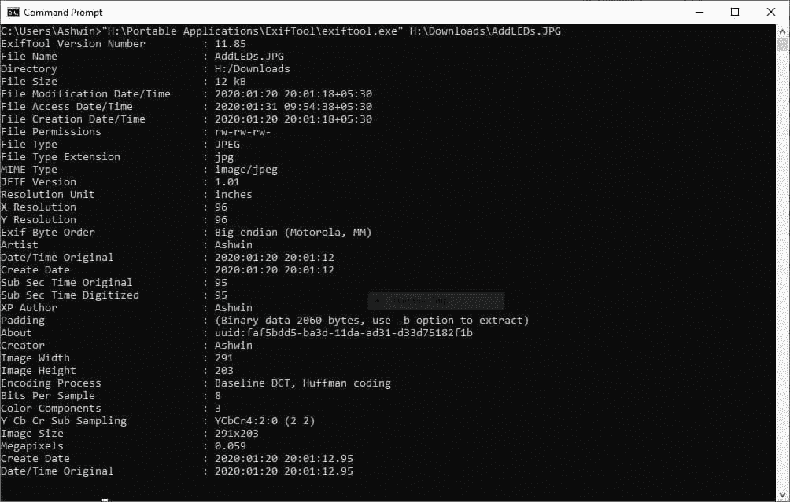

[***Exiftool***](https://exiftool.org/) 是一款免费的开源软件程序，用于读取、写入和更新 PDF、音频、视频、图像等各类文件的元数据。它是独立于平台的，可以作为 Perl 库和命令行应用程序使用。元数据可以描述为关于数据的信息，例如文件大小、创建日期、文件类型等。ExifTool 非常容易使用，并提供了大量的数据信息。

Exiftool 是一个具有大量功能的工具，能够处理超过 130 个不同组 的 23，000 个标签。你甚至可以定义自定义标签！

# OpenVAS

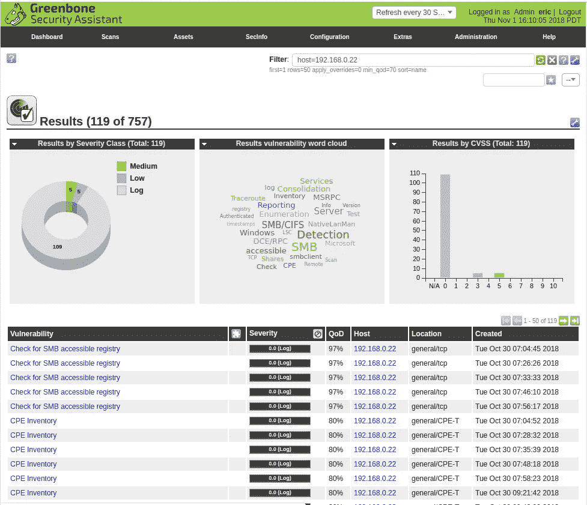

OpenVAS 或开放漏洞评估系统是一个笔式测试框架，其工具集允许您扫描和测试系统的已知漏洞。OpenVAS 使用一个包含已知利用和漏洞集合的数据库。

OpenVAS 包括:

*   由结果和配置组成的数据库
*   运行各种网络漏洞测试的扫描程序
*   网络漏洞测试的集合
*   Greenbone Security Assistant 是一个 web 界面，允许您在浏览器中运行和管理扫描

它对一个 IP 地址进行全面的安全测试。它将首先对 IP 地址进行端口扫描，以找到开放的服务。一旦发现监听服务，就使用大型数据库对它们进行已知漏洞和错误配置的测试。结果将汇编成一份报告，其中包括每个漏洞的详细信息以及发现的值得注意的问题。

一旦您收到测试结果，您将需要检查每个发现的相关性和可能的假阳性。应对任何已确认的漏洞进行重新调解，以确保您的系统没有风险。

# Nmap

[Nmap](https://nmap.org/) 意为“网络映射器”，是最流行、使用最广泛的安全审计工具之一。Nmap 是一个免费的开源工具，用于本地和远程主机的安全审计和网络探测。这将是攻击者用来攻击您的网站或 web 应用程序的第一个程序。

Nmap 通过使用 IP 数据包检测网络上运行的主机和 IP，然后检查这些数据包，以包括主机和 IP 的详细信息，以及它们运行的操作系统。

Nmap 的主要功能包括端口检测(确保您知道在特定端口上运行的潜在实用程序)、操作系统检测、IP 信息检测(包括 Mac 地址和设备类型)、禁用 DNS 解析和主机检测。

# WebShag

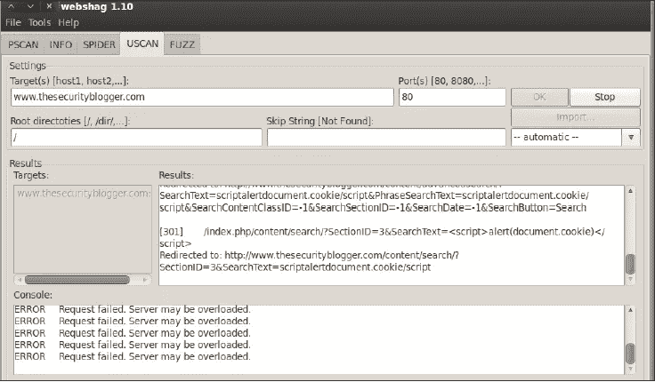

webshag(免费的 Web 服务器审计工具)是一个多线程、多平台的 Web 服务器审计工具。它用 Python 编写，收集了 web 服务器审计的常用功能，如网站爬行、URL 扫描或文件模糊。

Webshag 可用于通过代理并使用 HTTP 认证(基本和摘要)来扫描 HTTP 或 HTTPS 中的 web 服务器。除此之外，它还提出了创新的 IDS 规避功能，旨在使请求之间的关联更加复杂(例如，对每个请求使用不同的随机 HTTP 代理服务器)。

# 建筑

BuiltWith 是一个用于查找网站构建内容的网站。如果你需要收集某个网站的技术细节，你可以使用这个工具。这个 OSINT 工具是一个网站分析器、竞争分析和商业智能工具。你可以使用他们的免费搜索引擎来分析网站的技术概况。只需输入一个域名，然后点击搜索，就可以找到一个网站正在使用的内容管理系统(CMS)或内容框架，包括小部件和插件。

如果你不想使用 BuiltWith，Wappalyzer 是另一个选择。

# Grep.app

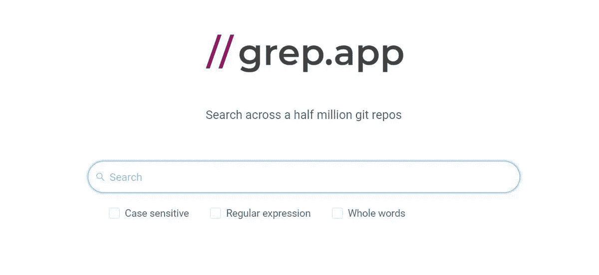

你如何在互联网上搜索 50 万个 git repos？当然，你可以尝试 GitHub、GitLab 或 BitBucket 提供的个人搜索栏，但是 [Grep.app](https://grep.app/) 的工作效率非常高。

Grep.app 在搜索与 IOCs、易受攻击的代码或隐藏在 OSS repos 中的恶意软件(如 [Octopus Scanner](https://blog.sonatype.com/octopus-scanner-compromises-26-oss-projects-on-github) 、 [Gitpaste-12](https://www.bleepingcomputer.com/news/security/gitpaste-12-worm-botnet-returns-with-30-plus-vulnerability-exploits/) ，或恶意 GitHub Action[crypto mining PRs](https://www.bleepingcomputer.com/news/security/github-actions-being-actively-abused-to-mine-cryptocurrency-on-github-servers/))相关的字符串时也很有用。

# HaveIbeenPwned

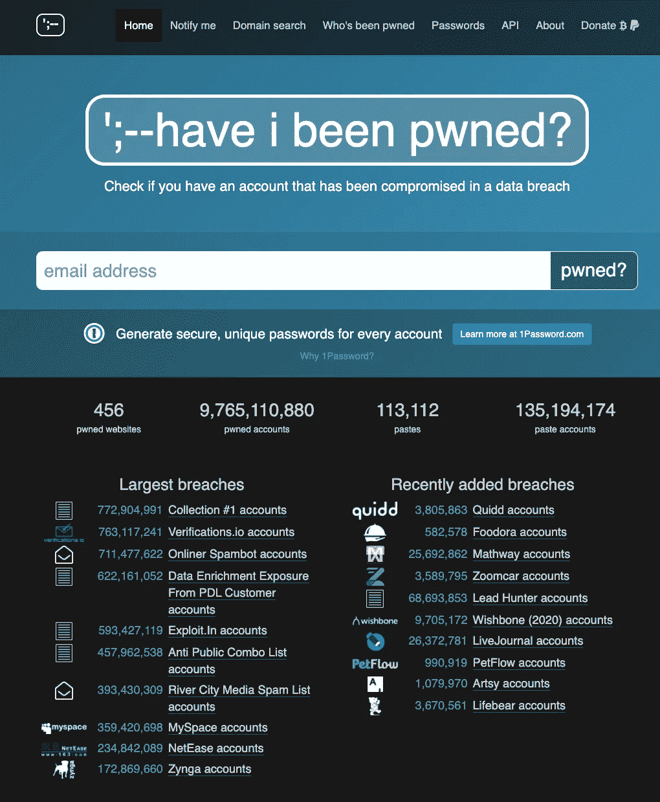

[HavIbeenPwned](https://haveibeenpwned.com/About) 是每个安全研究人员的首选工具之一。它维护着过去几年泄露的密码、电子邮件和电话号码的数据库。

近来，安全漏洞频繁发生，这要求安全专业人员时刻保持警惕。当您需要检查最新的公开违规是否有您的凭据时，HaveIbeenPwned 会非常有用。

HaveIbeenPwned 为组织提供的一个吸引人的功能是域搜索。每当系统发现特定域的数据遭到破坏时，它都会通知域所有者。但是要使用该功能，必须首先验证他拥有该特定的域。在此之后，HaveIbeenPwned 将在系统每次发现数据泄露时自动发送电子邮件。

# 已验证

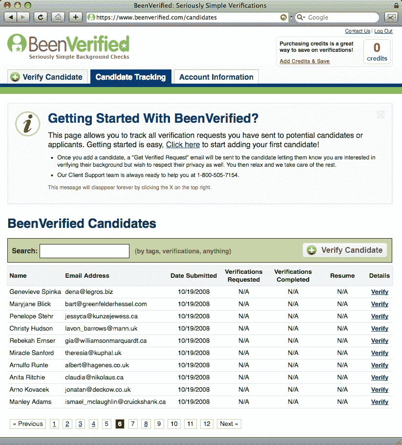

[BeenVerified](https://www.beenverified.com/) 是一个具有市场竞争力的应用程序，可以在公开的网络记录中查看个人。在领导 It 安全调查以寻找某个不知名个人的详细信息时，查询有关地球上任何个人的更重要数据非常有帮助。

当你完成后，搜索结果将包括每个匹配给定名字的人，以及他们的细微之处、地理区域、电话号码等等。在系统收集结果后，BeenVerified 将生成一份全面的数据报告。

令人难以置信的是，BeenVerified 还包含了来自政府来源和犯罪记录的数据。

BeenVerified 的数据来源包括来自不同数据集的数据，清算记录，职业历史，基于网络的媒体简介，以及令人惊讶的在线照片。

所以，当你在网上搜寻某个人的具体信息时，BeenVerified 可以作为你的第一站

# 谷歌呆子

搜索引擎确实为我们提供了很多信息，而谷歌是最受欢迎的，它被用来收集关于某个目标的信息。 **Google Dorks** 是最有用的开源情报工具之一，它使用一些令人惊叹的运营商来提供这些信息。多克帮助你更有效地进行有针对性的搜索。

谷歌呆子通常被称为 GHDB(谷歌黑客数据库)，是专门为信息收集阶段的笔测试人员设计的。

以下是它的一些运算符:

*   Ext:这用于定义具体要查找的文件扩展名。
*   Intext:用于查找页面上的特定文本。
*   Filetype:用于查找用户需要查找的特定文件类型。
*   Inurl:这用于检索 url 中包含特定文本的网页。
*   Intitle:这用于检索标题中有特定文本的网页。

搜索引擎也索引日志文件，呆子可以访问它们找到漏洞和隐藏的数据。

# 检查用户名

社交媒体拥有大量数据，因此在不同的主要社交网络上寻找用户名是一项耗时的任务。通过使用 CheckUsernames，你可以同时在几个社交网络上搜索一个用户名。它会在 160 多个网站上搜索特定的用户名。用户可以检查特定站点上目标的存在，以使攻击更有针对性。这个工具对于网络安全活动非常有用

因此，最后，它是一个快速而有用的工具，只需一次简单的搜索，就可以在主要的社交网络中查看你的品牌。

# 令人毛骨悚然的

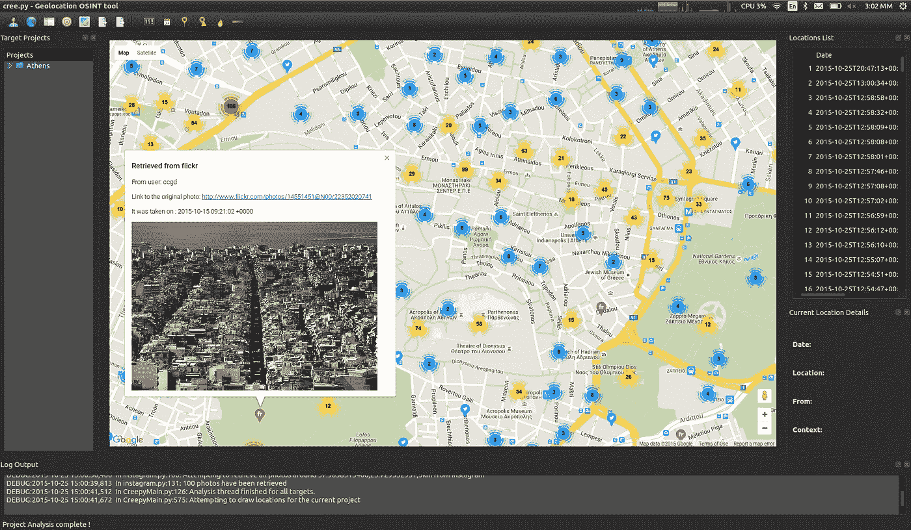

图片分享是社交媒体平台最常用的功能之一。但是在分享的时候，有时我们甚至会分享照片拍摄的确切位置。Creepy 是一个 python 应用程序工具，它提取细节并在地图上显示地理位置。它通过各种社交网络平台收集地理位置数据，并根据确切的日期和位置作为搜索过滤器提供报告。

Creepy 支持对 Twitter、Flickr 和 Instagram 的搜索，可以下载 CSV 或 KML 格式的报告进行额外的分析。

# 凶猛的

激烈，一个神奇的网络映射，和端口扫描工具。通常用于定位网络中不连续的 IP 空间和主机名，它不仅仅是一个简单的 IP 扫描器或 DDoS 工具。这是一个伟大的侦察工具，被世界各地的怀特哈特社区所使用。

凶是专门为企业网络设计的，用于发现其系统网络中的可能目标。能够在几分钟内扫描域，激烈成为大型网络中执行漏洞检查的首选工具。

它的一些定义特征包括:

*   对指定范围执行反向查找
*   内部和外部 IP 范围扫描
*   能够执行整个 C 类扫描
*   枚举目标上的 DNS 记录
*   出色的暴力破解功能，加上反向查找，如果暴力破解无法找到多个主机
*   名称服务器发现和区域转移攻击

***如何凶猛的执行扫描***

尽管它是一个如此足智多谋和有效的侦察工具，但它的工作相对简单。如果它不能容易地执行目标域的区域转移，它就用强力攻击开始扫描过程。凶使用一个预先确定的单词表，其中包含它可以检测到的可能的子域。如果一个子域不在列表中，它将不会被检测到。

# 福卡

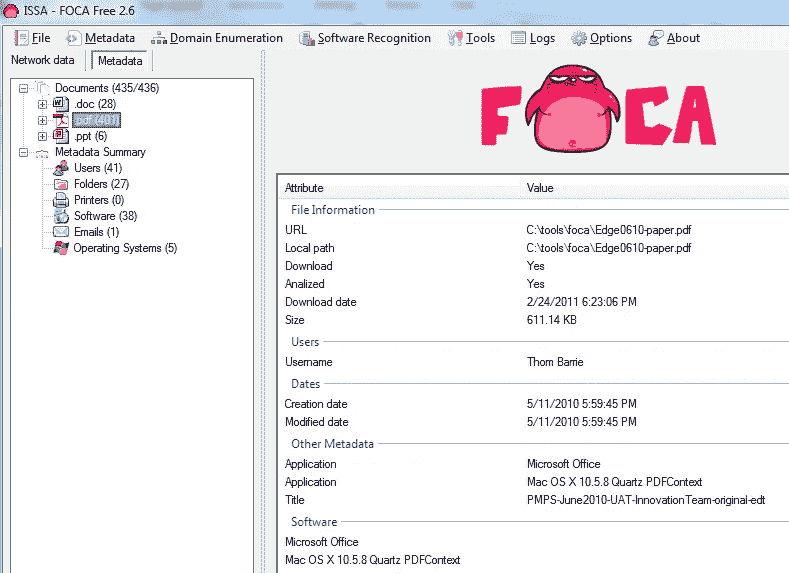

FOCA 代表收集档案的指纹组织。FOCA 是一种工具，主要用于在其扫描的文档中查找元数据和隐藏信息。这些文件可能在网页上，可以下载和分析 FOCA。

它能够分析各种各样的文档，最常见的是 **Microsoft Office** 、 **Open Office** 或 **PDF** 文件，尽管它也分析 Adobe InDesign 或 SVG 文件。

使用三个可能的搜索引擎来搜索这些文档: **Google** 、 **Bing** 和 **DuckDuckGo** 。来自三个引擎的结果的总和相当于大量的文档。还可以添加本地文件以从图形文件中提取 EXIF 信息，甚至在下载文件之前，就可以对通过 URL 发现的信息进行完整的分析。

# 重新蜘蛛

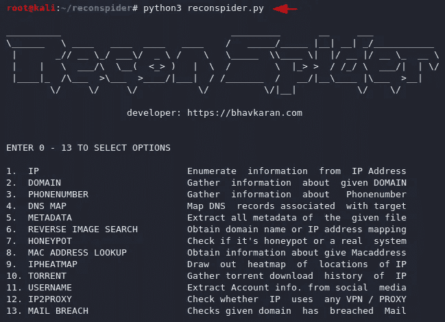

**ReconSpider** 是最先进的开源情报(OSINT)框架，用于扫描 IP 地址、电子邮件、网站和组织，并从不同来源找出信息。

信息安全研究人员、渗透测试人员、漏洞猎人和网络犯罪调查人员可以使用 ReconSpider 来查找有关其目标的深层信息。

ReconSpider 聚合所有原始数据，将其可视化显示在仪表板上，并促进数据的警报和监控。

侦察蜘蛛还结合了[波](https://github.com/adithyan-ak/WAVE)、[光子](https://github.com/s0md3v/Photon)和[侦察犬](https://github.com/s0md3v/ReconDog)的能力，对攻击面进行全面的枚举。

**为什么叫 ReconSpider？**

`**ReconSpider**`**=**`**Recon**`**+**`**Spider**`

*   侦察=侦察

侦察是通过各种探测手段获取关于敌人或潜在敌人的活动和资源，或特定区域的地理特征的信息的任务。

*   **蜘蛛=网络爬虫**

网络爬虫有时被称为蜘蛛或蜘蛛机器人，通常简称为爬虫，是系统地浏览万维网的互联网机器人，通常用于网络索引(网络蜘蛛搜索)。

**工具概述**

*   对 IP 地址、电子邮件、网站和组织进行 OSINT 扫描，并从不同来源查找信息。
*   关联和协作结果，并以统一的方式显示它们。
*   对整合数据使用特定脚本/启动自动化 OSINT。
*   目前仅在命令行界面(CLI)中可用。

欢迎任何类型的评论。谢谢您的时间:)。

# 黑客快乐！！！

如果你喜欢阅读文章**，请鼓掌并跟随:**

***碎碎念:***[https://twitter.com/i_amsphinx](https://twitter.com/i_amsphinx)

***领英:***[https://www.linkedin.com/in/pathakabhi24/](https://www.linkedin.com/in/pathakabhi24/)

***GitHub:***https://github.com/pathakabhi24