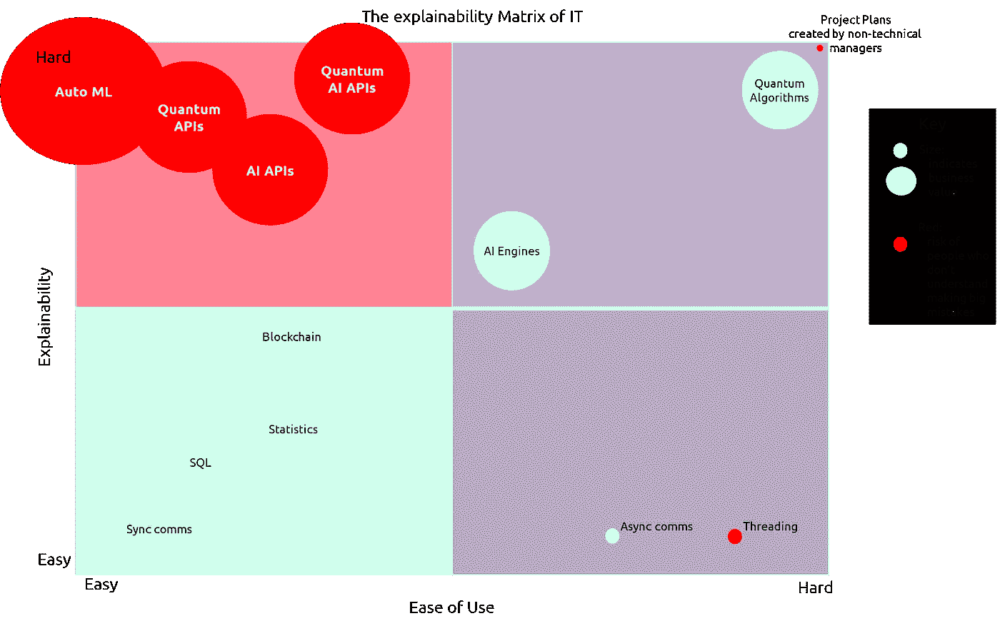
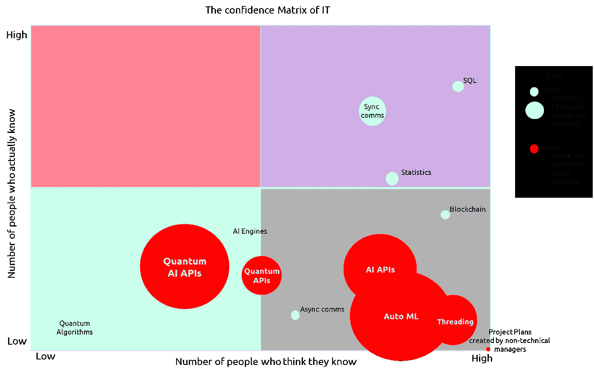

# 我们搞砸事情的能力呈指数增长

> 原文：<https://medium.com/nerd-for-tech/our-ability-to-screw-up-is-exponentially-increasing-6ca07aaf8bb8?source=collection_archive---------3----------------------->

> “我们快速构建糟糕软件的能力从未如此之高，而且还在不断增长”——CIO 在 2008 年的一次会议上

这位首席信息官谈到了那个时代的低代码平台，他们当时是对的，今天也绝对是对的。所以我想我应该开始描绘出我认为用不同的技术来构建糟糕的解决方案是多么容易。我从两个角度来做这件事:

1.  可解释性——我们解释事物如何工作的能力
2.  信心差距——有多少人认为自己知道，有多少人实际知道

我最初关注的是数据技术，但我也包括了异步、同步和线程，以提供参考点。

可解释性与易用性

第一张地图显示了解释某样东西的容易程度和使用它的容易程度。所以线程非常容易解释(东西同时运行)，但实际上很难做到。使用像 Tensorflow 这样的人工智能引擎是非常困难的，因为你正在使用它，你往往知道如何解释它，不是总是，而是更经常，因此它往往是一个中等的错误。然而，AutoML 可能非常容易使用，大多数使用它的人完全不知道他们在使用什么，也不知道它是如何得出答案的，当它爆炸时，往往非常壮观。当然，在最上面，我们有由非技术人员为一个技术项目创建的项目计划，在这些事情中通常没有可解释性，它们实际上是不可能使用的。

在我看来，量子算法实际上是相当安全的，这并不是说如果它们搞砸了，问题可能不会很大，而是因为创建它们太难了，这就带来了第二个挑战:信心..

信心差距

下一个是信心差距，我必须在这里为线程化大声疾呼。即使在今天，我仍然看到有人满怀信心地编写多线程代码，而对什么是活锁、死锁或几乎任何多线程原理都没有任何概念。AI APIs 和 AutoML 是我见过的人们有绝对信心的两个东西，因为他们把数据扔进去，并且完全相信返回的结果。到一个人实际上反对一个模拟 API，但仍然把结果放入他们演示的 PowerPoint 中的程度。这就是量子算法(而不是 API)非常安全的原因，假装是量子算法的人非常困难，你可以使用人工智能引擎假装一点(通过分类器类型的东西运行你自己的图像)，但假装创建量子算法实际上就像假装登月一样，只是去那里更容易。

今天我认为量子 API 和量子 AI 的风险是超级低的，但主要是因为做这项工作的成本太大了。它越是一种商品，我们就越会看到人们认为他们理解它。就像我们今天看到的人工智能一样，人们相信，因为他们向 API 提交了一个向量，所以他们是真正的数据科学家，完全理解正在发生的事情。

所有这一切的要点是，某些技术，如 SQL，非常强大，因为实际上很多人都知道如何使用它们，并且知道如何不把它们搞砸，这在很大程度上是因为它们很容易解释。我们在其他地方发现，随着复杂性的增加，人们变得过于自信，能够快速实现他们完全不理解也无法解释的解决方案。随着数据、数字和软件在商业优势中所占的比重越来越大，这带来的挑战只会越来越大。我们有更多的人提供技术解决方案，我们正在构建工具，使他们能够构建更大、更复杂的解决方案，并以更快的速度构建这些解决方案，同时减少理解和控制。

2008 年的首席信息官是对的，他们现在是对的，从现在起他们也将是对的。所以当你使用技术和构建系统时，问自己三个关键问题

1.  我们真的知道这是如何运作的吗？
2.  如果出了问题，我们能修好它吗？
3.  当它真的出错时，出错的程度会有多严重？

记住:

> “我们快速构建糟糕软件的能力从未如此之高，而且还在不断增长”——史蒂夫·琼斯，2022 年