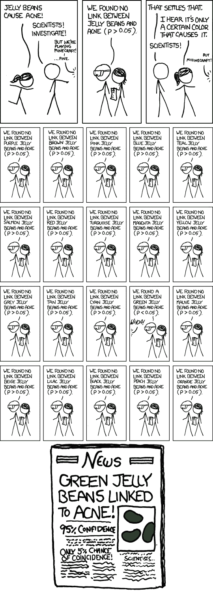

# P-hacking 解释说

> 原文：<https://medium.com/nerd-for-tech/p-hacking-explained-45d4980abf11?source=collection_archive---------7----------------------->

来源: [smbc-comics](https://www.smbc-comics.com/comic/p-2)

今天，在这个每时每刻都被淹没在数据中的黄金时代，我们被大量掩盖在信息名义下的观点所淹没。错误结论是灾难性的！以下是哈桑·米哈吉对此的看法:【https://www.youtube.com/watch?v=icNirsV1rLA

通常，数据越大，结果越好。但相反，数据越多，被随机性忽悠做出错误结论的风险就越高。p-hacking 就是这样。

但是在我们深入细节之前，让我们先了解一下基本术语。

统计学是帮助我们在这个不确定的世界中管理风险的科学。在一个充满随机性的世界里，它帮助我们了解不确定性较少的事物。

***什么是样本和总体？***

让我们假设，我们想知道地球上所有男人的平均身高。收集所有男人的身高几乎是不可能的。我们把地球上的所有男人都看作是人口。但是由于收集整个人口的信息是不可行的，我们试图从整个人口中随机抽取一个样本来公平地代表它。这个子集称为样本。我们使用这个样本对世界做出推断，并将其推广到整个人口。从总体中选择一个无偏的(有代表性的)样本来做出这些推论是非常重要的。有各种各样的采样方法，但是我们不会深入讨论它的细节，因为这不是本文的重点。

***什么是假设？***

假设是对世界上任何事情的预测，可以通过观察或实验来验证。得出结论是调查的起点。假设，如果我想知道地球上男性的平均身高是否大于女性。最初，我做了一个假设。为了证明/反驳我的假设，我从现实生活中收集数据，对收集的数据进行分析，以更好地理解我的假设，并最终做出结论，如果我相当确信结果是有意义的，并具有安全的确定性水平。

***什么是假设检验？***

假设检验是为了验证假设的有效性而进行的程序。它使用上述收集的样本数据来评估关于人口的假设。这是一个矛盾证明，即它不能证实一个假设，而只能否定/拒绝它。

***什么是统计显著性和 p 值？***

正如亚里士多德所说，不可能的事情很可能会发生。因此，当我们在足够多的随机样本上测试假设时，至少有一次可能会遇到一个随机样本，迫使你错误地得出假设。因此我们引入了统计显著性的概念。让我们举个例子:
假设我的主张是“吃巧克力增加记忆力”

**零假设:**是利用样本数据对总体做出的断言。它假定默认情况下没有“影响”或“关系”。
因此，我们的无效假设是:
“巧克力消费量和记忆力之间没有关系”

**备选假设:**如果零假设被断定为假，则相信该假设。因此，我们的另一个假设是“巧克力消费量和记忆力之间存在联系”

假设现在我们随机抽取一组志愿者进行实验，并将他们分成两组。我们给一组人提供巧克力，而不给另一组人，并在一段时间内测试他们记忆力，得出一系列结果。比方说，我们得到的结果是，食用巧克力有 70%的可能性导致记忆力增强。

但是我们如何知道这些结果是基于观察还是随机发生的(样本中的随机性)。也就是说，如果随机组的记忆能力因随机机会或其他因素而增强，而不是因为吃了巧克力，那会怎样？

统计显著性是一个概念，它证明这一结果仅仅是随机发生的几率很低。因此，可以肯定这个结论是正确的。因此，为了量化统计显著性，我们引入了一个称为 **p 值**的度量。

它是一个介于 0 和 1 之间的概率值，有助于确定所获得结果的重要性。p 值告诉我们一个给定的结论是否是随机发生的结果。如果 p 值低于某个阈值，则结果被标记为“有统计学意义”。典型的阈值 p 值为 0.05。
它的意思是，这个结果有 5%的概率是随机发生的，而不是通过真实的观察。我们冒这个险！
小于阈值(0.05)的 p 值表示反对零假设的有力证据，所以你否定了零假设，并得出结论:巧克力消费量与记忆力之间存在关系。

***被随机性愚弄是什么意思？***

人类的大脑受到一系列有条件和无条件的偏见。这是一种人们没有考虑所有相关数据而错误判断事件可能性的现象。我们很自然地将这些偏见编码到我们构建的结构中。这一事件在统计学上被称为 p-hacking。

***P-黑客:***

由于我们并不研究整个人群，而只是研究其中的一个随机子集来进行假设检验，因此研究中包含的数据可能是一个极端的随机案例。对这个特定的数据集执行分析可以产生与其他分析不同的具有期望的统计显著性的结果。假设在我们的情况下，我决心证明巧克力消费和记忆能力是相关的。
我可以尝试使用不同的随机样本以各种不同的方式进行分析，直到我得到想要的 p 值。这叫做 p-hacking。

来源: [P-Hacking](https://imgs.xkcd.com/comics/significant.png)

简而言之，它是以不同方式执行大量统计分析的实践，目的是找到理想的 p 值(低于 0.05)。这可以通过稍微调整假设来支持论点或者通过考虑数据的不同部分来实现。当研究人员只公布一个“重要”的结果，而没有提及所有失败的剩余分析时。

虽然对于 p-hacking 没有明确的解决方案，但是避免它的一种方法是进行训练/测试分割。它的概念是保留一个测试集进行评估，一旦我们确信模型结果是有希望的，就使用这个保持测试集来测试模型。它保证了模型在看不见的数据上的可靠性。数据中有更多的特征也是增加 p-hacking 机会的另一个因素。所以我们可以尝试通过向数据集添加更多的行来补偿它。

P-hacking 可能是灾难性的！正如马克·吐温所说:“有三种谎言:谎言、可恶的谎言和统计数据。”所以下次要小心，不要被随机性所迷惑。