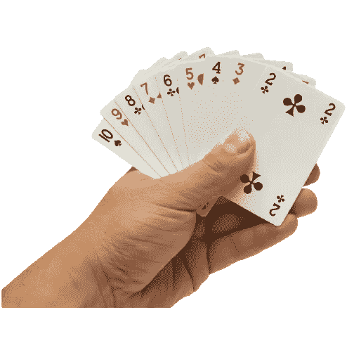
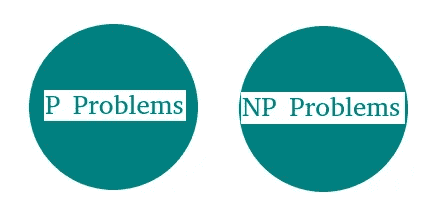
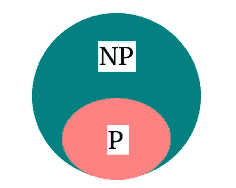
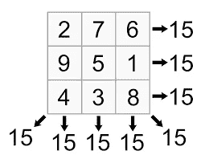
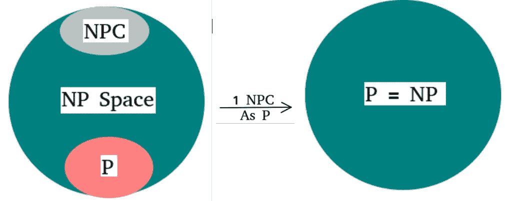
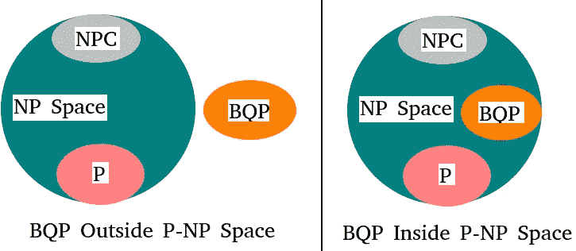

# p vs NP——比图灵聪明？成为百万富翁！

> 原文：<https://medium.com/nerd-for-tech/p-vs-np-smarter-than-turing-become-a-millionaire-8d2f5a4330ef?source=collection_archive---------17----------------------->

# 你有什么“问题”吗？

我们生活在一个混乱的世界里。我们每天都在解决问题，有些是琐碎的，有些是复杂的。解决问题、找出解决方案是我们的天性，而不仅仅是解决方案，我们总是倾向于找出**优化解决方案**。

例如，假设你要迟到了，你想准时到达办公室(是的..从前——2020 年 3 月前的时代)。你知道你通常去办公室的路线可能会因为交通高峰期而拥堵，所以你会决定走另一条路线。你会根据一些因素在脑海中计算并**决定一条替代路线**，比如替代路线可能是一条捷径，或者是一条你可以开快车的高速公路，或者它相对较少为公众所知，或者地铁会让你比你自己的车更快到达，或者更少的交通信号。比方说，经过一番考虑，你得出结论，在路线 A、B、C 和 D 中，路线 A 和路线 D 是最好的。你开始在路线 A 上驾驶，但是由于一次不幸的事故有一次巨大的交通堵塞。现在你在诅咒自己，你应该走 D 路，也许那是最好的路。

现在，真正的问题是，你 100%确定 D 路线是最好的路线吗？可能 C 路线是最好的路线，你完全忽略了这一点。这里重要的一点是**除非你选择所有路线，否则你无法百分之百确定哪条路线是最好的。显然，你在办公室有更好的事情要做，而不是一条一条地走，然后决定哪条是最好的。**

即使你想走所有路线，看哪条最好，你**也不能同时走所有路线**。所以，你必须一条一条地走每条路线。即使这样，你也不能百分百肯定地说哪条路线是最好的，因为既然你一条一条地选择了备用路线，那么时间窗口是不同的。可能是 B 路线在下午 1 点因为校车离开 B 路线上的学校而变得拥挤，或者当你在下午 2 点穿过 C 路线时，可能是因为它被关闭了，你不得不因为倒下的电线杆而改道。

你不能确定这个问题的最优解，除非你同时在所有的路线上旅行，这在物理上是不可能的。最后 3-4 段的要点只有一个，即你可以在指数时间内确定这个问题的解，但不能在多项式时间内确定，换句话说，不能在非指数时间内确定。

除非你有一个**非确定性图灵机(NTM)** ，可以一次性走完所有路线来解决这个问题，否则你不可能在非指数时间内有解。不幸的是，NTM 只是理论上的 T2，并不存在。你，我和我们所有的计算机只是普通的普通无聊的图灵机。

# 多项式和指数——外来词汇？

如果你读到这里，那么你肯定想知道和理解更多关于多项式或指数或确定性或非确定性或图灵机的混乱。

所以，让我们试着去理解这些术语。

你玩过**的扑克牌游戏**吗？一名玩家随机洗牌并分发卡片。然后，你一张一张地拿起每张牌，整理你手中的牌。

如果你曾经整理过手中的牌，那么你就有意或无意地执行了**“插入排序”**。插入排序是一种算法或一组步骤，可以用来对任何事物进行排序。考虑到每手牌由 13 张牌组成，因此要对这 13 张牌进行排序，您需要执行 169 个步骤。哇…那有很多步骤。我怎么能肯定地说出这个数字呢？我们来计算一下。你有 13 张颠倒的牌。你拿起每张牌，放在手中。对于你拿的每张牌，你扫描你手中的每张牌。因此，对于 13 张牌，您将扫描手中所有的牌 13 次。就是这个数字——13 x 13 = 169

在这种情况下，输入大小是 13。如果你要整理 15 张卡片呢？它将是 15×15 步。所以，如果你有“n”张牌，那么你将执行 n×n 个步骤，或者换句话说，n^2 步骤。这种基于输入大小的步数计算称为**时间复杂度。**

再比如，假设你的朋友给了你他的储物柜钥匙，让你去把他的东西从储物柜里拿出来。所以，你去更衣室，你看到房间里有 100 个储物柜。你不知道钥匙会放在哪个柜子里。所以，你会试着打开从 1 到 100 的每一个柜子。所以，你最多走 100 步。如果有 500 个储物柜，你就走 500 步。如果有**【n】个储物柜**，那么你就要走 **n 步**。

所以，你现在一定已经意识到，每个解决方案都可以分成几个步骤，步骤的数量取决于输入的大小。对于一些算法，复杂度是“n”，对于一些其他算法，复杂度可以是 n^2，或者可以是 n^3，或者可以是 logn 或 n log n 等。所有这些复杂性可以被称为“多项式”。

现在，可以肯定地说，有许多问题有多项式解，像排序、搜索、乘法、寻找排列和组合，或者任何人或任何现代计算机都能解决的任何其他问题。这些也是**确定性解。**确定性意味着对于任何特定的给定输入，产生的输出都是相同的。例如，如果我让你告诉我序列 4，2，7，1，9，3，5 中的最小整数值，那么答案将永远是 1，即使你运行相同的程序万亿次。**投入和产出紧密相连。**

另一方面，我们有**算法**或问题的解决方案，它们可能对相同的输入给出**不同的输出。例如，由于竞争条件不同，并发程序的执行可能会有所不同，或者基于随机数生成器，概率算法可能会有不同的表现并产生不同的输出。例如，如果你和我下一盘棋。有些游戏我可能赢，有些游戏你可能赢，有些游戏可能以平局告终。输入是一样的，那就是你，我和象棋，但是每局结束时输出是不同的。**

确定性或暴力算法可能要花很长时间来决定谁将赢得比赛，因为玩家有太多的可能性可以移动棋子。在每一步，移动可以是一个玩家的 16 个棋子中的任何一个。如果现代计算机试图通过考虑每一个可能的运动来确定获胜者，那么计算机将花费比宇宙年龄更多的时间来计算结果。当然，如果确定性计算机还在运行的话，我们不会活到几十亿年后才能看到一盘棋的结果。

这些花费**指数时间**的问题**的某些解决方案集合**具有**指数时间复杂度**，可以表示为 **2^n 或 3^n 或最坏的 n^n.**

客观地看，如果输入大小 **n 是 100** ，如果算法的复杂度是 **n3** ，那么可能需要**几个小时**来解决问题。但是，如果我们有一个**指数算法**，那么在**相同的输入大小**下，如果一个指数算法的时间复杂度是 **2^n** ，那么这个问题将在**千万亿年后得到解决，即 1 有 18 个 0**。这是宇宙年龄的几万亿倍。

这些**指数解有一个很好的性质**。这些解决方案以指数时间运行，但是为了**验证**是否**输出**正确与否，它**需要多项式时间**。例如，运行一个国际象棋游戏可能需要几十亿年，但最终如果我们想验证是玩家 A 赢了还是玩家 B 赢了，那么我们可以立即知道。

另一个例子——数独难题，解决一个数独难题是一个指数解，但一旦解决，很容易在多项式时间或瞬间验证解决方案是对还是错。

具有**多项式解**的**组问题**称为 **P 问题。**

有一个**指数解**但能在多项式时间内容易验证的**组问题**称为 **NP 问题。**这些被称为 NP 问题，因为一个**非确定性图灵机**(这是理论上的)可以在多项式时间内解决这个完全相同的**指数问题。因此被称为非确定性多项式或 NP 问题。**

NP 问题的例子——国际象棋、数独、围棋、俄罗斯方块、糖果粉碎、旅行推销员、寻找最佳路线、蛋白质折叠(Lavinthal 悖论)、天气模式、暴力破解、电路设计等。

# 更大的问题

无论我们到目前为止讨论了什么，这都是计算复杂性理论的基础。计算复杂性本身就是一个大课题，也是一个深入研究的领域。但是为什么所有这些真的重要呢？我们理解有些是 P 类问题，有些是 NP 类问题，这里面有什么大不了的。我们对那么多其他事物都有分类，那为什么对问题的分类要区别对待呢？它将如何让你的生活变得更好？为什么要讨论这个 P vs NP？为什么 P vs NP 是计算机界最大的未解之谜？谁会为这样一件微不足道的事情付出一百万美元，而你只是在看问题的分类？

眼界比我在这里写什么都要大得多。但我会试着回答所有这些更大的问题，并确保你会理解为什么这个 P 对 NP 是如此重要，至少有 100 万美元的奖金。

# 给我那个地平线

正如我们到目前为止所看到的，我们有两类问题，一类是 P 问题，另一类是 NP 问题。

所有的 **P 问题也可以在指数时间**内解决。所以如果我们仔细观察，所有的 **P 问题也都是 NP 问题**，但是**并不是所有的 NP 问题都是 P 问题**。就像说，所有的鸡都是鸟，但不是所有的鸟都是鸡。p 只是 NP 的一个子集。

所以，现在我们知道了**有些 NP 问题**可以归类**为 P 问题**，但更大的问题是，我们能把**所有 NP 问题归类为 P 问题吗？**

# 我的生活没有改变，我不在乎！

如果你真的在想这些废话有什么意义，那它不会影响你的生活。当然，你不会因为知道所有这些多项式或非确定性 bla bla 而突然变成超人。

暂时不要想这个问题。

如果你能**证明所有 NP 问题都可以在多项式时间内**解决，或者任何可以在多项式时间内验证的问题也可以在多项式时间内解决，那么你本质上就是**证明所有 NP 问题其实都是 P 问题，**或者换句话说 P 会变成等于 NP。P 不会只是 NP 问题的子集，但是 P 将成为唯一的问题集。

如果 P 被证明等于 NP，那么它本质上意味着存在一种算法，可以在几分钟或几小时内解决问题，而不是花费数十亿年。

这将意味着，对于**最有效的路由**存在一个解决方案。它能改善全球文明的后勤，超出我们的想象。

这将意味着，存在一种解决蛋白质折叠的**方法，**这将从根本上打破拉文塔尔悖论，新药可以在几天内制成，而不是几十年。这意味着在你庆祝下一个生日的时候，你可以治愈癌症。

这意味着，我们可以绝对准确地提前几个月预测所有的海啸、飓风、地震，并且每年拯救数百万人的生命。

这将意味着你可以从克莱数学研究所获得你的 100 万美元，该研究所为任何能证明 P = NP 的人设立了奖金。

这将意味着所有的**加密都可以很快被破解**，网络安全将成为一个神话。祝你好运，把你新赚的 100 万美元存入你的银行账户。

这仅仅意味着世界将会改变。所有被认为无法解决的问题都将变得可以解决。把指数问题拉到多项式问题的 ubrella 下，人类文明的进步就会变成指数的。**这就是 P = NP 如此重要的原因。**

# 怎么证明 P = NP？

让我们玩一个游戏。假设我们有从 1 到 9 的数字。我们可以一次选择一个数字。我们轮流。最先累积到 15 个数字的玩家将获胜。

1 2 3 4 5 6 7 8 9

假设

*   我选 9
*   你选 6 个
*   我选 4
*   你选 8
*   我选 2。现在我的总数是 15，所以我赢了。

它看起来眼熟吗？不…我们重新排列一下问题。

现在，如果我们在重新排列后玩同样的游戏，它将与玩井字游戏完全相似。

这实质上意味着我们已经**把我们的问题简化成一个更普遍的问题。**任何可以用来玩井字游戏的算法，同样的算法也可以用来玩任意数字的魔方，而不仅仅是 1- 9 & 15。反之亦然，任何可以用来玩魔方的算法，同样的算法也可以用来玩井字游戏。如果两个问题可以归结为同一个问题，那么它们可以用相同的算法来解决。

我们已经知道一些 NP 问题是 P 问题，因为 **P 是 NP 的子集。**因此，为了**证明**所有的 NP 问题实际上都是 P 问题，你必须**为至少一个 NP 完全(NPC)问题**找到多项式解，或者将一个 NPC 问题简化为某个已知有多项式解的问题。 **NP 完全问题**是那些**没有已知多项式解的问题。**

很多人认为 P 不是 NP。当然直到现在还没有证明 P 等于 NP，或者 P 不能等于 NP。还有很多其他的事情到现在还没有被证明，例如，没有人证明鬼魂或超自然力量是真实的。

另外，证明超自然现象也有 100 万美元的奖金——[https://en . Wikipedia . org/wiki/One _ Million _ Dollar _ Paranormal _ Challenge](https://en.wikipedia.org/wiki/One_Million_Dollar_Paranormal_Challenge)

# 为什么减少问题？为什么不发明 NTM？

辩论正在进行。NTM 是纯理论的，是一台理想的计算机。我们能得到的最接近 NTM 的**是**量子计算机。**因为即使是量子计算机也会有量子误差和量子涨落。量子计算机处理叠加和概率。**NP 中存在我们认为在量子计算机上无法在多项式时间内解决的问题，而作为非确定性图灵机确实可以在多项式时间内解决 NP 完全问题。理论上，NTM 比量子计算机强大得多。

有一些问题存在多项式量子算法，这些问题可以在多项式时间内由量子计算机解决，例如整数因式分解问题。整数分解没有多项式解，但是在量子计算机中有一个量子算法可以在多项式时间内解决整数分解。这类问题被归类为 BQP 或有界误差量子多项式时间问题。

有一些证据(https://www.scottaaronson.com/papers/bqpph.pdf)表明 BQP 问题在 P-NP 空间之外。如果 BQP 真的在 P-NP 空间之外，那就意味着即使 P = NP，但是 BQP！= P 或 NP。

因此，**如果你解决了 P vs NP** ，那么一场**新的战斗将会开始**，这场战斗将被称为 **P vs BQP。**

目前**我们真的不知道 BQP 是在 P-NP 空间之外**、**还是在 P-NP 空间之内。**看起来在问题空间中量子行为也是模糊的，并且处于叠加状态，即同时在 P-NP 空间的内部和外部。

# 扣人心弦

还有另外一组问题叫做 **NP 难**，举**例子**停机问题。**一些 NP-Hard 是 NP 完全的**，但是**大多数 NP 难题完全位于 P-NP 空间之外**。像停机问题这样的 NP 难问题需要另一篇文章来更好地理解它。

# …的结束

我不想对这里提到或讨论的所有内容进行总结，而是想引用著名的计算复杂性理论先驱之一 Scott Aaronson 的话来结束这篇文章。

“““

如果 P=NP，那么这个世界将会是一个与我们通常想象的完全不同的地方。“创造性飞跃”没有特别的价值，在解决问题和找到解决方案后认识到这一点之间没有根本的差距。每个能欣赏交响乐的人都会是莫扎特；每个人谁可以遵循一步一步的论点将是高斯；每个能认识到好的投资策略的人都会是沃伦·巴菲特。

*-斯科特·阿伦森*

”””

另外，如果这篇文章激励你找到了 P 对 NP 问题的解决方案，并改变了世界，并且你赢得了 100 万美元的奖金，那么不要忘记我的那份奖金。