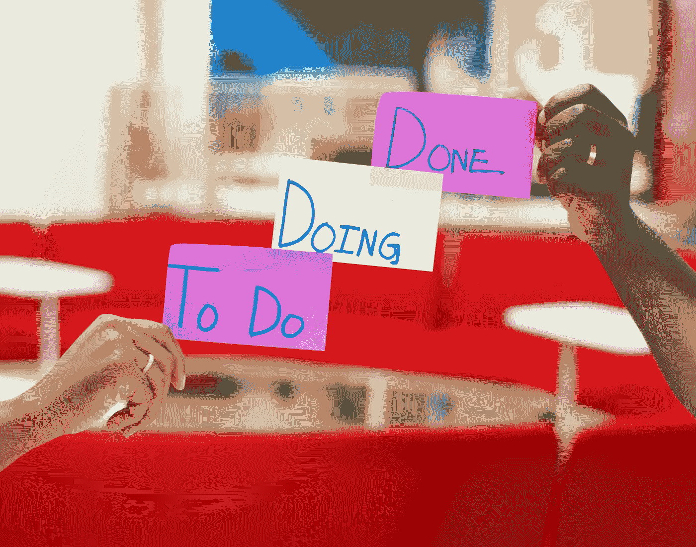

# 纸还是钻石？你的团队有多敏捷？

> 原文：<https://medium.com/nerd-for-tech/paper-or-diamond-how-agile-is-your-team-181e225b84c9?source=collection_archive---------16----------------------->

71%的公司使用敏捷方法。即使它们遵循相同的框架，它们的过程也有一些不同。

使用相同的方法却有如此多的差异，这正常吗？ **实施敏捷的正确方法是什么？**

照片由[达里娅·内布里亚希娜](https://unsplash.com/@epicantus?utm_source=unsplash&utm_medium=referral&utm_content=creditCopyText)在 [Unsplash](https://unsplash.com/s/photos/agile-work-software?utm_source=unsplash&utm_medium=referral&utm_content=creditCopyText) 拍摄

# 管理项目的通用方法

敏捷指的是基于敏捷宣言中列出的一套价值观来组织项目的一套方法和技术。敏捷宣言概述了四个核心价值观和[十二条原则](http://agilemanifesto.org/principles.html)。

> *“流程和工具上的个人和交互*
> 
> *综合文档之上的工作软件*
> 
> *合同谈判的客户协作*
> 
> *按照计划应对变化。”*

# **每个团队都有自己的一套程序**

许多人说，为了“正确地使用敏捷”,你需要一个 5-9 人的团队，和一个产品负责人在同一个房间里工作。例如，Scrum 规定每天的站立会议不超过 15 分钟，所有团队成员都必须参加，在每个迭代结束时进行冲刺回顾和演示。

所有这些都是在正确环境下的伟大实践。现实中，我们并没有这样理想的条件。我们必须处理外包、大型团队、分布式团队和利益相关者的兼职可用性。

敏捷是一种哲学，是交付价值的坚实指南，是一种遵循的参考。没有正确的方法来实现敏捷方法。这就是为什么你不能衡量你的团队有多敏捷。敏捷原则只是一个参考，它们的原则需要被分析、测试，并适应一个适合你的团队的过程。

与其遵循一套原则和方法，拥有敏捷的心态，选择对团队有意义的方法，似乎对团队更有效。每个团队都需要找到适合自己的方法。

# 同样的过程并不适用于每个人

照片由[阿曼达·贝莱奇](https://unsplash.com/@thirteen13designz?utm_source=medium&utm_medium=referral)在 [Unsplash](https://unsplash.com?utm_source=medium&utm_medium=referral) 上拍摄

纸张(第一)、棉花(第二)、皮革(第三)、银(第二十五)、金(第五十)、钻石(第六十)。所有这些都是结婚纪念日。从中世纪开始，就有赠送特定周年礼物的传统，代表着一对夫妇的婚姻如何巩固了久而久之。敏捷团队也是如此。

一个团队的力量与日俱增，挑战也好，冲刺也罢。当团队持续改进他们的过程时，他们会更加快乐和强大。遵循一个独特的模式是不自然的。力量来自于适应和团队合作。

每个团队都是不同的，它有自己的工作方式和自己的优先事项。因为每个人和组织都是独一无二的，所以需要为每个人量身定制工作方式是很正常的。

**同一流程不能适用于所有团队的三个原因:**

*   团队规模很重要！五个人的团队和二十个人的团队会有不同的工作方式。
*   不同的人意味着不同的技能、偏好和背景。每个人都有自己的工作方式、职业目标和学习方式。
*   上下文很重要。根据不同的环境，团队会有不同的工作方式，这是正常的。我们可以很容易地比较生产同类产品的公司，我们会注意到它们之间的巨大差异。

# **“愿你的选择反映你的希望，而不是你的恐惧”**

照片由[伊登·康斯坦丁诺](https://unsplash.com/@edenconstantin0?utm_source=unsplash&utm_medium=referral&utm_content=creditCopyText)在 [Unsplash](https://unsplash.com/?utm_source=unsplash&utm_medium=referral&utm_content=creditCopyText) 拍摄

强迫一个团队遵循严格的过程不是正确的方法。当人们感到被欣赏和舒适时，他们会更有效率。您必须能够选择正确的策略并根据您的环境调整您的方法，而不是标准化一种方法或框架。不要害怕根据需要多次优化和更新工作流。

*“我们想要恢复一种平衡。我们拥抱建模，但不是为了在一个积满灰尘的公司知识库中归档一些图表。我们拥抱文档，但不是数百页从不维护和很少使用的大部头。我们制定计划，但认识到在动荡的环境中计划的局限性。”* —敏捷宣言

为了开发一个流程，你不需要从零开始。您可以结合现有的实践和策略，并对它们进行适当的修改，以解决当前的情况。我们可以从他人的学习中受益。

# **衡量重要的东西，而不是你的团队有多敏捷**

[Firmbee.com](https://unsplash.com/@firmbee?utm_source=medium&utm_medium=referral)在 [Unsplash](https://unsplash.com?utm_source=medium&utm_medium=referral) 上拍照

不管我们使用什么方法，团队的主要目标是尽可能的有效。为了实现这一点，它需要不断地改进过程和工具基础设施。不要害怕尝试。这是最好的学习方法之一。你希望改进什么？质量，员工士气，测试覆盖率，或者客户满意度？

另一件要记住的事情是“以可持续的速度持续交付”。更重要的是保持一致，并长期保持一致。总的来说，做一个项目是一场马拉松，而不是短跑。你只需要找到你的团队的跑步节奏。

事实是，没有一种正确的方法来实现敏捷方法。毕竟，我们不应该专注于做敏捷或变得敏捷，而是要尽可能地有效。

> ***“团队的力量在于每个个体成员。每个成员的力量就是团队。”*** —菲尔杰克逊

**参考:** *“选你的哇。《优化你的工作方式的训练有素的敏捷交付手册》*作者斯科特·安布勒，马克·莱恩斯。