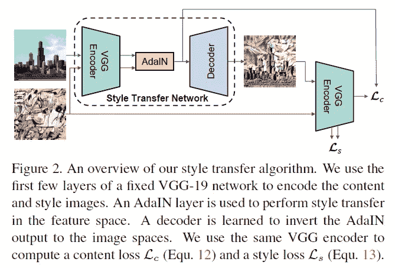
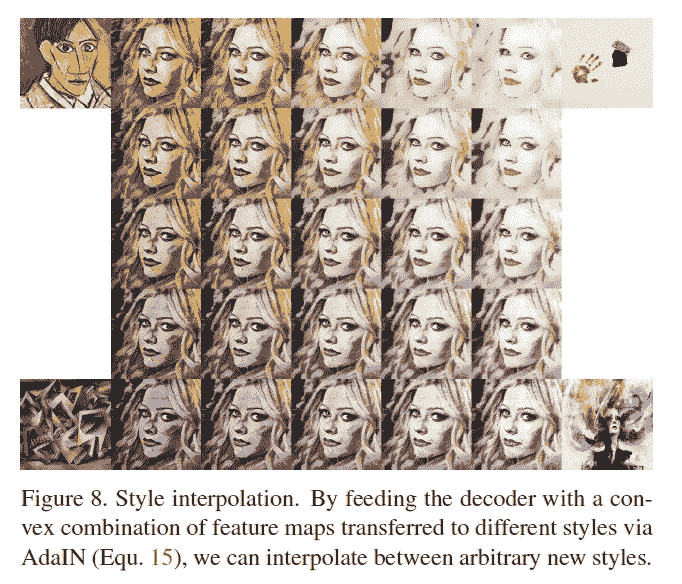
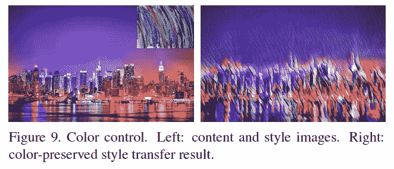
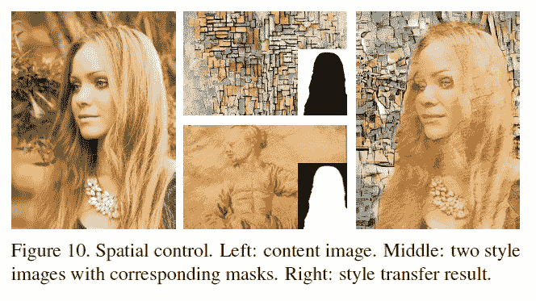

# 论文摘要:“通过自适应实例规范化实时传输任意样式”(AdaIN)

> 原文：<https://medium.com/nerd-for-tech/paper-summary-arbitrary-style-transfer-in-real-time-with-adaptive-instance-normalization-3340e57b87dd?source=collection_archive---------7----------------------->

这篇文章总结了我认为重要的关键点，并添加了一些我自己的评论。对于更多的细节和部分，我没有在这篇文章中介绍，请参考论文。

https://arxiv.org/pdf/1703.06868.pdf

# 要点

*   实时传输任意风格
*   使用自适应实例标准化(AdaIN)层，它可以调整内容特征的均值和方差
*   允许控制内容风格的权衡、风格插值、颜色/空间控制

# 以前的作品

*   利用网络后向投影最小化风格损失和内容损失的优化方法。这可以用于许多不同的风格，无需重新训练，但它需要多次反向投影迭代，因此它在计算上和时间上都很昂贵
*   前馈网络将一个固定的风格转移到一个输入图像。缺点是这个网络只为单一风格训练。
*   这项工作将允许处理许多风格(甚至是看不见的)在一个前进的流。

# 规范化在风格化方面是有效的

批量标准化因其在各种网络训练中的有效性而广受欢迎，但已发现其在图像生成中尤其有效。批规范的关键思想是标准化所有小批中每个通道特征的均值和标准。

另一项工作发现，用实例规范化(IN)替换 BN 会产生更好的风格化结果。IN 和 BN 的主要区别在于，IN 对每个通道应用均值/标准差归一化，但只对每个样本应用，而不是对所有小批量应用。

另一项工作更进一步，允许为每种风格交换 IN 参数。

这三部作品表明，控制特征的意义和标准会影响图像的风格。

# 阿丹

如果特征统计决定了风格，那么也许我们可以修改特征的统计来改变风格？

这个想法为阿丹提供了基础。

AdaIn 将接收内容输入 x 和样式输入 y，它将简单地调整 x 的通道方式均值和方差，以匹配 y 的均值和方差。

它没有控制仿射参数的可学习参数，而是通过样式输入来计算这些参数。

# 使用 AdaIN 进行风格转换的网络结构

本文提出以下结构来利用 AdaIN 进行风格转换。

核心是一个 VGG-19 编码器，它经过预训练，只使用前几层。这个编码器将不被训练，因此它的权重是固定的。内容图像和样式图像都将通过编码器。对于前几个图层的要素地图，将获取样式图像的要素统计数据。内容图像也将通过 VGG-19 编码器，其中每个图层的统计数据将替换为样式图像要素地图的统计数据。

最后一个特征将被馈送到解码器，解码器将对特征图进行上采样，使其回到原始输入尺寸，并输出风格转换的输出图像。这个解码器网络是经过训练的网络。

对于训练，解码器的样式和内容的输出将用于丢失。

解码器的样式输出必须接近样式图像的样式，内容必须接近内容图像的内容。

这两个目标函数可以定义如下。

内容流失。

这就是内容流失。“t”是 AdaIn 层的输出，该特征将被馈入解码器(“g()”)。f()'函数是 VGG 编码器网络。因此，该内容损失旨在最小化“风格转移嵌入向量(t)”和“生成的风格化图像的 VGG 编码器传递向量”之间的欧几里德距离。

在某种程度上，这是有意义的，因为如果生成的风格化图像成功地传递了风格，那么重新嵌入的版本本身应该接近它的制造者，也就是“t”。但是因为这种方法，**我认为**这种内容损失部分地包含了风格损失的某个方面。这是因为编码器的特征图包含内容和风格信息，并且这种内容损失是与来自 VGG 网络的最初几层的特征一起工作，而不是整个 VGG 网络。我认为，如果我们使用完整的 VGG 网络的输出，并使用他们的距离作为内容损失，那么它可能更接近于一个更“纯”的内容损失。

或者进一步考虑一下，如果本文的主要假设是样式信息由特征的均值/标准差统计表示，而其余部分构成内容信息，为什么不将这种想法融合到内容损失中呢？在这种情况下，“t”和“f(g(t))”都被修改为具有相等的均值/标准差，然后这两者之间的距离被用作内容损失。但这只是我自发的建议。

这是一个复杂的内容丢失解释，但作者提到，这个版本的内容丢失提供了更好的训练性能。

下面是风格损失，它的解读就简单多了。

风格丧失。对于每个要素图层，我们希望样式图像的均值/标准差和风格化图像(解码器输出)的均值/标准差尽可能接近。

将这两个损失相加就是最终损失，风格损失权重因子(lambda)将控制哪个损失将被更强调。

# 内容风格权衡

不幸的是，这不能实时完成，因为这是由损失函数的风格损失权重控制的。因此，如果你想调整内容，风格权衡，你将需要重新训练它与新的风格减肥。

# 样式插值

这可以实时完成，无需任何再培训。只需运行两个样式图像并获得两组样式特征统计数据。进行样式转换时，使用一些中间值进行统计。

# 空间和颜色控制

根据上面的实验结果，风格统计也包括颜色。但是，如果我们想保持颜色，只转移其他方面的风格呢？本文建议通过预处理风格图像的颜色分布来匹配内容图像的颜色分布。具体如何做在论文中没有提及。那么对内容图像执行样式转移将输出保留内容图像的颜色但是转移了其他样式方面的图像。

空间控制可以通过用两种不同风格的图像遮蔽两个区域来完成。对于每个掩模，应该使用相应样式图像的特征统计，而其他部分应该使用其他样式图像的特征统计。

