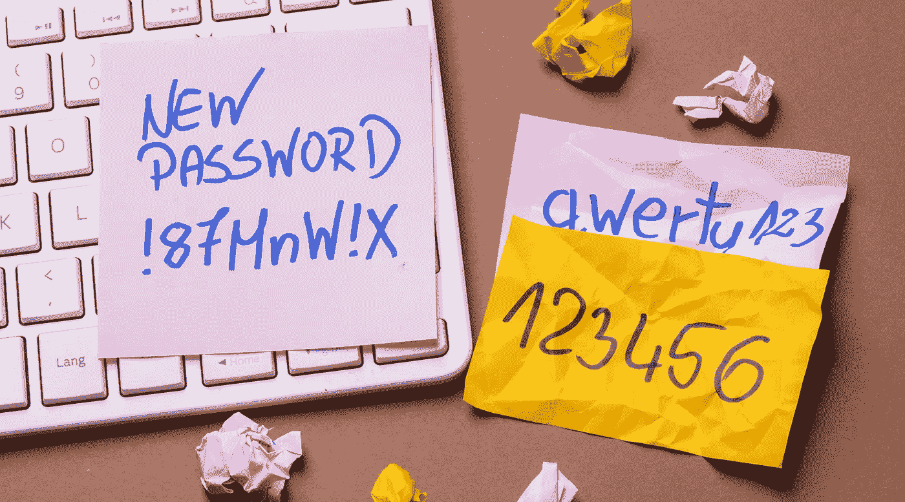

# 密码应该被淘汰，但既然没有，那就让它们更安全吧

> 原文：<https://medium.com/nerd-for-tech/passwords-should-be-extinct-but-since-they-arent-make-them-more-secure-9d2e799abed1?source=collection_archive---------0----------------------->

这是那种“是的，但是……”的故事。

从应该的方式开始。作为在线认证手段的密码现在应该已经绝迹了。摆脱我们的痛苦。在一个理想的世界里，国家(CSAM)网络安全意识月第二周的主题应该是“免于密码！”

首先也是最重要的，因为它们不安全。无论它们有多长、多复杂、多独特，它们都太容易被窃取了，要么是用户被骗把它们给了别人，要么是储存它们的在线服务器被攻破了。事实上，地下网络犯罪论坛充斥着[出售的数十亿泄露密码](https://www.darkreading.com/vulnerabilities-threats/24-billion-credentials-circulate-dark-web-2022)。

从微软前首席执行官比尔·盖茨开始，许多专家已经说了几十年了。十年来一直致力于提供更安全的身份认证手段的 FIDO(快速身份在线)联盟的前执行董事 Brett McDowell 很久以前就将术语“强密码”称为矛盾修饰法。

第二，因为有更好的选择——最新的 FIDO 标准，即 FIDO2，可能是最突出的。它消除了旧的“你知道的东西”(密码或密码短语)，代之以“你拥有的东西”(令牌或可穿戴物)和“你是什么”(指纹、声音、面部、虹膜)。

让它们变得更好的是，它们只存在于你的设备或你的身上。攻击者必须窃取您或您的设备，这是可能的，但可能性极小。它们不像密码那样是“共享的秘密”，你和你正在使用的网站或服务都有密码，黑客只需在笔记本电脑上敲几下键盘就可以访问成千上万的密码。

此外，FIDO 也越来越受欢迎——它越来越普及，最新的 FIDO2 标准旨在直接内置于操作系统和网络浏览器中。大约一年前，它们被内置到 Windows 10、Android 上的 Google Play 服务以及 Safari、Chrome、Firefox 和 Edge 网络浏览器中。

现在，一些科技巨头——谷歌、苹果、英特尔、微软、贝宝、脸书、亚马逊、VMware、三星、美国银行、富国银行等，以及所有主要的网络浏览器和越来越多的电信公司——都支持 FIDO 标准。

**漫长的旅程**

是的，但是…

应该是这样的还是不应该是这样的。密码仍然是在网上证明你是你的最常用的方法。

正如 Ars Technica 上周所说的那样，“虽然世界上的每个浏览器都支持显示旧的[密码]文本框，但每个网络浏览器、每个密码管理器和每个网站都需要增加对 passkey 的支持。这将是一个漫长的旅程。”

因此，只要这是真的，我们都应该尽可能地让它们安全，这就是 CSAM 第二周的主题:“密码和密码管理器”

但似乎有点奇怪的是，没有提到 FIDO，也没有敦促人们尽可能采用无密码认证。

联邦网络安全和基础设施安全局(CISA)是监管 CSAM 的机构之一，没有回应对此事的置评请求。但身份盗窃资源中心的首席运营官詹姆斯·e·李(James E. Lee)表示，鉴于“FIDO 仍然是一个新兴的无密码框架，直到最近才开始向主流过渡，他认为 CSAM 的重点应该仍然是密码。因此，推动消费者采用一套可用性非常有限的工具还为时过早。”

由国家网络安全联盟(NCSA)和 CISA 运营和监管的 CSAM，如今已进入第 19 个年头。它这个月的总口号是“在网上保持安全很容易。#BeCyberSmart。”

**相对安全**

安全当然是相对的。如上所述，密码不会像其他越来越常用的认证方式那样安全。但是有办法让它们变得更好。CSAM 网站上的第一组密码建议由来已久。它们是劳动密集型和内存密集型的，并且只提供递增的安全性改进，这就是为什么太多人忽视它们的原因。尽管如此，如果你要使用密码，他们应该

*   Long:至少 12 个字符
*   独特:从不重复使用密码
*   复杂:没有“密码 111”、“管理”、“qwerty”或“123456”这些东西。不复杂的密码就相当于把你家的钥匙放在你门前的迎宾垫下面，上面有一个指向它的箭头。密码对除你之外的任何人来说都应该是乱码，所以使用大小写字母、数字和特殊字符的组合。有些网站甚至允许你加入空格。

第二个主要建议是使用密码管理器，它提供了更多的功能。它确实让用户更容易，让黑客更难。

密码管理器——有很多好的——要求你只记住一个主密码，所以要把它做得很长很复杂。也许基于一个只有你知道的短语。密码管理器会将你所有其他的用户名和密码组合存储在一个加密的数据库中，这意味着它们对黑客来说也是乱码。您可以创建它们，或者由服务生成它们。

CSAM 网站指出了密码管理器的其他几个主要优势

*   它节省时间。除了密码管理器本身，你不需要为任何东西输入密码。
*   它适用于您的所有设备和操作系统。
*   它保护你的身份。
*   大多数服务会通知您潜在的钓鱼网站。

第三个建议听起来可能违反直觉，但它既能让事情变得更容易，又不会让你变得不安全。不要理会那些定期更改密码的劝告。

美国国家标准与技术研究所(National Institute of Standards and Technology)多年来一直在其数字身份指南(Digital Identity Guidelines)中建议不要频繁更改密码。专家发现，频繁更改密码实际上会使事情变得不安全，因为人们会使密码变得更简单，或者与他们以前的密码相似。

根据 CSAM 网站的说法，更改密码的唯一原因是“如果你的账户有未经授权的访问，或者这是数据泄露的一部分”。

底线:如果你关心你的网络安全——你应该——你可以通过遵循这些建议来改善它。但现实是，这种改善只会是微不足道的。CSAM 更紧迫的总体目标应该是提高人们的意识，并推动采用比密码更好、更快、更安全的在线身份认证方案。

这一天即将到来，李说。“微软已经在内部转向无密码环境，并正在慢慢地将这一选择扩展到客户。苹果现在提供无密码的密钥，但只适用于装有最新操作系统的移动设备。谷歌已经宣布计划在 2023 年遵循这一 FIDO 兼容选项。”

“所有这些努力都是为了克服用户行为，使人们更加安全，并使身份犯罪分子更难窃取和使用凭据，”他说。

这是令人鼓舞的消息。它不能来得太快。