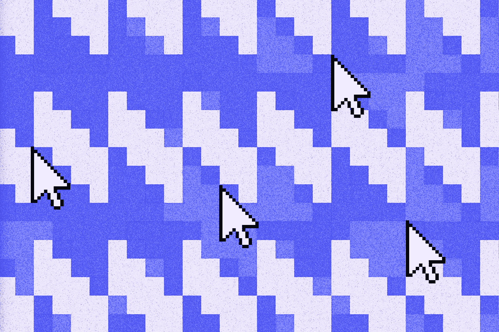

# 破坏模式

> 原文：<https://medium.com/nerd-for-tech/patterns-of-disruption-977113d95399?source=collection_archive---------7----------------------->

参加由我热爱的国家的一家电信运营商组织的黑客马拉松帮助我发现了什么是破坏模式。天知道我对模式感兴趣有多久了，因为我对认知科学的兴趣教会了我我们的大脑如何使用模式匹配，以及我们在日常生活中不知不觉中应用的这种模式匹配技能如何使我们的生活变得更容易。这就是我们利用类比的力量提出新的想法和理解事物的模式，我已经将这种技能用于商业模式的发现。

我两天前发现的这种模式是关于价值链的中断，价值链可以是产品或服务分销渠道或供应链，主要是在激励和利润受到威胁的情况下建立垂直或水平关系的任何地方。那么我应该同意，与他人联系和分享是非常有见地的，至少对我来说是这样，因为我正在研究这种对金融市场的破坏，而没有意识到它在电信市场的应用，并且很可能在许多其他市场中的应用。为了验证我所发现的这种破坏模式的应用，收集各种市场中的破坏数据并了解它们是如何发生的以及为什么会发生是很重要的。激励和费用是驱动这种特殊中断模式的核心参数。

发现这种破坏模式让我想到，Paypal 如何通过为获取用户提供资金并迅速传播而获得牵引力，这可能是下一个非洲金融科技领导者的武器。一些非洲金融科技颠覆者正开始收取零费用，但下一步可能是向用户付费，但那些将应用这种颠覆模式的人将需要在交易之外找到一种盈利模式，让他们弥补损失并盈利。玩弄存款和取款之间的延迟以及一个非常好的做市系统可能是这种盈利渠道，这将有助于金融科技独角兽成为我描述的下一个领导者。

几年前，我就在推动更多的电信运营商与其用户分享红利。当时，在非洲这样的非科技市场应用这种模式可能还为时过早，但对于那些有足够财力的人来说，现在是开始慷慨对待非洲金融服务消费者的最佳时机，给他们钱加入你的金融科技基础设施，但如果慷慨是经常性的，这将比 Paypal 更好，这意味着不仅适用于用户注册金融科技服务，而且适用于整个客户生命周期。要做到这一点，金融交易可以转化为投资决策，从长远来看，每笔交易背后的参与者都是有利可图的。

频繁易手的货币对经济更有利，因为它增加了落到需要它和/或缺少它的人手中的可能性，但如果基础经济系统是广泛的，并对最大数量的用户开放，这就更真实了。

当从一个账户转账到另一个账户时，只要用我们随身携带的智能手机轻轻一点，几乎每个人都拥有的智能手机就会好奇地发现，在人、社区、部落和家庭中越来越难看到慷慨和同情。慷慨和同情的组织是那些将领导下一个[区块链经济](/nerd-for-tech/blockchain-is-disrupting-status-roles-and-authority-in-organizations-f147f1482c5d)的组织，这个经济正在一层一层地建立起来。