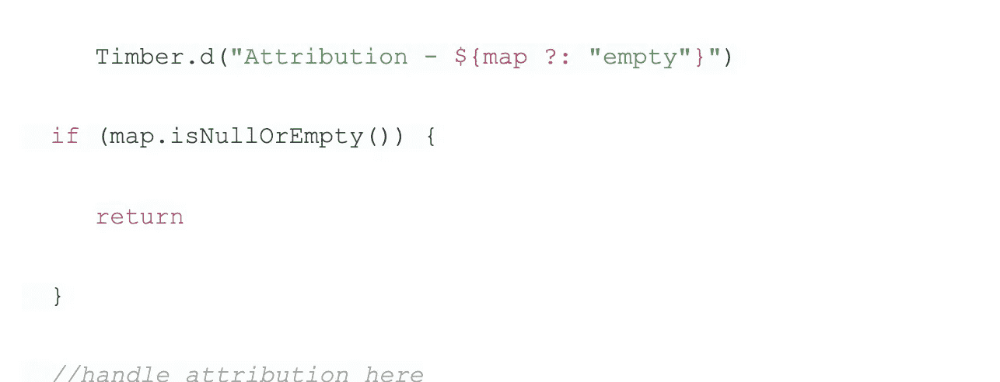
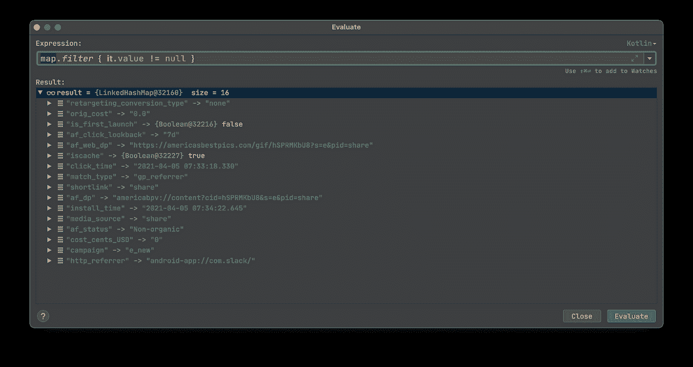
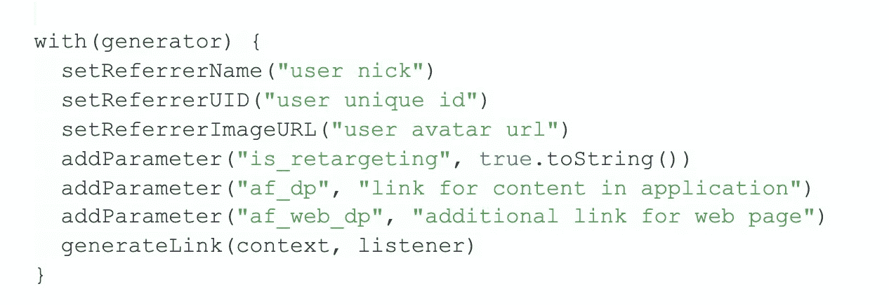
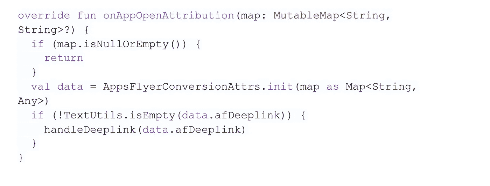
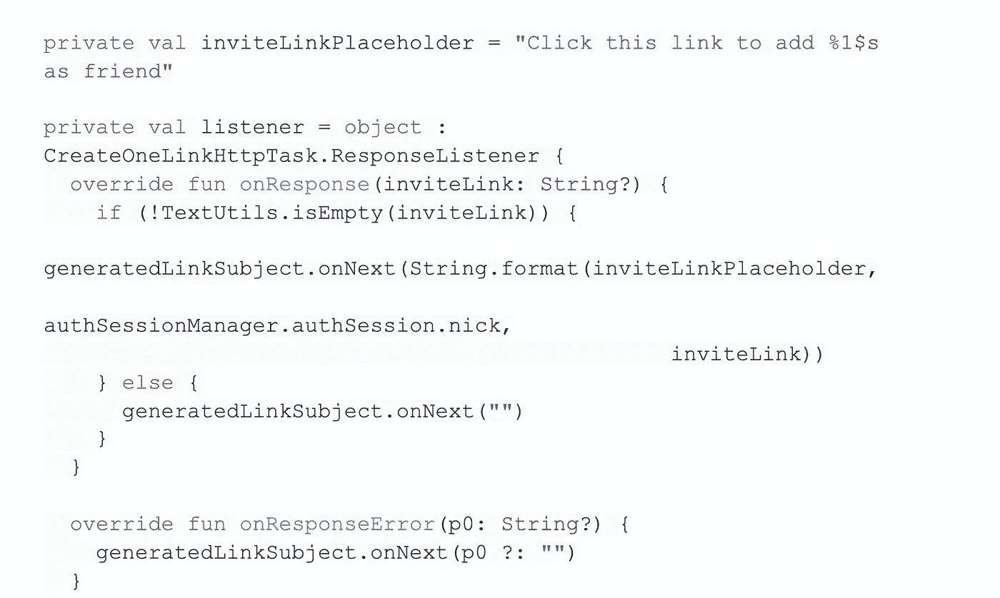
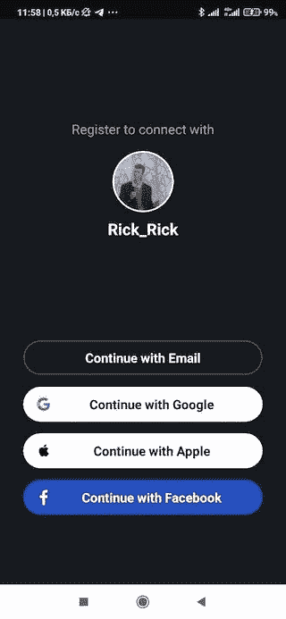

# 使用 AppsFlyer 个性化应用邀请

> 原文：<https://medium.com/nerd-for-tech/personalizing-app-invites-with-appsflyer-4285d42b3ff3?source=collection_archive---------6----------------------->

任何人，只要一直在用一个 app 建立用户交互，都知道这个过程有多复杂。这种相互作用的机制之一是深度链接。这是一种决定推送通知、用户参与度和留存率的机制。

在本文中，我们将介绍一些 AppsFlyer 工具以及如何使用它们，并举例说明邀请用户的功能，这将有助于使签到更加个性化。

# SDK 集成和获取属性数据

AppsFlyer 是一个移动流量分析和归因平台，提供大量付费和免费服务。我们将使用应用程序安装属性数据并创建短链接来实现应用程序邀请功能。

首先，我们将 SDK 集成到项目中(详见[说明](https://support.appsflyer.com/hc/en-us/articles/207032126-Android-SDK-integration-for-developers#introduction))。)

集成后，您可以检查安装后的归属情况。为此，让我们向方法*onconversiondatascence*添加一个简单的日志。

之后，你需要在测试设备上打开一个专门生成的[链接](https://abpv.onelink.me/nWMv/share?c=e_new&af_dp=americabpv%3A%2F%2Fcontent%3Fcid%3DhSPRMKbU8%26s%3De%26pid%3Dshare&af_web_dp=https%3A%2F%2Famericasbestpics.com%2Fgif%2FhSPRMKbU8%3Fs%3De%26pid%3Dshare)。由于该应用程序没有安装在智能手机上，您将被重定向到商店进行安装。

很有可能在安装启动后，会出现一条“归属—空”的消息。这可能有几个原因:

1.  AppsFlyer 中的项目配置方式错误。
2.  包名不同于 AppsFlyer 中使用的包名，例如，如果您为调试版本使用附加后缀。
3.  您的设备[尚未添加](https://support.appsflyer.com/hc/en-us/articles/207031996)到测试设备中。

如果一切正常，AppsFlyer 将向您发送一个如下所示的属性(为了清楚起见，我通过调试器过滤掉了空值):

安装归属示例

大约这种数据存在于地图中。这里有很多有趣的东西，例如，http_referrer 字段显示链接是从哪里被点击的，而 is_first_launch 可以用来跟踪第一次启动。

现在，最重要的字段是 af_dp:它接收关于链接内容的信息，在这种情况下，它是 id 为 hSPRMKbU8 的 meme。我们使用这个 id 使应用程序的打开更加有机——通过这个点击，meme 将成为提要中的第一个。

一切似乎都很好，但也有隐藏的陷阱。

1.  每次启动应用程序时，都会检索安装数据。这是一个小小的安全措施，以防第一次运行时无法处理属性。因此，如果您有只需要在第一次运行时工作的逻辑，那么单独支持它是值得的，例如，通过 prefs 中的标志或任何其他机制。
2.  从启动一个应用程序到调用一个方法所需的时间可能会有所不同，尤其是在第一次运行时。在测试运行中，它从 2 秒到 15 秒不等。如果过程中的代码不影响 UI，这不是问题，但是如果你必须基于属性构建一个屏幕，事情就更糟了。这里没有好的解决方案，因为每一个都会在应用程序启动后阻止用户一段时间，或者很难实现。

所以现在我们知道如何获得安装信息，太好了！不要忘记让分析师对这些数据感到满意。

# 短链路服务

分析显示，短链接最有可能被打开。或许，这是因为，对于普通人来说，连接中的参数看起来很吓人，难以理解。可能由于没有断字，短链接在屏幕上看起来更有机，但事实是快速链接更适合我们的用户。

AppsFlyer 已经有一个 [API](https://support.appsflyer.com/hc/en-us/articles/360001250345-OneLink-API) 用于生成这样的链接，但是它不是免费的。不准备付出就不要放弃。SDK 中为客户提供了一个模拟。它的名字叫 [LinkGenerator](https://support.appsflyer.com/hc/en-us/articles/115004480866-User-invite-attribution) 。

现在，当你点击一个短链接时，你会被重定向到网站，然后到 Google Play，最后到应用程序。

它似乎可以工作，但让我们尝试在已经安装了应用程序的设备上打开链接。整个跳转链又会重复一遍——看起来不太好看，直接通过 app 打开链接就好了。原来这个也可以。

首先，您需要向应用程序清单添加一个相关的意图过滤器。

其次，您需要在 onAppOpenAttribution 的方法中添加链接处理。这是所有被短链接隐藏的数据进入的地方。

因为需要服务器的参与，所以在接收数据时也会有延迟，但是与 onConversionDataSuccess 方法相比，这种延迟并不显著。

# 新的用户邀请功能

现在我们已经准备好实现我们在文章开头谈到的特性。在一个简化的形式中，它看起来像这样:客户端应该创建包含关于客户端的数据的特殊邀请链接。这些数据应该用于新安装的系统，以显示独特的个性化登录屏幕。

通过分解，我们得到两个子任务:

1.  创建和共享邀请链接。
2.  安装后处理邀请链接。

让我们一步一步来。事实上，我们已经拥有了创建邀请链接所需的一切。让我们添加关于共享链接的用户的数据:他的 id、姓名和头像。

带有分享文本的就绪链接看起来是这样的:点击此链接将 https://abpv.onelink.me/nWMv/344e6258 ABPV 的 Rick_Rick 添加为好友，只剩下传递给分享了。

现在，联系汇率变成了自由浮动。任何在点击进入后安装该应用程序的人都将被视为被邀请，并将自动订阅该链接的作者。

您可以在安装后实现支持邀请的第二部分。

让我们将处理邀请链接添加到方法 *onConversionDataSuccess* 中。可以通过字段 media_source 将它们与普通链接区分开。在它的内部，应该有值 af_app_invites。

然后将数据传递给主题上的*，邀请屏幕状态根据该主题的值而变化。*

最终邀请屏幕

# 摘要

所描述的案例非常简单，但可以用来使注册更加个性化，通过正确的方法和受众提高转化率。

这个例子可以作为进一步开发成熟的推荐系统或发明其他东西的基础。

除了安装的短链接和归属，AppsFlyer 还提供了许多其他工具，如反欺诈或受众管理，但那是另一回事了。